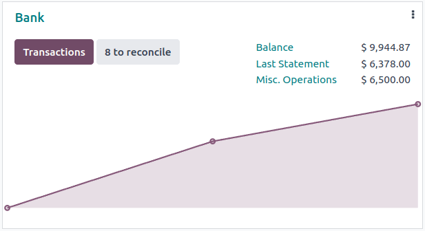
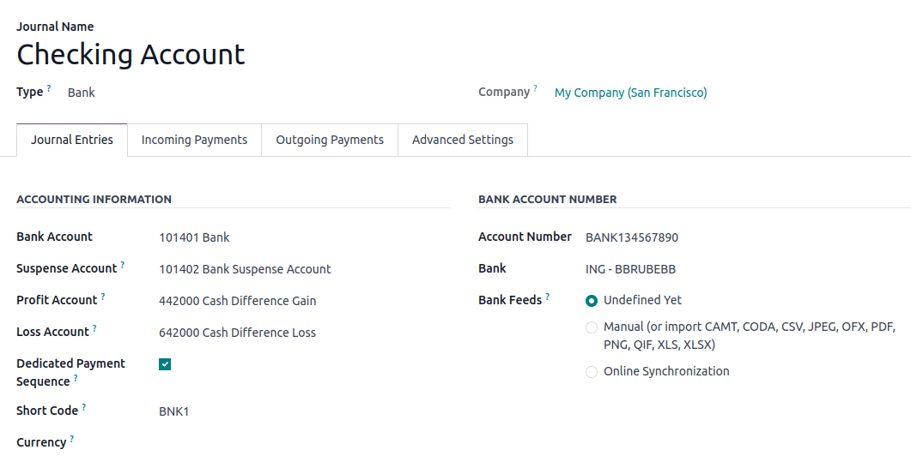
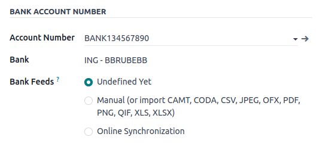

# Bank and cash accounts

You can manage as many bank or cash accounts as needed on your database.
Configuring them correctly allows you to have all your banking data
up-to-date and ready for `reconciliation
` with your journal
entries.

In Odoo Accounting, each bank account has a dedicated journal set to
post all entries in a dedicated account. Both the journal and the
account are automatically created and configured whenever you add a bank
account.

::: tip

Cash journals and accounts must be configured manually.
::::

Bank journals are displayed by default on the
`Accounting Dashboard` in the form of
cards which include action buttons.

## Manage bank and cash accounts 

### Connect a bank for automatic synchronization

To connect your bank account to your database, go to
`Accounting ‣ Configuration
‣ Add a Bank Account`, select
your bank in the list, click on `Connect`, and follow the instructions.

### Create a bank account 

If your banking institution is not available in Odoo, or if you don\'t
want to connect your bank account to your database, you can configure
your bank account manually.

To manually add a bank account, go to
`Accounting ‣ Configuration ‣ Add a Bank
Account`, click on
`Record transactions manually` (at
the bottom right), fill out the bank information, and click
`Create`.

::: tip

\- Odoo automatically detects the bank account type (e.g., IBAN) and
enables some features accordingly. - A default bank journal is available
and can be used to configure your bank account by going to
`Accounting ‣ Configuration ‣ Accounting: Journals ‣ Bank`. Open it and edit the different fields to match
your bank account information.
::::

### Create a cash journal

To create a new cash journal, go to
`Accounting ‣ Configuration ‣ Accounting:
Journals`, click on
`Create` and select
`Cash` in the
`Type` field.

For more information on the accounting information fields, read the
`accounting/bank/configuration` section of
this page.

::: tip

A default cash journal is available and can be used straight away. You
can review it by going to
`Accounting ‣ Configuration ‣ Accounting: Journals ‣ Cash`.
::::

### Edit an existing bank or cash journal

To edit an existing bank journal, go to
`Accounting ‣ Configuration ‣ Accounting:
Journals` and select the journal
you want to modify.

## Configuration 

You can edit the accounting information and bank account number
according to your needs.

### Suspense account 

Bank statement transactions are posted on the suspense account until
they are reconciled. At any moment, the suspense account\'s balance in
the general ledger shows the balance of transactions that have not yet
been reconciled.

::: tip

When a bank transaction is reconciled, the journal entry is modified to
replace the bank suspense account with the account of the journal item
it is reconciled with. This account is usually the
`outstanding receipts or payments account ` if reconciling with a registered payment or the account
receivable or payable if reconciling with an invoice or bill directly.
::::

### Profit and loss accounts

The `Profit Account` is used to
register a profit when the ending balance of a cash register differs
from what the system computes, while the
`Loss Account` is used to register a
loss when the ending balance of a cash register differs from what the
system computes.

### Currency

You can edit the currency used to enter the transactions.

### Account number 

If you need to **edit your bank account details**, click on the external
link arrow next to your `Account Number`. On the account page, click on the external link arrow
next to your `Bank` and update your
bank information accordingly. These details are used when registering
payments.

### Bank feeds

`Bank Feeds` defines how the bank
transactions are registered. Three options are available:

- `Undefined yet`, which should be
  selected when you don't know yet if you will synchronize your bank
  account with your database or not.
- `Import (CAMT, CODA, CSV, OFX, QIF)`, which should be selected if you want to import your
  bank statements and transactions using a different format.
- `Automated Bank Synchronization`,
  which should be selected if your bank is synchronized with your
  database.

## Outstanding accounts 

By default, payments in Odoo do not create journal entries, but they can
easily be configured to create journal entries using **outstanding
accounts**.

- An **outstanding receipts account** is where incoming payments are
  posted until they are linked with incoming bank transactions.
- An **outstanding payments account** is where outgoing payments are
  posted until they are linked with outgoing bank transactions.

These accounts are usually of
`type `
`Current Assets` and
`Current Liabilities`.

Payments that are registered in Odoo are posted to the outstanding
receipts and outstanding accounts until they are reconciled. At any
moment, the outstanding receipts account\'s balance in the general
ledger shows the balance of registered incoming payments that have not
yet been reconciled, and the outstanding payments account\'s balance in
the general ledger shows the balance of registered outgoing payments
that have not yet been reconciled.

### Bank and cash journal configuration

To configure payments to create journal entries, set outstanding
accounts for the journal\'s payment methods. This can be done for any
journal with the `type ` `Bank` or
`Cash`.

To configure the outstanding accounts for a journal\'s payment methods,
first go to
`Accounting ‣ Configuration ‣ Journals` and select a bank or cash journal. In the
`Incoming Payments` and
`Outgoing Payments` tabs, set
`Outstanding
Receipts accounts` and
`Outstanding Payments accounts` for
each payment method that you want to create journal entries.

::: tip

\- If the main bank account of the journal is added as an outstanding
receipts account or outstanding payments account, when a payment is
registered, the invoice or bill\'s status is directly set to
`Paid`. - If the outstanding receipts
or outstanding payments account for a payment method is left blank,
registering a payment with that payment method will not create any
journal entry.
::::

::: 
bank/bank_synchronization bank/transactions bank/reconciliation
bank/reconciliation_models bank/internal_transfers bank/foreign_currency
bank/loans
:::
