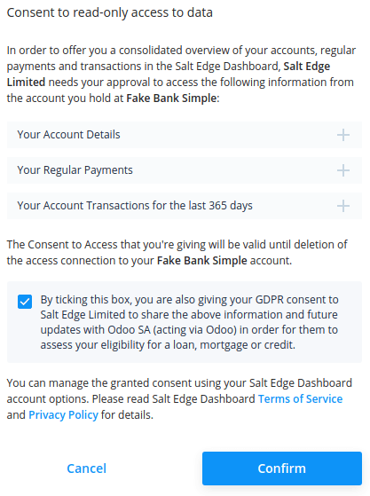

# Salt Edge

**Salt Edge** is a third-party provider that aggregates banking
information from your bank accounts. It supports \~5000 institutions in
more than 50 countries.

Odoo can synchronize directly with your bank to get all bank statements
imported automatically into your database.

## Configuration

### Link your bank accounts with Odoo

1.  Start synchronization by clicking on `Accounting ‣ Configuration
    ‣ Add a Bank Account`.

2.  Select the institution you want to synchronize. You can see if Salt
    Edge is the third party provider of the institution by selecting it.

3.  After giving your phone number, you are asked for an email address.
    This email address is used to create your Salt Edge account. Please
    make sure you enter a valid email address, as otherwise, you will
    not be able to access your Salt Edge account.

    

4.  After entering your email address, you are redirected to Salt Edge
    to continue the synchronization process.

    

5.  Make sure you give your consent by checking the consent checkbox.

    

6.  Complete the synchronization by following the steps.

### Update your credentials

To update your Salt Edge credentials or modify the synchronization
settings, activate the
`developer mode `, go to
`Accounting ‣ Configuration ‣
Online Synchronization`, and
select the institution you want to update credentials. Click
`Update Credentials` to start the
flow and follow the steps.

Don\'t forget to check the consent checkbox. Otherwise, Odoo may not be
able to access your information.

### Fetch new accounts

To add new online accounts to your connection, activate the
`developer mode `, go to
`Accounting ‣ Configuration ‣ Online Synchronization`, and select the institution to fetch the new
accounts. Click `Fetch Accounts` to
start the flow and follow the steps.

::: tip

Don\'t forget to check the consent checkbox. Otherwise, Odoo may not be
able to access your information.
::::

## FAQ

### I have an error when I try to delete my synchronization within Odoo

Odoo can\'t permanently delete the connection you have created with the
banking institution. However, it can revoke the consent you gave so that
Odoo won\'t be able to access your account anymore. The error you are
seeing is probably a message telling you that the consent was revoked,
but the record could not be deleted as it still exists within Salt edge.
If you want to remove the connection completely, please connect to your
[Salt Edge account](https://www.saltedge.com/dashboard) and manually
delete your synchronization. Once this is done, you can go back to Odoo
to delete the record.

### I have an error saying that I have already synchronized this account

You have probably already synchronized your bank account with Salt Edge,
please check on your [dashboard](https://www.saltedge.com/dashboard)
that you don\'t already have a connection with the same credentials.

If you already have a synchronization with the same credentials present
on your Salt Edge dashboard and this synchronization has not been
created with Odoo, delete it and create it from your Odoo database.

If you already have a connection with the same credentials present on
your Salt Edge dashboard and this synchronization was created with Odoo,
activate the `developer
mode `, go to
`Accounting ‣ Configuration ‣ Online
Synchronization`, and click
`Update Credentials` to reactivate
the connection.
