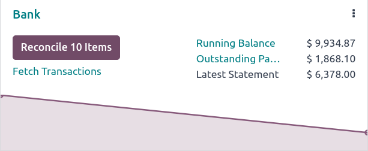
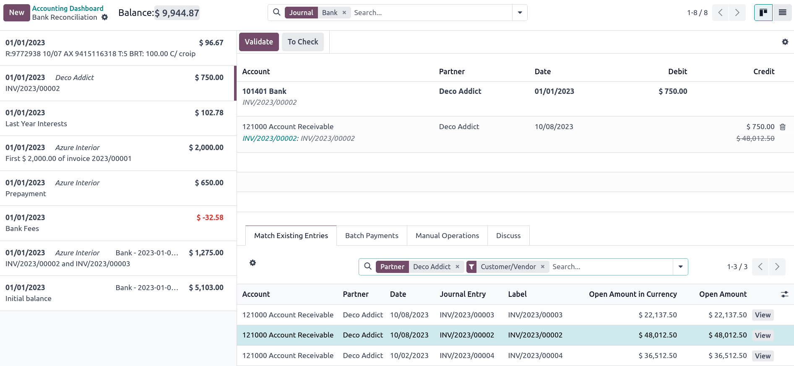
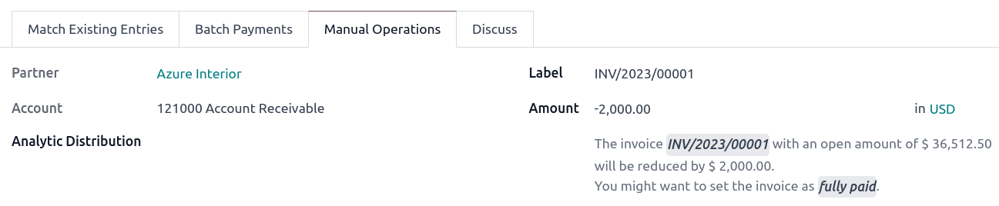

# Bank reconciliation

**Bank reconciliation** is the process of matching your
`bank transactions ` with
your business records, such as
`customer invoices `, `vendor bills
`, and
`payments `. Not only is this
compulsory for most businesses, but it also offers several benefits,
such as reduced risk of errors in financial reports, detection of
fraudulent activities, and improved cash flow management.

Thanks to the bank
`reconciliation models `, Odoo pre-selects the matching entries automatically.

## Bank reconciliation view 

To access a bank journal\'s **reconciliation view**, go to your
`Accounting Dashboard` and either:

- click the journal name (e.g., `Bank`) to display all transactions, including those
  previously reconciled or
- click the `Reconcile items` button
  to display all transactions Odoo pre-selected for reconciliation. You
  can remove the `Not Matched` filter
  from the search bar to include previously reconciled transactions.

The bank reconciliation view is structured into three distinct sections:
transactions, counterpart entries, and resulting entry.

Transactions

:   The transactions section on the left shows all bank transactions,
    with the newest displayed first. Click a transaction to select it.

Counterpart entries

:   The counterpart entries section on the bottom right displays the
    options to match the selected bank transaction. Multiple tabs are
    available, including
    `reconciliation/existing-entries`,
    `reconciliation/batch-payments`,
    `reconciliation/manual-operations`,
    and `Discuss`, which contains the
    chatter for the selected bank transaction.

Resulting entry

:   The resulting entry section on the top right displays the selected
    bank transaction matched with the counterpart entries and includes
    any remaining debits or credits. In this section, you can validate
    the reconciliation or mark it as `To Check`. Any `reconciliation model
    buttons ` are
    also available in the resulting entry section.

## Reconcile transactions 

Transactions can be matched automatically with the use of
`reconciliation models
`, or they can be
matched with `existing entries
`,
`batch payments `,
`manual operations `, and `reconciliation model buttons
`.

1.  Select a transaction among unmatched bank transactions.
2.  Define the counterpart. There are several options for defining a
    counterpart, including
    `matching existing entries `, `manual operations
    `,
    `batch payments `, and
    `reconciliation model buttons `.
3.  If the resulting entry is not fully balanced, balance it by adding
    another existing counterpart entry or writing it off with a
    `manual operation `.
4.  Click the `Validate` button to
    confirm the reconciliation and move to the next transaction.

::: tip

If you are not sure how to reconcile a particular transaction and would
like to deal with it later, use the `To Check` button instead. All transactions marked as `To
Check` can be displayed using the
`To Check` filter.
::::

::: tip

Bank transactions are posted on the **journal\'s suspense account**
until reconciliation. At this point, reconciliation modifies the
transaction journal entry by replacing the bank suspense account with
the corresponding receivable, payable, or outstanding account.
::::

### Match existing entries 

This tab contains matching entries Odoo automatically pre-selects
according to the reconciliation models. The entry order is based on
`reconciliation models `, with suggested entries appearing first.

::: tip

The search bar within the `Match Existing Entries` tab allows you to search for specific journal items.
::::

### Batch payments 

`Batch payments ` allow
you to group different payments to ease reconciliation. Use the
`Batch Payments` tab to find batch
payments for customers and vendors. Similarly to the
`Match Existing Entries` tab, the
`Batch Payments` tab has a search bar
that allows you to search for specific batch payments.

### Manual operations 

If there is not an existing entry to match the selected transaction, you
may instead wish to reconcile the transaction manually by choosing the
correct account and amount. Then, complete any of the relevant optional
fields.

::: tip

You can use the `fully paid` option
to reconcile a payment, even in cases where only a partial payment is
received. A new line appears in the resulting entry section to reflect
the open balance registered on the Account Receivable by default. You
can choose another account by clicking on the new line in the resulting
entry section and selecting the `Account` to record the open balance.
::::

::: tip

Lines are silently reconciled unless a write-off entry is required,
which launches a reconciliation wizard.

::::

### Reconciliation model buttons 

Use a `reconciliation model ` button for manual operations that are frequently used. These
custom buttons allow you to quickly reconcile bank transactions manually
and can also be used in combination with existing entries.
