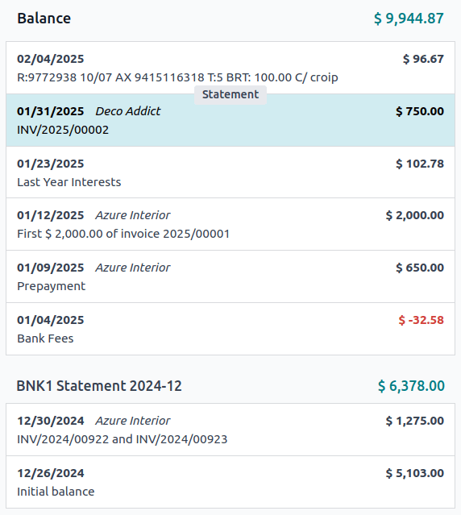

# Transactions

Importing transactions from your bank statements allows keeping track of
bank account transactions and reconciling them with the ones recorded in
your accounting.

`Bank synchronization ` automates the process. However, if you do not want to use it
or if your bank is not yet supported, other options exist:

- `Import bank transactions ` delivered by your bank;
- `Register bank transactions ` manually.

::: tip

`Grouping transactions by statement ` is optional.
::::

## Import transactions 

Odoo supports multiple file formats to import transactions:

- SEPA recommended Cash Management format (CAMT.053)
- Comma-separated values (CSV)
- Open Financial Exchange (OFX)
- Quicken Interchange Format (QIF)
- Belgium: Coded Statement of Account (CODA)

To import a file, go to the `Accounting Dashboard`, and in the `Bank`
journal, click on `Import File`.

::: tip

Alternatively, you can also:

- click the `fa-ellipsis-v`
  `(ellipsis)` icon on the
  `Bank` journal and select
  `Import file`;
- or access the transaction list by clicking the
  `fa-ellipsis-v`
  `(ellipsis)` icon on the
  `Bank` journal and selecting
  `Transactions`, then click the
  `fa-cog` `(gear)` icon and select `Import records`.
::::

Next, select the file and upload it.

After setting the necessary formatting options and mapping the file
columns with their related Odoo fields, you can run a
`Test` and `Import` your bank transactions.

## Register bank transactions manually 

You can also record your bank transactions manually. To do so, go to
`Accounting
Dashboard`, click on the
`Bank` journal, and then on
`New`. Make sure to fill out the
`Partner` and
`Label` fields to ease the
reconciliation process.

## Statements 

A **bank statement** is a document provided by a bank or financial
institution that lists the transactions that have occurred in a
particular bank account over a specified period of time.

In Odoo Accounting, it is optional to group transactions by their
related statement, but depending on your business flow, you may want to
record them for control purposes.

::: warning

If you want to compare the ending balances of your bank statements with
the ending balances of your financial records, *don\'t forget to create
an opening transaction* to record the bank account balance as of the
date you begin synchronizing or importing transactions. This is
necessary to ensure the accuracy of your accounting.
::::

To access a list of existing statements, go to the
`Accounting Dashboard`, click the
`fa-ellipsis-v`
`(ellipsis)` icon next to the bank or
cash journal you want to check, then click
`Statements`.

### Statement creation from the kanban view 

Open the bank reconciliation (kanban) view from the
`Accounting Dashboard` by clicking on
the name of the bank journal and identify the transaction corresponding
to the last (most recent) transaction of your bank statement. Click on
the `Statement` button when hovering
on the upper separator line to create a statement from that transaction
down to the oldest transaction that is not yet part of a statement.

In the `Create Statement` window,
fill out the statement\'s `Reference`, verify its `Starting Balance` and `Ending Balance`, and click `Save`.

### Statement creation from the list view 

Open the list of transactions by clicking on the name of the bank
journal and switching to the list view. Select all the transactions
corresponding to the bank statement, and, in the
`Statement` column, select an
existing statement or create a new one by typing its reference, clicking
on `Create and edit...`, filling out
the statement\'s details, and saving.

### Statement viewing, editing, and printing 

To view an existing statement, click on the statement amount in the
reconciliation (kanban) view or click on the statement name in the bank
transaction list view. From here, you can edit the
`Reference`,
`Starting Balance`, or
`Ending Balance`.

::: tip

Manually updating the `Starting Balance` automatically updates the `Ending
Balance` based on the new value of
the `Starting Balance` and the value
of the statement\'s transactions.
::::

:::: warning

If the `Starting Balance` doesn\'t
equal the previous statement\'s `Ending
Balance`, or if the
`Ending Balance` doesn\'t equal the
running balance (`Starting Balance`
plus the statement\'s transactions), a warning appears explaining the
issue. To maintain flexibility, it is still possible to save without
first resolving the issue.
::::

To attach a digital copy (i.e., JPEG, PNG, or PDF) of the bank statement
for enhanced recordkeeping, click the `fa-paperclip` `Attachments` button and
select the file to attach.

To generate and print a PDF of the bank statement, click the
`Print` button (if accessed via the
reconciliation view) or click on the `fa-cog``(gear)` icon and click
`fa-print``Statement` (if accessed via the list view).

::: tip

When a bank statement is generated to be printed, it is automatically
added to the `Attachments`.
::::
