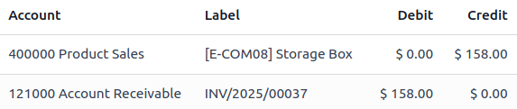
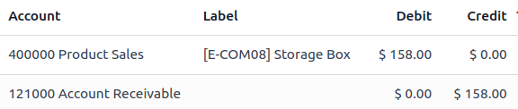

# Credit notes and refunds

A credit/debit note, or credit/debit memo, is a document sent to a
customer to inform them that they have been *credited/debited* a certain
amount.

Several use cases can lead to a credit note, such as:

> - a mistake in the invoice
> - a return of the goods, or a rejection of the services
> - the goods delivered are damaged

Debit notes are less common but are most frequently used to track debts
owed by customers or to vendors because of modifications to confirmed
customer invoices or vendor bills.

::: tip

Issuing a credit/debit note is the only legal method for canceling,
refunding, or modifying a validated invoice. Make sure to **register the
payment** afterward if money is being refunded to the customer and/or
validate the
`return ` if a storable product is being returned.
::::

## Issue a customer credit note 

In most cases, credit notes are created directly from the corresponding
invoices. To do so, go to
`Accounting ‣ Customers ‣ Invoices`, open the relevant `Invoice`, and click `Credit Note`.

In the `Credit Note` window, fill in
the `Reason displayed on Credit Note`
and update the `Journal` and
`Reversal date` if needed. There are
two options:

- Click `Reverse` to open a draft
  credit note prefilled with the exact details from the original
  invoice. Update the `Product` and
  `Quantity` and click
  `Confirm`. This option allows for a
  partial refund or modifications to the credit note.
- Click `Reverse and Create invoice`
  to create a credit note, validate it automatically, reconcile it with
  the related invoice, and open a new draft invoice prefilled with the
  exact details from the original invoice.

To create a credit note from scratch, go to
`Accounting ‣ Customers ‣ Credit
Notes`, and click
`New`. Filling out a credit note
follows the same process as completing an
`invoice `.

::: tip

A credit note sequence starts with [R] and is followed by
the related document number (e.g., RINV/2025/0004 is associated with the
invoice INV/2025/0004).
::::

## Issue a customer debit note 

To create a debit note, go to
`Accounting ‣ Customers ‣ Invoices` and follow these steps:

1.  Select the desired invoice(s), click `fa-cog` `Actions` and select
    `Create Debit Note`.
2.  In the `Create Debit Note`
    window, fill in the `Reason` and
    update the `Use Specific Journal`
    and `Debit Note Date` fields if
    needed.
3.  Enable the `Copy Lines` option to
    copy the invoice lines and click `Create
    Debit Note`.
4.  In the debit note, update the `Product` and `Quantity`
    and click `Confirm`.

::: tip

To create a debit note from the invoice form view, click the
`fa-cog` `(gear)` icon and select `Debit Note`.
::::

## Record a vendor refund 

Vendor refunds or vendor credit notes are recorded the same way as
`credit notes
`:

To record a vendor refund or a vendor credit note directly from the
corresponding vendor bill, go to
`Accounting ‣ Vendors ‣ Bills`, open the relevant vendor bill, and click
`Credit Note`.

To record it from scratch, go to
`Accounting ‣ Vendors ‣ Refund`, and click on `New`.

## Record a vendor debit note 

Debit notes from vendors are recorded the same way
`debit notes are issued to customers
`.

To record a debit note, go to
`Accounting ‣ Vendors ‣ Bills` and select the desired bill(s). Click
`fa-cog` `Actions` and select `Create Debit Note`.

::: tip

To create a debit note from the vendor bill form view, click the
`fa-cog` `(gear)` icon and select `Debit Note`.
::::

## Journal entries 

Creating a credit/debit note from an invoice/bill generates a **reverse
entry** that cancels out the journal items from the original invoice.

::: example
The journal entry of an invoice:

The credit note\'s journal entry generated to reverse the original
invoice above:

:::
