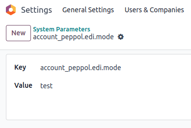
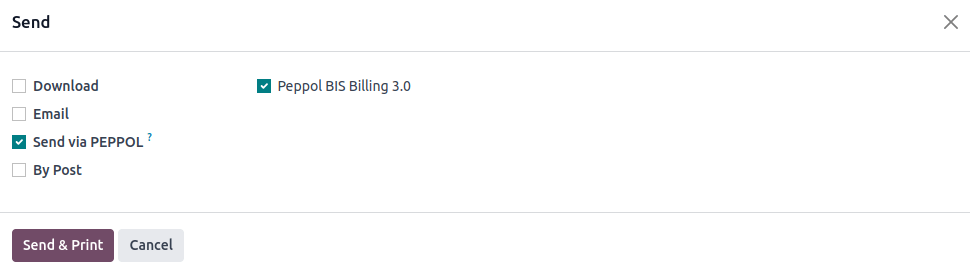
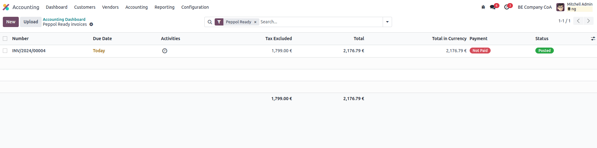
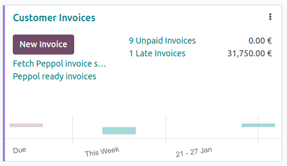
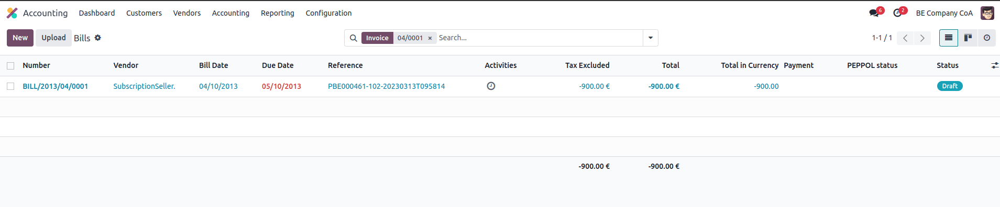

# Electronic invoicing (`EDI (electronic data interchange)`)

EDI, or electronic data interchange, is the inter-company communication
of business documents, such as purchase orders and invoices, in a
standard format. Sending documents according to an EDI standard ensures
that the machine receiving the message can interpret the information
correctly. Various EDI file formats exist and are available depending on
your company\'s country.

EDI feature enables automating the administration between companies and
might also be required by some governments for fiscal control or to
facilitate the administration.

Electronic invoicing of your documents such as customer invoices, credit
notes or vendor bills is one of the application of EDI.

Odoo supports e-invoicing in many countries. Refer to the country\'s
page for more details:

- `Argentina `
- `Austria `
- `Belgium `
- `Brazil `
- `Chile `
- `Colombia `
- `Croatia `
- `Ecuador `
- `Estonia `
- `Finland `
- `Guatemala `
- `Hungary `
- `Ireland `
- `Italy `
- `Latvia `
- `Lithuania `
- `Luxembourg `
- `Mexico `
- `Netherlands `
- `Norway `
- `Peru `
- `Romania `
- `Spain `
- `Spain - Basque Country `
- `Uruguay `

## Configuration 

By default, the format available in the
`send window `
depends on your customer\'s country.

You can define a specific e-invoicing format for each customer. To do
so, go to `Accounting ‣ Customers ‣ Customers`, open the customer form, go to the
`Accounting` tab and select the
appropriate format.

### National electronic invoicing

Depending on your company\'s country (e.g.,
`Italy `,
`Spain `, `Mexico
`,
etc.), you may be required to issue e-invoicing documents in a specific
format for all your invoices. In this case, you can define a default
e-invoicing format for your sales journal.

To do so, go to
`Accounting ‣ Configuration ‣ Journals`, open your sales journal, go to the
`Advanced Settings` tab, and enable
the formats you need for this journal.

## E-invoices generation 

From a confirmed invoice, click `Send & Print` to open the send window. Check the e-invoicing option
to generate and attach the e-invoice file.

## Peppol 

The [Peppol](https://peppol.org/about/) network ensures the exchange of
documents and information between enterprises and governmental
authorities. It is primarily used for electronic invoicing, and its
access points (connectors to the Peppol network) allow enterprises to
exchange electronic documents.

Odoo is an **access point** and an
`SMP (Service Metadata Publisher)`,
enabling electronic invoicing transactions without the need to send
invoices and bills by email or post.

If not done yet, `install ` the `Peppol` module
([account_peppol]).

::: warning

\- Peppol registration is **free** and available in Odoo Community - You
can send **Customer Invoices** and **Credit Notes** and receive **Vendor
Bills** and **Refunds** via Peppol. - You can send and receive in one of
the following supported document formats: **BIS Billing 3.0, XRechnung
CIUS, NLCIUS**. - \| The following **countries** are eligible for
**Peppol registration in Odoo**: \| Andorra, Albania, Austria, Bosnia
and Herzegovina, Belgium, Bulgaria, Switzerland, Cyprus, Czech Republic,
Germany, Denmark, Estonia, Spain, Finland, France, United Kingdom,
Greece, Croatia, Hungary, Ireland, Iceland, Italy, Liechtenstein,
Lithuania, Luxembourg, Latvia, Monaco, Montenegro, North Macedonia,
Malta, Netherlands, Norway, Poland, Portugal, Romania, Serbia, Sweden,
Slovenia, Slovakia, San Marino, Turkey, Holy See (Vatican City State)
::::

### Registration 

Go to `Accounting ‣ Configuration ‣ Settings`. If you do not have the Peppol module installed,
first tick the `Enable PEPPOL`
checkbox and then **manually save**. Click
`Start sending via Peppol` to open
the registration form.

::: tip

This registration form also pops up if you choose to
`Send & Print` an invoice via Peppol
without completing the registration process.
::::

You can register either as a sender or a receiver. A sender can only
send invoices and credit notes on Odoo via Peppol, without ever
registering as a Peppol participant on Odoo SMP. If you have an existing
Peppol registration elsewhere that you want to keep, but want to send
invoices from your Odoo database and receive other documents in another
software, register as a **sender**.

::: tip

\- You can always register as a sender first and register to receive
documents later. - When registering, you can specify if you would also
like to receive documents.
::::

Fill in the following information:

- Check the receiver box if you want to register on Odoo SMP. If you are
  migrating from another service provider, insert the
  `Migration key` from the previous
  provider (the field becomes visible after you tick the checkbox).
- `E-Address Scheme`: the Peppol
  Electronic Address Scheme usually depends on your company\'s country.
  Odoo often prefills this with the most commonly used EAS code in your
  country. For example, the preferred EAS code for most companies in
  Belgium is [0208].
- `Endpoint`: this is usually a
  Company Registry number or a VAT number.
- `Phone`: phone number including the
  country code (e.g., [+32] in Belgium).
- `Email`: this is the email Odoo can
  use to contact you regarding your Peppol registration.

If you want to explore or demo Peppol, you can choose to register in
`Demo` mode. Otherwise, select
`Live`.

::: tip

\- Selecting `Demo` simulates
everything in Odoo. There is no sending, receiving, or partner
verification. - For **advanced users only**, it is possible to run tests
on Peppol\'s test network. The server allows to register on Peppol and
send/receive test invoices to/from other participants. To do so, enable
the `developer-mode`, open the
**Settings** app, go to
`Technical ‣ System Parameters`, and search for
[account_peppol.edi.mode]. Click the parameter and change
the `Value` to [test]. Go
back to the Peppol setup menu in the **Settings** app. The option
`Test` is now available.

::::

When set up, request a verification code to be sent to you by clicking
`Send a
registration code by SMS`. A text
message containing a code is sent to the phone number provided to
finalize the verification process.

Once you enter the code and click `Register`, your Peppol participant status is updated. If you
chose to only send documents, then the status changes to `Can send but
not receive`. If you opted to receive
documents as well, the status changes to `Can send, pending
registration to receive`. In that
case, it should be automatically activated within a day.

Then, set the default journal for receiving vendor bills in the
`Incoming Invoices
Journal`.

::: tip

To manually trigger the cron that checks the registration status, enable
the `developer-mode`, then go to
`Settings ‣ Technical ‣ Scheduled Actions`, and search for the
`PEPPOL: update participant status`
action.
::::

Your receiver application status should be updated soon after you are
registered on the Peppol network.

All invoices and vendor bills can now be sent directly using the Peppol
network.

::: warning

To update the email that Odoo can use to contact you, modify the email
and click `Update contact details`.
::::

### Configure Peppol services

Once you are registered on Odoo SMP, the
`Configure Peppol Services` button
becomes visible to allow you to enable or disable document formats that
other participants can send you via Peppol. By default, all document
formats supported by Odoo are enabled (depending on the installed
modules).

### Contact verification

Before sending an invoice to a contact using the Peppol network, it is
necessary to verify that they are also registered as a Peppol
participant.

To do so, go to
`Accounting ‣ Customers ‣ Customers` and open the customer\'s form. Then go to
`Accounting tab ‣ Electronic Invoicing`, select the correct format, and make sure their
`Peppol EAS code` and the
`Endpoint` are filled in. Then, click
`Verify`. If the contact exists on
the network, their Peppol endpoint validity is set to Valid.

::: warning

While Odoo prefills both the EAS code and the Endpoint number based on
the information available for a contact, it is better to confirm these
details directly with the contact.
::::

It is possible to verify the Peppol participant status of several
customers at once. To do so, go to
`Accounting ‣ Customers ‣ Customers` and switch to the list view. Select the customers
you want to verify and then click
`Actions ‣ Verify Peppol`.

If the participant is registered on the Peppol network but cannot
receive the format you selected for them, the
`Peppol endpoint validity` label
changes to `Cannot
receive this format`.

### Send invoices

Once ready to send an invoice via the Peppol network, simply click
`Send & Print` on the invoice form.
To queue multiple invoices, select them in the list view and click
`Actions ‣ Send & Print`; they
will be sent in a batch later on. Both
`BIS Billing 3.0` and
`Send via PEPPOL` checkboxes need to
be ticked.

Posted invoices that can be sent via Peppol are marked as
`Peppol Ready`. To display them, use
the `Peppol Ready` filter or access
the Accounting dashboard and click
`Peppol ready invoices` on the
corresponding sales journal.

Once the invoices are sent via Peppol, the status is changed to
`Processing`. The status is changed
to [Done] after they have been successfully delivered to the
contact\'s Access Point.

::: tip

By default, the Peppol status column is hidden on the Invoices list
view. You can choose to have it displayed by selecting it from the
optional columns, accessible from the top right corner of the Invoices
list view.
::::

A cron runs regularly to check the status of these invoices. It is
possible to check the status before the cron runs by clicking
`Fetch Peppol invoice status` in the
corresponding sales journal on the Accounting dashboard.

### Receive vendor bills

Once a day, a cron checks whether any new documents have been sent to
you via the Peppol network. These documents are imported, and the
corresponding vendor bills are created automatically as drafts.

If you want to retrieve incoming Peppol documents before the cron runs,
you can do so from the Accounting dashboard on the main Peppol purchase
journal that you set up in the settings. Just click
`Fetch from Peppol`.

