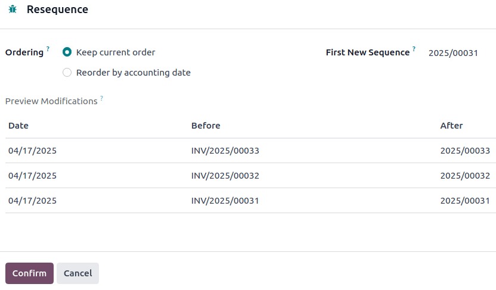

# Invoice sequence

When confirming an invoice, Odoo generates a unique invoice reference
number. By default, it uses the sequence format
[INV/year/incrementing-number] (e.g.,
[INV/2025/00001]), which restarts from [00001]
each year.

However, it is possible to
`change the sequence format ` and its periodicity, and to
`mass-resequence invoices `.

::: tip

Changes made to reference numbers are logged in the chatter.
::::

## Changing the default sequence 

To customize the default sequence, open the last confirmed invoice,
click `Reset to
Draft`, and edit the invoice\'s
reference number.

Odoo then explains how the detected format will be applied to all future
invoices. For example, if the current invoice\'s month is added, the
sequence\'s periodicity will change to every month instead of every
year.

::: tip

The sequence format can be edited directly when creating the first
invoice of a given sequence period.
::::

## Mass-resequencing invoices 

It can be helpful to resequence multiple invoice numbers. For example,
when importing invoices from another invoicing or accounting system and
the reference originates from the previous software, continuity for the
current year must be maintained without restarting from the beginning.

::: tip

This feature is only available to users with administrator or advisor
access.
::::

Follow these steps to resequence invoice numbers:

1.  Activate the `developer mode `.
2.  From the `Accounting Dashboard`,
    open the `Customer Invoices`
    journal.
3.  Select the invoices that need a new sequence.
4.  Click the `fa-cog`
    `Actions` menu and select
    `Resequence`.
5.  In the `Ordering` field, choose
    to
    - `Keep current order`: The order
      of the numbers remains the same.
    - `Reorder by accounting date`:
      The number is reordered by accounting date.
6.  Set the `First New Sequence`.
7.  `Preview Modifications` and click
    `Confirm`.

::: tip

\- To indicate where the sequence change began, the first invoice in the
new sequence is highlighted in red in the
`Customer Invoices` list. This visual
marker is permanent and purely informational. - If there are any
irregularities in the new sequence, such as gaps, cancelled, or deleted
entries within the open period, a
`Gaps in the sequence` message
appears in the `Customer Invoices`
journal on the Accounting dashboard. To view more details about the
related invoice(s), click `Gaps in the sequence`. This visual marker is temporary and will disappear
once the entry\'s accounting date is on or after the lock date.
::::

::: tip

Resequencing is not possible:

- When entries are before a lock date.
- When the sequence leads to a duplicate.
- When the range is invalid. For example, if the
  `Invoice Date` doesn\'t align with
  the date in the new sequence, such as using a 2024 sequence
  (INV/2024/XXXXX) for an invoice dated in 2025.

In these cases, a `Validation Error`
message appears.
::::
