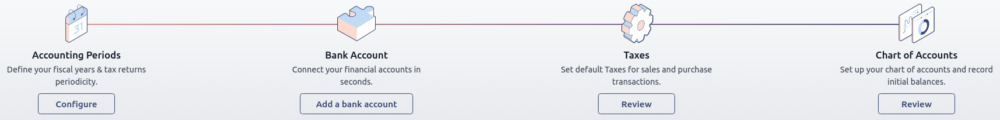
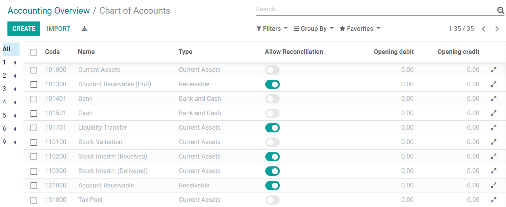
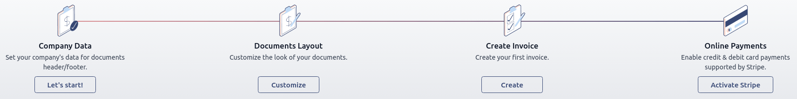

# Get started

When you first open your Odoo Accounting app, the
`Accounting Dashboard` welcomes you
with a step-by-step onboarding banner, a wizard that helps you get
started. This onboarding banner is displayed until you choose to close
it.

The settings visible in the onboarding banner can still be modified
later by going to
`Accounting ‣ Configuration ‣ Settings`.

::: tip

Odoo Accounting automatically installs the appropriate **Fiscal
Localization Package** for your company, according to the country
selected at the creation of the database. This way, the right accounts,
reports, and taxes are ready-to-go.
`Click here ` for more information about Fiscal Localization Packages.
::::

## Accounting onboarding banner

The step-by-step Accounting onboarding banner is composed of four steps:

1.  `accounting-setup-periods`
2.  `accounting-setup-bank`
3.  `accounting-setup-taxes`
4.  `accounting-setup-chart`

### Accounting Periods 

Define the **Fiscal Years**' opening and closing dates, which are used
to generate reports automatically, and set your **Tax Return
Periodicity**, along with a reminder to never miss a tax return
deadline.

By default, the opening date is set on the 1st of January and the
closing date on the 31st of December, as this is the most common use.

::: tip

You can also change these settings by going to
`Accounting ‣ Configuration ‣
Settings ‣ Fiscal Periods` and
updating the values.
::::

### Bank Account 

Connect your bank account to your database and have your bank statements
synced automatically. To do so, find your bank in the list, click
`Connect`, and follow the
instructions on-screen.

::: tip

`Click here `
for more information about this feature.
::::

If your Bank Institution can't be synchronized automatically, or if you
prefer not to sync it with your database, you can also configure your
bank account manually by typing its name, clicking
`Create your Bank Account`, and
filling out the form.

- `Name`: the bank account\'s name,
  as displayed in Odoo.
- `Account Number`: your bank account
  number (IBAN in Europe).
- `Bank`: click
  `Create and edit` to configure the
  bank\'s details. Add the bank institution\'s `Name` and its `Identifier Code` (BIC or SWIFT).
- `Code`: this code is your
  Journal\'s `Short Code`, as
  displayed in Odoo. By default, Odoo creates a new Journal with this
  short code.
- `Journal`: This field is displayed
  if you have an existing bank journal that is not linked yet to a bank
  account. If so, then select the `Journal` you want to use to record the financial transactions
  linked to this bank account or create a new one by clicking
  `Create and Edit`.

::: tip

\- You can add as many bank accounts as needed with this tool by going
to
`Accounting ‣ Configuration ‣ Add a Bank Account`. - `Click here ` for more information about Bank Accounts.
::::

### Taxes 

This menu allows you to create new taxes, (de)activate, or modify
existing taxes. Depending on the
`localization package ` installed on your database, taxes required for your country
are already configured.

::: tip

`Click here ` for more information
about taxes.
::::

### Chart of Accounts 

With this menu, you can add accounts to your **Chart of Accounts** and
indicate their initial opening balances.

Basic settings are displayed on this page to help you review your Chart
of Accounts. To access all the settings of an account, click on the
`Setup` button at the end of the
line.

::: tip

`Click here ` for more information on how to configure your Chart of
Accounts.
::::

## Invoicing onboarding banner

There is another step-by-step onboarding banner that helps you take
advantage of your Odoo Invoicing and Accounting apps. The Invoicing
onboarding banner is the one that welcomes you if you use the Invoicing
app rather than the Accounting app.

If you have Odoo Accounting installed on your database, you can reach it
by going to `Accounting ‣ Customers ‣ Invoices`.

The Invoicing onboarding banner consists of four main steps:

1.  `invoicing-setup-company`
2.  `invoicing-setup-layout`
3.  `invoicing-setup-invoice`
4.  `invoicing-setup-payments`

### Company Data 

Add your company's details, such as the name, address, logo, website,
phone number, email address, and Tax ID or VAT number. These details are
then displayed on your documents, such as invoices.

::: tip

You can also change the company\'s details by going to
`Settings ‣ General
Settings`, scrolling down to the
`Companies` section, and
`Update Info`.
::::

### Documents Layout 

Customize the
`default invoice layout `.

::: tip

You can also change the invoice layout by going to `Settings ‣ General
Settings`, scrolling down to the
`Companies` section, and clicking
`Configure
Document Layout`.
::::

### Create Invoice 

Create your first invoice.

::: tip

Add your **bank account number** and a link to your **General Terms &
Condition** in the footer. This way, your contacts can find the full
content of your GT&C online without having to print them on the invoices
you issue.
::::

### Online Payments 

Get started with Stripe and enable secure integrated credit and debit
card payments within Odoo.

::: tip

To use other payment providers, go to
`Invoicing ‣ Configuration ‣ Payment Providers` and
`enable the desired providers `.
::::

::: 
get_started/cheat_sheet get_started/chart_of_accounts
get_started/consolidation get_started/multi_currency
get_started/avg_price_valuation get_started/tax_units
:::
