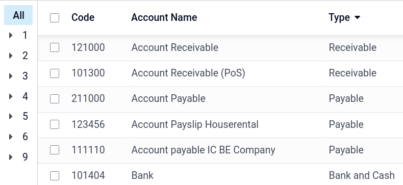
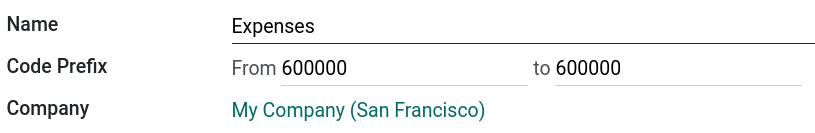

# Chart of accounts

The **chart of accounts (COA)** is the list of all the accounts used to
record financial transactions in the general ledger of an organization.
The chart of accounts can be found under
`Accounting ‣ Configuration ‣ Chart of Accounts`.

When browsing your chart of accounts, you can sort the accounts by
`Code`,
`Account Name`, or
`Type`, but other options are
available in the drop-down menu

## Configuration of an account 

The country you select during the creation of your database (or
additional company in your database) determines which
`fiscal localization package ` is installed by default. This package includes a standard
chart of accounts already configured according to the country\'s
regulations. You can use it directly or set it according to your
company\'s needs.

To create a new account, go to
`Accounting ‣ Configuration ‣ Chart of Accounts`, click `Create`, and fill in (at the minimum) the required fields
(`Code, Account Name, Type`).

:::: warning

It is not possible to modify the **fiscal localization** of a company
once a journal entry has been posted.
::::

### Code and name

Each account is identified by its `Code` and `Name`, which
also indicate the account\'s purpose.

### Type 

Correctly configuring the **account type** is critical as it serves
multiple purposes:

- Information on the account\'s purpose and behavior
- Generate country-specific legal and financial reports
- Set the rules to close a fiscal year
- Generate opening entries

To configure an account type, open the `Type` field\'s drop-down selector and select the
corresponding type from the following list:

+---------------+--------------+-------------------------+
| Report        | Category     | Account Types           |
+===============+==============+=========================+
| Balance Sheet | Assets       | Receivable              |
|               |              +-------------------------+
|               |              | Bank and Cash           |
|               |              +-------------------------+
|               |              | Current Assets          |
|               |              +-------------------------+
|               |              | Non-current Assets      |
|               |              +-------------------------+
|               |              | Prepayments             |
|               |              +-------------------------+
|               |              | Fixed Assets            |
|               +--------------+-------------------------+
|               | Liabilities  | Payable                 |
|               |              +-------------------------+
|               |              | Credit Card             |
|               |              +-------------------------+
|               |              | Current Liabilities     |
|               |              +-------------------------+
|               |              | Non-current Liabilities |
|               +--------------+-------------------------+
|               | Equity       | Equity                  |
|               |              +-------------------------+
|               |              | Current Year Earnings   |
+---------------+--------------+-------------------------+
| Profit & Loss | Income       | Income                  |
|               |              +-------------------------+
|               |              | Other Income            |
|               +--------------+-------------------------+
|               | Expense      | Expense                 |
|               |              +-------------------------+
|               |              | Depreciation            |
|               |              +-------------------------+
|               |              | Cost of Revenue         |
+---------------+--------------+-------------------------+
| Other         | Other        | Off-Balance Sheet       |
+---------------+--------------+-------------------------+

#### Assets

Some **account types** can **automate** the creation of
`asset ` entries. To
**automate** entries, click `View` on
an account line and go to the `Automation` tab.

You have three choices for the `Automation` tab:

1.  `No`: this is the default value.
    Nothing happens.
2.  `Create in draft`: whenever a
    transaction is posted on the account, a draft entry is created but
    not validated. You must first fill out the corresponding form.
3.  `Create and validate`: you must
    also select a `Deferred Expense Model`. Whenever a transaction is posted on the account,
    an entry is created and immediately validated.

### Default taxes

In the `View` menu of an account,
select a **default tax** to be applied when this account is chosen for a
product sale or purchase.

### Tags

Some accounting reports require **tags** to be set on the relevant
accounts. To add a tag, under `View`,
click the `Tags` field and select an
existing tag or `Create` a new one.

### Account groups

**Account groups** are useful to list multiple accounts as
*sub-accounts* of a bigger account and thus consolidate reports such as
the **Trial Balance**. By default, groups are handled automatically
based on the code of the group. For example, a new account
[131200] is going to be part of the group
[131000]. You can attribute a specific group to an account
in the `Group` field under
`View`.

#### Create account groups manually

::: tip

Regular users should not need to create account groups manually. The
following section is only intended for rare and advanced use cases.
::::

To create a new account group, activate
`developer mode ` and head
to `Accounting ‣ Configuration ‣ Account Groups`. Here, create a new group and enter the
`name, code prefix, and company` to
which that group account should be available. Note that you must enter
the same code prefix in both `From`
and `to` fields.

To display your **Trial Balance** report with your account groups, go to
`Accounting ‣ Reporting ‣ Trial Balance`, then open the `Options` menu and select
`Hierarchy and Subtotals`.

### Allow reconciliation

Some accounts, such as accounts made to record the transactions of a
payment method, can be used for the reconciliation of journal entries.

For example, an invoice paid with a credit card can be marked as
`paid` if reconciled with its
payment. Therefore, the account used to record credit card payments
needs to be configured as **allowing reconciliation**.

To do so, check the `Allow Reconciliation` box in the account\'s settings, and
`Save`; or enable the button from the
chart of accounts view.

### Shared Accounts 

The **Shared Accounts** feature allows the creation of a single account
for a specific purpose and sharing it between multiple companies. It is
especially useful for multi-company environments where a similar account
might be used across different companies.

### Deprecated

It is not possible to delete an account once a transaction has been
recorded on it. You can make them unusable by using the **Deprecated**
feature: check the `Deprecated` box
in the account\'s settings, and `Save`.

