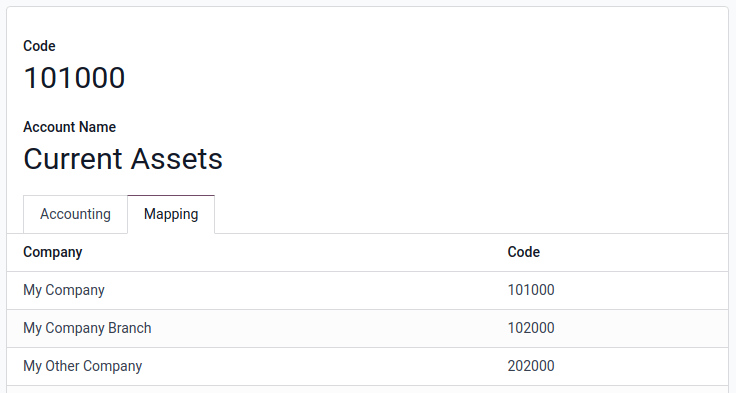
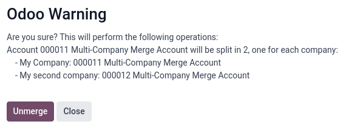

# Consolidation

Consolidation allows combining financial data from **multiple separate
companies**, each with its own books, into a unified view, providing a
\"fair image\" of the entire group\'s financial health.

It helps create a clear, comprehensive view of the group\'s financial
performance by combining data from multiple companies.

::: tip

Consolidating companies involves **legally separate entities**, whereas
`branches
` are
**subdivisions** of a single legal entity which often share the head
office\'s resources (journals, taxes, accounts, fiscal positions) and
are not consolidated in the same way.
::::

## Consolidation tools 

**Several tools** combined together will contribute to the construction
of the financial consolidation:

::: 
1.  **Account Mapping:** Similar accounts from different companies can
    be mapped together. This allows Odoo to combine them correctly in
    consolidated reports. To map accounts, go to
    `Accounting ‣ Configuration ‣ Chart of Accounts`. Click `View` on the account line. In the
    `Mapping` tab, enter a code in
    the corresponding company `Code`
    column to map the account.

    

    ::: tip
    
## Account merging 

Accounts can be merged to reduce the number of accounts and standardize
them across companies. This is optional; consolidation works without it.

To use the merge tool, select all the companies with an account that
needs to be merged in the company selector in the top right corner of
the screen.

Then, go to
`Accounting ‣ Configuration ‣ Chart of Accounts` and select the accounts to merge. Click the
`fa-cog` `Actions` menu and select `Merge
accounts`.

In the `Merge accounts` window,
enable the `Group by name?` option if
needed and click `Merge`.

The selected accounts are then merged into a single shared account,
accessible by all the chosen companies, just as if the account had been
directly created to be shared.

## Account unmerging 

Accounts can also be unmerged if needed.

:::: warning

Note that unmerging accounts **will not unmerge the chatters** of the
accounts. Once merged, the changes\' histories are permanently merged.
::::

To unmerge accounts, select a company with a shared account in the
company selector at the top right corner of the screen. Then, go to
`Accounting ‣ Configuration ‣ Chart of
Accounts` and select the account
to unmerge. Click the `fa-cog`
`Actions` menu and select
`Unmerge accounts`.

An `Odoo Warning` confirmation pop-up
window will appear, listing how the accounts will be split.

Click `Unmerge`. A new account linked
to each company will be created for the previously shared account.

## Import a mapping 

To **import an account mapping**, select all the related companies in
the company selector at the top right corner of the screen and go to
`Accounting ‣ Configuration ‣ Chart of
Accounts`.

First, to choose the fields to export, select the accounts, click the
`fa-cog` `Actions` button and select `Export`. Then, in the `Export data` window, add the `Code mapping/Code`, `Code Mapping/Company` and `External ID`
fields using the `fa-plus` icon and click
`Export`. No other field is required.

Second, rework it in a spreadsheet adding the desired code for each
company on desired accounts.

Third, to reimport the file (xlsx or csv format) in Odoo, click
`Import` and, in the
`Import Chart of Accounts` section,
click `Import CoA`. In the
`Accounting Import Guide`, drop or
click `Upload Data File` to import
the file. Then, click `Import`.

Finally, the codes now take into account the mapping company per
company.
