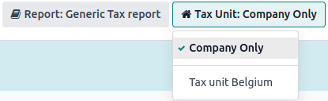

# Tax units

::: warning

This is only applicable to multi-company environments.
::::

A **tax unit** is a group of VAT-taxable enterprises that are legally
independent of each other but are closely linked financially,
organizationally, and economically and therefore considered the same
VAT-taxable enterprise. **Tax units** are not mandatory, but if created,
constituent companies of the unit must belong to the same **country**,
use the same **currency**, and one company must be designated as the
**representative** company of the **tax unit**. **Tax units** receive a
specific **tax ID** intended only for **tax returns**. **Constituent**
companies keep their **tax ID** used for **commercial purposes**.

::: example
Enterprise **A** owes €300.000,00 of VAT taxes and enterprise **B** can
recover €280.000,00 of VAT taxes. They form up as a **tax unit** so that
the two amounts balance out and must conjointly only pay €20.000,00 of
VAT taxes.
:::

## Configuration

To create a **tax unit**, go to
`Accounting ‣ Configuration ‣ Tax Units`, and click `New`. Enter a **name** for the unit, select a
`Country`, the
`Companies` to incorporate in the
unit, the `Main Company`, and the
`Tax ID` of the **constituent**
company of that tax unit.

### Fiscal position

As transactions between constituents of the same **tax unit** are not
subject to VAT, it is possible to create a
`tax mapping (fiscal position) ` to avoid the application of VAT on inter-constituent
transactions.

Be sure a constituent company has been selected before, then go to
`Accounting ‣
Configuration ‣ Fiscal Positions`, and `Create` a
new **fiscal position**. Click the `Tax Mapping` tab, select the `Tax on Product` usually applied for **non-constituent** transactions,
and in `Tax to Apply`, select the 0%
tax to apply for **constituent** transactions.

Do the same for the `Account Mapping`
tab if required, and repeat this process for **each** constituent
company on your database.

::: example
Depending on your
`localization package `, taxes may vary from the screenshot displayed.

:::

Then, assign the fiscal position by opening the **Contacts** app. Search
for a **constituent** company, and open the contact\'s **card**. Click
the `Sales & Purchase` tab, and in
the `Fiscal Position` field, input
the **fiscal position** created for the **tax unit**. Repeat the process
for each **constituent** company card form, on each company database.

## Tax report

The **representative** company can access the aggregated tax report of
the **tax unit** by going to
`Accounting ‣ Reporting ‣ Tax Report`, and selecting the **tax unit** in
`Tax Unit`. This report contains the
aggregated transactions of all **constituents** and the .XML export
contains the name and VAT number of the **main** company.

