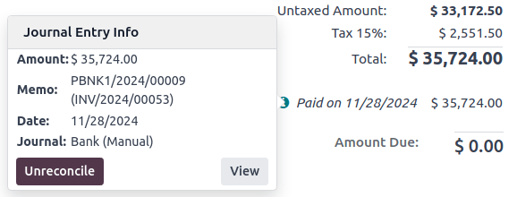
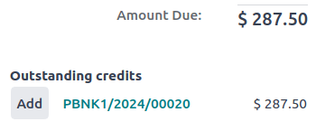
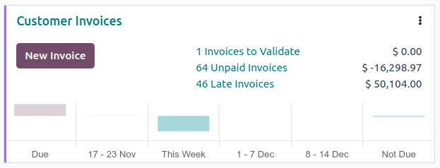
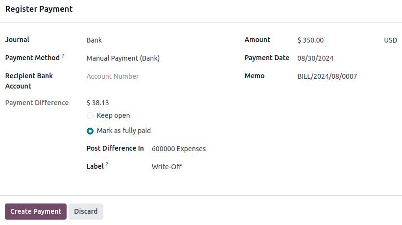

# Payments

In Odoo, payments can either be automatically linked to an invoice or
bill or be stand-alone records for use at a later date:

- If a payment is **linked to an invoice or bill**, it reduces/settles
  the amount due on the invoice. Multiple payments on the same invoice
  are possible.
- If a payment is **not linked to an invoice or bill**, the customer has
  an outstanding credit with the company, or the company has an
  outstanding debit with a vendor. Those outstanding amounts
  reduce/settle unpaid invoices/bills.

## Payment methods 

Several payment methods are available in Odoo to allow different
configurations for different types of payments. Examples of payment
methods include manual payments (such as cash), `checks
`, and batch payment
files (such as `NACHA
` and
`SEPA `). Payment
methods can be configured in the `Incoming Payments` and `Outgoing Payments` tabs of a bank or cash journal.

### Preferred payment method 

A contact\'s preferred payment method can be set so that when a payment
is created for that contact, the payment method is automatically
selected by default. Invoices and bills can be filtered by
`Payment Method` to simplify
`group ` payments.

To set a preferred `Payment Method`
for a customer or a vendor, go to
`Accounting ‣ Customers ‣ Customers` or `Accounting ‣ Vendors
‣ Vendors` and select the
customer or vendor. In the `Sales & Purchase` tab of the contact form, select the preferred
`Payment Method` in the
`Sales` section for invoice payments
or for vendor bill payments in the `Purchase` section.

::: tip

Access a full list of all contacts from the
`Customers` or
`Vendors` list view by removing the
`Customers` or
`Vendors` filter. Alternatively,
access the full contact list through the Contacts app.
::::

### Checks 

`Vendor bills can be paid by check ` using a dedicated outgoing payment method, which allows
check numbers to be tracked and checks to be printed directly from Odoo.

For incoming customer check payments, you can use the default
`Manual Payment` payment method, or
you can create a payment method specifically for checks to help identify
such payments quickly. To create a *Check* payment method, follow these
steps:

1.  Go to `Accounting ‣ Configuration ‣ Journals` and select the `Bank` journal.
2.  In the `Incoming Payments` tab,
    click `Add a line`.
3.  As `Payment Method`, select
    `Manual`, then enter
    [Check] as the `Name`.

When registering a customer payment
`on an invoice ` or
`not related to an invoice `, use the new `Check`
payment method.

::: tip

Registering a customer payment by check in Odoo does not move funds.
Checks must be deposited in order to make the payment. Once deposited to
your bank, the check should appear as a `bank
transaction `, at which
point it can be `reconciled
` with the registered
payment.
::::

::: tip

\- For best practice, enter the check number as the
`Memo` when registering a customer
payment by check. - `Batch payments ` can simplify reconciling deposits containing multiple
checks.
::::

## Registering payment from an invoice or bill 

To register a payment for an invoice or a bill, follow these steps:

1.  Click `Pay` on a customer invoice
    or vendor bill. In the `Pay`
    window, select the `Journal` and
    the `Payment Date`.
2.  If previously set, the contact\'s preferred
    `Payment Method` is automatically
    selected by default but can be updated if necessary.
3.  If using
    `payment terms `, the `Amount` is
    automatically set based on the installment amounts defined by the
    payment term. To pay the full amount instead, click
    `full amount`.
4.  If necessary, edit the `Memo`.
5.  Click `Create Payment`.

After the payment is registered, the customer invoice or vendor bill is
marked as `In payment`.

::::::::::: tabs
::::: group-tab
Without outstanding accounts

If no
`outstanding accounts ` are configured, no journal entry is created. To display more
information about the payment, click the `Payments` smart button.

When the invoice or vendor bill is
`reconciled ` with a
bank transaction, its status is updated to `Paid`.

::: tip

\- If a bank transaction is reconciled in a different currency, a
journal entry is automatically created to post the currency exchange
gains/loss amount. - When a bank transaction is reconciled with an
invoice with cash-basis, a journal entry is automatically created to
post the cash-basis tax amount.
::::
:::::

::::::: group-tab
Using outstanding accounts

By default, payments in Odoo do not create journal entries, but they can
easily be configured to create journal entries using
`outstanding accounts
`.

Registering a payment on a customer invoice or vendor bill generates a
new journal entry and reduces the `Amount Due` based on the payment amount. The counterpart is
reflected in an
`outstanding ` **receipts** or **payments** account. At this point, the
customer invoice or vendor bill is marked as
`In payment`. Then, when the payment
is `reconciled ` with
a bank transaction, the invoice or vendor bill status changes to
`Paid`.

The `fa-info-circle` information icon
next to the payment line displays more information about the payment. To
access additional information, such as the related journal, click
`View`.

::: tip

\- Unreconciling a payment unlinks it from the invoice or bill but does
not delete the payment. - If a payment is (un)reconciled in a different
currency, a journal entry is automatically created to post the currency
exchange gains/losses (reversal) amount. - If a payment is
(un)reconciled on an invoice with cash-basis taxes, a journal entry is
automatically created to post the cash-basis tax (reversal) amount.
::::

::: tip

If the main bank account is set as the outstanding account on the bank
journal\'s payment method, registering the full payment on an invoice or
bill moves the invoice/bill directly to the `Paid` status without requiring bank reconciliation.
::::
:::::::
:::::::::::

## Registering payments not tied to an invoice or bill 

When a new payment is registered via
`Customers / Vendors ‣ Payments`, it is not directly linked to an invoice or bill.

::::: tabs
::: group-tab
Without outstanding accounts

Payments that are not linked to an invoice or bill should not be
registered without using
`outstanding accounts `, as there is no way to associate the payment with the
invoice or bill since no journal entry is created for the payment. The
amount paid or received is not reflected in the accounting and the
`Amount Due` is not updated based on
the payment amount.
:::

::: group-tab
Using outstanding accounts

Instead, the payment\'s journal entry matches the
`outstanding account` with the
account receivable or the account payable until the payment is manually
matched with its related invoice or bill. Then,
`reconciling ` the
payment with the bank transaction completes the payment workflow.
:::
:::::

### Payments matching 

::: tip

During the `bank reconciliation ` process, a remaining balance is identified if the total
debits and credits do not match when records are compared with bank
transactions. This balance must either be reconciled later or written
off immediately.
::::

#### For a single invoice or bill 

::::: tabs
::: group-tab
Without outstanding accounts

By default, payments in Odoo do not create journal entries. As a result,
there is no payment to match.
:::

::: group-tab
Using outstanding accounts

A blue banner appears when validating a new invoice/bill and an
**outstanding payment** exists for this specific customer or vendor. To
match it with the invoice or bill, click `Add` under `Outstanding Credits` or `Outstanding Debits`.

The invoice or bill is then marked as `In payment` until the payment is
`reconciled ` with
its corresponding `bank transaction(s)
`.
:::
:::::

#### For multiple invoices or bills 

::::: tabs
::: group-tab
Without outstanding accounts

By default, payments in Odoo do not create journal entries. As a result,
there is no payment to match, but this feature can still be used to
match miscellaneous journal items.
:::

::: group-tab
Using outstanding accounts

The `Payments matching` or
`Auto-reconcile` tool allows
reconciling journal items with each other (i.e., payments with customer
invoices or vendor bills) either individually or in batches. Access the
`Accounting Dashboard`, click the
`fa-ellipsis-v`
(`ellipsis`) button from the
`Customer
Invoices` or
`Vendor Bills` journals, and select
`Payments Matching`. Alternatively,
go to `Accounting ‣ Accounting ‣ Reconcile`.

To manually `Reconcile` journal
items, select the individual items from the list view and click
`Reconcile`.
:::
:::::

##### Auto-Reconcile Feature 

::::: tabs
::: group-tab
Without outstanding accounts

To use the `Auto-Reconcile` feature,
follow these steps:

1.  In the `Journal Items to reconcile` list view, click `Auto-Reconcile` next to the receivable or payable account (or a
    specific contact\'s group of journal items in that account).
2.  In the `Reconcile automatically`
    window, click `Reconcile`.
:::

::: group-tab
Using outstanding accounts

To use the `Auto-Reconcile` feature,
follow these steps:

1.  In the `Journal Items to reconcile` list view, click `Auto-Reconcile` next to the receivable or payable account (or a
    specific contact\'s group of journal items in that account).
2.  In the `Reconcile Automatically`
    window, set the `Reconcile` field
    depending on how you want to match journal items:
    - `Perfect Match`: Each debit
      journal item will be matched with the corresponding credit journal
      item of the same value.
    - `Clear Accounts`: All
      reconciled journal items will have the same matching number, as
      they are selected from the same account.
3.  Click `Reconcile`.

Invoices and bills are automatically matched to their corresponding
payments and marked as `In payment`
until they are `reconciled ` with their corresponding
`bank transactions `.
:::
:::::

## Registering payments on multiple invoices/credit notes or bills/refunds (group payments) 

To register payments on multiple invoices/credit notes or bills/refunds,
follow these steps:

1.  Go to
    `Accounting ‣ Customers ‣ Invoices/Credit Notes` or
    `Accounting ‣ Vendors ‣ Bills/Refunds`.
2.  In the list view, click into the search bar, group by
    `Payment Method`, select the
    relevant invoices/credit notes or bills/refunds and click
    `Pay`.
3.  In the `Pay` window, select the
    `Journal` and the
    `Payment Date`.
4.  If previously set, the contact\'s preferred
    `Payment Method` is automatically
    selected by default but can be updated if necessary.
5.  If using
    `payment terms `, the `Amount` is
    automatically set based on the installment amounts defined by the
    payment term. To pay the full amount instead, click
    `full amount`.
6.  To combine all payments from the same contact into a single payment,
    enable the `Group
    Payments` option, or leave it
    unchecked to create separate payments.
7.  Click `Create payment`.

::::: tabs
::: group-tab
Without outstanding accounts

The invoices or bills are then marked as `In payment` until they are
`reconciled ` with
the bank transactions.
:::

::: group-tab
Using outstanding accounts

The invoices or bills are then marked as `In payment` until the bank transactions are
`reconciled ` with
the payments.
:::
:::::

## Registering a single payment for multiple customers or vendors (batch payments) 

Batch payments allow grouping payments from multiple customers to ease
`reconciliation
`. They are also
useful when depositing `checks
` or cash
payments to the bank or for generating bank payment files such as
`SEPA ` or
`NACHA `.

### Payments matching 

The `Payments matching` tool opens
all unreconciled journal items and allows them to be processed
individually, matching all payments and journal items. Go to the
`Accounting Dashboard`, go to
`Accounting ‣ Accounting ‣ Reconcile` or click the `fa-ellipsis-v` (`ellipsis`) button from
the `Customer
Invoices` or
`Vendor Bills` journals, and select
`Payments Matching`.

::: tip

During the `reconciliation `, if the sum of the debits and credits does not match, there
is a remaining balance. This either needs to be reconciled at a later
date or written off directly.
::::

## Registering a partial payment 

To register a partial payment, click on `Pay` from the related invoice or bill.

::::: tabs
::: group-tab
Without outstanding accounts

In the case of a partial payment (when the `Amount` paid is less than the total remaining amount on the
invoice or the bill), fill in the `Amount` in the `Pay` window.
:::

::: group-tab
Using outstanding accounts

In the case of a partial payment (when the `Amount` paid is less than the total remaining amount on the
invoice or the bill), the `Payment Difference` field displays the outstanding balance. There are two
options:

- `Keep open`: Keep the invoice or
  the bill open and mark it with a `Partial` banner;
- `Mark as fully paid`: Select an
  account in the `Post Difference In`
  field and change the `Label` if
  needed. A journal entry will be created to balance the accounts
  payable or receivable with the selected account.

:::
:::::

## Reconciling payments with bank transactions 

::::: tabs
::: group-tab
Without outstanding accounts

Once a payment has been registered, the status of the invoice or bill is
`In
payment`. The next step is
`reconciling ` the
related `bank
transaction ` line with
the invoice or bill to finalize the payment workflow and mark the
invoice or bill as `Paid`.
:::

::: group-tab
Using outstanding accounts

Once a payment has been registered, the status of the invoice or bill is
`In
payment`. The next step is
`reconciling ` the
payment with the related
`bank transaction `
line to finalize the payment workflow and mark the invoice or bill as
`Paid`.
:::
:::::

::: 
payments/online payments/batch payments/batch_sdd payments/follow_up
payments/pay_sepa payments/pay_checks payments/forecast
payments/trusted_accounts
:::
