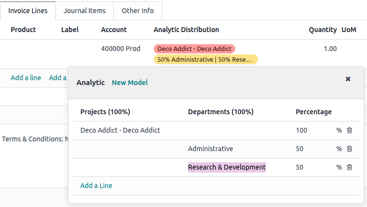

# Analytic accounting

Analytic accounting helps track costs and revenues and analyze a
project\'s or service\'s profitability. When creating journal entries,
costs can be `distributed
` across one or more analytic accounts.

To activate this feature, go to
`Accounting ‣ Configuration ‣ Settings` and enable `Analytic Accounting` in the `Analytics`
section.

## Analytic accounts 

Analytic accounts give an overview of costs and revenue.

To access analytic accounts, go to
`Accounting ‣ Configuration ‣ Analytic
Accounts`. To create a new
analytic account, click `New` and
fill in the following information:

- `Analytic Account`: Assign the name
  of the analytic account.
- `Customer`: Select the customer
  linked to the project, if applicable.
- `Reference`: Include a reference to
  make the account easier to find if needed.
- `Plan`: Link the
  `Analytic Account` to an
  `analytic plan
  `.
- `Company`: In a
  `multi-company ` environment, select the company using the analytic
  account. To make the analytic account accessible to all companies,
  leave the field empty.
- `Currency`: Update the currency of
  the analytic account if needed.

Then, the `budget ` information
can be filled in.

## Analytic plans 

Analytic plans group
`analytic accounts `, allowing the company to analyze its accounting, such as
tracking costs and revenues by project or department.

To access analytic plans, go to
`Accounting ‣ Configuration ‣ Analytic Plans`. Click `New` to
create a new plan, add a name, and fill in the following information:

- `Parent`: Link the plan to another
  analytic plan if a hierarchy between plans must be built.
- `Default Applicability`: Define how
  the plan is applied when creating a new journal entry:
  - `Optional`: Adding the analytic
    plan is not mandatory.
  - `Mandatory`: The entry cannot be
    confirmed if no analytic account is selected.
  - `Unavailable`: The plan is not
    available.
- `Color`: Set a color for the tag
  related to this specific plan.

To fine-tune a plan\'s applicability, create a new line in the
`Applicability` tab and set the
following fields:

- `Domain`: Choose the accounting
  documents to which the plan applies.
- `Financial Accounts Prefixes`:
  Enter the prefix(es) of the account(s) to which the plan applies.
- `Product Category`: Choose the
  product category to which the plan applies.
- `Applicability`: Define how the
  plan is applied when creating a new journal entry. The applicability
  set here always overrides the default applicability.
- `Company`: In a
  `multi-company ` environment, select the company using the plan. To make
  the analytic plan accessible to all companies, leave the field empty.

Two smart buttons are available:

- `Subplans`: To have a more complex
  analytic structure. Click the smart button, then click
  `New` to add a subplan. This
  creates a parent-child relationship between the two plans, and the
  `Parent` field of the subplan is
  automatically populated with the original plan.
- `Analytic Accounts`: To access the
  `analytic accounts
  ` linked to the plan.

::: tip

Each analytic plan must have at least one analytic account.
::::

## Analytic distribution 

The distribution of costs in one or more analytic accounts can be set in
each `invoice/bill
` or `en masse
`.

::: tip

The analytic distribution is prefilled based on the applicability and
the `analytic
distribution models `.
::::

### Analytic distribution on invoices or bills 

To add analytic distribution, click the
`Analytic Distribution` column when
creating an `invoice ` or
`bill `.

::: tip

The `Analytic Distribution` field is
mandatory only if the `analytic plan
` has been set as `Mandatory` in either the `Default Applicability` field on an analytic plan or the
`Applicability` field on an analytic
plan line.
::::

In the `Analytic` window, select the
desired `Analytic Accounts` in the
different `Analytic Plans` displayed
in columns. Then, split the costs between the accounts by modifying the
percentage.

### Analytic distribution en masse 

To mass-edit analytic accounts in several entries simultaneously, go to
`Accounting
‣ Accounting ‣ Journal items`, and select the ones that need to be updated.
Click the `Analytic Distribution`
column and add the required distribution in the
`Analytic` column, then click the
`oi-close` `(cross)` and `Confirm`. The
analytic distribution is then added to the selected journal items.

### Analytic distribution models 

Analytic distribution models automatically apply a specific distribution
based on defined criteria.

To create a new analytic distribution model, go to
`Accounting ‣ Configuration ‣
Analytic Distribution Models`,
click `New`, and set the conditions
the model has to meet to apply automatically:

::: tip

\- All specified conditions of an analytic distribution model must be
met for the model to be applied. To apply an analytic distribution model
based on individual conditions, create separate analytic distribution
models for each condition. - Analytic distribution models can be
combined and sequenced, allowing distribution across multiple models if
linked to different
`analytic plans `. To adjust the order, drag and drop the models using the
`oi-draggable`
`(draggable)` icon.
::::

- `Accounts Prefixes`: Apply the
  distribution model only to journal items involving accounts that begin
  with specific prefixes.
- `Partner`: Apply the distribution
  model only to journal items involving a specific partner.
- `Product`: Apply the distribution
  model only to journal items involving a specific product.
- `Company`: In a
  `multi-company ` environment, apply the distribution model only to journal
  items involving a specific company. To apply it across all companies,
  leave the field empty.
- `Analytic Distribution`:
  `Analytic distribution
  ` that will be applied when the above conditions are met.

::: example
Any time a journal item is posted to the
`Utilities (601000)` account, it
should be automatically distributed in the
`Departments` analytic plan as
follows:

- 60% to the `Manufacturing` analytic
  account
- 30% to the `Marketing` analytic
  account
- 10% to the `Admin` analytic account

To automate this distribution, the `Accounts Prefix` can be set to [601], as
`Utilities (601000)` is the only
account in the chart of accounts that begins with [601].

If additional accounts such as `Electricity (601100)` or `Gas (601200)`
are available in the chart of accounts, the distribution will also apply
to both since they share the same prefix.
:::

To define more criteria, use the `oi-settings-adjust` `(adjust settings)` icon
to reveal more columns or click `View` on an individual analytic distribution model.

- `Partner Category`: Apply this
  distribution model only to journal items involving a partner in a
  specific category.
- `Product Category`: Apply this
  distribution model to journal items involving a product in a specific
  category.

::: tip

Alternatively, it is possible to create an analytic distribution model
from the `Analytic` window by
clicking `New Model`:

- either when creating an invoice/bill and filling in the
  `analytic distribution
  `;
- or when `mass-editing analytic accounts
  ` in several entries simultaneously.
::::
