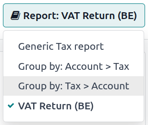
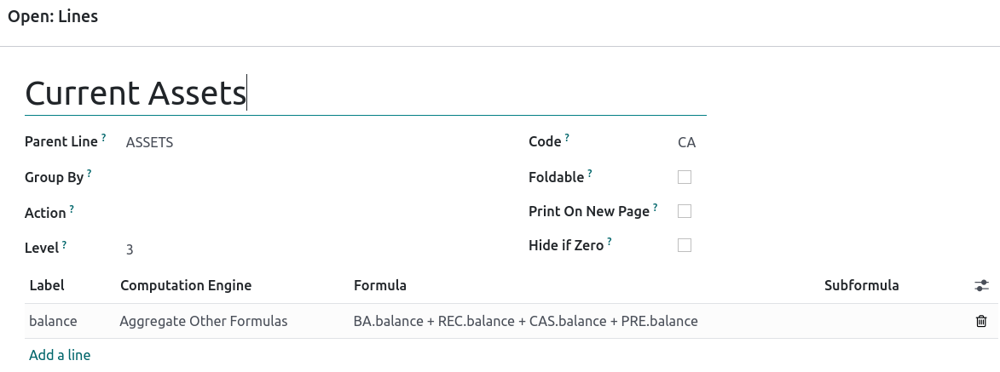
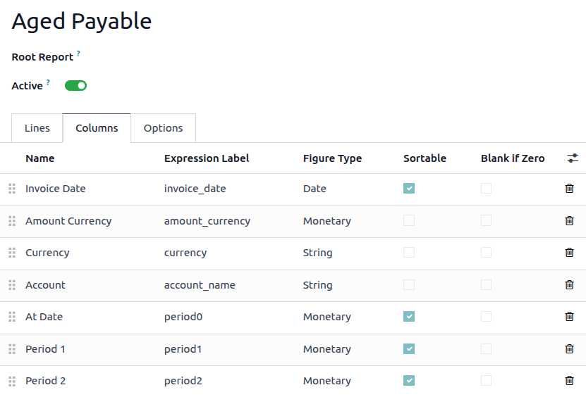

# Custom reports

Odoo comes with a powerful and easy-to-use reporting framework. The
engine allows you to create new reports, such as tax reports, balance
sheets, and income statements with specific groupings and layouts.

::: warning

Activate the `developer mode ` to access the accounting report configuration.
::::

To create a new report, go to
`Accounting ‣ Configuration ‣ Accounting Reports`. From here, create either a
`root report ` or
a `variant
`.

::: tip

\- Consider saving modified reports as report variants to keep their
root reports intact. - To access an existing report\'s management
interface from the report itself, click on the
`fa-cogs` `(gears)` icon.
::::

## Root reports 

Root reports can be regarded as generic, neutral accounting reports.
They serve as models on which local accounting versions are built. If a
report has no root report, it is considered to be a root report itself.

::: example
A tax report for Belgium and the US would both use the same generic
version as a base and adapt it for their domestic regulations.
:::

Creating a menu item is required to access a new root report. To do so,
open the report\'s configuration, click `Action`, `Create Menu Item`,
and refresh the page. The report is now available under
`Accounting ‣ Reporting`.

::: tip

Cases that require creating a new root report are rare, such as when a
country\'s tax authorities require a new and specific type of report.
::::

## Variants 

Variants are country-specific versions of root reports and, therefore,
always refer to a root report. To create a variant, select a generic
(root) report in the `Root Report`
field when creating a new report.

When a root report is opened from the Accounting app\'s
`Reporting` menu, all of its variants
are displayed in the report variant selector in the top right corner of
the view.

::: example
`VAT Report (BE)` is a variant of the
root `Generic Tax report`.

:::

## Lines 

After creating a report (either root or variant), the next step is to
fill it with lines. To create a new line, click on
`Add a line`. To modify an existing
line, click on the line itself and edit the popup. All lines require a
`Name` and can have an optional
`Code` which allows using the line\'s
value in formulas.

## Expressions

Each line can contain one or multiple **expressions**. Expressions can
be seen as **sub-variables** needed by a report line. To create an
expression, click on `Add a line`
*within* a line\'s popup.

When creating an expression, you must enter a `Label` used to refer to that expression. The label must be
unique among the expressions of each report line. Both the `Computation
Engine` and the
`Formula` fields must also be
completed. The **computation engine** defines how the **formula(s)** and
**subformula(s)** are interpreted. It is possible to mix expressions
using different computation engines under the same line if needed.

::: tip

Depending on the engine, `subformulas` may also be required.
::::

### Odoo Domain computation engine

When using the `Odoo Domain`
computation engine, a formula is interpreted as an `Odoo
domain ` targeting
[account.move.line] objects.

The subformula allows you to define how the move lines matching the
domain are used to compute the value of the expression:

[sum]

:   The result is the sum of all the balances of the matched move lines.

[sum_if_pos]

:   The result is the sum of all the balances of the matched move lines
    if this amount is positive. Otherwise, it is [0].

[sum_if_neg]

:   The result is the sum of all the balances of the matched move lines
    if this amount is negative. Otherwise, it is [0].

[count_rows]

:   The result is the number of sub-lines of this expression. If the
    parent line has a `group-by
    `
    value, this will correspond to the number of distinct grouping keys
    in the matched move lines. Otherwise, it will be the number of
    matched move lines.

::: tip

To **reverse** the sign of the result, put a [-] sign at the
beginning of the subformula.
::::

### Tax Tags computation engine

When using the `Tax Tags` computation
engine, the contents of the `Formula`
field are matched to tax tags. If such tags do not exist when creating
the expression, they will be created.

When evaluating the expression, the expression computation can roughly
be expressed as: **(amount of the move lines with** [+]
**tag)** [-] **(amount of the move lines with**
[-] **tag)**.

::: example
If the `Formula` is set to
[tag_name], the engine matches tax tags
[+tag_name] and [-tag_name], creating them if
necessary. To exemplify further: two tags are matched by the formula. If
the formula is [A], it will require (and create, if needed)
tags [+A] and [-A].
:::

### Aggregate Other Formulas computation engine

The `Aggregate Other Formulas`
computation engine performs arithmetic operations on the amounts
obtained from other expressions. Formulas here are composed of
references to expressions separated by one of the four basic arithmetic
operators (addition [+], subtraction [-],
division [/], and multiplication [\*]). To refer
to an expression, type in its parent line\'s **code** followed by a
period [.] and the expression\'s **label** (ex.
**code.label**).

**Subformulas** can be one of the following:

[if_above(CUR(amount))]

:   The value of the arithmetic expression will be returned only if it
    is greater than the provided bound. Otherwise, the result will be
    [0].

[if_below(CUR(amount))]

:   The value of the arithmetic expression will be returned only if it
    is lower than the provided bound. Otherwise, the result will be
    [0].

[if_between(CUR1(amount1), CUR2(amount2))]

:   The value of the arithmetic expression will be returned only if it
    is strictly between the provided bounds. Otherwise, it will be
    brought back to the closest bound.

[if_other_expr_above(LINE_CODE.EXPRESSION_LABEL, CUR(amount))]

:   The value of the arithmetic expression will be returned only if the
    value of the expression denoted by the provided line code and
    expression label is greater than the provided bound. Otherwise, the
    result will be [0].

[if_other_expr_below(LINE_CODE.EXPRESSION_LABEL, CUR(amount))]

:   The value of the arithmetic expression will be returned only if the
    value of the expression denoted by the provided line code and
    expression label is lower than the provided bound. Otherwise, the
    result will be [0].

[CUR] is the currency code in capital letters, and
[amount] is the amount of the bound expressed in that
currency.

You can also use the [cross_report] subformula to match an
expression found in another report.

### Prefix of Account Codes computation engine

The `Prefix of Account Codes`
computation engine is used to match amounts made on accounts using the
prefixes of these accounts\' codes as variables in an arithmetic
expression.

::: example
\| [21] \| Arithmetic expressions can also be a single
prefix, such as here.
:::

::: example
\| [21 + 10 - 5] \| This formula adds the balances of the
move lines made on accounts whose codes start with [21] and
[10], and subtracts the balance of the ones on accounts with
the prefix [5].
:::

It is also possible to ignore a selection of sub-prefixes.

::: example
\| [21 + 10(101, 102) - 5(57)] \| This formula works the
same way as the previous example but ignores the prefixes
[101], [102], and [57].
:::

You can apply \'sub-filtering\' on **credits and debits** using the
[C] and [D] suffixes. In this case, an account
will only be considered if its prefix matches, *and* if the total
balance of the move lines made on this account is **credit/debit**.

::: example
Account [210001] has a balance of -42 and account
[210002] has a balance of 25. The formula [21D]
only matches the account [210002], and hence returns 25.
[210001] is not matched, as its balance is *credit*.
:::

Prefix exclusions can be mixed with the [C] and
[D] suffixes.

::: example
\| [21D + 10(101, 102)C - 5(57)] \| This formula adds the
balances of the move lines made on accounts whose code starts with
[21] *if* it is debit ([D]) and [10]
*if* it is credit ([C]), but ignores prefixes
[101], [102], and subtracts the balance of the
ones on accounts with the prefix [5], ignoring the prefix
[57].
:::

To match the letter [C] or [D] in a prefix and
not use it as a suffix, use an empty exclusion [()].

::: example
\| [21D()] \| This formula matches accounts whose code
starts with [21D], regardless of their balance sign.
:::

In addition to using code prefixes to include accounts, you can also
match them with **account tags**. This is especially useful, for
example, if your country lacks a standardized chart of accounts, where
the same prefix might be used for different purposes across companies.

::: example
\| [tag(25)] \| This formula matches accounts whose
associated tags contain the one with ID *25*.
:::

If the tag you reference is defined in a data file, an XMLID can be used
instead of the ID.

::: example
\| [tag(my_module.my_tag)] \| This formula matches accounts
whose associated tags include the tag denoted by *my_module.my_tag*.
:::

You can also use arithmetic expressions with tags, possibly combining
them with prefix selections.

::: example
\| [tag(my_module.my_tag) + tag(42) + 10] \| The balances of
accounts tagged as *my_module.my_tag* will be summed with those of
accounts linked to the tag with ID *42* and accounts with the code
prefix [10]
:::

[C] and [D] suffixes can be used in the same way
with tags.

::: example
\| [tag(my_module.my_tag)C] \| This formula matches accounts
with the tag *my_module.my_tag* and a credit balance.
:::

Prefix exclusion also works with tags.

::: example
\| [tag(my_module.my_tag)(10)] \| This formula matches
accounts with the tag *my_module.my_tag* and a code not starting with
[10].
:::

### External Value computation engine

The `External Value` computation
engine is used to refer to **manual** and **carryover values**. Those
values are not stored using [account.move.line], but with
[account.report.external.value]. Each of these objects
directly points to the expression it impacts, so very little needs to be
done about their selection here.

**Formulas** can be one of the following:

[sum]

:   If the result must be the sum of all the external values in the
    period.

[most_recent]

:   If the result must be the value of the latest external value in the
    period.

In addition, **subformulas** can be used in two ways:

[rounding=X]

:   Replacing [X] with a number instructs to round the
    amount to X decimals.

[editable]

:   Indicates this expression can be edited manually, triggering the
    display of an icon in the report, allowing the user to perform this
    action.

::: tip

Manual values are created at the [date_to] currently
selected in the report.
::::

Both subformulas can be mixed by separating them with a [;].

::: example
\| [editable;rounding=2] \| This subformula shows the
correct way to mix both behaviors.
:::

### Custom Python Function computation engine

The `Custom Python Function`
computation engine is a means for developers to introduce custom
computation of expressions on a case-by-case basis. The
`Formula` is the name of a **python
function** to call, and the `Subformula` is a **key** to fetch in the **dictionary** returned by
this function. Use this computation engine only if making a custom
module.

## Columns

Reports can have an **indefinite number** of columns to display. Each
column gets its values from the **expressions** declared on the
**lines**. The field `expression_label` of the column gives the label of the expressions whose
value is displayed. If a line has no **expression** in that field, then
nothing is displayed for it in this column. If multiple columns are
required, you must use different **expression** labels.

When using the **period comparison** feature found under the
`Options` tab of an accounting
report, all columns are repeated in and for each period.

## Line grouping 

Non-standard grouping is possible by adding or using existing fields on
the *Journal Item* model, provided that the fields are related and
non-stored.

::: tip

Grouping lines requires the report to have explicit report lines that
can be edited. The deferred reports, for example, do not support
grouping lines as they use dynamic lines that are generated.
::::

### Create a new field on journal item

To create a non-stored, related field in the *Journal Item* model, first
go to `Accounting ‣ Journal Items`, and click the `fa-bug` `(bug)` icon, then click
`Fields`. Click
`New` to create a new field, and
complete the following fields:

- `Field Name`: a technical name for
  the field

- `Field Label`: the label to be
  displayed for the field

- `Field Type`: the type of field
  that this related field should point to

- `Stored`: Leave this field
  unchecked as only non-stored fields can be used to group lines.

- `Related Model`: If the field type
  is `one2many`,
  `many2many`, or
  `many2one`, select the model of the
  original field to group by.

- `Related Field Definition`: the
  technical path to the field you want to group by

  ::: example
  To group by the sales team of the commercial partner, set the related
  field definition to [move_id.team_id].
  :::

### Group lines

To group lines, go to the
`Lines ` tab
of the desired report, click on the line you want to group, and edit the
`Group by` field. Enter the technical
name (`Field Name`) of the field to
use as the grouping key.

::: tip

To find a list of all the model\'s fields and their technical names, go
to `Accounting ‣ Journal Items`, and click the `fa-bug` `(bug)` icon, then click
`Fields`. The technical name of each
field is listed in the `Field Name`
column.
::::

