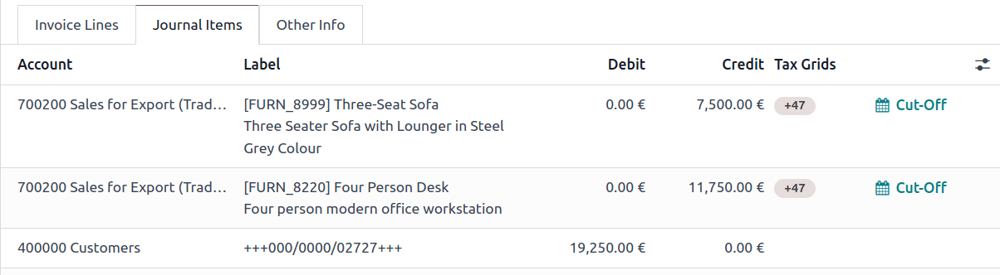

# Tax return (VAT declaration)

Companies with a registered `VAT (Value Added Tax)` number must submit a **tax return** on a monthly or
quarterly basis, depending on their turnover and the registration
regulation. A tax return - or VAT return - gives the tax authorities
information about the taxable transactions made by the company. The
**output tax** is charged on the number of goods and services sold by a
business, while the **input tax** is the tax added to the price when
goods or services are purchased. Based on these values, the company can
calculate the tax amount they have to pay or be refunded.

::: tip

You can find additional information about VAT and its mechanism on this
page from the European Commission: [\"What is
VAT?\"](https://ec.europa.eu/taxation_customs/business/vat/what-is-vat_en).
::::

## Prerequisites 

### Tax Return Periodicity 

The configuration of the **Tax Return Periodicity** allows Odoo to
compute your tax return correctly and also to send you a reminder to
never miss a tax return deadline.

To do so, go to
`Accounting ‣ Configuration ‣ Settings`. Under the
`Tax Return Periodicity`, you can
set:

- `Periodicity`: define here whether
  you submit your tax return on a monthly or quarterly basis;
- `Reminder`: define when Odoo should
  remind you to submit your tax return;
- `Journal`: select the journal in
  which to record the tax return.

::: tip

This is usually configured during the
`app's initial set up `.
::::

### Tax Grids 

Odoo generates tax reports based on the `Tax Grids` settings that are configured on your taxes. Therefore,
it is crucial to make sure that all recorded transactions use the right
taxes. You can see the `Tax Grids` by
opening the `Journal Items` tab of
any invoice and bill.

To configure your tax grids, go to
`Accounting ‣ Configuration ‣ Taxes`, and open the tax you want to modify. There, you
can edit your tax settings, along with the tax grids that are used to
record invoices or refunds.

::: tip

Taxes and reports are usually already pre-configured in Odoo: a
`fiscal localization package
` is
installed according to the country you select at the creation of your
database.
::::

## Close a tax period 

### Tax lock date 

Any new transaction whose accounting date prior to the
`Lock Tax Return` date has its tax
values moved to the next open tax period. This is useful to make sure
that no change can be made to a report once its period is closed.

Therefore, we recommend locking your tax date before working on your
`Closing Journal Entry`. This way,
other users cannot modify or add transactions that would have an impact
on the `Closing Journal Entry`, which
can help you avoid some tax declaration errors.

To check the current `Lock Tax Return` date, or to edit it, go to
`Accounting ‣ Accounting ‣ Lock Dates`.

### Tax return 

Once all the transactions involving taxes have been posted for the
period you want to report, open the `Tax Return` report by going to `Accounting ‣ Reporting ‣ Tax
Return`. Select the period you
want to declare using the date filter to have an overview of the tax
return. Then, click `Closing Entry`
to create a tax closing journal entry. Odoo automatically proposes the
details of the journal entry. Make any necessary changes and click
`Post`.

From the report, click `PDF` to
download a PDF of the tax return. Alternatively, click the
`fa-cog` (`gear`) icon, then click `Download Excel` to download an XLSX of the tax return. To save the
report to the Documents app, click the `fa-cog` (`gear`) icon, then
click `Copy to Documents`. Select the
format to `Export to`, the
`Documents Name`, the
`Folder` to store it in, and add any
`Tags`.

The report includes all the values to report to the tax authorities,
along with the amount to be paid or refunded.

::: tip

If you forgot to lock your tax date before clicking on
`Closing Journal Entry`, then Odoo
automatically locks your fiscal period on the same date as the
accounting date of your entry. This safety mechanism can prevent some
fiscal errors, but it is advised to lock your tax date manually before,
as described above.
::::

::: warning

\- Once the tax report for a period has been generated but not yet
posted, additional invoices or bills from that same period can still be
posted and included in the closing entry. To do so, click
`oi-arrow-right`
`Refresh` in the
`Proposition of tax closing
journal entry`, or click
`Closing Entry` again from the tax
report. - After the tax report has been posted for a period, Odoo locks
the period and prevents the creation of new journal entries involving
VAT. Any corrections to customer invoices or vendor bills must then be
recorded in the following period.
::::

