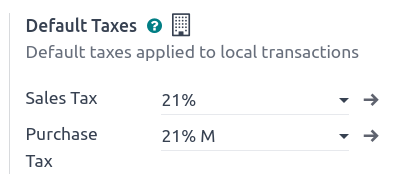

# Taxes

There are numerous types of **taxes**, and their application varies
greatly, depending mostly on your company\'s localization. To make sure
they are recorded with accuracy, Odoo\'s tax engine supports all kinds
of uses and computations.

## Default taxes 

**Default taxes** define which taxes are automatically selected when
creating a new product. They are also used to prefill the
`Taxes` field when adding a new line
on an invoice in
`Accounting Firms ` mode.

To change your **default taxes**, go to
`Accounting ‣ Configuration ‣ Settings
‣ Taxes ‣ Default Taxes`,
select the appropriate taxes for your default sales tax and purchase
tax, and click on `Save`.

::: tip

**Default taxes** are automatically set up according to the country
selected at the creation of your database, or when you set up a
`fiscal localization package
` for your
company.
::::

## Activate sales taxes from the list view 

As part of your
`fiscal localization package `, most of your country\'s sales taxes are already
preconfigured on your database. However, only a few taxes are activated
by default. To activate taxes relevant to your business, go to
`Accounting
‣ Configuration ‣ Taxes` and
enable the toggle button under the `Active` column.

## Configuration 

To edit or create a **tax**, go to
`Accounting ‣ Configuration ‣ Taxes` and open a tax or click on `New`.

### Basic options

#### Tax name 

The **tax name** is displayed for backend users in the
`Taxes` field in
`sales orders `,
`invoices `, product
forms, etc.

#### Tax computation 

- **Group of Taxes**

  The tax is a combination of multiple sub-taxes. You can add as many
  taxes as you want, in the order you want them to be applied.

  ::: warning
   example
A product has a sales price of \$1000, and we apply a \$10 *fixed* tax.
We then have:

  -------------------------------------------------
  Product sales Price without Tax        Total
  price         tax                      
  ------------- ------------- ---------- ----------
  1,000         1,000         10         1,010.00

  -------------------------------------------------
:::

- **Percentage of price**

  The *sales price* is the taxable basis: the tax amount is computed by
  multiplying the sales price by the tax percentage.

::: example
A product has a sales price of \$1000, and we apply a *10% of Price*
tax. We then have:

  -------------------------------------------------
  Product sales Price without Tax        Total
  price         tax                      
  ------------- ------------- ---------- ----------
  1,000         1,000         100        1,100.00

  -------------------------------------------------
:::

- **Percentage of Price Tax Included**

  The **total** is the taxable basis: the tax amount is a percentage of
  the total.

::: example
A product has a Sales Price of \$1000, and we apply a *10% of Price Tax
Included* tax. We then have:

  -------------------------------------------------
  Product sales Price without Tax        Total
  price         tax                      
  ------------- ------------- ---------- ----------
  1,000         1,000         111.11     1,111.11

  -------------------------------------------------
:::

- **Python code**

  A tax defined as **Python code** consists of two snippets of Python
  code that are executed in a local environment containing data such as
  the unit price, product or partner. `Python Code` defines the amount of the tax, and
  `Applicable Code` defines if the
  tax is to be applied. The formula is found at the bottom of the
  `Definition` tab.

::: example
`Python Code`: [result = price_unit
\* 0.10] `Applicable Code`: [result = true]
:::

#### Active 

Only **active** taxes can be added to new documents.

::: warning

It is not possible to delete taxes that have already been used. Instead,
you can deactivate them to prevent future use.
::::

::: tip

This field can be modified from the
`list view `.
::::

#### Tax type 

The `Tax Type` determines the tax
application, which also restricts where it is displayed.

- **Sales**: Customer invoices, product customer taxes, etc.
- **Purchase**: Vendor bills, product vendor taxes, etc.
- **None**

::: tip

You can use `None` for taxes that you
want to include in a `Group of Taxes
` but that you do not
want to list along with other sales or purchase taxes.
::::

#### Tax scope

The `Tax Scope` restricts the use of
taxes to a type of product, either **goods** or **services**.

### Definition tab 

Allocate with precision the amount of the taxable basis or percentages
of the computed tax to multiple accounts and tax grids.

- **Based On**:
  - `Base`: the price on the invoice
    line
  - `% of tax`: a percentage of the
    computed tax.
- **Account**: if defined, an additional journal item is recorded.
- **Tax Grids**: used to generate
  `tax reports `
  automatically, according to your country\'s regulations.

### Advanced options tab 

#### Label on invoices 

The tax label is displayed on each invoice line in the
`Taxes` column. This is visible to
*front-end* users on exported invoices, in customer portals, etc.

#### Tax group 

Select which **tax group** the tax belongs to. The tax group name is the
displayed above the **total** line on exported invoices and in customer
portals.

Tax groups include different iterations of the same tax. This can be
useful when you must record the same tax differently according to
`fiscal positions `.

::: example

In the example above, the `0% EU S`
tax for intra-community customers in Europe records the amount on
specific accounts and tax grids. However, it remains a 0% tax to the
customer. This is why the label indicates `0% EU S`, and the tax group name above the
`Total` line indicates
`VAT 0%`.
:::

::: warning

Taxes have three different labels, each one having a specific use. Refer
to the following table to see where they are displayed.

  --------------------------------------------------------------------------------------------------------------------
  `Tax Name                         `Label on Invoice                           `Tax Group
  `                       role="ref"}                                 role="ref"}
  --------------------------------- ------------------------------------------- --------------------------------------
  Backend                           `Taxes`  Above the `Total` line on exported
                                                                                invoices

  --------------------------------------------------------------------------------------------------------------------
::::

#### Include in analytic cost 

With this option activated, the tax amount is assigned to the same
**analytic account** as the invoice line.

#### Included in price 

With this option activated, the total (including the tax) equals the
**sales price**.

[Total = Sales Price = Computed Tax-Excluded price + Tax]

::: example
A product has a sales price of \$1000, and we apply a *10% of Price*
tax, which is *included in the price*. We then have:

  -------------------------------------------------
  Product sales Price without Tax        Total
  price         tax                      
  ------------- ------------- ---------- ----------
  1,000         900.10        90.9       1,000.00

  -------------------------------------------------
:::

::: tip

If you need to define prices accurately, both tax-included and
tax-excluded, please refer to the following documentation:
`taxes/B2B_B2C`.
::::

::: tip

By default, only the `Tax excluded`
column is displayed on invoices. To display the
`Tax included` column, click the
**dropdown toggle** button and check `Tax incl.`.

::::

#### Affect base of subsequent taxes 

With this option, the total tax-included becomes the taxable basis for
the other taxes applied to the same product.

You can configure a new
`group of taxes ` to
include this tax or add it directly to a product line.

:::: warning

The order in which you add the taxes on a product line has no effect on
how amounts are computed. If you add taxes directly on a product line,
only the tax sequence determines the order in which they are applied.

To reorder the sequence, go to
`Accounting ‣ Configuration ‣ Taxes`, and drag and drop the lines with the handles next
to the tax names.

::::

## Extra taxes

\"Extra taxes\" is a broad term referring to additional taxes beyond the
standard or basic taxes imposed by governments. These extra taxes can be
**luxury** taxes, **environmental** taxes, **import** or **export
duties** taxes, etc.

::: tip

The method to compute these taxes varies across different countries. We
recommend consulting your country\'s regulations to understand how to
calculate them for your business.
::::

To compute an extra tax in Odoo,
`create a tax `,
enter a tax name, select a
`Tax Computation `,
set an `Amount`, and in the
`Advanced Options` tab, check
`Affect Base of Subsequent Taxes`.
Then, drag and drop the taxes in the
`order they should be computed `.

::: example
\- In Belgium, the formula to compute an environmental tax is: [(product
price + environmental tax) x sales tax]. Therefore, our
environmental tax has to come *before* the sales tax in the computation
sequence. - In our case, we created a 5% environmental tax (Ecotax) and
put it *before* the Belgian base tax of 21%.

:::

::: 
taxes/cash_basis taxes/retention taxes/vat_verification
taxes/fiscal_positions taxes/avatax taxes/eu_distance_selling
taxes/B2B_B2C
:::
