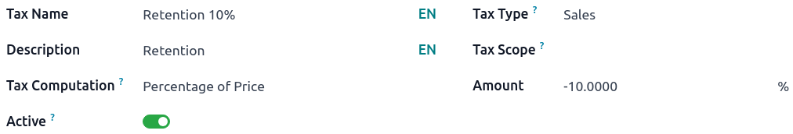
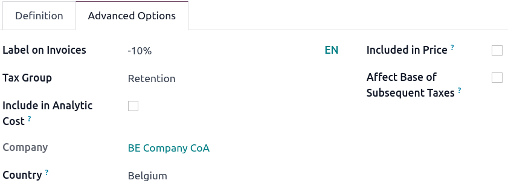
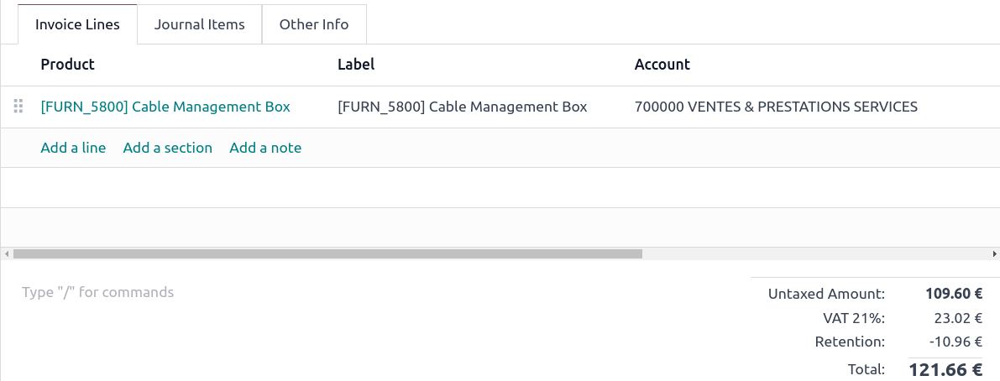

# Withholding taxes

A **withholding tax**, also known as retention tax, mandates the payer
of a customer invoice to deduct a tax from the payment and remit it to
the government. Typically, a tax is included in the subtotal to
calculate the total amount paid, while withholding taxes are directly
subtracted from the payment.

## Configuration

In Odoo, a withholding tax is defined by creating a negative tax. To
create one, go to
`Accounting ‣ Configuration ‣ Taxes` and, in the `Amount` field, enter a negative amount.

Then, go to the `Advanced Options` tab and create a retention
`Tax Group`.

::: tip

If the retention is a percentage of a regular tax, create a
`Tax` with a
`Tax Computation` as a
`Group of Taxes`. Then, set both the
regular tax and the retention one in the `Definition` tab.
::::

## Retention taxes on invoices

Once the retention tax has been created, it can be used on customer
forms, sales orders, and customer invoices. Several taxes can be applied
on a single customer invoice line.

