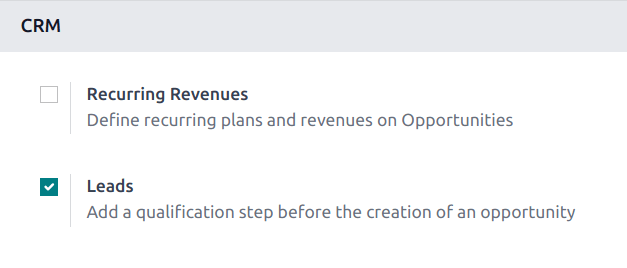
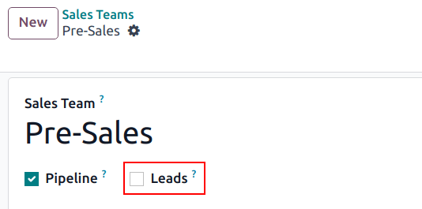
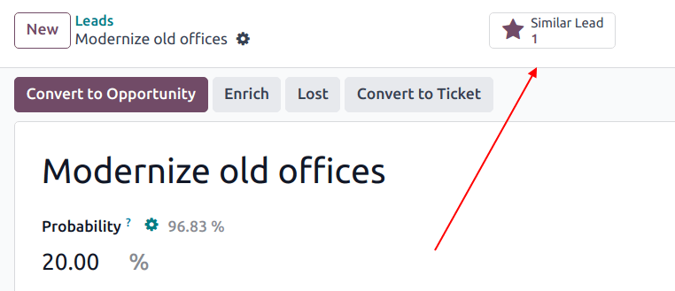
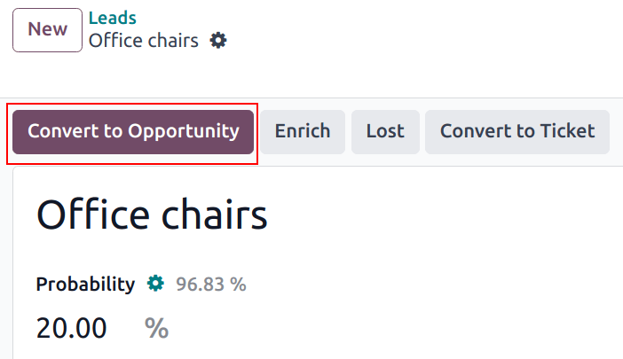
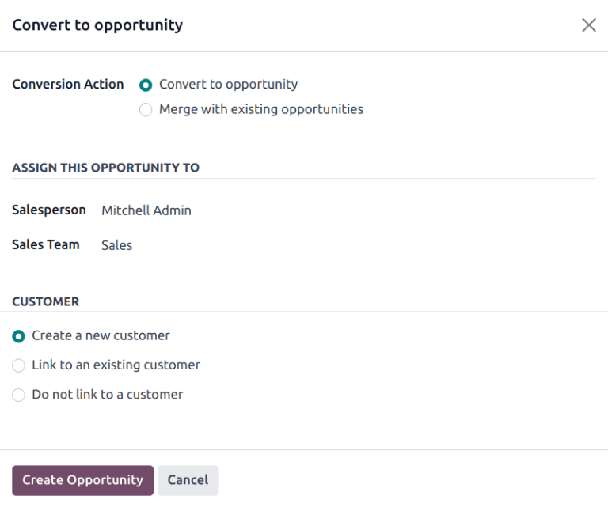

# Lidlarni imkoniyatlarga aylantirish

*Lidlar* imkoniyat yaratilishidan oldin malakali qadamlar sifatida harakat qiladi. Bu 
uning potentsialini ko'rib chiqish va imkoniyat sotuvchiga tayinlanishidan oldin 
uning maqsadga muvofiqligini baholash uchun qo'shimcha vaqt beradi.

## Sozlash

*Lidlar* sozlamasini faollashtirish uchun
`CRM app ‣ Configuration ‣ Settings` ga o'ting va
`Leads` deb belgilangan katagini belgilang. Keyin
`Save` tugmasini bosing.

Ushbu xususiyatni faollashtirish ekranning yuqori qismida joylashgan sarlavha 
paneliga yangi menyu opsiyasi - `Leads` ni qo'shadi.

*Lidlar* sozlamasi faollashtirilgach, u standart ravishda barcha sotuv 
jamoalariga qo'llaniladi. Muayyan jamoa uchun lidlarni o'chirish uchun
`CRM app ‣ Configuration ‣ Sales Teams` ga o'ting. Keyin o'sha 
jamoaning sozlash sahifasini ochish uchun ro'yxatdan jamoani tanlang.
`Sales Team` maydoni ostida joylashgan `Leads` katakchasini tozalang, 
so'ngra `Save` tugmasini bosing.

## Lidni imkoniyatga aylantirish

Lidni *imkoniyat* ga aylantirish uchun `CRM app ‣ Leads` ga o'ting 
va uni ochish uchun ro'yxatdan lidni bosing.

:::: warning

Agar lid uchun sahifaning yuqori qismida `Similar Leads` aqlli tugmasi 
paydo bo'lsa, bu ma'lumotlar bazasida shunga o'xshash lid yoki imkoniyat 
mavjudligini bildiradi. Ushbu lidni aylantirishdan oldin, lidni birlashtirish 
kerakligini tasdiqlash uchun aqlli tugmani bosing.

::::

Sahifaning yuqori chap qismida joylashgan `Convert to Opportunity` 
tugmasini bosing.

Bu `Convert to opportunity` qalqib chiquvchi modal oynasini ochadi. 
Bu yerda `Conversion Action` maydonida 
`Convert to opportunity` opsiyasini tanlang.

::: tip

Ushbu lidni mavjud shunga o'xshash lid yoki imkoniyat bilan birlashtirish uchun
`Conversion Action` maydonida 
`Merge with existing opportunities` ni tanlang. Bu birlashtirilishi 
kerak bo'lgan shunga o'xshash lidlar/imkoniyatlar ro'yxatini yaratadi.

Birlashtirishda Odoo tizimda birinchi yaratilgan lid/imkoniyatga ustunlik beradi 
va ma'lumotlarni birinchi yaratilgan lid/imkoniyatga birlashtiradi. Biroq, agar 
lid va imkoniyat birlashtirilayotgan bo'lsa, qaysi yozuv birinchi yaratilganidan 
qat'i nazar, natijada olingan yozuv imkoniyat deb ataladi.
::::

Keyin imkoniyat tayinlanishi kerak bo'lgan `Salesperson` va 
`Sales Team` ni tanlang. Hech bir maydon majburiy emas, lekin 
`Salesperson` maydonida tanlov qilinsa, `Sales Team` maydoni 
sotuvchining jamoa tayinlashlariga asoslanib avtomatik ravishda to'ldiriladi.

Agar lid allaqachon sotuvchi yoki jamoaga tayinlangan bo'lsa, ushbu maydonlar 
avtomatik ravishda o'sha ma'lumot bilan to'ldiriladi.

`Customer` sarlavhasi ostida quyidagi opsiyalardan birini tanlang:

- `Create a new customer`: yangi mijoz yozuvini yaratish uchun liddagi 
  ma'lumotlardan foydalanish uchun ushbu opsiyani tanlang.
- `Link to an existing customer`: ushbu opsiyani tanlang, so'ngra 
  ushbu imkoniyatni mavjud mijoz yozuviga bog'lash uchun natijada 
  ochiladigan pastga tushish menyusidan mijozni tanlang.
- `Do not link to a customer`: lidni aylantirish uchun, lekin uni 
  yangi yoki mavjud mijozga bog'lamaslik uchun ushbu opsiyani tanlang.

Nihoyat, barcha sozlamalar tugallangach, `Create Opportunity` ni bosing.

Yangi yaratilgan imkoniyatni ko'rish uchun `CRM app ‣ My Pipeline` ga o'ting.

::: tip

Barcha imkoniyatlarni ko'rish uchun yuqori `Pipeline` sahifasidagi 
`Search...` panelidan ba'zi filtrlarni olib tashlash kerak bo'lishi mumkin.
::::