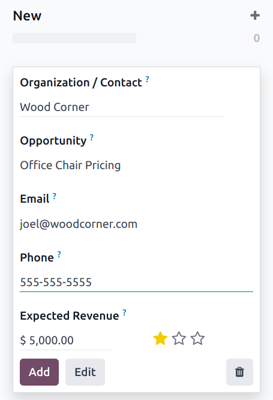

# Lidlarni yaratish (email yoki qo'lda)

Lidlarni *CRM* ilovasiga maxsus email taxalluslari orqali va yangi yozuvlarni 
qo'lda yaratish orqali qo'shish mumkin. Bu `website contact form` orqali 
ilovada yaratilgan lidlar va imkoniyatlarga qo'shimcha hisoblanadi.

Avvalo, ma'lumotlar bazasida *Lidlar* xususiyati yoqilganligini ta'minlang, 
buning uchun `CRM app ‣ Configuration ‣ Settings` ga o'ting. 
`Leads` katakchasini belgilang, so'ngra `Save` tugmasini bosing.

## Email taxalluslarini sozlash

Har bir sotuv jamoasi o'zining noyob email taxallusini yaratish va undan 
foydalanish imkoniyatiga ega. Ushbu manzilga xabarlar yuborilganda, xabardagi 
ma'lumotlar bilan lid (yoki imkoniyat) yaratiladi.

Sotuv jamoasining email taxallusini yaratish yoki yangilash uchun 
`CRM app ‣ Configuration ‣ Sales Teams` ga o'ting. 
Jamoaning tafsilotlar sahifasini ochish uchun ro'yxatdan jamoani bosing.

`Email Alias` maydoniga email taxallusi uchun nom kiriting yoki mavjud 
nomni tahrirlang. `Accept Emails From` maydonida ushbu email taxallusiga 
xabar yuborishga kimga ruxsat berilganligini tanlash uchun pastga tushish 
menyusidan foydalaning:

- `Everyone`: har qanday email manzilidan xabarlar qabul qilinadi.
- `Authenticated Partners`: faqat hamkor (aloqa yoki mijoz) yozuvi bilan 
  bog'langan email manzillaridan xabarlar qabul qilinadi.
- `Followers only`: faqat jamoa bilan bog'liq yozuvni (lid yoki imkoniyat kabi) 
  kuzatib boruvchilardan xabarlar qabul qilinadi. Jamoa a'zolaridan ham 
  xabarlar qabul qilinadi.
- `Authenticated Employees`: faqat *Employees* ilovasidagi yozuv bilan 
  bog'langan email manzillaridan xabarlar qabul qilinadi.

### Email orqali yaratilgan lidlar

Email taxallusi xabarlaridan yaratilgan lidlarni `CRM app ‣ Leads` ga 
o'tib ko'rish mumkin. Uni ochish va tafsilotlarni ko'rish uchun ro'yxatdan 
lidni bosing.

Taxallus tomonidan qabul qilingan email lid uchun *chatter* ipiga qo'shiladi. 
Xabarning mavzu qatori sarlavha maydoniga qo'shiladi va `Email` maydoni 
kontaktning email manzili bilan yangilanadi.

::: tip

Agar ma'lumotlar bazasida *lidlar* xususiyati **yoqilmagan** bo'lsa, email 
taxallusiga yuborilgan xabarlar ma'lumotlar bazasiga imkoniyatlar sifatida 
qo'shiladi.
::::

## Lidlarni qo'lda yaratish

Lidlarni yangi yozuvni qo'lda yaratish orqali *CRM* ilovasiga to'g'ridan-to'g'ri 
qo'shish mumkin. Mavjud lidlar ro'yxatini ko'rish uchun `CRM app ‣ Leads` ga o'ting.

::: tip

Lidlarni `Generate Leads` tugmasi orqali ham qo'shish mumkin.
::::

Ro'yxatning yuqori chap qismida bo'sh `Leads` formasini ochish uchun 
`New` tugmasini bosing.

Yangi formaning birinchi maydoniga yangi lid uchun sarlavha kiriting. 
Keyinchalik, `Contact Name` va `Company Name` kiriting.

::: tip

Agar lid `converted to an opportunity` bo'lsa, `Company Name` maydoni 
ushbu imkoniyatni mavjud mijozga bog'lash yoki yangi mijoz yaratish 
uchun ishlatiladi.
::::

### Imkoniyatlarni qo'lda yaratish

Imkoniyatni qo'lda yaratish uchun `CRM app ‣ Sales ‣ My Pipeline` ga o'ting. 
Sahifaning yuqori chap qismida yangi imkoniyat Kanban kartasini yaratish uchun 
`New` tugmasini bosing. `Organization/Contact` maydoniga imkoniyat tegishli 
bo'lgan kompaniya nomini kiriting.

Nomni tanlang va uni `Opportunity` maydoniga kiriting. *Bu majburiy maydon.* 
Imkoniyatni qo'lda yaratayotganda, imkoniyat tafsilotlariga bog'liq nomni 
qo'shish foydalidir.

::: example
Quyidagi misolda imkoniyat [5 VP Chairs] deb nomlangan. Bu mijoz qiziqayotgan 
mahsulotni, shuningdek, mahsulotlarning potentsial sonini aniqlaydi.

:::

Imkoniyat uchun aloqa ma'lumotlarini `Email` va `Phone` maydonlariga kiriting.

`Expected Revenue` maydoniga imkoniyat uchun taxminiy qiymatni kiriting.

::: tip

`Expected Revenue` va ustuvorlik maydonlaridagi ma'lumotlar individual 
sotuvchilar va jamoa asosida ishlashni kuzatish uchun ishlatilishi mumkin. 
Qo'shimcha ma'lumot uchun `../performance/expected_revenue_report` va 
`../track_leads/lead_scoring` ga qarang.
::::

Keyin ustuvorlikni belgilash uchun `fa-star-o` `(yulduzcha)` ikonalaridan 
foydalaning.

- `fa-star-o` `fa-star-o` `fa-star-o`: past ustuvorlik
- `fa-star` `fa-star-o` `fa-star-o`: o'rta ustuvorlik
- `fa-star` `fa-star` `fa-star-o`: yuqori ustuvorlik
- `fa-star` `fa-star` `fa-star`: juda yuqori ustuvorlik

::: tip

Ustuvorlikni belgilash Kanban ko'rinishida lidlar tartibini o'zgartiradi, 
yuqori ustuvorlikli lidlar birinchi bo'lib ko'rsatiladi.
::::

Barcha kerakli ma'lumotlar kiritilgach, `Add` tugmasini bosing.

