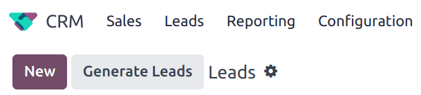

# Lid qazib olish

*Lid qazib olish* - bu *CRM* foydalanuvchilariga yangi lidlarni to'g'ridan-to'g'ri 
o'zlarining Odoo ma'lumotlar bazasiga yaratish imkonini beruvchi xususiyatdir. Lid 
malakasini ta'minlash uchun lid qazib olish natijasi turli xil filtrlash mezonlari, 
masalan, mamlakat, kompaniya hajmi va sanoat sohasiga qarab belgilanadi.

## Sozlash

Boshlash uchun `CRM app ‣ Configuration ‣ Settings` ga o'ting va xususiyatni 
faollashtirish uchun `Lead Mining` katakchasini belgilang. Keyin `Save` tugmasini 
bosing.

## Lidlarni yaratish

*Lid qazib olish* sozlamasi faollashgandan so'ng, *CRM* *Pipeline* ning yuqori 
chap burchagida (`CRM app ‣ Sales ‣ My Pipeline`) foydalanish uchun 
*Generate Leads* deb nomlangan yangi tugma mavjud bo'ladi.

Lid qazib olish so'rovlari `CRM app ‣ Configuration ‣ Lead Mining Requests` 
orqali yoki `CRM app ‣ Leads ‣ Leads` orqali ham mavjud bo'lib, u yerda ham 
`Generate Leads` tugmasi mavjud.

`Generate Leads` tugmasini bosing va lidlarni yaratish uchun turli xil mezonlarni 
taklif qiluvchi qalqib chiquvchi oyna paydo bo'ladi.

Faqat kompaniya ma'lumotlarini olish uchun `Companies` uchun lidlarni yaratishni 
tanlang yoki kompaniya ma'lumotlari va individual xodimlarning aloqa ma'lumotlarini 
olish uchun `Companies and their Contacts` ni tanlang.

::: tip

`Companies and their Contacts` ni nishonga olganda, kontaktlarni `Role` yoki 
`Seniority` asosida filtrlash uchun qo'shimcha opsiyalar mavjud.
::::

Qo'shimcha filtrlash opsiyalari quyidagilarni o'z ichiga oladi:

- `Countries`: lidlarni ular joylashgan mamlakat (yoki mamlakatlar) asosida 
  filtrlash.
- `States`: agar tegishli bo'lsa, lidlarni ular joylashgan shtat asosida 
  qo'shimcha filtrlash.
- `Industries`: lidlarni ular ishlayotgan aniq sanoat sohasiga qarab filtrlash.
- `Filter on Size`: kompaniyadagi xodimlar sonini belgilash uchun ushbu 
  katakchani belgilang. Bu `Size` deb nomlangan maydonni yaratadi. Kerakli 
  kompaniya hajmi uchun diapazon yaratish uchun bo'sh joylarni to'ldiring.
- `Sales Team`: lidlar qaysi Sotuv Jamoasiga tayinlanishini tanlang.
- `Salesperson`: lidlar Sotuv Jamoasining qaysi a'zosiga tayinlanishini tanlang.
- `Default Tags`: topilgandan so'ng lidlarga to'g'ridan-to'g'ri qo'llaniladigan 
  teglarni tanlang.

::: warning

Aloqa ma'lumotlarini olishda EIning eng so'nggi qoidalaridan xabardor bo'lishni 
unutmang. Umumiy Ma'lumotlarni Himoya qilish Reglamenti haqida qo'shimcha 
ma'lumot olish uchun [Odoo GDPR](http://odoo.com/gdpr) ga qarang.
::::

### Lidlarni ko'rish

Lidlar yaratilgandan so'ng, ular belgilangan sotuvchi va jamoaga tayinlanadi. 
Lid haqida qo'shimcha ma'lumotni ko'rish uchun ro'yxatdan birini tanlang va 
uni ochish uchun bosing.

Lid uchun chatter ipida qo'shimcha ma'lumotlar beriladi. Bu xodimlar soni, 
kompaniya tomonidan ishlatiladigan texnologiya, vaqt mintaqasi va to'g'ridan-to'g'ri 
aloqa ma'lumotlarini o'z ichiga olishi mumkin.

::: tip

Agar ma'lumotlar bazasi uchun `Leads` **yoqilmagan** bo'lsa, lidlar 
*imkoniyatlar* sifatida yaratiladi va belgilangan sotuvchi uchun pipelinegа 
qo'shiladi.

`Leads` xususiyatini yoqish uchun `CRM app ‣ Configuration ‣ Settings` ga 
o'ting va `Leads` katakchasini belgilang. Keyin `Save` tugmasini bosing.
::::

## Narxlash

Lid qazib olish *Ilova ichida xarid* xususiyatidir va har bir yaratilgan lid 
bitta `credit` ga tushadi.

::: warning

`Companies and their Contacts` yaratish har bir yaratilgan kontakt uchun 
bitta qo'shimcha kreditga tushadi. To'liq narx ma'lumotlarini bu yerdan 
ko'ring: [Lead Generation by Odoo IAP](https://iap.odoo.com/iap/in-app-services/167?).
::::

Kreditlarni sotib olish uchun `CRM app ‣ Configuration ‣ Settings` ga o'ting. 
`Lead Generation` bo'limida, `Lead Mining` xususiyati ostida `Buy Credits` 
tugmasini bosing.

Kreditlarni `Settings app` ga o'tish orqali ham sotib olish mumkin. 
`Contacts` bo'limida, `Odoo IAP` xususiyati ostida `View My Services` 
tugmasini bosing.

::: tip

Haqiqiy obunaga ega bo'lgan Enterprise Odoo foydalanuvchilari ma'lumotlar 
bazasi uchun ko'proq kreditlar sotib olishdan oldin `IAP (In-App Purchase)` 
xususiyatlarini sinab ko'rish uchun bepul kreditlar oladilar. Bu demo/o'quv 
ma'lumotlar bazalari, ta'lim ma'lumotlar bazalari va bitta ilova bepul 
ma'lumotlar bazalarini o'z ichiga oladi.
::::