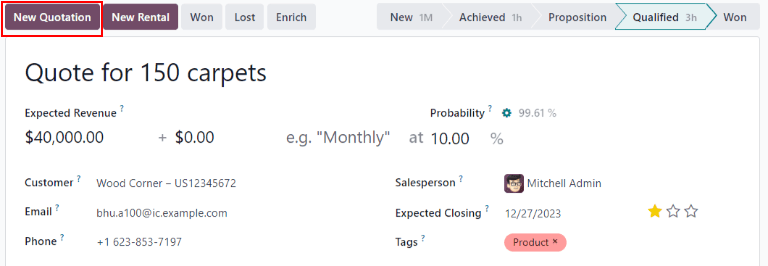
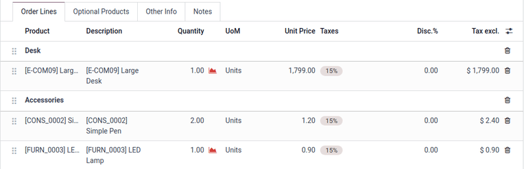
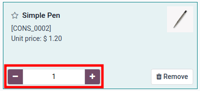

# Taklifnomalar yaratish va yuborish

Malakali mijoz imkoniyatga aylantirilgandan so'ng, keyingi qadam taklifnoma yaratish va yetkazish hisoblanadi. Bu jarayon Odoo ning *CRM* ilovasi orqali osonlikcha boshqarilishi mumkin.

## Yangi taklifnoma yaratish

Yangi taklifnoma yaratish uchun `CRM app` ni oching, bu asosiy *CRM* boshqaruv panelida `Pipeline` sahifasini ochadi.

Bu yerdan har qanday imkoniyatni ochish uchun uning ustiga bosing. Mavjud ma'lumotlarni ko'rib chiqing va zarur bo'lsa, har qanday maydonlarni yangilang.

::: tip

Agar bu imkoniyat uchun taklifnoma allaqachon yaratilgan bo'lsa, uni forma yuqorisidagi `Quotations` aqlli tugmasi orqali topish mumkin. Mavjud taklifnomalar soni ham aqlli tugmada ko'rsatilgan.
:::

Formaning yuqori chap qismida `New Quotation` tugmasini bosing.

::: warning

`New Quotation` tugmasi paydo bo'lishi uchun **Sales** ilovasi **majburiy** ravishda o'rnatilgan bo'lishi kerak.
:::

::: warning

Imkoniyat formasida `Customer` maydoni **majburiy** emas.

Biroq, taklifnoma yuborishdan oldin mijoz ma'lumotlari qo'shilishi yoki bog'lanishi kerak. Agar imkoniyatda `Customer` maydoni bo'sh qoldirilsa, `New Quotation` tugmasini bosish quyidagi variantlar bilan pop-up oynasini ochadi:

- `Create a new customer`: imkoniyat formasida mavjud ma'lumotlardan foydalanib, yangi mijoz yozuvini yaratadi.
- `Link to an existing customer`: mavjud mijoz nomlari bilan ochiladigan maydonni ochadi. Bu yangi taklifnomani mavjud mijoz yozuviga bog'lash uchun nomni tanlang.
- `Do not link to a customer`: taklifnoma mijozga bog'lanmaydi va mijoz ma'lumotlariga hech qanday o'zgarish kiritilmaydi.
:::

Bu tugma bosilgandan so'ng, yangi taklifnoma formasi paydo bo'ladi. Formaning yuqori qismidagi ma'lumotlarni tasdiqlang va etishmayotgan yoki noto'g'ri maydonlarni yangilang:

- `Customer`: bu taklifnoma yaratilgan kompaniya yoki aloqa.
- `Referrer`: agar bu mijoz boshqa mijoz yoki aloqa tomonidan tavsiya etilgan bo'lsa, uni ushbu maydondagi ochiladigan menyudan tanlang.
- `Invoice Address`: hisob-faktura yuborilishi kerak bo'lgan jismoniy manzil.
- `Delivery Address`: har qanday mahsulotlar yetkazib berilishi kerak bo'lgan jismoniy manzil.
- `Quotation Template`: agar mavjud bo'lsa, ushbu maydondan oldindan sozlangan `quotation template` ni tanlang.
- `Expiration`: ushbu taklifnoma endi yaroqsiz bo'ladigan sana.
- `Quotation Date`: qoralama/yuborilgan buyurtmalarning yaratilish sanasi, tasdiqlangan buyurtmalarning tasdiqlash sanasi. Ushbu maydon faqat `Developer mode (debug mode)` faol bo'lganda ko'rinadi.
- `Recurring Plan`: agar bu taklifnoma takrorlanuvchi mahsulot yoki obuna uchun bo'lsa, foydalaniladigan takrorlanuvchi reja konfiguratsiyasini tanlang.
- `Pricelist`: ushbu buyurtmaga qo'llaniladigan narx ro'yxatini tanlang.
- `Payment Terms`: ushbu taklifnoma uchun tegishli to'lov shartlarini tanlang.

::: tip

`Expiration` maydoni taklifnomaning yaratilish sanasi va standart amal qilish muddati asosida avtomatik to'ldiriladi.

Standart amal qilish muddatini yangilash uchun `Sales app ‣ Configuration ‣ Settings ‣ Quotations & Orders` ga o'ting va `Default Quotation Validity` maydonini yangilang. Avtomatik muddatni o'chirish uchun ushbu maydonga [0] kiriting.

Kerakli o'zgarishlar tugallanganda `Save` ni bosing.

Taklifnoma shablonidan foydalanganda, muddati tugash sanasi shablondagi `Quotation Validity` maydoniga asoslanadi. Shablondagi amal qilish muddati hisoblashini o'zgartirish uchun `Sales app ‣ Configuration ‣ Sales Orders ‣ Quotation Templates` ga o'ting.

Keyin shablonni ochish uchun uning ustiga bosing va `Quotation Validity` maydonidagi raqamni yangilang.
:::

### Buyurtma qatorlari

Yangi taklifnomadagi mijoz, to'lov va muddat ma'lumotlarini yangiliagandan so'ng, `Order Lines` yorlig'ini tegishli mahsulot ma'lumotlari bilan yangilash mumkin.

Buning uchun `Order Lines` yorlig'ida `Add a product` ni bosing.

Keyin mahsulot katalogi bo'ylab qidirish uchun `Product` maydoniga element nomini kiriting. So'ngra ochiladigan menyudan mahsulotni tanlang yoki `Create` yoki `Create and Edit` ni tanlab yangisini yarating.

Mahsulotni tanlagandan so'ng, zarur bo'lsa `Quantity` ni yangilang. Qolgan maydonlardagi ma'lumotlarni tasdiqlang.

Taklifnomadan qatorni olib tashlash uchun `fa-trash-o` `(axlat qutisi)` ikonkasini bosing.

Mahsulotlarni bo'limlarga ajratish uchun `Add a section` ni bosing va bo'lim uchun nom kiriting. Keyin nomning chap tomonidagi `oi-draggable` `(sudrab)` ikonkasini bosing va bo'limni tegishli joyga ko'chirish uchun sudrab olib boring. Taklifnoma buyurtma qatorlarini tartibga solishni tugatish uchun har bir mahsulotni xuddi shu usul bilan ko'chiring.

#### Mahsulot katalogi

Taklifnomaga ko'plab mahsulotlarni tezda qo'shish uchun mahsulot katalogini ochish uchun `Catalog` tugmasini bosing.

Ma'lumotlar bazasidagi barcha mahsulotlar kartalar sifatida ro'yxatlangan va chap panelda `Product Category` va `Attributes` bo'yicha saralash mumkin.

Mahsulot qo'shish uchun mahsulot kartasidagi `fa-shopping-cart` `Add` tugmasini bosing. `fa-plus` `(qo'shish)` yoki `fa-minus` `(ayirish)` tugmalaridan foydalanib element miqdorini belgilang yoki ikkita tugma orasidagi raqam maydoniga miqdorni kiriting. Elementni olib tashlash uchun mahsulot kartasidagi `fa-trash` `Remove` tugmasini bosing.

Barcha mahsulot miqdorlari belgilangandan so'ng, taklifnomaga qaytish uchun `Back to Quotation` tugmasini bosing. Mahsulot katalogida tanlangan elementlar endi `Order Lines` yorlig'ida paydo bo'ladi.

## Taklifnomani oldindan ko'rish va yuborish

Mijoz ko'radigan kabi taklifnomani oldindan ko'rish uchun `Preview` tugmasini bosing. Buning natijasida `Customer Portal` da oldindan ko'rish ochiladi.

Mijoz oldindan ko'rishini ko'rib chiqqandan so'ng, backend'dagi taklifnoma formasiga qaytish uchun `Return to edit mode` ni bosing.

Taklifnoma mijozga yetkazishga tayyor bo'lganda, `Send by Email` tugmasini bosing.

Buning natijasida oldindan sozlangan elektron pochta xabari bilan pop-up oyna ochiladi. Taklifnomadan ma'lumotlar, jumladan aloqa ma'lumotlari, umumiy narx va taklifnoma sarlavhasi taklifnomadan import qilinadi.

Taklifnomaning PDF fayli elektron pochtaga ilova sifatida qo'shiladi.

::: tip

E-pochta xabarini yaratish uchun oldindan yuklangan shablon ishlatiladi. Shablonni o'zgartirish uchun elektron pochta pop-up oynasining pastki qismida joylashgan `Load template` maydonining o'ng tomonidagi ichki havolani bosing.

Yangi shablonni tanlash uchun `Load template` ochiladigan menyusidan variantni tanlang.
:::

Elektron pochtaga zarur o'zgarishlar kiritishni davom ettiring, so'ngra `Send` ni bosing. Xabarning nusxasi yozuvning *Chatter* qismiga qo'shiladi.

Taklifnoma yuborilgandan so'ng, dastlabki imkoniyatning `Quotations` aqlli tugmasi yangi hisob bilan yangilanadi. Ushbu taklifnoma va boshqa barcha taklifnomalarga *CRM* ilovasidagi imkoniyat yuqorisidagi ushbu aqlli tugma orqali kirish mumkin.

Imkoniyatga bog'langan va tasdiqlangan, shuning uchun savdo buyurtmalariga aylantirilgan har qanday taklifnomalar `Quotations` aqlli tugmasida ko'rsatilgan sondan chiqarib tashlanadi. Buning o'rniga, savdo buyurtmasining qiymati bir xil boshqaruv panelida joylashgan `Orders` aqlli tugmasida paydo bo'ladi.

## Imkoniyatni yutgan yoki yutqazgan deb belgilash

Yo'nalish aniq va to'g'ri bo'lishi uchun, mijoz taklifnomaga javob bergandan so'ng imkoniyatlar *yutgan* yoki *yutqazgan* deb aniqlanishi kerak.

Imkoniyatni *yutgan* yoki *yutqazgan* deb belgilash uchun taklifnoma formasining yuqori chap qismidagi breadcrumbs yordamida imkoniyatga qayting. Yoki `CRM app ‣ Sales ‣ My Pipeline` ga o'ting va uni ochish uchun to'g'ri imkoniyatni bosing.

Formaning yuqori chap qismida `Won` yoki `Lost` tugmasini bosing.

Agar imkoniyat *yutgan* deb belgilansa, yozuvga yashil `Won` banner qo'shiladi va u `Won` bosqichiga ko'chiriladi.

`Lost` tugmasi orqali imkoniyatni *yutqazgan* deb belgilash `Mark Lost` pop-up oynasini ochadi, bu yerda `Lost Reason` kiritish mumkin.

`Lost Reason` ochiladigan maydonidan mavjud yutqazish sababini tanlang. Agar tegishli sabab mavjud bo'lmasa, uni `Lost Reason` maydoniga kiritib, `Create` ni bosish orqali yangisini yarating.

::: tip

Iloji boricha `Lost Reason` ning oldindan sozlangan qiymatlaridan foydalanish yoki yangi qiymatlar yaratishni faqat savdo jamoasi rahbarlariga cheklash eng yaxshi amaliyotdir. Ushbu parametr uchun izchil qiymatlardan foydalanish `Lost Reason` parametri bo'yicha filtrlashda yo'nalish tahlilini osonroq va aniqroq qiladi.

Ushbu maydon uchun yangi qiymatlarni sozlash uchun `CRM ‣ Configuration ‣ Lost Reasons` ga o'ting va ro'yxatga qo'shilgan har bir yangi yozuv uchun `New` va `Save` ni bosing.
:::

Qo'shimcha eslatmalar va sharhlar `Closing Note` maydoniga qo'shilishi mumkin.

`Mark Lost` pop-up oynasiga barcha kerakli ma'lumotlar kiritilgandan so'ng, `Mark as Lost` ni bosing.

`Mark as Lost` ni bosgandan so'ng, pop-up oyna yo'qoladi va Odoo imkoniyat formasiga qaytadi, bu erda imkoniyatning yuqori o'ng burchagida yangi qizil `Lost` banner paydo bo'ladi.

Imkoniyat *yutqazgan* deb belgilangandan so'ng, u endi faol hisoblanmaydi va yo'nalishdan olib tashlanadi.

Yo'nalishdan *yutqazgan* imkoniyatni ko'rish uchun qidiruv paneli o'ng tomonidagi `down arrow icon` ni bosing va paydo bo'ladigan ochiladigan menyudan `Lost` yoki `Archived` ni tanlang.

::: warning

*Yutqazgan* deb belgilangan imkoniyatlar *Arxivlangan* deb hisoblanadi, lekin hisobot berishda imkoniyat *yutqazgan* sifatida kiritilishi uchun u aniq ravishda *yutqazgan* deb belgilanishi, *Arxivlangan* emas, **zarur** ekanini unutmang.
:::