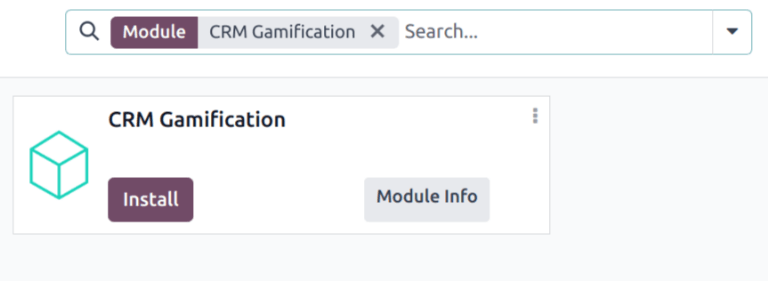
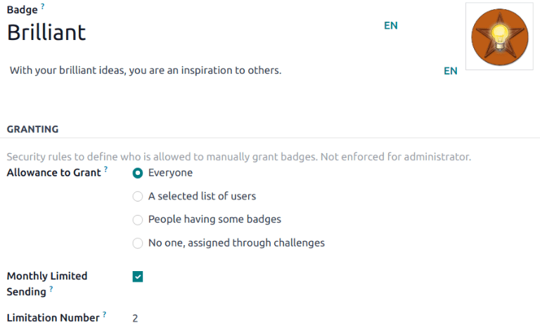
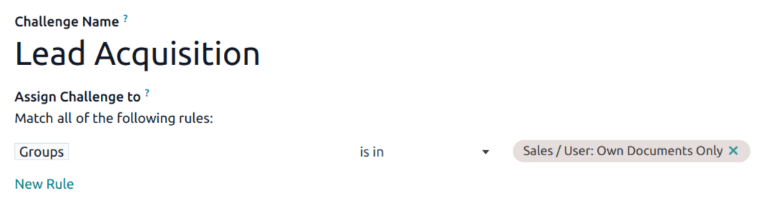
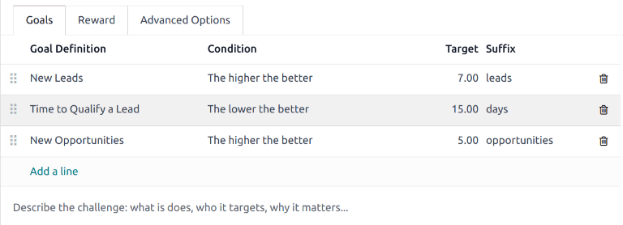

# CRM Gamifikatsiya

Odoo ning *CRM* ilovasida *gamifikatsiya vositalari* moslashtirilgan qiyinchiliklar, maqsadlar va mukofotlar orqali foydalanuvchilarni baholash va rag'batlantirish imkoniyatini beradi. Maqsadlar *CRM* ilovasi ichidagi harakatlarni nishonga olish uchun yaratiladi va ishtirok etuvchi savdo jamoalariga avtomatik ravishda kuzatib borish va mukofotlash mumkin.

## Konfiguratsiya

*CRM Gamification* modulini o'rnatish uchun `Apps` ilovasiga o'ting. Sahifaning yuqori qismidagi `Search...` paneliga bosing va `Apps` filtrini olib tashlang. Qidirish uchun [CRM Gamification] deb yozing.

`CRM Gamification` modulida `Install` ni bosing. Bu modul *CRM* va *Sales* ilovalari bilan bog'liq maqsadlar va qiyinchiliklarni o'z ichiga oladi.

::: tip

Agar **ham** *CRM* va *Sales* ilovalari o'rnatilgan bo'lsa, *CRM Gamification* moduli ma'lumotlar bazasiga avtomatik ravishda o'rnatiladi.
:::

*Gamification Tools* menyusiga kirish uchun avval `developer-mode` ni yoqing.

Keyin `Settings app ‣ Gamification Tools` ga o'ting.

## Nishonlar yaratish

*Nishonlar* foydalanuvchilarga qiyinchilikni bajarganlarida beriladi. Bajarilgan vazifa turiga qarab turli nishonlar berilishi mumkin va maqsadga erishish vaqtiga qarab bir nechta foydalanuvchiga berilishi mumkin.

Mavjud nishonlarni ko'rish yoki yangisini yaratish uchun `Settings ‣ Gamification Tools ‣ Badges` ga o'ting.

::: tip

Ba'zi nishonlar qiyinchiliklardan tashqari ham berilishi mumkin. Kerakli nishon uchun Kanban kartasini tanlang, so'ngra `Grant` ni bosing. Bu `Grant Badge` pop-up oynasini ochadi. `Who would you like to reward?` maydonidan foydalanuvchini tanlang.

Foydalanuvchi nima uchun mukofot olayotganiga oid qo'shimcha ma'lumotlarni quyidagi maydonga qo'shing, so'ngra `Grant Badge` ni bosing.
:::

Yangi nishon yaratish uchun sahifaning yuqori chap qismida `New` ni bosing va bo'sh formani oching. `Badge` uchun nom kiriting, so'ngra tavsifni kiriting.

`Allowance to Grant` maydoni nishon qachon va kim tomonidan berilishi mumkinligini belgilaydi:

- `Everyone`: bu nishon har qanday foydalanuvchi tomonidan qo'lda berilishi mumkin.
- `A selected list of users`: bu nishon faqat tanlangan foydalanuvchilar guruhi tomonidan berilishi mumkin. Agar bu variant tanlansa, u yangi maydon - `Authorized Users` ni yaratadi. Ushbu ochiladigan ro'yxatdan tegishli foydalanuvchilarni tanlang.
- `People having some badges`: bu nishon faqat ma'lum nishon bilan mukofotlangan foydalanuvchilar tomonidan berilishi mumkin. Agar bu variant tanlansa, u yangi maydon - `Required Badges` ni yaratadi. Foydalanuvchi bu nishonni boshqalarga berish imkoniyatiga ega bo'lishdan oldin ega bo'lishi kerak bo'lgan nishon(lar)ni tanlash uchun ushbu ochiladigan ro'yxatdan foydalaning.
- `No one, assigned through challenges`: bu nishon qo'lda berilishi mumkin emas, u faqat qiyinchiliklar orqali berilishi mumkin.

Foydalanuvchi yuborishi mumkin bo'lgan nishonlar sonini cheklash uchun `Monthly Limited Spending` checkboxini belgilang. Bu foydalanuvchi ushbu nishonni berishi mumkin bo'lgan marta soniga chegara o'rnatadi. `Limitation Number` maydoniga bu nishon har bir kishi uchun oyiga maksimal necha marta yuborilishi mumkinligini kiriting.

## Qiyinchilik yaratish

Qiyinchilik yaratish uchun `Settings ‣ Gamification Tools ‣ Challenges` ga o'ting. Bo'sh qiyinchilik formasini ochish uchun yuqori chap burchakda `New` ni bosing.

Formaning yuqori qismida `Challenge Name` ni kiriting.

### Tayinlash qoidalarini yaratish

Qiyinchilikni ma'lum foydalanuvchilarga tayinlash uchun bir yoki bir nechta tayinlash qoidalaridan foydalanish kerak.

`Assign Challenge to` ostidagi birinchi maydonga bosing va qoidani belgilash uchun ochiladigan ro'yxatdan parametrni tanlang. Keyin qoidaning operatorini belgilash uchun keyingi maydonga bosing. Zarur bo'lsa, parametrni yanada aniqroq belgilash uchun uchinchi maydonga bosing.

::: tip

*Sales* ilovasida ruxsatlari bo'lgan barcha foydalanuvchilarni qo'shish uchun quyidagi parametrlar bilan qoida yarating:

- `Groups`
- `is in`
- [Sales/User: Own Documents Only]

:::

`Periodicity` maydonida maqsadlarni avtomatik ravishda baholash uchun vaqt oralig'ini tanlang.

### Maqsadlar qo'shish

Qiyinchiliklar bitta maqsadga asoslanishi yoki turli nishonlar bilan bir nechta maqsadlarni o'z ichiga olishi mumkin. Qiyinchilikga maqsad qo'shish uchun `Goals` yorlig'ida `Add a line` ni bosing.

`Goal Definition` maydonida ochiladigan ro'yxatdan maqsadni tanlang. `Condition` maydoni maqsad ta'rifida belgilangan shartni aks ettirish uchun avtomatik ravishda yangilanadi.

::: tip

*CRM Gamification* moduli savdo jamoalariga qaratilgan oldindan sozlangan maqsadlarni o'z ichiga oladi:

- `New Leads`
- `Time to Qualify a Lead`
- `Days to Close a Deal`
- `New Opportunities`
- `New Sales Orders`
:::

`Suffix` asosida maqsad uchun `Target` ni kiriting.

Har bir qo'shimcha maqsad uchun ushbu qadamlarni takrorlang.

### Mukofotlar qo'shish

Keyin `Reward` yorlig'ini bosing. Ochiladigan ro'yxatlardan tanlash orqali `For 1st User` va `For Every Succeeding User` uchun beriladigan `badges` ni tanlang.

::: tip

Nishonlar qiyinchilik tugaganda beriladi. Bu ishlaydigan davr oxirida, qiyinchilikning tugash sanasida yoki qiyinchilik qo'lda yopilganda bo'ladi.
:::

Sozlash tugallangandan so'ng, qiyinchilikni boshlash uchun sahifaning yuqori chap qismidagi `Start Challenge` tugmasini bosing.