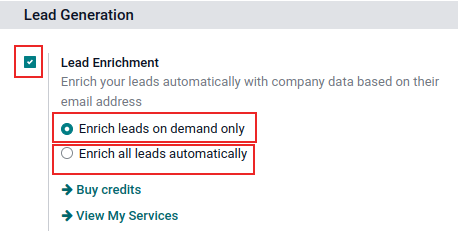
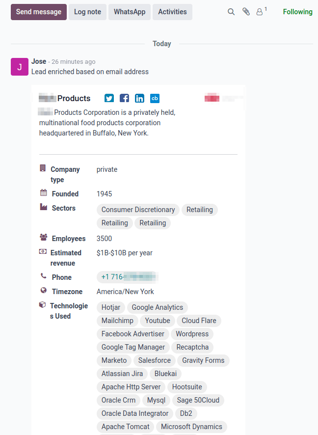
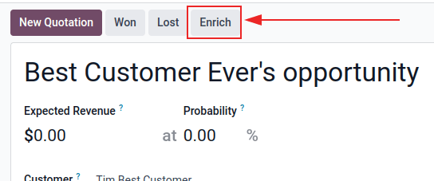
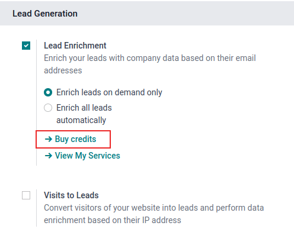

# Lead boyitish

*Lead boyitish* - bu leadga biriktirilgan aloqa uchun biznes ma'lumotlarini taqdim etadigan xizmat. Lead boyitish foydalanish uchun kredit talab qiladigan In-App Purchase (IAP) hisoblanadi va Odoo ma'lumotlar bazasidagi mavjud leadlar uchun mavjud.

Lead boyitish tomonidan taqdim etiladigan ma'lumotlar biznes haqidagi umumiy ma'lumotlarni (to'liq biznes nomi va logotipni o'z ichiga olgan holda), ijtimoiy media hisoblarini, `Company type`, `Founded` ma'lumotlarini, `Sectors` ma'lumotlarini, `Employees` sonini, `Estimated revenue`ni, `Phone` raqamini, `Timezone`ni va `Technologies Used`ni o'z ichiga olishi mumkin.

::: tip

Amal qiladigan obunaga ega Enterprise Odoo foydalanuvchilari ma'lumotlar bazasi uchun ko'proq kredit sotib olishga qaror berishdan oldin `IAP (In-App Purchase)` xususiyatlarini sinash uchun bepul kreditlar oladilar. Bu demo/o'quv ma'lumotlar bazalari, ta'lim ma'lumotlar bazalari va bitta-ilova-bepul ma'lumotlar bazalarini o'z ichiga oladi.
:::

::: warning

Lead boyitishdan foydalanish uchun *CRM* sozlamalar sahifasida *leads* xususiyati **majburiy** ravishda faollashtirilgan bo'lishi kerak. *CRM* sozlamalariga kirish uchun `CRM app ‣ Configuration ‣ Settings` ga o'ting. `CRM` bo'limi ostida `Leads` variantini faollashtiring va `Save` ni bosing.
:::

## Lead boyitishni sozlash

*CRM* ilovasida lead boyitishni sozlash uchun `CRM app ‣ Configuration ‣ Settings` ga o'ting. Keyin `Lead Generation` bo'limi ostida `Lead Enrichment` yonidagi checkboxni belgilang va `Enrich leads on demand only` yoki `Enrich all leads automatically`ni tanlang. O'zgarishlarni faollashtirish uchun `Save` tugmasini bosing.

## Leadlarni boyitish

Leadlarni boyitish leadda belgilangan mijozning elektron pochta manzili domeni asosida amalga oshiriladi. Leadni boyitishning ikki xil usuli mavjud: *avtomatik ravishda* yoki *qo'lda*.

### Leadlarni avtomatik ravishda boyitish

Sozlash paytida, agar *CRM* `Settings` sahifasida `Enrich all leads automatically` tanlangan bo'lsa, leadni boyitish uchun foydalanuvchi tomonidan hech qanday harakat qilinishi shart emas. Rejalashtirilgan harakat har oltmish daqiqada avtomatik ravishda ishga tushadi va masofaviy ma'lumotlar bazasi bilan bog'lanishdan keyin leadlarda boyitish sodir bo'ladi.

::: tip

Avtomatik lead boyitish uchun ishlaydigan cronjobga kirish uchun `developer mode`ni faollashtiring va `Settings app ‣ Technical menu ‣ Automation section ‣ Scheduled Actions` ga o'ting. `Search...` panelida [CRM] deb yozing. `CRM: enrich leads (IAP)` deb belgilangan natijaga bosing va zarur tuzatishlarni kiriting. `Execute Every` maydoniga besh daqiqadan katta yoki teng qiymat kiriting.
:::

::: example
Quyida muvaffaqiyatli avtomatik to'ldirilgan lead boyitish ma'lumotlarining misoli:

:::

### Leadlarni qo'lda boyitish

Agar `Lead Enrichment`ni faollashtirishda *CRM* `Settings` sahifasida `Enrich leads on demand only` varianti tanlangan bo'lsa, foydalanuvchi boyitmoqchi bo'lgan har bir leadni **majburiy** ravishda qo'lda boyitish kerak. Bu leadning yuqorgi menyusidagi `Enrich` tugmasini bosish orqali amalga oshiriladi.

Xuddi shu ma'lumot xuddi shunday `IAP (In-App Puchase)` kredit narxida olinadi (har bir boyitish uchun bitta). Bu boyitish usuli har bir leadni boyitish shart bo'lmaganda yoki narx muammo bo'lganda foydalidir.

::: tip

*Ro'yxat* ko'rinishidan foydalanib leadlarni ommaviy ravishda qo'lda boyitish. Avval `CRM app ‣ Leads` ga o'ting va ro'yxat ko'rinishi tugmasini (`☰ (uchta gorizontal chiziq)` ikonkasi) bosing. Keyin qo'lda boyitilishi kerak bo'lgan leadlar uchun checkboxlarni belgilang. Nihoyat, `⚙️ Action` ikonkasini bosing va natijada paydo bo'lgan ochiladigan menyudan `Enrich`ni tanlang. Buni *My Pipeline* sahifasidan ham amalga oshirish mumkin. Buning uchun shunchaki *CRM* ilovasini oching yoki `CRM app ‣ Sales ‣ My Pipeline` ga o'ting. Har ikkala yo'l ham `Pipeline` sahifasida leadlar va imkoniyatlarni ochib beradi.
:::

## Narxlash

Lead boyitish In-App Purchase (IAP) xususiyati bo'lib, har bir boyitilgan lead bitta kreditga tushadi.

::: tip

To'liq narx ma'lumotlari uchun bu yerni ko'ring: [Lead Generation by Odoo IAP](https://iap.odoo.com/iap/in-app-services/273).
:::

Kredit sotib olish uchun `CRM app ‣ Configuration ‣ Settings` ga o'ting. `Lead Generation` bo'limida, `Lead Enrichment` xususiyati ostida `Buy Credits`ni bosing.

Kreditlar va balanslar `Settings app` ga o'tish orqali ham sotib olinishi mumkin. `Contacts` bo'limida, `Odoo IAP` xususiyati ostida `View My Services`ni bosing.

::: warning

Kompaniyaning aloqa ma'lumotlarini yig'ishda eng so'nggi Yevropa Ittifoqi qoidalaridan xabardor bo'lishga ishonch hosil qiling. Umumiy Ma'lumotlarni Himoya qilish Reglamenti haqida ko'proq ma'lumot uchun: [Odoo GDPR](http://odoo.com/gdpr) ga murojaat qiling.
:::
