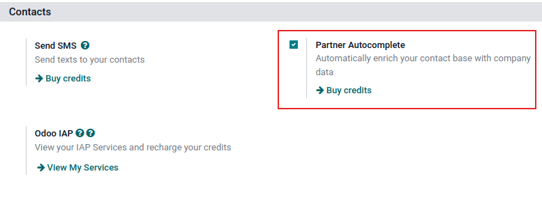

# Kontaktlarni hamkor avtoto'ldirish bilan boyitish

*Hamkor avtoto'ldirish* kontaktlar bazasini korporativ
ma'lumotlar bilan boyitadi. Har qanday modulda yangi kompaniya nomini
`Customer` maydoniga
([partner_id] texnik maydon) kiriting va
pastga tushuvchi menyuda taklif qilingan kompaniyalardan birini tanlang. Kerakli kompaniya haqida topish qiyin bo'lgan qimmatli kompaniya ma'lumotlarini darhol oling.

::: warning

Kompaniya *Kontaktlar*
ilovasida ma'lumotlar bilan boyitishdan oldin qo'lda kiritilgan bo'lishi **mumkin emas**.
::::

Hamkor avtoto'ldirish tomonidan taqdim etiladigan ma'lumotlar biznes haqidagi umumiy ma'lumotlarni (to'liq biznes nomi va logotipini o'z ichiga olgan), ijtimoiy media hisoblarini, `Company type`, `Founded`
ma'lumotlarini, `Sectors` ma'lumotlarini,
`Employees` sonini,
`Estimated revenue`,
`Phone` raqamini,
`Timezone` va
`Technologies Used` ni o'z ichiga olishi mumkin.

::: warning

Kompaniyaning aloqa ma'lumotlarini olishda so'nggi Evropa qoidalaridan xabardor bo'lishga ishonch hosil qiling. Umumiy ma'lumotlarni himoya qilish qoidasi haqida batafsil ma'lumot uchun qarang: [Odoo GDPR](http://odoo.com/gdpr). Odoo-da shaxsiy aloqa ma'lumotlarini hamkor avtoto'ldirish funksiyasi bilan qidirish mumkin emas.
::::

## Konfiguratsiya

`Settings app ‣ Contacts section` ga o'ting. Keyin `Partner
Autocomplete` funksiyasini faollashtiring,
uning yonidagi katakchani belgilang va `Save` tugmasini bosing.

## Kontaktlarni korporativ ma'lumotlar bilan boyitish

Har qanday moduldan, foydalanuvchi yangi kompaniya kontaktining nomini terayotganda, Odoo potentsial mos keladigan takliflarning katta pastga tushuvchi menyusini ko'rsatadi. Agar ulardan biri tanlansa, kontakt o'sha aniq tanlov bilan bog'liq korporativ ma'lumotlar bilan to'ldiriladi.

Masalan, [Odoo] ni terib kiritgandan so'ng, quyidagi ma'lumotlar to'ldiriladi:

Chatterda, kerakli oldindan to'ldirilgan kontaktni bosgandan so'ng, kompaniya haqida quyidagi ma'lumotlar to'ldiriladi:

::: tip

Hamkor avtoto'ldirish kompaniya nomi o'rniga
`VAT (qo'shilgan qiymat solig'i)` raqami kiritilsa ham ishlaydi.
::::

## Narxlash

*Hamkor avtoto'ldirish* - bu *Ilova ichida xarid (IAP)* xizmati bo'lib,
foydalanish uchun oldindan to'langan kreditlar talab etiladi. Har bir so'rov bitta kredit sarflaydi.

Kreditlar sotib olish uchun
`Settings app ‣ Contacts section` ga o'ting. Keyin `Partner Autocomplete` funksiyasini toping va
`Buy credits` tugmasini bosing yoki
`Odoo IAP` funksiyasini toping va
`View My Services` tugmasini bosing. Natijada paydo bo'lgan sahifadan kerakli paketni tanlang.

::: tip

Agar ma'lumotlar bazasida kreditlar tugab qolsa, taklif qilingan kompaniyani bosganda to'ldirilgan yagona ma'lumot veb-sayt havolasi va logotipi bo'ladi.

Bizning [Maxfiylik siyosati](https://iap.ooo.com/privacy) haqida bilib oling.
::::

::: tip

Amal qiluvchi obunaga ega Enterprise Odoo foydalanuvchilari ma'lumotlar bazasi uchun ko'proq kreditlar sotib olishga qaror berishdan oldin `IAP (Ilova ichida
xarid)` funksiyalarini sinab ko'rish uchun bepul kreditlar oladi. Bu demo/trening ma'lumotlar bazalari, ta'lim ma'lumotlar bazalari va bitta-ilova-bepul ma'lumotlar bazalarini o'z ichiga oladi.
::::
