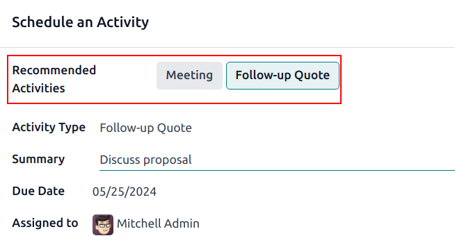
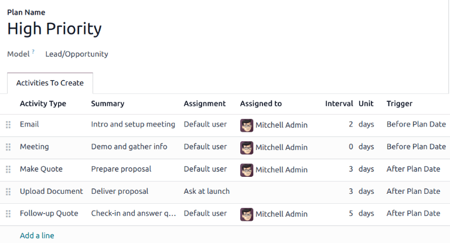
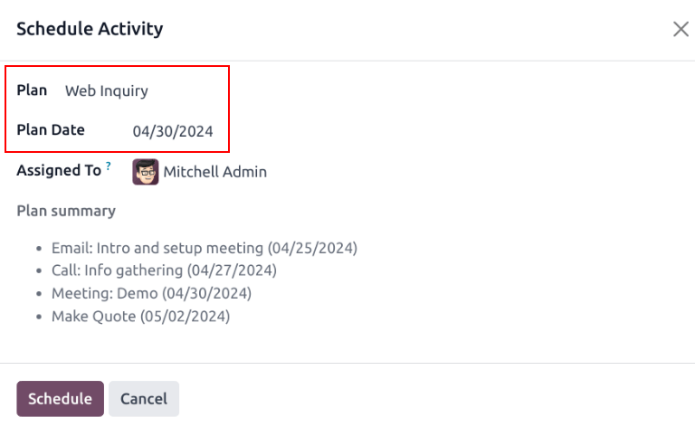
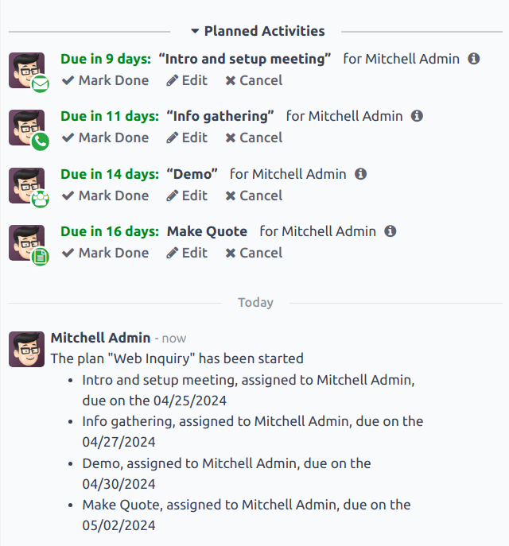

# Sotuv jamoalari uchun faoliyatlardan foydalanish

*Faoliyatlar* - bu *Odoo* ma'lumotlar bazasidagi yozuv bilan bog'langan kuzatuv vazifalaridir.
Faoliyatlar ma'lumotlar bazasining chatter mavzusi, Kanban ko'rinishi, ro'yxat ko'rinishi yoki ilovaning faoliyatlar ko'rinishini o'z ichiga olgan istalgan sahifasida rejalashtirilishi mumkin.

Potentsial mijozlar va imkoniyatlar uchun rejalashtirilgan faoliyatlar.

## Faoliyat turlari

*CRM* ilovasida oldindan sozlangan faoliyat turlari to'plami mavjud. Mavjud faoliyat turlari ro'yxatini ko'rish uchun
`CRM app ‣ Configuration ‣ Activity Types` ga o'ting.

::: tip

Ma'lumotlar bazasida qo'shimcha faoliyat turlari mavjud va ulardan turli ilovalar orqali foydalanish mumkin. Faoliyat turlarining to'liq ro'yxatiga kirish uchun `Settings app` ga o'ting, so'ngra `Discuss` bo'limiga o'ting va `Activity Types` tugmasini bosing.
::::

*CRM* ilovasi uchun oldindan sozlangan faoliyat turlari quyidagilardir:

> - `Email`: sotuvchini elektron pochta yuborishga undaydigan eslatuvchini chatterga qo'shadi.
> - `Call`: sotuvchi kontakt bilan qo'ng'iroq qilish uchun vaqt rejalashtirishi mumkin bo'lgan kalendar havolasini ochadi.
> - `Meeting`: sotuvchi kontakt bilan uchrashuv o'tkazish uchun vaqt rejalashtirishi mumkin bo'lgan kalendar havolasini ochadi.
> - `To Do`: chatterga umumiy eslatuvchi vazifani qo'shadi.
> - `Upload Document`: tashqi hujjat yuklash mumkin bo'lgan havolani faoliyatga qo'shadi. Eslatib o'tamiz, bu faoliyat turidan foydalanish uchun *Documents* ilovasi **talab qilinmaydi**.

::: tip

Agar *Sales* yoki *Accounting* kabi boshqa ilovalar o'rnatilgan bo'lsa, *CRM* ilovasida boshqa faoliyat turlari ham mavjud bo'ladi.
::::

### Yangi faoliyat turi yaratish

Yangi faoliyat turi yaratish uchun sahifaning yuqori chap qismidagi `New` tugmasini bosing va bo'sh shaklni oching.

Shaklning yuqori qismida yangi faoliyat turi uchun `Name` ni tanlashdan boshlang.

#### Faoliyat sozlamalari

##### Harakat

*Action* maydoni faoliyatning maqsadini belgilaydi. Ba'zi harakatlar faoliyat rejalashtirilgandan so'ng maxsus xatti-harakatlarni ishga tushiradi.

- Agar `Upload Document` tanlansa, hujjat yuklash havolasi to'g'ridan-to'g'ri chatterdagi rejalashtirilgan faoliyatga qo'shiladi.
- Agar `Phonecall` yoki `Meeting` tanlansan, foydalanuvchilar bu faoliyat uchun vaqt rejalashtirish uchun kalendarlarini ochish imkoniyatiga ega bo'ladi.
- Agar `Request Signature` tanlansa, imzo so'rovi pop-up oynasini ochadigan havola chatterdagi rejalashtirilgan faoliyatga qo'shiladi.

::: tip

Faoliyat turida tanlash mumkin bo'lgan harakatlar ma'lumotlar bazasida hozirda o'rnatilgan ilovalardan kelib chiqib turlicha bo'ladi.
::::

##### Standart foydalanuvchi

Bu faoliyat turi rejalashtirilganda faoliyatni ma'lum foydalanuvchiga avtomatik ravishda tayinlash uchun `Default User` pastga tushuvchi menyusidan nom tanlang. Agar bu maydon bo'sh qoldirilsa, faoliyat uni yaratgan foydalanuvchiga tayinlanadi.

##### Standart xulosa

Bu faoliyat turi yaratilganda eslatmalarni kiritish uchun ularni `Default Summary` maydoniga kiriting.

::: tip

`Default User` va `Default Summary` maydonlaridagi ma'lumotlar faoliyat yaratilganda kiritiladi. Biroq, faoliyat rejalashtirilishi yoki saqlanishidan oldin ularni o'zgartirish mumkin.
::::

#### Keyingi faoliyat

Faoliyat tugallangan deb belgilangandan so'ng yangi faoliyatni avtomatik ravishda taklif qilish yoki ishga tushirish uchun `Chaining Type` o'rnatilishi kerak.

##### Keyingi faoliyatni taklif qilish

`Chaining Type` maydonida `Suggest Next Activity` ni tanlang. Buni amalga oshirgandan so'ng, pastdagi maydon quyidagiga o'zgaradi: `Suggest`. Bu faoliyat turiga kuzatuv vazifalari sifatida tavsiya qilinadigan faoliyatlarni tanlash uchun `Suggest` maydoni pastga tushuvchi menyusini bosing.

`Schedule` maydonida bu faoliyatlar uchun standart muddat tanlang. Buning uchun kerakli `Days`, `Weeks` yoki `Months` sonini sozlang. Keyin u `after completion date` yoki `after previous activity deadline` sodir bo'lishini hal qiling.

Bu `Schedule` maydoni ma'lumotlarini faoliyat rejalashtirilishidan oldin o'zgartirish mumkin.

Barcha konfiguratsiyalar tugallangandan so'ng `Save` tugmasini bosing.

::: tip

Agar faoliyatning `Chaining Type` si `Suggest Next Activity` ga o'rnatilgan bo'lsa va `Suggest` maydonida faoliyatlar ro'yxati mavjud bo'lsa, foydalanuvchilarga keyingi qadamlar sifatida faoliyatlar tavsiya etiladi.

::::

##### Keyingi faoliyatni ishga tushirish

`Chaining Type` ni `Trigger Next Activity` ga o'rnatish oldingi faoliyat tugallangandan so'ng darhol keyingi faoliyatni ishga tushiradi.

Agar `Chaining Type` maydonida `Trigger Next Activity` tanlangan bo'lsa, pastdagi maydon quyidagiga o'zgaradi: `Trigger`. `Trigger` maydoni pastga tushuvchi menyusidan bu faoliyat tugallangandan so'ng ishga tushiriladigan faoliyatni tanlang.

`Schedule` maydonida bu faoliyatlar uchun standart muddat tanlang. Buning uchun kerakli `Days`, `Weeks` yoki `Months` sonini sozlang. Keyin u `after completion date` yoki `after previous activity deadline` sodir bo'lishini hal qiling.

Bu `Schedule` maydoni ma'lumotlarini faoliyat rejalashtirilishidan oldin o'zgartirish mumkin.

Barcha konfiguratsiyalar tugallangandan so'ng `Save` tugmasini bosing.

::: tip

Faoliyatning `Chaining Type` si `Trigger Next Activity` ga o'rnatilgan bo'lsa, faoliyatni *Done* deb belgilash darhol `Trigger` maydonida ko'rsatilgan keyingi faoliyatni ishga tushiradi.
::::

## Faoliyatni kuzatish

Faoliyatlar holatining eng aniq ko'rinishi bilan potentsial mijozlar qatorini yangilab turish uchun, potentsial mijoz bilan aloqa o'rnatilgan zahoti, tegishli faoliyat *Done* deb belgilanishi kerak. Bu zarur bo'lganda keyingi faoliyatni rejalashtirish imkonini beradi. Shuningdek, bu potentsial mijozlar qatorining muddati o'tgan faoliyatlar bilan to'lib ketishining oldini oladi.

Potentsial mijozlar qatori eng samarali bo'ladi, agar u yangilab turilsa va u kuzatayotgan o'zaro ta'sirlarga mos kelsa.

## Faoliyat rejalari

*Faoliyat rejalari* - bu oldindan sozlangan faoliyatlar ketma-ketligi. Faoliyat rejasi ishga tushirilganda ketma-ketlikdagi har bir faoliyat avtomatik ravishda rejalanadi.

Yangi reja yaratish uchun `CRM app ‣ Configuration ‣ Activity Plan` ga o'ting. Bo'sh `Lead Plans` shaklini ochish uchun sahifaning yuqori chap qismidagi `New` tugmasini bosing.

`Plan Name` maydoniga yangi reja uchun nom kiriting. `Activities to Create` oynasida yangi faoliyat qo'shish uchun `Add a line` tugmasini bosing.

Pastga tushuvchi menyudan `Activity Type` ni tanlang. Mavjud faoliyat turlarining to'liq ro'yxatini ko'rish yoki `new one` yaratish uchun `Search More` tugmasini bosing.

Keyin `Summary` maydoniga sotuvchi uchun ko'rsatmalar yoki faoliyat tugallanganda kerakli ma'lumotlar kabi faoliyatning o'ziga xos tomonlarini tavsiflovchi har qanday tafsilotlarni kiriting. Ushbu maydon mazmuni rejalashtirilgan faoliyat bilan birga kiritiladi va keyinchalik tahrir qilinishi mumkin.

`Assignment` maydonida quyidagi variantlardan birini tanlang:

> - `Ask at launch`: reja rejalashtirilganda faoliyatlar foydalanuvchiga tayinlanadi.
> - `Default user`: faoliyatlar har doim ma'lum foydalanuvchiga tayinlanadi.

Agar `Assignment` maydonida `Default user` tanlangan bo'lsa, `Assigned to` maydonida foydalanuvchini tanlang.

::: tip

Faoliyat rejalari standart foydalanuvchilarga tayinlangan faoliyatlar va reja ishga tushirilganda tayinlangan foydalanuvchilarga ega bo'lishi mumkin.

::::

Keyin faoliyat uchun vaqt jadvalini sozlang. Faoliyatlar reja sanasidan oldin yoki keyin sodir bo'lishi uchun rejalashtirilishi mumkin. Bu faoliyat uchun muddatni belgilash uchun `Interval` va `Units` maydonlaridan foydalaning. Nihoyat, `Trigger` maydonida faoliyat reja sanasidan oldin yoki keyin sodir bo'lishini tanlang.

::: example
Yuqori ustuvorlikdagi potentsial mijozlarni boshqarish uchun faoliyat rejasi yaratiladi. Ayniqsa, bu potentsial mijozlar bilan tezda aloqa o'rnatilishi kerak, dastlabki aloqadan keyin ikki kun ichida uchrashuv rejalashtirish kerak. Reja quyidagi faoliyatlar bilan sozlanadi:

- Reja sanasidan ikki kun **oldin** elektron pochta
- Reja sanasidan nol kun **oldin** uchrashuv
- Reja sanasidan uch kun **keyin** taklif tayyorlash
- Reja sanasidan uch kun **keyin** hujjat yuklash
- Reja sanasidan besh kun **keyin** kuzatuv

Bu *reja sanasi* ni uchrashuv muddati sifatida belgilaydi, bu rejaning maqsadi hisoblanadi. Ushbu sanadan oldin mijoz bilan aloqa o'rnatish va uchrashuvga tayyorgarlik ko'rish uchun vaqt bor. Ushbu sanadan keyin sotuvchida taklif yaratish, hujjat yuklash va kuzatuv qilish uchun vaqt bor.
:::

Rejaga kiritilgan har bir faoliyat uchun ushbu qadamlarni takrorlang.

### Faoliyat rejasini ishga tushirish

*CRM* imkoniyatida faoliyat rejasini ishga tushirish uchun `CRM app` ga o'ting va uni ochish uchun imkoniyatning Kanban kartasini bosing.

Chatterning yuqori o'ng qismida `Activities` tugmasini bosib `Schedule Activity` pop-up oynasini oching.

`Plan` maydonida ishga tushiriladigan kerakli faoliyat rejasini tanlang. Bu rejaga kiritilgan faoliyatlarni ro'yxatlab beruvchi `Plan summary` ni yaratadi. Kalendar popoverdan foydalanib `Plan Date` ni tanlang. Bu `Plan summary` ni `activity plan` da sozlangan intervallar asosida muddatlar bilan yangilaydi.

`Assigned To` maydonida foydalanuvchini tanlang. Bu foydalanuvchi rejadagi `Assignment` maydonida `Ask at launch` bilan sozlangan faoliyatlarga tayinlanadi.

`Schedule` tugmasini bosing.

Rejaning tafsilotlari har bir faoliyat bilan birga chatterga qo'shiladi.

