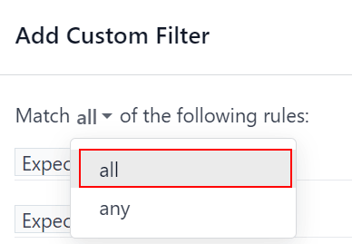
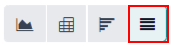
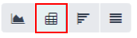

# Kutilayotgan daromad hisoboti

*Kutilayotgan daromad* - bu ma'lum sanagacha, odatda joriy oyning oxirigacha yopilishi kutilayotgan potentsial mijozlarning umumiy naqd qiymatidir.

*Kutilayotgan daromad hisoboti* sotuv qatorida yopilish sanasi belgilangan barcha faol potentsial mijozlarni to'playdi va sotuv jamoalarining ma'lum vaqt oralig'ida qanday ishlayotganini taqqoslaydi.

Oylik kutilayotgan daromad hisobotini olish orqali sotuv menejerlari qaysi jamoa a'zolari o'z maqsadlariga erishayotganini va kimga qimmatli bitimlarni yopish uchun qo'shimcha yordam kerak bo'lishi mumkinligini ko'rishlari mumkin.

## Kutilayotgan daromad hisobotini yaratish

Kutilayotgan daromad hisobotini yaratish uchun avval `CRM app ‣ Reporting ‣ Pipeline` ga o'ting. Bu `Pipeline Analysis` boshqaruv panelini ochadi.

::: warning

*Pipeline Analysis* boshqaruv paneli standart bo'yicha qidiruv satrida bir necha filtrlarni o'z ichiga oladi. Har qanday qo'shimcha maxsus filtrlar qo'shishdan oldin bularni olib tashlang.
::::

Hisobotning yuqori chap qismida `Measures` tugmasini bosing, so'ngra pastga tushuvchi menyudan `Expected Revenue` ni tanlang.

Sahifaning yuqori qismida `Search...` satrining o'ng tomonidagi `🔻(pastga yo'naltirilgan uchburchak)` belgisini bosib `Filters`, `Group By` va `Favorites` ustunlarini o'z ichiga olgan pastga tushuvchi menyuni oching. `Filters` ustuni ostida `Add Custom Filter` tugmasini bosing, bu `Add Custom Filter` pop-up oynasini ochadi.

### Maxsus filtrlar qo'shish

Kutilayotgan daromad hisobotini yaratish uchun quyidagi shartlar uchun filtrlar yaratilishi kerak:

> - `Expected closing date`: natijalarni faqat ma'lum vaqt oralig'ida yopilishi kutilayotgan potentsial mijozlarni o'z ichiga olish uchun cheklaydi.
> - `Exclude unassigned leads`: tayinlangan sotuvchisi bo'lmagan potentsial mijozlarni istisno qiladi.
> - `Specific sales teams`: natijalarni faqat bir yoki bir necha sotuv jamolariga tayinlangan potentsial mijozlarni o'z ichiga olish uchun cheklaydi. Bu filtr ixtiyoriy va agar hisobot butun kompaniya uchun mo'ljallangan bo'lsa, kiritilmasligi kerak.

#### Kutilayotgan yopilish sanasi uchun filtr qo'shish

`Add Custom Filter` pop-up oynasida yangi qoidaning birinchi maydoniga bosing. `Search...` satriga [Expected Closing] deb yozing yoki ro'yxatdan tanlash uchun aylantiring. Ikkinchi maydonga bosing va `is set` ni tanlang. Bu natijalarni faqat taxminiy yopilish sanasi ko'rsatilgan potentsial mijozlarni o'z ichiga olish uchun cheklaydi.

Keyin qoidaning o'ng tomonidagi `➕ (plyus)` belgisini bosib uni nusxalang.

::: tip

`➕ (plyus)` belgisidan foydalanish bir xil filtr asosida bir necha qoidalar qo'shishni osonlashtiradi.
::::

Yangi qoidaning ikkinchi maydonida pastga tushuvchi menyudan `is between` ni tanlang. Bu kutilayotgan yopilish sanasi sodir bo'lishi kerak bo'lgan va potentsial mijozlarning natijalarga kiritilishi uchun belgilangan vaqt oralig'ini yaratadi.

Har bir sana maydoniga birin-ketin bosing va qoidaga boshlang'ich va oxirgi sanani qo'shish uchun kalendar popover oynasidan foydalaning. Bu odatda joriy oyning yoki moliyaviy chorakning boshlanishi va tugashidir.

#### Tayinlanmagan potentsial mijozlarni istisno qilish

Kutilayotgan yopilish sanasi uchun filtrdan so'ng `New Rule` qo'shing. Keyin yangi qoidaning birinchi maydoniga bosing va `Search...` satrida [Salesperson] deb yozing yoki ro'yxatdan tanlash uchun aylantiring. Qoidaning ikkinchi maydoniga bosing va pastga tushuvchi menyudan `is set` ni tanlang. Bu tayinlangan sotuvchisi bo'lmagan har qanday natijalarni istisno qiladi.

#### Sotuv jamoalari uchun filtr qo'shish

::: tip

Bu filtr ixtiyoriy. Butun kompaniya uchun natijalarni ko'rish uchun bu filtrni qo'shish **kerak emas** va `View results` ga davom eting.
::::

Hisobot natijalarini bir yoki bir necha sotuv jamolariga cheklash uchun `New Rule` tugmasini bosing. Keyin yangi qoidaning birinchi maydonini bosing va `Search...` satrida [Sales Team] deb yozing yoki uni topish uchun ro'yxatdan qidiring.

Qoidaning ikkinchi maydonida pastga tushuvchi menyudan `is in` ni tanlang. Ushbu operatorni tanlash natijalarni keyingi maydonda ko'rsatilgan sotuv jamolariga cheklaydi.

Nihoyat, uchinchi maydonga bosing va yo popover menyusida ochilgan to'liq ro'yxatdan tanlov qiling yoki ma'lum sotuv jamoasining nomining birinchi bir necha harflarini yozing, uni tezda topib parametr sifatida tanlang.

::: tip

[Sales Team] qoidasiga bir nechta jamoalar qo'shilishi mumkin, bunda har bir parametr qidiruv mantiqida "yoki" (masalan, "har qanday") operatori bilan ishlov beriladi.
::::

## Natijalarni ko'rish

`Add Custom Filter` shaklining yuqori qismida qoidalarning `any` yoki `all` ga mos kelishi uchun variant mavjud. Hisobotni to'g'ri ishga tushirish uchun faqat quyidagi filtrlarning **barchasiga** mos keladigan yozuvlar kiritilishi kerak. Filtrlarni qo'shishdan oldin ushbu maydonda `all` tanlanganligiga ishonch hosil qiling.

`Add Custom Filter` shaklining pastki qismida `Add` tugmasini bosing.

### Ko'rish variantlari

Kutilayotgan daromad hisoboti bir nechta ko'rinishlardan foydalanishdan foyda ko'radi. Standart grafik ko'rinish qaysi sotuvchilar eng ko'p daromad keltirishini aniqlash uchun ishlatilishi mumkin, ro'yxat ko'rinishi va pivot ko'rinishi esa ma'lum bitimlar haqida batafsil ma'lumot beradi.

:::::: tabs
::: tab
Grafik ko'rinish

*Grafik ko'rinish* ma'lumotlarni vizuallashtirish uchun ishlatiladi va naqshlar va tendentsiyalarni aniqlashda foydali.

*Ustunli diagrammalar* bir necha toifalar yoki bir necha sotuvchilar orasida ma'lumotlarning taqsimlanishini ko'rsatish uchun ishlatiladi.

*Chiziqli diagrammalar* ma'lum vaqt davomida o'zgaruvchan tendentsiyalarni ko'rsatish uchun foydali.

*Doira diagrammalari* kichik sonli toifalar yoki sotuvchilar orasida ma'lumotlarning taqsimlanishi yoki taqqoslashini, ayniqsa ular butun rasmning mazmunli qismini qanday tashkil etishini ko'rsatish uchun foydali.

Kutilayotgan daromad hisobotining standart ko'rinishi qatlamli ustunli diagrammadir. Boshqa grafik ko'rinishiga o'tish uchun hisobotning yuqori chap qismidagi belgilardan birini bosing. Chiziqli diagramma ham, ustunli diagramma ham qatlamli ko'rinishda mavjud bo'lsa-da, doira diagrammasi mavjud emas.

Grafik ko'rinish belgilari tartib bilan: ustunli diagramma, chiziqli diagramma, doira diagrammasi, qatlamli.

:::

::: tab
Ro'yxat ko'rinishi

*Ro'yxat ko'rinishi* belgilangan sanagacha yopilishi kutilayotgan barcha potentsial mijozlarning ro'yxatini beradi. Ro'yxat ko'rinishida potentsial mijozni bosish batafsil tahlil uchun yozuvni ochadi, lekin asosiy ko'rinishdan ko'plab tushunchalar olish mumkin.

Ro'yxat ko'rinishiga o'tish uchun hisobotning yuqori o'ng qismidagi `≣ (ro'yxat)` belgisini bosing.

Hisobotga qo'shimcha ko'rsatkichlar qo'shish uchun ro'yxatning yuqori o'ng qismidagi `toggle` belgisi bilan ko'rsatilgan *qo'shimcha variantlar menyusini* bosing.

Ro'yxat ko'rinishida toggle belgisini bosish qo'shimcha variantlar menyusini ochadi.

Ro'yxat ko'rinishiga qo'shish uchun pastga tushuvchi menyudan har qanday qo'shimcha ko'rsatkichlarni tanlang. Foydali bo'lishi mumkin bo'lgan ba'zi variantlar `Expected Closing` va `Probability` dir.
:::

::: tab
Pivot ko'rinish

*Pivot ko'rinish* belgilangan sanagacha yopilishi kutilayotgan barcha potentsial mijozlarni dinamik jadvalga joylashtiradi.

Pivot ko'rinishiga o'tish uchun hisobotning yuqori o'ng qismidagi `Pivot` belgisini bosing.

Ushbu hisobot uchun pivot ko'rinish tanlanganida, X o'qi qatordagi bosqichlarni ro'yxatlaydi, Y o'qi esa natijalarni yaratilgan sanasi bo'yicha guruhlash uchun standart hisoblanadi. Bu guruhlashlarni almashtirish uchun hisobotning yuqori qismidagi aylanish o'qi belgisini (`⇄`) bosing.

Hisobotga qo'shimcha o'lchovlar qo'shish uchun hisobotning yuqori chap qismidagi `Measures` tugmasini bosing. Pastga tushuvchi menyudan har qanday qo'shimcha ko'rsatkichlarni tanlang.

Pivot ko'rinishiga qator yoki ustun guruhini qo'shish uchun `Total` yonidagi `➕ (plyus belgisi)` ni bosing, so'ngra guruhlardan birini tanlang. Birini olib tashlash uchun `➖ (minus belgisi)` ni bosing va tegishli variantni bekor qiling.

Pivot ko'rinishini *Dashboards* ilovasida tahrirlash mumkin bo'lgan elektron jadval formatiga qo'shish uchun `Insert in Spreadsheet` tugmasini bosing. Agar Odoo *Documents* ilovasi o'rnatilgan bo'lsa, hisobotni bo'sh yoki mavjud elektron jadvalga qo'shish va eksport qilish mumkin.
:::
::::::
