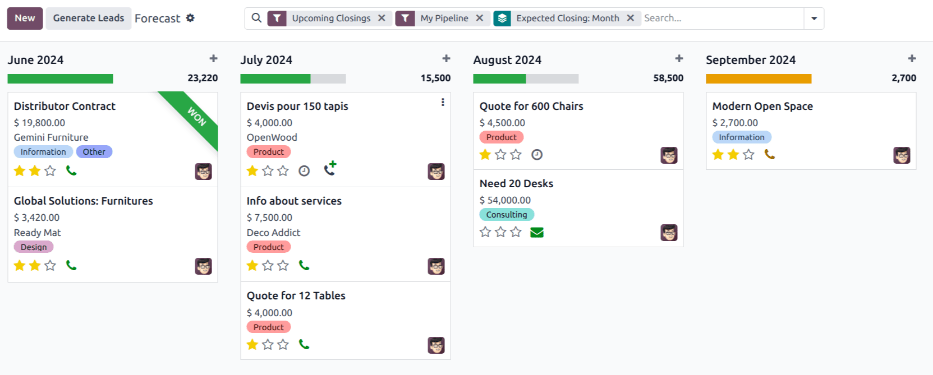
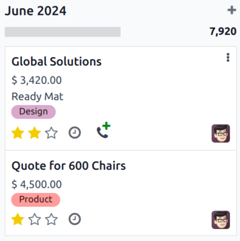
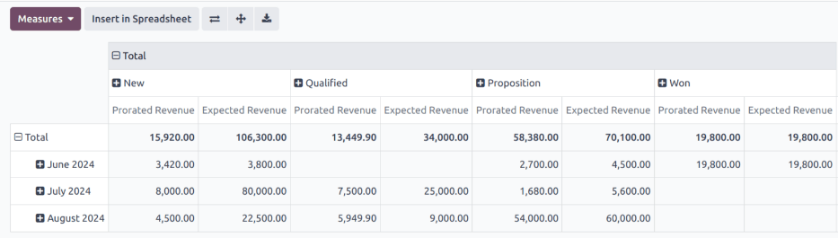

# Prognoz hisoboti

`CRM` ilovasidagi *Prognoz* hisoboti foydalanuvchilarga kelgusi imkoniyatlarni ko'rish va potentsial sotuvlar prognozini tuzish imkonini beradi. Imkoniyatlar kutilayotgan yopilish sanasi oyiga qarab guruhlangan va muddatni sozlash uchun sudrab olib tashlanishi mumkin.

*Prognoz* hisobotiga kirish uchun quyidagi yo'lni bosing:
`CRM app ‣ Reporting ‣ Forecast`.

## Prognoz hisobotida navigatsiya qilish

Standart `Forecast` hisoboti
joriy foydalanuvchining konveyeriga tayinlangan imkoniyatlarni o'z ichiga oladi va ular to'rt oy ichida yopilishi kutilmoqda. Shuningdek, u kutilayotgan yopilish sanasi belgilanmagan imkoniyatlarni ham ko'rsatadi. Imkoniyatlar `oi-view-kanban`
`(Kanban)` ko'rinishida oyga qarab guruhlangan.

### Kutilayotgan yopilish sanasi

Imkoniyatlar imkoniyat formasidagi *Kutilayotgan yopilish* maydonida belgilangan sanaga qarab guruhlangan. Ushbu sanani to'g'ridan-to'g'ri `Forecast` sahifasidan o'zgartirish uchun kerakli imkoniyat uchun Kanban kartasini tanlang, so'ngra kartani kerakli ustuncha sudrab olib boring.

::: maslahat

Prognoz uchun standart vaqt oralig'i *oy* hisoblanadi. Buni hisobotning yuqori qismidagi `Search...` paneli yonidagi `fa-caret-down`
`(pastga)` belgisini bosish orqali o'zgartirish mumkin. Paydo bo'lgan pastga tushuvchi menyudagi `Group By` sarlavhasi ostida `Expected Closing`ni bosib, mavjud variantlar ro'yxatini kengaytiring va ro'yxatdan kerakli vaqt miqdorini tanlang.
::::

Imkoniyat yangi oyga qo'shilgandan so'ng, imkoniyat formasidagi *Kutilayotgan yopilish* maydoni yangi oyning *oxirgi* sanasiga yangilanadi.

::: maslahat

*Kutilayotgan yopilish* maydonini imkoniyat kartasida ham qo'lda yangilash mumkin. Buning uchun `Forecast` sahifasidagi imkoniyat uchun Kanban kartasini bosib, imkoniyatning batafsil formasini oching. `Expected Closing` maydonini bosing va yangi yopilish sanasini tanlash uchun kalendar popoveridan foydalaning.
::::

### Proportsional daromad

`Forecast` hisobot sahifasidagi har oy ustunchasining yuqori qismida, progress barning o'ng tomonida, o'sha vaqt oralig'i uchun proportsional daromadning yig'indisi ko'rsatilgan.

Proportsional daromad quyidagi formula yordamida hisoblanadi:

$$\text \times \text = \text$$

Imkoniyatlar bir ustundan ikkinchisiga ko'chirilganda, ustun daromadi o'zgarishni aks ettirish uchun avtomatik ravishda yangilanadi.

::: misol
Iyun oyi uchun prognoz hisoboti ikkita imkoniyatni o'z ichiga oladi:

Birinchi imkoniyat, [Global Solutions], kutilayotgan daromadi [\$3,800] va ehtimolligi [90%]. Bu [\$3,420] proportsional daromadga olib keladi.

Ikkinchi imkoniyat, [Quote for 600 Chairs], kutilayotgan daromadi [\$22,500] va ehtimolligi [20%]. Bu [\$4,500] proportsional daromadga olib keladi.

Imkoniyatlarning umumiy proportsional daromadi [\$7,920] bo'lib, bu oy ustunchasining yuqori qismida ko'rsatilgan.

:::

## Natijalarni ko'rish

Grafik ko'rinishiga o'tish uchun `fa-area-chart`
`(area chart)` belgisini bosing. Keyin, hisobotning yuqori qismidagi tegishli belgini bosib, `fa-bar-chart` `(bar
chart)`,
`fa-line-chart`
`(line chart)`, yoki
`fa-pie-chart` `(pie
chart)` ko'rinishiga o'ting.

Pivot ko'rinishiga o'tish uchun `oi-view-pivot`
`(pivot)` belgisini, yoki ro'yxat ko'rinishiga o'tish uchun `oi-view-list`
`(list)` belgisini bosing.

::: maslahat

`pivot view`
ma'lumotlarni yanada chuqur ko'rish va tahlil qilish uchun ishlatilishi mumkin. Bir nechta o'lchovlarni tanlash mumkin va ma'lumotlarni oyga qarab hamda imkoniyat bosqichiga qarab ko'rish mumkin.

::::