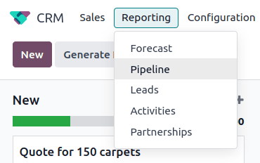
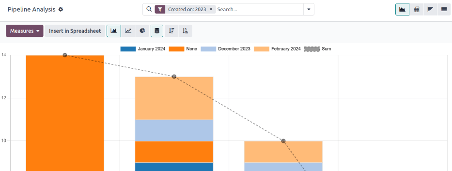
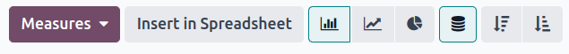
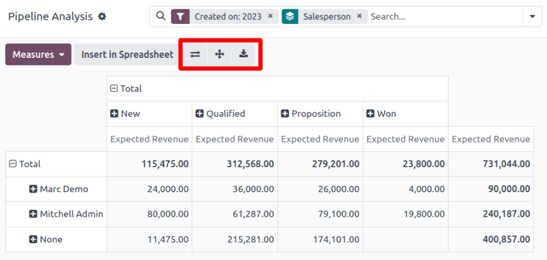
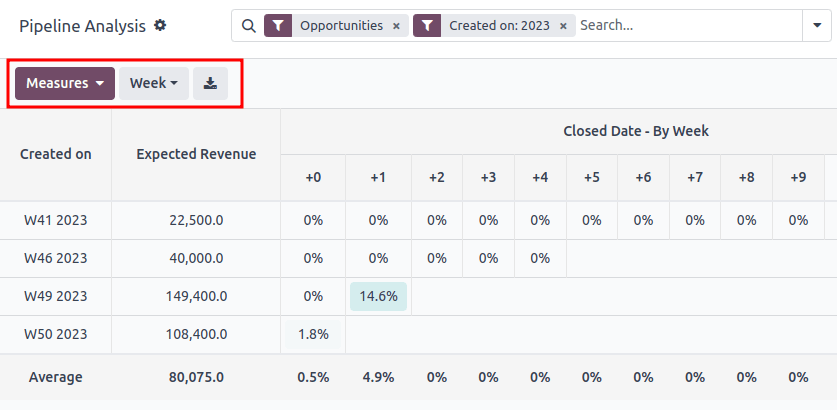
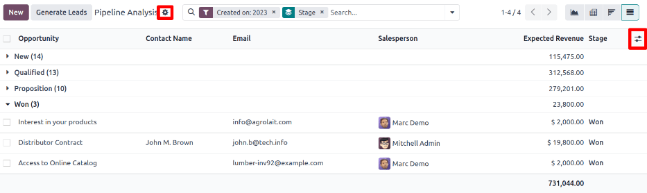

# Pipeline Tahlili

*CRM* ilovasi sotish pipeline'ini boshqaradi, chunki lead'lar/imkoniyatlar bosqichdan bosqichga, paydo bo'lishdan sotuvga (**Yutuq**) yoki arxivga (**Yo'qotilgan**) o'tadi.

Pipeline'ni tashkil qilgandan so'ng, pipeline va uning foydalanuvchilari samaradorligi haqida tushuncha olish uchun *Pipeline Tahlili* sahifasida mavjud qidiruv variantlari va hisobotlardan foydalaning.

*Pipeline Tahlili* sahifasiga kirish uchun quyidagi yo'lni bosing:
`CRM app ‣ Reporting ‣ Pipeline`.

## Pipeline tahlili sahifasida navigatsiya qilish

`Pipeline Analysis` sahifasiga kirganda, o'tgan yildan boshlab lead'larni ko'rsatuvchi ustunli grafik avtomatik ravishda to'ldiriladi. Ustunlar sotish pipeline'ining har bir bosqichidagi lead'lar sonini ifodalaydi va lead'ning o'sha bosqichga yetgan oyini ko'rsatish uchun ranglar bilan kodlangan.

`Pipeline Analysis` sahifasining interaktiv elementlari grafikni manipulyatsiya qilib, turli ko'rinishlarda turli xil ko'rsatkichlarni hisobot qiladi. Chapdan o'ngga, yuqoridan pastga elementlar quyidagilarni o'z ichiga oladi:

- `Actions`: `⚙️ (gear)` belgisi bilan ifodalanadi va `Pipeline Analysis` sahifa sarlavhasi yonida joylashgan. Bosilganda, uchta variant bilan pastga tushuvchi menyu paydo bo'ladi, har birining o'z sub-menyusi bor: `Knowledge`, `Dashboard`, `Spreadsheet`. (Qo'shimcha ma'lumot uchun `Hisobotlarni saqlash va ulashish`ga qarang)
  - `Knowledge` varianti grafikni *Knowledge* ilova maqolasiga bog'lash yoki kiritish uchun.
  - `Dashboard` varianti grafikni *Dashboards* ilovasidagi boshqaruv paneliga qo'shish uchun.
  - `Spreadsheet` varianti grafikni *Documents* ilovasidagi elektron jadvalga bog'lash uchun.
- `Search...` paneli: hozirda grafikga qo'llanilayotgan filtrlar va guruhlashlarni ko'rsatadi. Yangi filtrlar/guruhlar qo'shish uchun ularni qidiruv paneliga yozing yoki panel oxiridagi `⬇️ (down arrow)` belgisini bosib, variantlar pastga tushuvchi menyusini oching. (Qo'shimcha ma'lumot uchun `Qidiruv Variantlari`ga qarang)

Yuqori o'ng burchakda turli belgilar bilan ifodalangan ko'rinish variantlari mavjud. (Qo'shimcha ma'lumot uchun `Ko'rinish Variantlari`ga qarang)

- `Graph` ko'rinishi: ma'lumotlarni ustunli grafikda ko'rsatadi. Bu standart ko'rinish.
- `Pivot` ko'rinishi: ma'lumotlarni sozlanishi mumkin bo'lgan, kategoriyalashtirilgan ko'rsatkichlar jadvalida ko'rsatadi.
- `Cohort` ko'rinishi: ma'lumotlarni ularning `Created on` va `Closed Date` haftasi (standart), kuni, oyi yoki yiliga asoslangan holda ko'rsatadi va tashkil qiladi.
- `List` ko'rinishi: ma'lumotlarni ro'yxat shaklida ko'rsatadi.

Sahifaning eng chap tomonida, `Pipeline Analysis` sahifa sarlavhasi ostida, qo'shimcha sozlanishi mumkin filtr va ko'rinish variantlari mavjud.

- `Measures`: grafik, pivot yoki cohort ko'rinishida ko'rish mumkin bo'lgan turli o'lchov variantlarining pastga tushuvchi menyusini ochadi. `Measure` pastga tushuvchi menyusi ro'yxat ko'rinishida mavjud emas. (Qo'shimcha ma'lumot uchun `O'lchov Variantlari`ga qarang)
- `Insert in Spreadsheet`: *Documents* ilovasidagi elektron jadvalga yoki *Dashboards* ilovasidagi boshqaruv paneliga grafik yoki pivot jadval qo'shish variantlari bilan popup oynasini ochadi. Bu variant cohort yoki ro'yxat ko'rinishida mavjud emas.

Grafik ko'rinishi tanlangan holda, quyidagi variantlar mavjud:

- `Bar Chart`: grafikni ustunli grafikka o'zgartiradi.
- `Line Chart`: grafikni chiziqli grafikka o'zgartiradi.
- `Pie Chart`: grafikni doirasimon grafikka o'zgartiradi.
- `Stacked`: tanlanganda, grafikning har bir bosqichi natijalari bir-birining ustiga qo'yiladi. Tanlanmaganda, har bir bosqichdagi natijalar alohida ustunlar sifatida ko'rsatiladi.
- `Descending`: grafikdagi bosqichlarni chapdan o'ngga kamayish tartibida qayta tartibga soladi. Uni bekor qilish uchun ikkinchi marta belgini bosing. Qidiruv mezonlariga qarab, bu variant mavjud bo'lmasligi mumkin.
- `Ascending`: grafikdagi bosqichlarni chapdan o'ngga o'sish tartibida qayta tartibga soladi. Uni bekor qilish uchun ikkinchi marta belgini bosing. Qidiruv mezonlariga qarab, bu variant mavjud bo'lmasligi mumkin.

Pivot ko'rinishi tanlangan holda, quyidagi variantlar mavjud:

- `Flip Axis`: butun jadval uchun X va Y o'qlarini almashtiradi.
- `Expand All`: `➕ (plus sign)` belgilari yordamida qo'shimcha guruhlashlar tanlanganda, bu tugma har bir qator ostidagi guruhlashlarni ochadi.
- `Download xlsx`: jadvalni Excel fayli sifatida yuklab oladi.

### Qidiruv variantlari

`Pipeline Analysis` sahifasi turli filtrlar va guruhlash variantlari bilan sozlanishi mumkin.

Yangi qidiruv mezonlarini qo'shish uchun kerakli mezonlarni qidiruv paneliga yozing yoki qidiruv paneli yonidagi `⬇️ (down arrow)` belgisini bosib, barcha variantlarning pastga tushuvchi menyusini oching. Har bir variant nima qilishi haqida qo'shimcha ma'lumot uchun quyidagi bo'limlarga qarang.

::::::::: tabs
::: tab
Filtrlar

`Filters` bo'limi foydalanuvchilarga qidiruv mezonlariga tayyor va maxsus filtrlarni qo'shish imkonini beradi. Bitta qidiruvga bir nechta filtrlarni qo'shish mumkin.

- `My Pipeline`: joriy foydalanuvchiga tayinlangan lead'larni ko'rsatish.
- `Opportunities`: imkoniyat sifatida malakali bo'lgan lead'larni ko'rsatish.
- `Leads`: hali imkoniyat sifatida malakali bo'lmagan lead'larni ko'rsatish.
- `Active`: faol lead'larni ko'rsatish.
- `Inactive`: nofaol lead'larni ko'rsatish.
- `Won`: **Yutuq** deb belgilangan lead'larni ko'rsatish.
- `Lost`: **Yo'qotilgan** deb belgilangan lead'larni ko'rsatish.
- `Created On`: ma'lum vaqt oralig'ida yaratilgan lead'larni ko'rsatish. Standart bo'yicha, bu o'tgan yil, lekin kerak bo'lganda sozlanishi yoki butunlay olib tashlanishi mumkin.
- `Expected Closing`: ma'lum vaqt oralig'ida yopilishi (⁤**Yutuq** deb belgilanishi) kutilayotgan lead'larni ko'rsatish.
- `Date Closed`: ma'lum vaqt oralig'ida yopilgan (**Yutuq** deb belgilangan) lead'larni ko'rsatish.
- `Archived`: arxivlangan (**Yo'qotilgan** deb belgilangan) lead'larni ko'rsatish.
- `Add Custom Filter`: foydalanuvchiga ko'plab variantlar bilan maxsus filtr yaratish imkonini beradi. (Qo'shimcha ma'lumot uchun `Maxsus Filtrlar va Guruhlarni Qo'shish`ga qarang)
:::

::::: tab
Guruhlash

`Group By` bo'limi foydalanuvchilarga qidiruv natijalariga tayyor va maxsus guruhlashlarni qo'shish imkonini beradi. Natijalarni boshqariladigan bo'laklarga bo'lish uchun bir nechta guruhlashlar qo'shilishi mumkin.

::: ogohlantirish

Guruhlashlar qo'shilish tartibi yakuniy natijalar qanday ko'rsatilishiga ta'sir qiladi. Har bir foydalanish holati uchun nima yaxshi ishlashini ko'rish uchun bir xil kombinatsiyalarni boshqa tartibda tanlashga harakat qiling.
::::

- `Salesperson`: natijalarni lead tayinlangan Sotuvchi bo'yicha guruhlaydi.
- `Sales Team`: natijalarni lead tayinlangan Sotish Jamoasi bo'yicha guruhlaydi.
- `City`: natijalarni lead paydo bo'lgan shahar bo'yicha guruhlaydi.
- `Country`: natijalarni lead paydo bo'lgan mamlakat bo'yicha guruhlaydi.
- `Company`: natijalarni lead tegishli kompaniya bo'yicha guruhlaydi (agar ma'lumotlar bazasida bir nechta kompaniyalar faollashtirilgan bo'lsa).
- `Stage`: natijalarni sotish pipeline'ining bosqichlari bo'yicha guruhlaydi.
- `Campaign`: natijalarni lead paydo bo'lgan marketing kampaniyasi bo'yicha guruhlaydi.
- `Medium`: natijalarni lead paydo bo'lgan vosita (Email, Google Adwords, Website va h.k.) bo'yicha guruhlaydi.
- `Source`: natijalarni lead paydo bo'lgan manba (Qidiruv tizimi, Lead Recall, Newsletter va h.k.) bo'yicha guruhlaydi.
- `Creation Date`: natijalarni lead ma'lumotlar bazasiga qo'shilgan sana bo'yicha guruhlaydi.
- `Conversion Date`: natijalarni lead imkoniyatga aylantirilgan sana bo'yicha guruhlaydi.
- `Expected Closing`: natijalarni lead yopilishi ("Yutuq" deb belgilanishi) kutilayotgan sana bo'yicha guruhlaydi.
- `Closed Date`: natijalarni lead yopilgan ("Yutuq" deb belgilangan) sana bo'yicha guruhlaydi.
- `Lost Reason`: natijalarni lead "Yo'qotilgan" deb belgilanganda tanlangan sabab bo'yicha guruhlaydi.
- `Add Custom Group`: foydalanuvchiga ko'plab variantlar bilan maxsus guruh yaratish imkonini beradi. (Qo'shimcha ma'lumot uchun `Maxsus Filtrlar va Guruhlarni Qo'shish`ga qarang)
:::::

::: tab
Taqqoslash

`Comparison` bo'limi foydalanuvchilarga bir xil qidiruv mezonlarini boshqa vaqt oralig'ida taqqoslash imkonini beradi.

Bu variant faqat qidiruv `Created On`, `Expected Closing` yoki `Date Closed` kabi vaqtga asoslangan filtrlarni o'z ichiga olgan taqdirda mavjud. Bir vaqtda bir nechta vaqtga asoslangan filtrlarni qo'shish mumkin bo'lsa-da, faqat bitta taqqoslash tanlash mumkin.

- `Previous Period`: oldingi davrdan bir xil qidiruv mezonlari bilan taqqoslash qo'shadi.
- `Previous Year`: oldingi yildan bir xil qidiruv mezonlari bilan taqqoslash qo'shadi.
:::

::: tab
Sevimlilar

`Favorites` bo'limi foydalanuvchilarga qidiruvni keyingi uchun saqlash imkonini beradi, shunda uni har safar qayta yaratish shart emas.

Bir nechta qidiruvlarni saqlash, boshqalar bilan ulashish yoki hatto `Pipeline Analysis` sahifasi ochilganda standart sifatida o'rnatish mumkin.

- `Save current search`: joriy qidiruv mezonlarini keyingi uchun saqlash.
  - `Default filter`: qidiruvni saqlashda, `Pipeline Analysis` sahifasi ochilganda uni standart qidiruv filtri qilish uchun bu katakchani belgilang.
  - `Shared`: qidiruvni saqlashda, uni boshqa foydalanuvchilar uchun mavjud qilish uchun bu katakchani belgilang.
:::
:::::::::

#### Maxsus filtrlar va guruhlarni qo'shish

Qidiruv panelidagi tayyor variantlarga qo'shimcha ravishda, `Pipeline Analysis` sahifasi maxsus filtrlar va guruhlardan ham foydalanishi mumkin.

Maxsus filtrlar qidiruv natijalarini yanada sozlaydigan murakkab qoidalar bo'lib, maxsus guruhlar esa ma'lumotni yanada tartibli tarzda ko'rsatadi.

**Maxsus filtr qo'shish uchun:**

1. `Pipeline Analysis` sahifasida `Search...` paneli yonidagi `down arrow` belgisini bosing.
2. Pastga tushuvchi menyuda `Add Custom Filter`ni bosing.
3. `Add Custom Filter` popup oynasi uch noyob maydondan iborat standart qoida (`Country is in _____`) bilan paydo bo'ladi. Bu maydonlarni maxsus qoida yaratish uchun tahrirlash mumkin va bitta maxsus filtrga bir nechta qoidalarni qo'shish mumkin.
4. Qoidani tahrirlash uchun birinchi maydonni (`Country`) bosish bilan boshlang va pastga tushuvchi menyudan variant tanlang. Birinchi maydon qoidaning asosiy mavzusini belgilaydi.
5. Keyin, ikkinchi maydonni bosing va pastga tushuvchi menyudan variant tanlang. Ikkinchi maydon birinchi va uchinchi maydonlarning munosabatini belgilaydi va odatda **is** yoki **is not** bayonoti bo'ladi, lekin **dan katta yoki dan kichik** bayonotlar va boshqalar ham bo'lishi mumkin.
6. Nihoyat, uchinchi maydonni bosing va pastga tushuvchi menyudan variant tanlang. Uchinchi maydon qoidaning ikkinchi darajali mavzusini belgilaydi.
7. Barcha uch maydon tanlanganda, qoida yakunlanadi.
   - **Ko'proq qoidalar qo'shish uchun:** `New Rule`ni bosing va 4-7 qadamlarni kerak bo'lganda takrorlang.
   - **Qoidani o'chirish uchun:** qoida o'ng tomonidagi `🗑️ (trash)` belgisini bosing.
   - **Mavjud qoidani nusxalash uchun:** qoida o'ng tomonidagi `➕ (plus sign)` belgisini bosing.
   - **Murakkab qoidalar yaratish uchun:** qoida o'ng tomonidagi `Add branch` belgisini bosing. Bu "barcha" yoki "biror" bayonotini qo'shish uchun qoida ostiga boshqa modifikator qo'shadi.

8. Barcha qoidalar qo'shilgandan so'ng, maxsus filtrni qidiruv mezonlariga qo'shish uchun `Add`ni bosing.
   - **Maxsus filtrni olib tashlash uchun:** qidiruv panelidagi filtr yonidagi `✖️ (x)` belgisini bosing.

**Maxsus guruh qo'shish uchun:**

1. `Pipeline Analysis` sahifasida qidiruv paneli yonidagi `down arrow` belgisini bosing.
2. Paydo bo'lgan pastga tushuvchi menyuda `Add Custom Group`ni bosing.
3. Pastga tushuvchi menyudagi variantlarni aylantirib ko'ring va bir yoki bir nechta guruhni tanlang.
   - **Maxsus guruhni olib tashlash uchun:** qidiruv panelidagi maxsus guruh yonidagi `✖️ (x)` belgisini bosing.

### O'lchov variantlari

Standart bo'yicha, `Pipeline Analysis` sahifasi qidiruv mezonlariga mos keladigan lead'larning umumiy `Count`ni o'lchaydi, lekin boshqa qiziqarli narsalarni o'lchash uchun o'zgartirilishi mumkin.

Tanlangan o'lchovni o'zgartirish uchun sahifaning yuqori chap tomonidagi `Measures` tugmasini bosing va pastga tushuvchi menyudan quyidagi variantlardan birini tanlang:

- `Days to Assign`: lead yaratilgandan keyin tayinlanishi uchun ketgan kunlar sonini o'lchaydi.
- `Days to Close`: lead yopilishi (**Yutuq** deb belgilanishi) uchun ketgan kunlar sonini o'lchaydi.
- `Days to Convert`: lead imkoniyatga aylanishi uchun ketgan kunlar sonini o'lchaydi.
- `Exceeded Closing Days`: lead'ning Kutilayotgan Yopilish sanasini necha kun oshirganini o'lchaydi.
- `Expected MRR`: lead'ning Kutilayotgan Takrorlanadigan Daromadini o'lchaydi.
- `Expected Revenue`: lead'ning Kutilayotgan Daromadini o'lchaydi.
- `Prorated MRR`: lead'ning Proportsional Oylik Takrorlanadigan Daromadini o'lchaydi.
- `Prorated Recurring Revenues`: lead'ning Proportsional Takrorlanadigan Daromadlarini o'lchaydi.
- `Prorated Revenue`: lead'ning Proportsional Daromadini o'lchaydi.
- `Recurring Revenues`: lead'ning Takrorlanadigan Daromadini o'lchaydi.
- `Count`: qidiruv mezonlariga mos keladigan lead'larning umumiy miqdorini o'lchaydi.

### Ko'rinish variantlari

Filtrlar, guruhlashlar va o'lchovlarni sozlashdan so'ng, `Pipeline Analysis` sahifasi ma'lumotlarni turli yo'llar bilan ko'rsatishi mumkin. Standart bo'yicha, sahifa grafik ko'rinishidan foydalanadi, lekin pivot ko'rinish, cohort ko'rinish yoki ro'yxat ko'rinishiga o'zgartirilishi mumkin.

Pipeline'ni boshqa ko'rinishga o'zgartirish uchun `Pipeline Analysis` sahifasining yuqori o'ng tomonida joylashgan to'rtta ko'rinish belgilaridan birini bosing.

::::::::::::: tabs
::::: tab
Grafik Ko'rinishi

Grafik ko'rinishi `Pipeline Analysis` sahifasi uchun standart tanlovdir. U tahlilni ustunli grafik, chiziqli grafik yoki doirasimon grafik sifatida ko'rsatadi.

Bu ko'rinish varianti oddiy munosabatlarni tezda vizuallashtirish va taqqoslash uchun foydali, masalan har bir bosqichdagi lead'larning `Count`i yoki har bir `Salesperson`ga tayinlangan lead'lar.

Standart bo'yicha, grafik har bir guruhdagi lead'larning `Count`ini o'lchaydi, lekin buni `Measures` tugmasini bosish va paydo bo'lgan pastga tushuvchi menyudan `boshqa variant tanlash` orqali o'zgartirish mumkin.

::: maslahat

Ushbu ko'rinishda ustunli grafikdan foydalanganda, natijalar taqsimotini yanada o'qilishi oson qilish uchun `Stacked` variantini bekor qilishni ko'rib chiqing.
::::
:::::

::::: tab
Pivot Ko'rinishi

Pivot ko'rinishi tahlil natijalarini jadval sifatida ko'rsatadi. Standart bo'yicha, jadval natijalarni sotish pipeline'ining bosqichlari bo'yicha guruhlaydi va `Expected Revenue`ni o'lchaydi.

Pivot ko'rinishi grafik ko'rinishi bilan ishlashi mumkin bo'lgan batafsil raqamlarni tahlil qilish yoki ma'lumotlarni elektron jadvalga qo'shish uchun foydali, bu yerda Excel faylida bo'lgani kabi maxsus formulalarni o'rnatish mumkin.

Sahifaning yuqori chap tomonidagi uchta belgi quyidagi funksiyalarni bajaradi:

- `Flip Axis`: butun jadval uchun X va Y o'qlarini almashtiradi.
- `Expand All`: `➕ (plus sign)` belgilari yordamida qo'shimcha guruhlashlar tanlanganda, bu tugma har bir qator ostidagi guruhlashlarni ochadi.
- `Download xlsx`: jadvalni Excel fayli sifatida yuklab oladi.

::: maslahat

`Stage` guruhlashini olib tashlash mumkin emas, lekin o'lchovni `Measures` tugmasini bosish va boshqa variant tanlash orqali o'zgartirish mumkin.
::::
:::::

::: tab
Cohort Ko'rinishi

Cohort ko'rinishi tahlilni kunlar, haftalar, oylar yoki yillarga o'rnatilishi mumkin bo'lgan vaqt davrlari (cohortlar) sifatida ko'rsatadi. Standart bo'yicha, `Week` tanlangan.

Bu ko'rinish varianti aynan lead'larni yopish qancha vaqt ketganini taqqoslash uchun foydali.

Chapdan o'ngga, yuqoridan pastga, diagrammadagi ustunlar quyidagilarni ifodalaydi:

- `Created On`: ushbu ustundagi qatorlar qidiruv mezonlariga mos keladigan yozuvlar mavjud bo'lgan yil haftalari ifodalaydi.
  - `Week`ga o'rnatilganda, `W52 2023` yorlig'i bilan qator natijalar quyidagida sodir bo'lganini anglatadi: 2023 yilning 52-haftasi.
- `Measures`: diagrammadagi ikkinchi ustun natijalarning o'lchovidir. Standart bo'yicha, u `Count`ga o'rnatilgan, lekin `Measures` tugmasini bosish va pastga tushuvchi menyudan variant tanlash orqali o'zgartirilishi mumkin.
- `Closed Date - By Day/Week/Month/Year`: bu ustun o'lchangan natijalarning necha foizi keyingi kunlar/haftalar/oylar/yillarda yopilganini ko'radi.
- `Average`: bu qator ustundagi boshqa barcha qatorlarning o'rtachasini beradi.

Cohort ko'rinishi sahifaning yuqori chap tomonidagi `Download` belgisini bosish orqali Excel fayli sifatida ham yuklab olinishi mumkin.
:::

::::: tab
Ro'yxat Ko'rinishi

Ro'yxat ko'rinishi qidiruv mezonlariga mos keladigan barcha lead'larning bitta ro'yxatini ko'rsatadi. Lead'ni bosish yaqinroq ko'rib chiqish uchun yozuvni ochadi. `Country`, `Medium` va boshqalar kabi qo'shimcha tafsilotlar ro'yxatning yuqori o'ng tomonidagi `Filters` belgisini bosish orqali ro'yxatga qo'shilishi mumkin.

Bu ko'rinish varianti bir vaqtda ko'plab yozuvlarni ko'rib chiqish uchun foydali.

`⚙️ (gear)` belgisini bosish quyidagilar uchun variantlar bilan Actions pastga tushuvchi menyusini ochadi:

- `Import records`: ma'lumotlar elektron jadvalini yuklash sahifasini, shuningdek, o'sha ma'lumotlarni oson formatlash uchun andoza elektron jadvalni ochadi.
- `Export All`: ro'yxatni Excel uchun xlsx fayli sifatida yuklab oladi.
- `Knowledge`: *Knowledge* ilovasidagi maqolada ro'yxatning ko'rinishini yoki unga havolani kiritadi.
- `Dashboard`: ro'yxatni *Dashboards* ilovasidagi *My Dashboard*ga qo'shadi.
- `Spreadsheet`: *Documents* ilovasidagi elektron jadvaldagi ro'yxatga havola beradi yoki uni kiritadi.

::: maslahat

Ro'yxat ko'rinishida `New`ni bosish ro'yxatni yopadi va *New Quotation* sahifasini ochadi. `Generate Leads`ni bosish lead yaratish uchun popup oyna ochadi. Ikki funksiya ham ro'yxat ko'rinishini manipulyatsiya qilish uchun mo'ljallanmagan.
::::
:::::
:::::::::::::

## Hisobotlar yaratish

`pipeline tahlili sahifasida navigatsiya qilish`ni tushungandan so'ng, `Pipeline Analysis` sahifasi turli hisobotlarni yaratish va ulashish uchun ishlatilishi mumkin. Tayyor variantlar va maxsus filtr va guruhlashlar o'rtasida deyarli har qanday kombinatsiya mumkin.

Yaratilgandan so'ng, hisobotlar `sevimlilarga saqlanishi, boshqa foydalanuvchilar bilan ulashilishi va/yoki boshqaruv panellari va elektron jadvallarga qo'shilishi mumkin`.

`Pipeline Analysis` sahifasi yordamida yaratilishi mumkin bo'lgan bir nechta umumiy hisobotlar quyida batafsil ko'rsatilgan.

### Yutuq/Yo'qotish hisobotlari

Yutuq/Yo'qotish - bu ma'lum vaqt oralig'ida **Yutuq** yoki **Yo'qotilgan** deb belgilangan pipeline'dagi faol yoki ilgari faol lead'larning hisobi. Yutilgan imkoniyatlarni yo'qotilgan imkoniyatlarga bo'lish orqali, jamoalar lead'larni sotuvlarga aylantiruvchi asosiy ishlash ko'rsatkichlarini (KPI) aniqlashtirishi mumkin, masalan ma'lum jamoalar yoki jamoa a'zolari