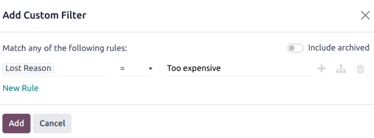

# Yo'qotilgan imkoniyatlar

Har bir imkoniyat muvaffaqiyatli savdoga olib kelmaydi. Konveyerni
yangilangan holda saqlash uchun *yo'qotilgan* imkoniyatlarni aniqlash kerak. 
Imkoniyat nima uchun yo'qotilganini ko'rsatish takrorlanuvchi muammolarni 
aniqlashga yordam beradi, o'qitish imkoniyatlarini ochib beradi va umumiy 
savdo strategiyasini yaxshilashda yordam beradi.

::: tip

`Yo'qotilgan imkoniyatlarni` faol bilan birlashtirish ularni konveyerga qaytaradi.
::::

## Imkoniyatni yo'qotilgan deb belgilash

Imkoniyatni yo'qotilgan deb belgilash uchun avval 
`CRM ilovasi`ni oching va keyin konveyerdan tegishli 
Kanban kartasini bosish orqali imkoniyatni tanlang. 
Buni qilish o'sha imkoniyatning tafsilotlar formasini ochadi.

Keyin imkoniyatning tafsilotlar formasining yuqori qismida 
joylashgan `Lost` tugmasini bosing.

Bu `Mark Lost` popup oynasini ochadi. 
`Lost Reason` ochiladigan menyudan mavjud 
yo'qotish sababini tanlang. Agar mos sabab mavjud bo'lmasa, 
uni `Lost Reason` maydoniga kiritib, 
`Create` tugmasini bosish orqali yangisini yarating.

Yo'qotish sababidan pastda maxsus 
`Closing Note` maydoniga qo'shimcha 
izohlar va sharhlar qo'shish mumkin.

::: tip

`Mark Lost` popup oynasidagi 
`Lost Reason` maydoni ham, 
`Closing Note` maydoni ham majburiy emas. 
Biroq, kuzatish, javobgarlik va hisobot maqsadlari uchun 
bu ma'lumotlarni kiritish tavsiya etiladi.
::::

`Mark Lost` popup oynasiga barcha 
kerakli ma'lumotlar kiritilgandan so'ng, 
`Mark as Lost` tugmasini bosing.

`Mark as Lost` tugmasini bosgandan so'ng, 
imkoniyatning yuqori o'ng burchagiga qizil 
`Lost` banner qo'shiladi.

::: tip

*Nofaol* (arxivlangan) imkoniyatni yo'qotilgan deb belgilash uchun 
`Probability` maydonini [0] foizga o'rnating.
::::

## Yo'qotish sabablarini yaratish/tahrirlash

Yangi yo'qotish sababini yaratish yoki mavjudini tahrirlash uchun 
`CRM ilovasi ‣ Konfiguratsiya ‣ Lost Reasons` ga o'ting.

Mavjud yo'qotish sababini tahrirlash uchun tahrirlanishi kerak bo'lgan 
sababni bosib ajratib ko'rsating. Bu yerdan tanlangan yo'qotish sababini 
`Description` maydonini tahrirlash orqali o'zgartiring.

Yangi yo'qotish sababini yaratish uchun `Lost Reasons` 
sahifasining yuqori chap burchagidagi `New` tugmasini bosing. 
Keyin `Description` maydoniga yangi yo'qotish sababini yozing.

## Yo'qotilgan imkoniyatlarni ko'rish

Yo'qotilgan imkoniyatlarni olish uchun 
`CRM ilovasi ‣ Savdo ‣ My Pipeline` ga o'ting, keyin sahifaning 
yuqori qismidagi qidiruv satriga bosing va barcha standart 
filtrlarni olib tashlang.

Qidiruv satrining o'ng tomonidagi `fa-caret-down` 
`(dropdown)` belgisini bosish orqali `Filters` 
ochiladigan menyusini oching. Bu `Filters`, 
`Group By` va `Favorites` 
variantlarini o'z ustunlariga ajratgan ochiladigan menyuni ochadi.

`Filters` bo'limidan `Lost` variantini tanlang. 
`Lost` ni tanlagandan so'ng, `Pipeline` 
sahifasida faqat [Yo'qotilgan] deb belgilangan imkoniyatlar ko'rinadi.

### Imkoniyatlarni yo'qotish sababiga qarab saralash

Imkoniyatlarni ma'lum yo'qotish sababiga qarab filtrlash uchun 
qidiruv satrining o'ng tomonidagi `fa-caret-down` 
`(dropdown)` belgisini yana bosing. `Lost` 
filtriga qo'shimcha ravishda, `Filters` 
ustuni ostida `Add Custom Filter` tugmasini bosing, 
bu `Add Custom Filter` popup oynasini ochadi.

`Add Custom Filter` popup oynasida birinchi 
maydonga bosing va qidiruv satriga [Lost Reason] yozing 
yoki uni topish uchun ro'yxatni aylantiring. Keyin keyingi 
maydonga bosing va ochiladigan menyudan `=` ni tanlang. 
Uchinchi maydonga bosing va ochiladigan menyudan yo'qotish 
sababini tanlang. Nihoyat, `Add` tugmasini bosing.

::: tip

Bir nechta yo'qotish sababi uchun natijalarni ko'rish uchun 
`Add Custom Filter` popup oynasidagi maxsus 
filtrning ikkinchi maydonida `is in` operatorini tanlang. 
Bu operatorni tanlash uchinchi maydonda bir nechta yo'qotish 
sababini tanlash imkonini beradi.

::::

## Yo'qotilgan imkoniyatlarni tiklash

Yo'qotilgan imkoniyatni tiklash uchun `CRM` 
ilovasini ochib `Pipeline` boshqaruv panelini ko'rsating. 
Yoki `CRM ilovasi ‣ Savdo ‣ My Pipeline` ga o'ting. 
Bu yerdan qidiruv satrining o'ng tomonidagi 
`fa-caret-down` `(dropdown)` belgisini bosib 
`Filters`, `Group By` va 
`Favorites` ustunlarini o'z ichiga olgan 
ochiladigan menyuni oching.

`Filters` ustuni ostida `Lost` ni tanlang. 
Buni qilish `Pipeline` sahifasida barcha 
yo'qotilgan imkoniyatlarni ko'rsatadi.

::: tip

Ma'lumotlar bazasidagi barcha imkoniyatlarni ko'rish uchun 
qidiruv satridan standart `My Pipeline` 
filtrini olib tashlang.
::::

Yo'qotilgan imkoniyatning tafsilotlar formasidan yuqori 
chap burchakdagi `Restore` tugmasini bosing. 
Buni qilish imkoniyat formasidan qizil `Lost` 
bannerni olib tashlaydi va imkoniyat tiklanganini bildiradi.

### Bir vaqtda bir nechta imkoniyatni tiklash

Bir vaqtda bir nechta imkoniyatni tiklash uchun qidiruv satrining 
o'ng tomonidagi `fa-caret-down` `(dropdown)` 
belgisini bosib boshqaruv paneli mega menyusini oching va 
chap tomondagi `Filters` ustuni ostida 
joylashgan standart `Lost` variantini tanlang.

Keyin yuqori o'ng burchakdagi `fa-bars` 
`(list)` belgisi bilan ifodalangan ro'yxat ko'rinishi 
variantini tanlang. Buni qilish `Pipeline` 
sahifasidagi barcha imkoniyatlarni ro'yxat ko'rinishida joylashtiradi. 
Ro'yxat ko'rinishi tanlanganida, tiklanishi kerak bo'lgan har bir 
imkoniyatning chap tomonidagi katak belgisini tanlang.

Kerakli imkoniyatlar tanlanganidan so'ng, `Pipeline` 
sahifasining yuqori qismidagi `fa-cog` 
`Actions` ochiladigan menyusini bosing. 
`fa-cog` `(Actions)` ochiladigan menyusidan 
`Unarchive` ni tanlang.

Buni qilish tanlangan imkoniyatlarni `Pipeline` 
sahifasidan olib tashlaydi, chunki ular endi 
`Lost` filtr mezonlariga mos kelmaydi. 
Bu yangi tiklangan imkoniyatlarni ko'rsatish uchun 
qidiruv satridan `Lost` filtrini o'chiring.

## Yo'qotilgan mijozlarni boshqarish

Agar ma'lumotlar bazasida *Mijozlar* yoqilgan bo'lsa, ularni 
imkoniyatlar kabi *yo'qotilgan* deb belgilash mumkin. 
Mijozlar imkoniyatlar bilan bir xil 
`yo'qotish sabablarini` ishlatadi.

::: tip

Mijozlarni yoqish uchun `CRM ilovasi ‣ Konfiguratsiya ‣ Settings` 
ga o'ting va `Leads` katak belgisini belgilang. 
Bu sahifaning yuqori qismidagi sarlavha menyu satriga 
yangi `Leads` menyusini qo'shadi.
::::

### Mijozni yo'qotilgan deb belgilash

Mijozni yo'qotilgan deb belgilash uchun 
`CRM ilovasi ‣ Leads` ga o'ting va ro'yxatdan 
mijozni tanlang. Buni qilish o'sha mijozning tafsilotlar 
formasini ochadi. Keyin mijozning tafsilotlar formasining 
yuqori qismida joylashgan `Lost` tugmasini bosing.

Bu `Mark Lost` popup oynasini ochadi. 
`Lost Reason` ochiladigan menyudan mavjud 
yo'qotish sababini tanlang. Agar mos sabab mavjud bo'lmasa, 
uni `Lost Reason` maydoniga kiritib, 
`Create` ni tanlash orqali yangisini yarating.

Yo'qotish sababidan pastda maxsus 
`Closing Note` maydoniga qo'shimcha 
izohlar va sharhlar qo'shish mumkin.

`Mark Lost` popup oynasiga barcha 
kerakli ma'lumotlar kiritilgandan so'ng, 
`Mark as Lost` tugmasini bosing.

### Yo'qotilgan mijozlarni tiklash

Yo'qotilgan mijozni tiklash uchun 
`CRM ilovasi ‣ Leads` ga o'ting va keyin 
qidiruv satrining o'ng tomonidagi `fa-caret-down` 
`(dropdown)` belgisini bosib `Filters`, 
`Group By` va `Favorites` 
ustunlarini o'z ichiga olgan ochiladigan menyuni oching.

`Filters` ustuni ostida `Lost` ni tanlang. 
Buni qilish `Leads` sahifasida barcha 
yo'qotilgan mijozlarni ko'rsatadi.

Keyin tiklash uchun kerakli yo'qotilgan mijozga bosing, 
bu o'sha mijozning tafsilotlar formasini ochadi.

Yo'qotilgan mijozning tafsilotlar formasidan yuqori chap 
burchakdagi `Restore` tugmasini bosing. Buni qilish 
mijoz formasidan qizil `Lost` bannerni olib 
tashlaydi va mijoz tiklanganini bildiradi.

### Bir vaqtda bir nechta mijozni tiklash

Bir vaqtda bir nechta mijozni tiklash uchun 
`CRM ilovasi ‣ Leads` ga o'ting, 
`Filters` ochiladigan menyusini oching va 
`Lost` variantini tanlang. Tiklanishi kerak 
bo'lgan har bir mijozning chap tomonidagi katak belgisini tanlang.

Kerakli mijozlar tanlanganidan so'ng, `Leads` 
sahifasining yuqori qismidagi `fa-cog` 
`(Actions)` ochiladigan menyusini bosing. 
`fa-cog` `(Actions)` ochiladigan menyusidan 
`Unarchive` ni tanlang.

Buni qilish tanlangan mijozlarni `Leads` 
sahifasidan olib tashlaydi, chunki ular endi 
`Lost` filtr mezonlariga mos kelmaydi. 
Bu yangi tiklangan mijozlarni ko'rsatish uchun 
qidiruv satridan `Lost` filtrini o'chiring.