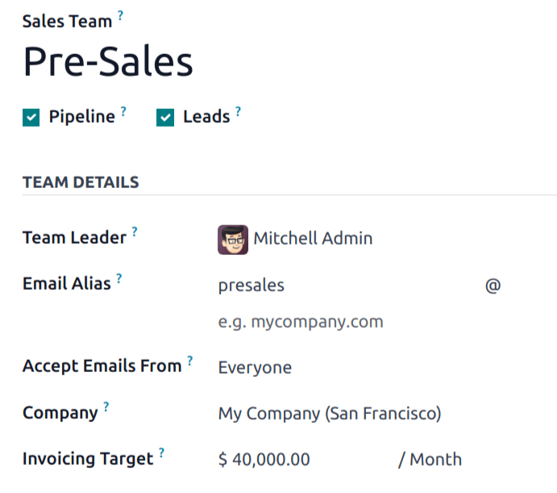
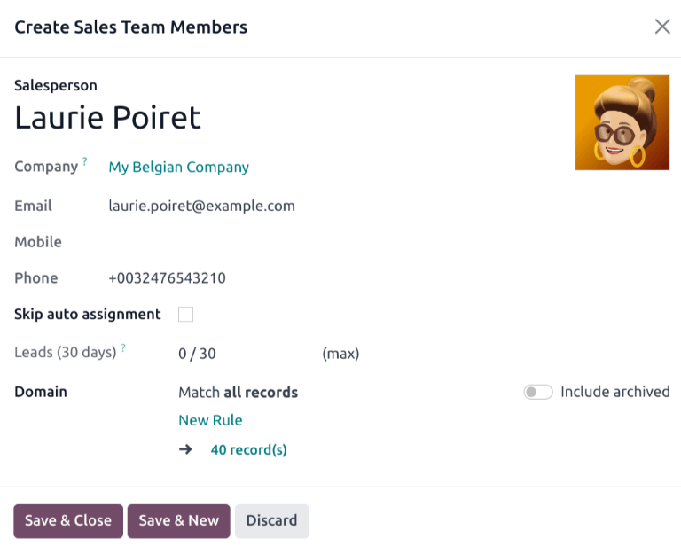
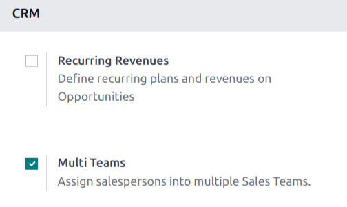
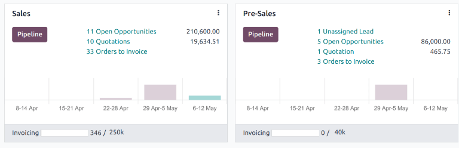

# Savdo jamoalarini boshqarish

Odoo ning *CRM* ilovasi ichidagi *Savdo jamoalari* funksiyasi bir nechta 
savdo jamoalarini yaratish va boshqarishga imkon beradi, ularning har birida 
o'z tayinlash qoidalari, fakturalash maqsadlari va sotuvchilar ro'yxati mavjud.

## Savdo jamoasini yaratish

Yangi savdo jamoasini yaratish uchun 
`CRM ilovasi ‣ Konfiguratsiya ‣ Sales Teams` ga o'ting, 
keyin `New` tugmasini bosing.

Bo'sh savdo jamoasi formasida `Sales Team` 
maydoniga nom kiriting.

Keyin ochiladigan ro'yxatdan `Team Leader` ni tanlang.

Bu savdo jamoasi uchun o'sha noyob elektron pochta manziliga 
xabar yuborilganida avtomatik ravishda mijoz/imkoniyat yaratish 
uchun `Email Alias` o'rnating. 
`Everyone`, `Authenticated Partners`, 
`Followers Only` yoki 
`Authenticated Employees` dan elektron pochta 
qabul qilishni tanlang.

Bu jamoani tayinlash uchun ochiladigan menyudan 
`Company` ni tanlang.

::: tip

`Company` maydoni faqat ko'p kompaniyali 
ma'lumotlar bazalarida ko'rinadi va majburiy emas.
::::

::: tip

Agar ma'lumotlar bazasida *Sales* ilovasi o'rnatilgan bo'lsa, 
savdo jamoasi formasida `Invoicing Target` 
maydoni paydo bo'ladi. Bu joriy oy uchun daromad maqsadi. 
Bu maydonga kiritilgan miqdor `savdo jamoasi boshqaruv paneli` 
dagi fakturalash jarayoni satrini to'ldirish uchun ishlatiladi.
::::

### Savdo jamoasi a'zolarini qo'shish

Jamoa a'zolarini qo'shish uchun savdo jamoasining konfiguratsiya 
sahifasini tahrirlayotganda `Members` tab 
ostida `Add` tugmasini bosing. Bu 
`Create Sales Team Members` popup oynasini ochadi.

::: tip

Agar *CRM* ilovasining *Settings* sahifasida 
`Rule-Based Assignment` funksiyasi **yoqilmagan** bo'lsa, 
`Members` tab ostidagi `Add` 
tugmasini bosish `Add: Salespersons` 
popup oynasini ochadi. Jamoaga qo'shilishi kerak bo'lgan 
sotuvchining eng chap tomonidagi katak belgisini belgilang, 
keyin `Select` tugmasini bosing.

::::

Ularni jamoaga qo'shish uchun `Salesperson` 
ochiladigan ro'yxatidan foydalanuvchini tanlang. Bu sotuvchiga 
mijozlar avtomatik tayinlanishini oldini olish uchun 
`Skip auto assignment` katak belgisini belgilang. 
Agar bu funksiya faollashtirilsa, sotuvchiga hali ham 
mijozlar qo'lda tayinlanishi mumkin.

`Leads (30 days)` maydoni sotuvchiga 
so'nggi o'ttiz kun ichida bu jamoa uchun nechta mijoz 
tayinlanganini va ularga qancha mijoz tayinlanishi kerakligini 
kuzatib boradi. Bu sotuvchiga tayinlanishi mumkin bo'lgan 
mijozlarning maksimal sonini tahrirlash uchun 
`Leads (30 days)` maydoniga 
o'sha miqdorni kiriting.

::: tip

`Domain` bo'limi yordamida alohida 
sotuvchilar uchun `tayinlash qoidalari` 
sozlanishi mumkin.
::::

Tugagach `Save & Close` tugmasini bosing 
yoki qo'shimcha a'zolar qo'shish uchun 
`Save & New` tugmasini bosing.

## Ko'p jamoalarni yoqish

Sotuvchilarni bir nechta savdo jamoasiga tayinlash imkonini berish 
uchun *Multi Teams* sozlamasi yoqilishi kerak. Avval 
`CRM ilovasi ‣ Konfiguratsiya ‣ Settings` ga o'ting. 
`CRM` bo'limi ostida `Multi Teams` 
deb belgilangan katak belgisini belgilang. Keyin sahifaning 
yuqori chap tomonidagi `Save` tugmasini bosing.

## Savdo jamoasi boshqaruv paneli

Savdo jamoasi boshqaruv panelini ko'rish uchun 
`CRM ilovasi ‣ Savdo ‣ Teams` ga o'ting. 
Foydalanuvchi a'zosi bo'lgan har qanday jamoa 
boshqaruv panelida ko'rinadi.

Har bir Kanban kartasi savdo jamoasining ochiq imkoniyatlari, 
kotirovkalari, savdo buyurtmalari va kutilayotgan daromadi, 
shuningdek haftada yangi imkoniyatlarning ustunli diagrammasi 
va fakturalash jarayoni satrining umumiy ko'rinishini beradi.

O'sha jamoaning *CRM* konveyeriga to'g'ridan-to'g'ri o'tish 
uchun `Pipeline` tugmasini bosing.

Ochiladigan menyuni ochish uchun Kanban kartasining yuqori 
o'ng burchagidagi `fa-ellipsis-v` 
`(vertikal ellipsis)` belgisini bosing. Keyin jamoaning 
sozlamalarini ko'rish yoki tahrirlash uchun 
`Configuration` tugmasini bosing.