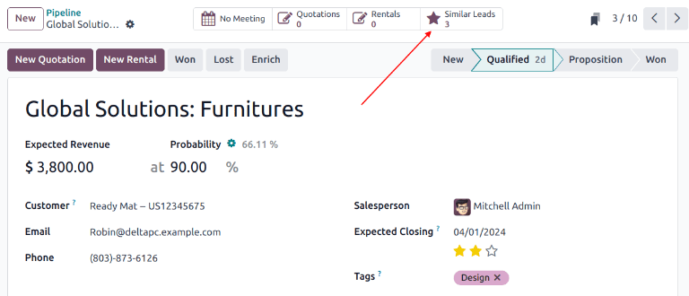
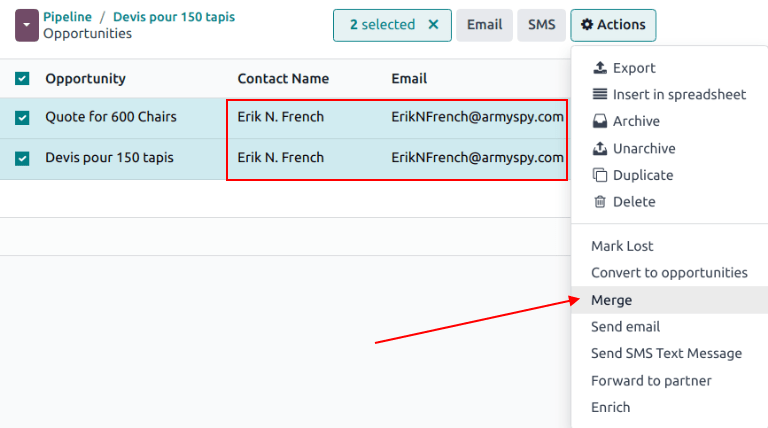

# O'xshash mijozlar va imkoniyatlarni birlashtirish

Odoo *CRM* ilovasi ichida o'xshash *mijozlar* va *imkoniyatlarni* 
avtomatik ravishda aniqlaydi. Bu takrorlangan yozuvlarni aniqlash 
ularni birlashtirish jarayonida hech qanday ma'lumot yo'qotmasdan 
birlashtirishga imkon beradi. Bu nafaqat *konveyerni* tartibli 
saqlashga yordam beradi, balki mijozlarga bir nechta sotuvchi 
tomonidan murojaat qilinishining oldini oladi.

::: tip

Imkoniyatlarni birlashtirishda hech qanday ma'lumot yo'qolmaydi. 
Boshqa imkoniyatdan olingan ma'lumotlar suhbatda qayd etiladi 
va ma'lumotnoma uchun ma'lumot maydonlarida saqlanadi.
::::

## O'xshash mijozlar va imkoniyatlarni aniqlash

O'xshash mijozlar va imkoniyatlar bog'langan kontaktning 
*elektron pochta manzili* va *telefon raqami* ni solishtirish 
orqali aniqlanadi. Agar o'xshash mijoz/imkoniyat topilsa, 
mijoz (yoki imkoniyat) yozuvining yuqori qismida 
*Similar Leads* aqlli tugmasi paydo bo'ladi.

### O'xshash mijozlar va imkoniyatlarni solishtirish

O'xshash mijozlar/imkoniyatlarning tafsilotlarini solishtirish uchun 
`CRM ilovasi ‣ Pipeline` yoki 
`CRM ilovasi ‣ Leads` ga o'ting. Mijoz yoki 
imkoniyatni oching va `Similar Leads` 
aqlli tugmasini bosing. Buni qilish faqat o'xshash 
mijozlar/imkoniyatlarni ko'rsatadigan Kanban ko'rinishini ochadi. 
Mijoz/imkoniyat tafsilotlarini ko'rish uchun kartaga bosing 
va ularni birlashtirishni tasdiqlang.

## O'xshash mijozlar va imkoniyatlarni birlashtirish

::: warning

Birlashtirishda Odoo tizimda birinchi yaratilgan mijoz/imkoniyatga 
ustunlik beradi va ma'lumotlarni birinchi yaratilgan 
mijoz/imkoniyatga birlashtiradi. Biroq, agar mijoz va imkoniyat 
birlashtirilayotgan bo'lsa, natijada hosil bo'lgan yozuv 
qaysi yozuv birinchi yaratilganidan qat'i nazar imkoniyat 
deb ataladi.
::::

Mijozlar/imkoniyatlar birlashtirilishi kerakligini tasdiqlagandan 
so'ng, breadcrumb havolasi yordamida yoki 
`Similar Leads` aqlli tugmasini bosish 
orqali Kanban ko'rinishiga qayting. Ro'yxat ko'rinishiga 
o'tish uchun `oi-view-list` `(list)` 
belgisini bosing.

Birlashtirilishi kerak bo'lgan mijozlar/imkoniyatlar uchun 
sahifaning chap tomonidagi katakni belgilang. Keyin sahifaning 
yuqori qismidagi `fa-cog` `Actions` 
belgisini bosib ochiladigan menyuni ochib ko'rsating. 
O'sha ochiladigan menyudan tanlangan imkoniyatlar yoki 
mijozlarni birlashtirish uchun `Merge` 
variantini tanlang.

`fa-cog` `Actions` ochiladigan menyusidan 
`Merge` tanlanganda, `Merge` popup 
modali paydo bo'ladi. O'sha popup modalda 
`Assign opportunities to` sarlavhasi 
ostida tegishli ochiladigan menyulardan 
`Salesperson` va `Sales Team` ni tanlang.

O'sha maydonlarning ostida birlashtirilishi kerak bo'lgan 
mijozlar/imkoniyatlar ularning tegishli ma'lumotlari bilan 
birga ro'yxatlangan. Tanlangan mijozlar/imkoniyatlarni 
birlashtirish uchun `Merge` tugmasini bosing.

:::: danger

Birlashtirish qaytarib bo'lmaydigan harakat. Agar ular 
birlashtirilishi kerakligiga mutlaqo ishonch komil bo'lmasangiz, 
mijozlar/imkoniyatlarni birlashtir**mang**.
::::

## Mijozlar/imkoniyatlar qachon birlashtirilmasligi kerak

O'xshash mijoz yoki imkoniyat aniqlanganida, lekin 
birlashtiril*masligi* kerak bo'lgan holatlar bo'lishi mumkin. 
Bu holatlar savdo jamoasi va tashkilotning jarayonlariga 
asoslangan holda farq qiladi. Ba'zi mumkin bo'lgan 
stsenariylar quyida keltirilgan.

### Yo'qotilgan mijozlar

Agar mijoz/imkoniyat `yo'qotilgan` 
deb belgilangan bo'lsa, u hali ham faol mijoz yoki 
imkoniyat bilan birlashtirilishi mumkin. Natijada 
mijoz/imkoniyat faol deb belgilanadi va konveyerga qo'shiladi.

### Tashkilot ichidagi turli kontaktlar

Bir xil tashkilotdan kelgan, ammo turli aloqa nuqtalari 
bo'lgan mijozlar/imkoniyatlar bir xil ehtiyojlarga ega 
bo'lmasligi mumkin. Bu holda bu yozuvlarni birlashtirishlik 
foydali emas, garchi bir xil sotuvchi yoki savdo jamoasini 
tayinlash takroriy ish va noto'g'ri tushunishlarning 
oldini olishi mumkin.

### Bir nechta sotuvchi bilan mavjud dublikatlar

Agar ma'lumotlar bazasida bir nechta mijoz/imkoniyat mavjud 
bo'lsa, ularga bir nechta sotuvchi tayinlangan bo'lishi 
mumkin va ular mustaqil ravishda ish olib borishadi. 
Bu mijozlar/imkoniyatlar alohida boshqarilishi kerak 
bo'lsa-da, ta'sirlangan barcha sotuvchilar ko'rinish 
uchun ichki yozuvda belgilanishi tavsiya etiladi.

### Aloqa ma'lumotlari o'xshash, ammo aniq emas

O'xshash mijozlar va imkoniyatlar bog'langan kontaktlarning 
elektron pochta manzillari va telefon raqamlarini solishtirish 
orqali aniqlanadi. Biroq, agar elektron pochta manzili 
*o'xshash*, lekin *aniq* bo'lmasa, ular mustaqil qolishi 
kerak bo'lishi mumkin.

::: example
Uch xil mijoz konveyerga qo'shildi va turli sotuvchilarga 
tayinlandi. Ular kontaktlarning elektron pochta manzillari 
tufayli *O'xshash mijozlar* deb aniqlandi.

Mijozlarning ikkitasi bir xil shaxs bo'lgan [Robin] dan 
kelganga o'xshaydi va bir xil elektron pochta manzillariga 
ega. Bu mijozlar birlashtirilishi kerak.

Uchinchi mijoz bir xil elektron pochta domeniga ega, 
ammo manzil boshqa va kontakt nomi ham boshqa. Bu mijoz 
katta ehtimol bilan bir xil tashkilotdan kelgan bo'lsa-da, 
u boshqa kontaktdan kelgan va birlashtirils**a olmaydi**.

:::