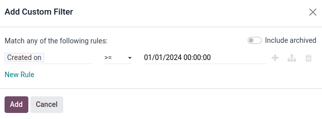
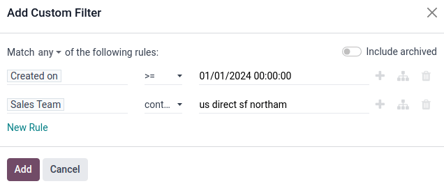
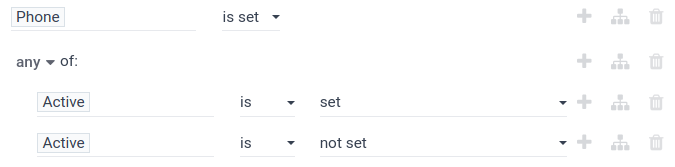

# Potentsial mijozlar taqsimoti hisoboti

*Potentsial mijozlar taqsimoti hisoboti* faol potentsial mijozlarning sotuvchilar o'rtasida adolatli taqsimlanganligini ko'rish uchun ishlatilishi mumkin. Shuningdek, u sifatli potentsial mijozlarning taqsimlanishini ko'rish va har bir sotuvchi qanchalik tez-tez potentsial mijozlarni qabul qilish (va saqlash)ini ko'rish uchun ham foydalaniladi.

Potentsial mijozlar taqsimoti hisobotlari sotuvchilarni yo'lda saqlashga yordam berish uchun har hafta o'tkazilishi mumkin, shu bilan birga ularga etarli miqdorda sifatli potentsial mijozlarni taqdim etadi. Bu hisobotlar, shuningdek, sotuvchilarning samarali faoliyat ko'rsatayotganligini, bitta sotuvchi tomonidan sifatli potentsial mijozlar tez-tez yo'qolayotganligini va sifatli potentsial mijozlarning umumiy necha foizi saqlanayotganligini ko'rish uchun ham ishlatilishi mumkin.

## Potentsial mijozlar taqsimoti hisobotlarini yaratish

Potentsial mijozlar taqsimoti hisobotini yaratish uchun avval `CRM app ‣ Reporting ‣ Pipeline`ga o'ting, bu `Pipeline Analysis` boshqaruv panelini ochadi.

Sahifaning yuqori qismidagi qidiruv satrida barcha standart filtrlarni olib tashlang. Bu barcha potentsial mijozlarga tegishli ma'lumotlarni ko'rsatadi.

Endi `Custom filters` qidiruv satrining o'ng tomonidagi `fa-caret-down` `(pastga yo'nalgan belgi)` belgisini bosish orqali qo'shilishi mumkin, bu qidiruv va filtr variantlarining ochiladigan menyusini ochadi.

Uchta ustun ko'rsatiladi: `Filters`, `Group By` va `Favorites`. Boshlash uchun `Filters` ustunining pastki qismiga o'ting va `Add Custom Filter`ni bosing. Bu `Add Custom Filter` pop-up oynasini ochadi, bu yerda muhim filtrlar birin-ketin qo'shilishi mumkin.

### Muhim filtrlar

Quyidagi filtr shartlari asosiy potentsial mijozlar taqsimoti hisobotini yaratish uchun ishlatiladi. Ular birgalikda ma'lum vaqt oralig'ida yaratilgan, bog'lanish usuli mavjud va sotuvchilar guruhiga tayinlangan barcha potentsial mijozlarni to'playdi.

#### Potentsial mijoz yaratilgan sana

`Match any of the following rules:` ostidagi birinchi maydonni bosing, unda `Country` qiymati mavjud. Paydo bo'lgan popoverda qidiruv satrida [Created on] ni yozing yoki uni topish va tanlash uchun ro'yxatni aylantiring.

Keyin, o'sha qatorning ikkinchi maydonida ochiladigan menyudan `>=` ni tanlang. Bu operator **faqat** uchinchi, eng o'ng maydon qiymatidan katta (yoki teng) qiymatlarni o'z ichiga oladi.

`Add Custom Filter` pop-up oynasining uchinchi maydoni potentsial mijozlar tanlanadigan eng erta sanani o'z ichiga olishi kerak.

Masalan, [01/01/2024 00:00:00] ni belgilash faqat 2024 yilning birinchi kunidan boshlab (shu kunni ham o'z ichiga olgan holda) yaratilgan potentsial mijozlarni o'z ichiga oladi.

#### Sotuvchilar guruhi

Formaga boshqa qator qo'shish uchun `New rule`ni bosing va bu qoida parametri uchun `Sales Team`ni tanlang. Keyin, yangi qoidaning ikkinchi maydonini bosing va ochiladigan menyudan `contains`ni tanlang. Bu operatorni tanlash uchinchi, eng o'ng maydon so'zlarini o'z ichiga olgan har qanday yozuvlarni filtrlaydi.

::: tip

Sotuvchilar guruhi kabi ma'lum oldindan belgilangan, cheklangan tanlovlar uchun `is in` operatori uchinchi maydondan ochiladigan menyu orqali osonroq va aniqroq tanlov qilishga yordam beradi, `contains` operatori bilan birgalikda kelgan matn maydoni maydonida xato yoki noto'g'ri qiymat xavfini kamaytiradi.
::::

Bu uchinchi maydonga hisobotga kiritilishi kerak bo'lgan sotuvchilar guruhi(lari)ning nomini kiriting. Barcha `contains` argument qiymatlari etarlicha aniq va Odoo-da mavjud bo'lganicha to'g'ri yozilishi muhim, aks holda bu bir nechta (yoki nol) qiymatlarni qaytarish xavfini tug'diradi.

::: warning

Formaga bir nechta qoida qo'shish orqali barcha filtrlar ustidagi pop-up oynasining yuqori qismida `any` `fa-caret-down` yoki `all` `fa-caret-down` shartlardan qaysi biri mos kelishi kerakligini belgilash uchun yangi variant paydo bo'ladi. Bu farq to'g'ri belgilanishi muhim, chunki u filtrlarning ma'lumotlarni qaytarish mantiqiga ta'sir qiladi.
::::

Standart `any` `fa-caret-down` menyu elementini bosing va uning o'rniga `all` `fa-caret-down` variantini tanlang. Bu sozlama **faqat** forma ichidagi *barcha* qoidalarga mos keladigan yozuvlarni ko'rsatadi.

#### Bog'lanish usuli

::: tip

Quyidagi ko'rsatma zarur emas, ammo hisobotning qidiruv mezonlariga belgilangan aloqa qiymatini qo'shish juda tavsiya etiladi. Ko'plab spam, takroriy yoki past sifatli potentsial mijozlarni hisobotdan oddiy ravishda `Phone` yoki `Email` qoidasini qo'shish orqali chiqarib tashlash mumkin.
::::

Formaga yana bir `New rule` qo'shing va birinchi maydonni `Phone`ga o'rnating. Keyin, ikkinchi maydondagi ochiladigan menyudan `is set`ni tanlang. Bu operatorni tanlash **faqat** potentsial mijoz bilan bog'langan telefon raqami mavjud yozuvlarni filtrlaydi.

Muqobil ravishda (yoki yuqoridagi qoidaga qo'shimcha), `New rule`ni bosing va birinchi maydonni `Email`ga o'rnating. Keyin, ikkinchi maydondagi ochiladigan menyudan `is set`ni tanlang.

Bu qoidalar hisobotga faqat bog'lanish usuli mavjud potentsial mijozlarni qo'shadi.

#### Faol holat

[Phone is set] qatorining o'ng tomonidagi `fa-sitemap` `(Add branch)` belgisini bosing, yuqoridagi qoidalardan shoxlanuvchi yangi qoida qo'shish uchun.

`any` `fa-caret-down` `of:` variantini ko'rsatgan chiziq ostida ikkita gorizontal maydon to'plami paydo bo'ladi. Bu sozlama ichidagi **har qanday** qoidalarga mos keladigan yozuvlarni filtrlaydi. Bu OR ([\|]) mantiqiy operatori bilan bir xil mantiqdan foydalanadi.

Birinchi maydonni `Active`ga o'rnating. Keyin, keyingi maydondan `is set`ni tanlang.

Keyin, `Active is set` yonidagi `fa-plus` `(Add New Rule)` tugmasini bosing, uning ostida yangi maydon qatori yaratish uchun.

Birinchi maydonni `Active`ga o'rnating. Keyin, keyingi maydondan `is not set`ni tanlang.

Bu qoida hisobotga potentsial mijozning faollik holatini qo'shadi.

::: tip

Faol holat potentsial mijozlar taqsimoti hisobotini yaratishda muhim filtr hisoblanadi, chunki u hisobotda g'alaba qozongan/yutqazgan yoki faol/nofaol holatidan qat'i nazar **barcha** potentsial mijozlarni o'z ichiga oladi. Bu har bir sotuvchiga tayinlangan barcha potentsial mijozlarning keng qamrovli ko'rinishini beradi.
::::

#### Guruh bo'yicha

Barcha filtrlar o'rnatilgandan so'ng, bu filtrlarni qidiruv satriga qo'shish uchun `Add` tugmasini bosing. Hisobotni tegishli tarzda guruhlash uchun qidiruv satrining o'ng tomonidagi `fa-caret-down` `(pastga yo'nalgan belgi)` belgisini bosing va `Group By` bo'limida `Salesperson`ni bosing. Endi barcha natijalar har bir potentsial mijozga tayinlangan sotuvchi bo'yicha guruhlangan.

Filtr qoidalari o'rnatilgach, maxsus filtrni saqlash va pop-up menyuni yopish uchun pop-up menyusining pastki qismidagi binafsha `Confirm` tugmasini bosing.

`Pipeline Analysis` boshqaruv paneli endi qidiruv satrida har bir filtr qoidasi bilan qayta ko'rsatiladi.

Hisobotni ustunli grafik sifatida ko'rish uchun qidiruv satrining o'ng tomonidagi `fa-area-chart` `(Graph)` belgisini bosing. Muqobil ravishda, potentsial mijozlarni guruhlangan ro'yxat sifatida ko'rish uchun `oi-view-list` `(List)` belgisini bosing.

::: tip

Filtrni saqlash uchun, shunda uni osonlik bilan qayta qo'llash mumkin bo'ladi, qidiruv satrining ochiladigan menyusining `Favorites` bo'limidagi `Save current search` tugmasini bosing.

Keyin, quyidagi matn maydoniga filtr uchun nom yozing. Filtrni pipeline-ga kirish huquqi bor har qanday foydalanuvchi bilan baham ko'rish uchun `Shared` katagini belgilang. Nihoyat, filtrni saqlash uchun quyidagi binafsha `Save` tugmasini bosing.

Filtr endi ochiladigan menyusining `Favorites` bo'limida berilgan nom bilan ko'rinadi va uni bosish orqali qayta qo'llanilishi mumkin.
::::

### Sifatli potentsial mijozlar uchun filtr

Quyidagi qo'shimcha shartlar sifatli potentsial mijozlarni topish uchun *yaxshi*, ammo *to'liq emas* qoidalar to'plamining namunasi sifatida taqdim etiladi. Bu filtrlar juda batafsil filtrga erishish uchun belgilangan tartibda `crm/track_leads/essential-filters` ustiga qo'llanilishi kerak.

- **Referred-by:** Tavsiya bo'yicha filtrlash, masalan, uchrashuv yoki sotuvchi tomonidan.
- **Source:** Maxsus manba UTMlari bo'yicha filtrlash, masalan, Facebook yoki LinkedIn.
- **Notes:** Ichki eslatmalar bo'yicha filtrlash.
- **Tags:** Kategorial teglar bo'yicha filtrlash.
- **Email:** Maxsus elektron pochta domenlari bo'yicha filtrlash, masalan, gmail.com yoki yahoo.com.
- **Salesperson:** Ma'lum sotuvchilar bilan bog'liq potentsial mijozlar bo'yicha filtrlash.

Bu shartlar hisobotda kerakli ma'lumotlarga eng mos kelishi uchun qo'shilishi, olib tashlanishi yoki o'zgartirilishi mumkin.