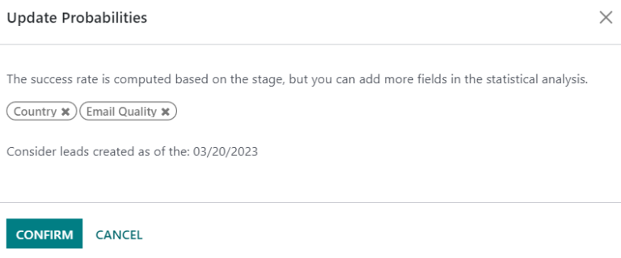
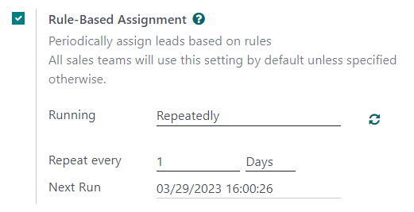
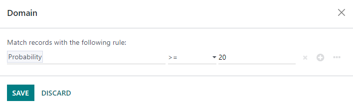

# Bashoratli potentsial mijozlar baholash orqali potentsial mijozlarni tayinlash

Odoo *CRM* ilovasi potentsial mijozlar/imkoniyatlarni sotuvchilar guruhlariga va sotuvchilariga avtomatik tarzda tayinlay oladi. Standart amaliyot potentsial mijozlarni har bir potentsial mijozni yutib olish ehtimolligiga asoslangan holda tayinlashdir. Kompaniyalar muvaffaqiyatli bitimlar bilan yakunlanish ehtimoli yuqori bo'lgan potentsial mijozlarni tegishli sotuvchilarga tezda tayinlash orqali ularga ustuvorlik berishi mumkin.

Odoo *bashoratli potentsial mijozlar baholash* deb ataladigan usul yordamida har bir potentsial mijozni yutib olish ehtimolligini avtomatik tarzda hisoblab chiqadi.

## Bashoratli potentsial mijozlar baholash

Bashoratli potentsial mijozlar baholash - bu Odoo *CRM*dan tarixiy ma'lumotlardan foydalanib ochiq potentsial mijozlar/imkoniyatlarni baholash uchun ishlatiladigan mashinani o'rgatish modeli.

Kompaniya CRM pipeline orqali imkoniyatlarni qayta ishlash jarayonida, Odoo qaysi imkoniyatlar yutilgan va yo'qotilganligiga doir ma'lumotlarni to'playdi. Bashoratli potentsial mijozlar baholash bu ma'lumotlardan har bir yangi potentsial mijoz yoki imkoniyatni yutib olish ehtimolligini bashorat qilish uchun foydalanadi.

CRM pipeline orqali ko'proq imkoniyatlar yuborilgan sari, Odoo ko'proq ma'lumot to'playdi, natijada ehtimolliklar aniqroq bo'ladi.

Aniq aytganda, Odoo-ning bashoratli potentsial mijozlar baholash tizimi *naive Bayes* ehtimollik modelidan foydalanadi:

$$P(A | B) = \frac{P(B | A) \cdot P(A)}{P(B)}$$

Tenglamani tushuntirish:

- P(A|B) = *Bu holatda* muvaffaqiyatli potentsial mijoz ehtimolligi
- P(A) = Shartlardan qat'i nazar potentsial mijozning muvaffaqiyatli bo'lishining umumiy ehtimolligi
- P(B|A) = Potentsial mijoz muvaffaqiyatli bo'lganida bu holatning ehtimolligi
- P(B) = Bu holatning ehtimolligi

*Bu holatda* atamasi Odoo-da potentsial mijozning muvaffaqiyatli bo'lishiga ta'sir qilishi mumkin bo'lgan o'zgaruvchilarni anglatadi. Bu tayinlangan Sotuvchi, potentsial mijozning manbai, potentsial mijozning tili va boshqa tarixiy va demografik ma'lumotlar kabi o'zgaruvchilarni o'z ichiga olishi mumkin.

Bu hisobda qaysi o'zgaruvchilar hisobga olinishi har bir biznesning ehtiyojlariga moslash uchun `sozlanishi` mumkin.

Har bir imkoniyatning muvaffaqiyat ehtimolligi imkoniyat formasida ko'rsatiladi va imkoniyat CRM pipeline orqali rivojlanishi bilan avtomatik yangilanadi.

Imkoniyat keyingi bosqichga o'tganda, uning muvaffaqiyat ehtimolligi bashoratli potentsial mijozlar baholash algoritmiga muvofiq avtomatik ravishda oshadi.

### Konfiguratsiya

Bashoratli potentsial mijozlar baholash Odoo *CRM*da doimo faol. Biroq, muvaffaqiyat ehtimolligini hisoblash uchun ishlatiladigan o'zgaruvchilar sozlamalarda moslashtirilishi mumkin.

Bashoratli potentsial mijozlar baholash tomonidan ishlatiladigan o'zgaruvchilarni moslashtirishh uchun `CRM ‣ Configuration ‣ Settings`ga o'ting. `Predictive Lead Scoring` ostida `Update Probabilities` tugmasini bosing.

Keyin, bashoratli potentsial mijozlar baholash xususiyati qaysi o'zgaruvchilarni hisobga olishini tanlash uchun ochiladigan menyuni bosing.

Quyidagi o'zgaruvchilarning istalgan soni faollashtirilishi mumkin:

- `State`: imkoniyat kelib chiqadigan geografik viloyat
- `Country`: imkoniyat kelib chiqadigan geografik mamlakat
- `Phone Quality`: imkoniyat uchun telefon raqami ko'rsatilgan yoki yo'qligi
- `Email Quality`: imkoniyat uchun elektron pochta manzili ko'rsatilgan yoki yo'qligi
- `Source`: imkoniyatning manbai (masalan, qidiruv tizimi, ijtimoiy media)
- `Language`: imkoniyatda ko'rsatilgan og'zaki til
- `Tags`: imkoniyatga qo'yilgan teglar

::: tip

[Stage] va [Team] o'zgaruvchilari doimo ta'sirda. [Stage] imkoniyat joylashgan CRM pipeline bosqichini anglatadi. [Team] imkoniyatga tayinlangan sotuvchilar guruhini anglatadi. Bashoratli potentsial mijozlar baholash qaysi ixtiyoriy o'zgaruvchilar tanlanganidan qat'i nazar, *doimo* bu ikki o'zgaruvchini hisobga oladi.
::::

Keyin, bashoratli potentsial mijozlar baholash o'z hisoblarini boshlaydigan sanani tanlash uchun `Consider leads created as of the:` variantining yonidagi sana maydonini bosing.

Nihoyat, o'zgarishlarni saqlash uchun `Confirm`ni bosing.

### Ehtimollikni qo'lda o'zgartirish

Imkoniyatning muvaffaqiyat ehtimolligi imkoniyat formasida qo'lda o'zgartirilishi mumkin. Uni tahrirlash uchun ehtimollik raqamini bosing.

::: warning

Ehtimollikni qo'lda o'zgartirish o'sha imkoniyat uchun avtomatik ehtimollik yangilanishini bekor qiladi. Ehtimollik imkoniyat pipeline-ning har bir bosqichidan o'tganda endi avtomatik yangilanmaydi.
::::

Avtomatik ehtimollikni qayta faollashtirish uchun ehtimollik foizining yonidagi tishli g'ildirak belgisini bosing.

## Ehtimollikka asoslangan potentsial mijozlarni tayinlash

Odoo *CRM* belgilangan qoidalar asosida potentsial mijozlar/imkoniyatlarni sotuvchilar guruhlariga va sotuvchilariga tayinlay oladi. Bitimlar bilan yakunlanish ehtimoli yuqori bo'lganlarga ustuvorlik berish uchun potentsial mijozlarning muvaffaqiyat ehtimolligiga asoslangan tayinlash qoidalarini yarating.

### Qoidalarga asoslangan tayinlashni sozlash

*Qoidalarga asoslangan tayinlash*ni faollashtirish uchun `CRM ‣ Configuration ‣ Settings`ga o'ting va `Rule-Based Assignment`ni faollashtiring.

Qoidalarga asoslangan tayinlash xususiyati `Manually`, ya'ni Odoo foydalanuvchisi tayinlashni qo'lda ishga tushirishi kerak, yoki `Repeatedly`, ya'ni Odoo tanlangan vaqt davriga muvofiq tayinlashni avtomatik ishga tushirishi uchun o'rnatilishi mumkin.

Avtomatik potentsial mijozlar tayinlashini o'rnatish uchun `Running` bo'limi uchun `Repeatedly`ni tanlang. Keyin, `Repeat every` bo'limida Odoo avtomatik tayinlashni qanchalik tez-tez ishga tushirishini moslang.

Agar qoidalarga asoslangan tayinlash `Repeatedly` ishga tushirilsa, tayinlash `Rule-Based Assignment` sozlamalaridagi dumaloq o'q belgisi yordamida (yoki sotuvchilar guruhi konfiguratsiya sahifasidagi `Assign Leads` tugmasi yordamida) hali ham qo'lda ishga tushirilishi mumkin.

### Tayinlash qoidalarini sozlash

Keyin, har bir sotuvchilar guruhi va/yoki sotuvchi uchun *tayinlash qoidalarini* sozlang. Bu qoidalar Odoo qaysi potentsial mijozlarni qaysi odamlarga tayinlashini belgilaydi. Boshlash uchun `CRM ‣ Configuration ‣ Sales Teams`ga o'ting va sotuvchilar guruhini tanlang.

Sotuvchilar guruhi konfiguratsiya formasida, `Assignment Rules` ostida, Odoo ushbu sotuvchilar guruhi uchun potentsial mijozlarni tayinlashni aniqlash uchun foydalanadigan qoidalarni sozlash uchun `Edit Domain`ni bosing. Qoidalar bu kompaniya yoki guruh uchun tegishli bo'lishi mumkin bo'lgan har qanday narsani o'z ichiga olishi mumkin va istalgan miqdordagi qoidalar qo'shilishi mumkin.

Tayinlash qoidalarini yaratishni boshlash uchun `Add Filter`ni bosing. Boshqa qator qo'shish uchun tayinlash qoidasining o'ng tomonidagi `+` belgisini bosing. Qatorni olib tashlash uchun `x` belgisini bosing.

Imkoniyatning muvaffaqiyat ehtimolligiga asoslangan tayinlash qoidasini yaratish uchun tayinlash qoidasi qatorining eng chap ochiladigan menyusini bosing va `Probability`ni tanlang.

O'rta ochiladigan menyudan kerakli tenglama belgisini tanlang - ehtimol *katta*, *kichik*, *katta yoki teng*, yoki *kichik yoki teng* belgisi.

Eng o'ng bo'shliqqa ehtimollikning kerakli raqam qiymatini kiriting. Nihoyat, o'zgarishlarni saqlash uchun `Save`ni bosing.

::: example
Sotuvchilar guruhi 20% yoki undan yuqori muvaffaqiyat ehtimolligiga ega potentsial mijozlarni olishi uchun tayinlash qoidasini sozlash uchun quyidagicha o'qiladigan `Domain` qatorini yarating: [Probability >= 20].

:::

Alohida guruh a'zolari uchun ham alohida tayinlash qoidalari sozlanishi mumkin. Sotuvchilar guruhi konfiguratsiya sahifasidan `Members` oynasida guruh a'zosini bosing, keyin `Domain` bo'limini tahrirlang. O'zgarishlarni saqlash uchun `Save`ni bosing.

Agar sozlamalarda avtomatik potentsial mijozlar tayinlash sozlangan bo'lsa, sotuvchilar guruhi ham, alohida guruh a'zolari ham `Skip auto assignment` variantiga ega. Ma'lum sotuvchilar guruhini yoki sotuvchini Odoo-ning qoidalarga asoslangan tayinlash xususiyati tomonidan avtomatik tarzda potentsial mijozlar tayinlanishidan chiqarib tashlash uchun bu katagini belgilang. Agar `Skip auto assignment` faollashtirilsa, sotuvchilar guruhi yoki sotuvchi hali ham qo'lda potentsial mijozlar tayinlanishi mumkin.

Ushbu sotuvchilar guruhiga qo'lda potentsial mijozlar tayinlash uchun sotuvchilar guruhi konfiguratsiya sahifasining yuqori qismidagi `Assign Leads` tugmasini bosing. Bu hozirda tayinlanmagan va ushbu guruhning belgilangan domeniga mos keladigan har qanday potentsial mijozlarni tayinlaydi.