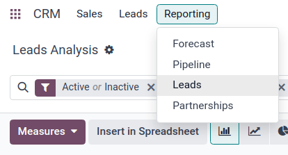

# Marketing atribusiyasi hisobotlari

Odoo *CRM* ilovasidan *marketing atribusiyasi hisoboti*ni tuzish uchun foydalaning, bu hisobot potentsial mijozlar manbasini tahlil qiladi va ularni marketingning potentsial mijozlarni yaratish, atribusiya, g'alaba darajasi va boshqalarga umumiy ta'sirini hisoblash maqsadida guruhlaydi.

## Potentsial mijozlar tahlili boshqaruv paneli

`CRM app ‣ Reporting ‣ Leads`ga o'tish orqali `Leads Analysis` boshqaruv paneliga o'tishdan boshlang.

::: tip

Hisobotlar `CRM app ‣ Leads` boshqaruv panelida ham o'tkazilishi mumkin, bu **faqat** *Settings* sahifasida *Leads* xususiyati faollashtirilgan bo'lsa kirish mumkin.

Agar *Leads* xususiyati **faollashtrilmagan** bo'lsa, `CRM app ‣ Sales ‣ My Pipeline` boshqaruv paneli ham hisobotlarni o'tkazish uchun ishlatilishi mumkin.

Ikkala boshqaruv paneli ham atribusiya hisobotini o'tkazish uchun zarur bo'lgan *Filters* va *Group By* mezonlarini o'z ichiga oladi.
::::

`fa-area-chart` `(grafik)` ko'rinishi sukut bo'yicha ko'rsatiladi, `Search...` satridagi `Active or Inactive` va `Created on: [current year]` filtrlari faol. Grafik tasvirda har oy va sotuvchilar guruhi bo'yicha yaratilgan potentsial mijozlar soni ko'rsatiladi, har bir sotuvchilar guruhi har oy uchun o'z rangiga ega.

Ko'rinishni `oi-view-list` `(ro'yxat)` variantiga o'zgartiring, boshqaruv panelining yuqori-o'ng qismida joylashgan tegishli belgini bosish orqali. Bu potentsial mijozlarni *Group By* parametrlari tomonidan belgilangan guruhlashda osonlik bilan ko'rsatish imkonini beradi.

## UTM parametrlarini qo'shish

*Urchin Tracking Modules (UTMlar)* - bu tashrif buyuruvchilar ma'lumotlarini kuzatish uchun ishlatiladigan URL-larga kiritilgan matn parchalari. Bu tashrif buyuruvchi havolaga qanday yetganligiga oid parametrlarni, masalan, tashrif qilingan veb-sayt turini va/yoki tashrif kelgan marketing kampaniyasini o'z ichiga oladi.

Odoo bu UTMlarni marketing kampaniyalarining ko'rsatkichlari va samaradorligini kuzatish uchun marketing atribusiyasi hisobotida parametr sifatida ishlatishi mumkin.

### UTMlarni yaratish

Odoo-dagi `link tracker` UTMlarni yaratish va sozlash uchun ishlatilishi mumkin.

UTMlar `Email Marketing` va `Marketing Automation` ilovalari tomonidan ham avtomatik yaratilishi mumkin.

Marketing atribusiyasi hisobotida ishlatiladigan UTM parametrlari qamrov darajasi bo'yicha kamayish tartibida *Medium*, *Source* va *Campaign*dir.

- *Medium* eng keng qamrovga ega UTM bo'lib, havolaga kirish uchun ishlatiladigan vositani aniqlash uchun ishlatiladi. Bu ijtimoiy media, elektron pochta yoki bir marta bosish narxi (CPC) kabi vositalarni o'z ichiga olishi mumkin.
- *Source* aniqroq bo'lib, trafik manbasini aniqlash uchun ishlatiladi. Masalan, veb-sayt nomi, ishlatiladigan qidiruv tizimi yoki aniq ijtimoiy media platformasi.
- *Campaign* eng aniq bo'lib, aniq marketing kampaniyalarini nom bo'yicha kuzatishi mumkin. Bu tanlov yoki mahsulot nomi, sotuv turi va hokazolarni o'z ichiga olishi mumkin.

## Hisobotlarni yaratish

Hisobotni yaratishni boshlash uchun filtr va guruhlash parametrlari ro'yxatini ko'rish uchun `Search...` satrining o'ng tomonidagi `fa-caret-down` `(pastga o'q)` ni bosing.

Qidiruv variantlarining chap ustunida joylashgan `Filters` faqat filtrga mos keladigan natijalarni saqlash uchun ishlatilishi mumkin. Masalan, `Won` filtrini tanlash atribusiya hisobotida faqat yutilgan potentsial mijozlarni ko'rsatadi.

O'rta ustunda joylashgan `Group By` natijalarni guruhlarga ajratish uchun ishlatiladi va filtrlar bilan yoki ularsiz ishlatilishi mumkin.

::: tip

Bir nechta `Group By` variantlarini belgilash birinchi tanlangan variantga muvofiq ichki guruhlarni yaratadi. Masalan, `Group By` ustunida `Medium`, keyin `Source`, so'ngra `Campaign`ni tanlash barcha natijalarni *birinchi* vosita bo'yicha, *keyin* har bir vositadagi aniq manbalar bo'yicha, so'ngra har bir manbadagi kampaniyalar bo'yicha saralaydi.

Buni `Search...` satrida paydo bo'lgan guruh plitasidagi tanlovlarning yo'nalishi va tartibiga qarab tekshirish mumkin.

::::

::: example
Foydali birinchi hisobot uchun:

1. `Filters` ustunidan hali ham faol deb belgilangan potentsial mijozlarni ko'rish uchun `Active` filtrini tanlang.
2. `Group By` ustunidan (aniq shu tartibda) `Source`ni, keyin qaysi guruhlash ko'proq tegishli bo'lishiga qarab `City` yoki `Country`ni tanlang.

Bu hisobot barcha faol potentsial mijozlarni o'z ichiga oladi, birinchi potentsial mijoz manbasi bo'yicha, keyin har bir potentsial mijoz kelgan shahar yoki mamlakat bo'yicha guruhlangan. Bu joylashuv bo'yicha saralangan faol imkoniyatlarning zichligini ko'rish uchun foydali.

Bu ma'lumotlar bilan konferentsiyalar yoki reklama taxtalar kabi marketing kampaniyalari eng ko'p potentsial daromad keltirayotgan joylarga yo'naltirilishi mumkin. Xuddi shunday, mavjud marketing kampaniyalari kam samarali bo'lgan joylarda targ'ibotni kuchaytirishga ko'proq e'tibor berilishi mumkin.
:::

## Hisobotlarni eksport qilish

Hisobotning o'lchovlarini belgilash uchun `Leads Analysis` boshqaruv panelidagi `oi-view-pivot` `(pivot view)`ga o'tishdan boshlang.

Hisobotning mavjud o'lchovlarini ko'rish uchun `Measures` tugmasini bosing. Ochiladigan menyudan kerakli o'lchovlarni tanlang (bir nechta o'lchovlar tanlanishi mumkin) va o'lchovlar, filtrlar va guruhlarning barchasi pivot jadvalda to'g'ri ko'rsatilganligini tekshiring. Bu ma'lumotlarning eksport qilishga tayyor ekanligini ta'minlaydi.

Ma'lumotlarni .xlsx fayli sifatida ro'yxat shaklida tezda eksport qilish uchun `oi-view-list` `(ro'yxat ko'rinishi)`ga o'ting. Sahifaning yuqori-chap qismidagi `Lead Analysis`ning o'ng tomonida joylashgan `Actions` `fa-cog` `(tishli g'ildirak)` belgisini bosing va `fa-upload` `Export All`ni bosing. Hisobot avtomatik ravishda .xlsx fayli sifatida yuklab olinadi.

Ko'proq eksport variantlari uchun hisobotni Odoo *Documents* ilovasiga eksport qilish mumkin. `Leads Analysis` sahifasining `oi-view-list` `(ro'yxat ko'rinishi)`dan `Actions` `fa-cog` `(tishli g'ildirak)` belgisini yana bosishdan boshlang. Endi `fa-table` `Spreadsheet`ga o'ting va `oi-view-list` `Insert list in spreadsheet`ni bosing. `Select a spreadsheet to insert your list.` nomli pop-up oyna paydo bo'ladi.

Agar kerak bo'lsa, hisobotni [Name of the list] maydonidan foydalanib qayta nomlash mumkin. Hisobotdagi elementlar soni [Insert the first _ records of the list] yorlig'i bilan belgilanishi mumkin. Keyin, yangi `Blank spreadsheet`ni tanlang yoki mavjud elektron jadvalga eksport qiling. Nihoyat, `Confirm` tugmasini bosing.

Hisobotni tashqi elektron jadvallar dasturida foydalanish uchun .xlsx fayli sifatida eksport qilish uchun `Actions` `fa-cog` `(tishli g'ildirak)` belgisini bosing va `fa-upload` `Export All` variantini tanlang. Agar so'ralsa, fayl joyini tanlang, faylni nomlang, keyin `Save`ni bosing.