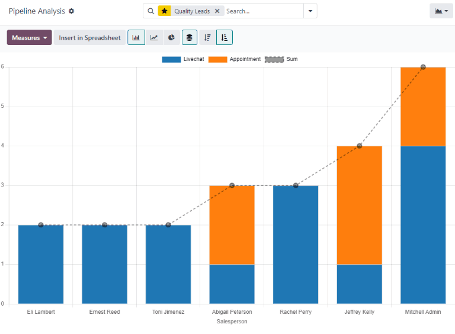
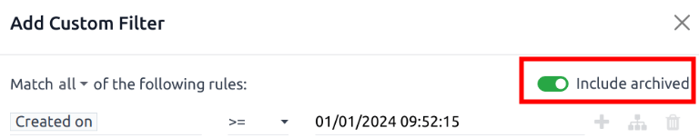
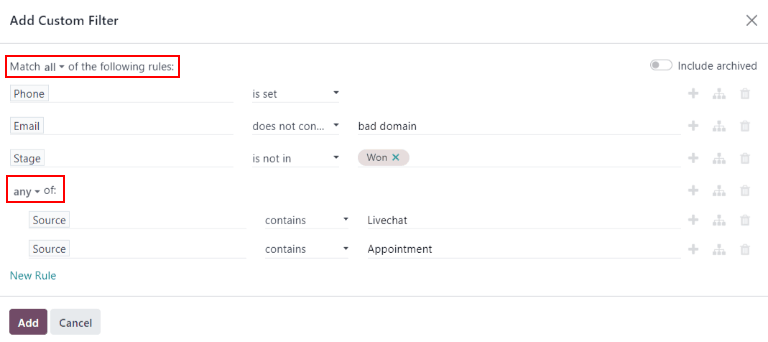
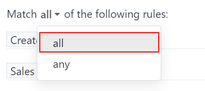

# Sifatli lidlar hisoboti

*Sifatli lid* - bu sotuvga olib kelishi mumkin bo'lgan lid. U sotuvchilarning kelishuvni yakunlashiga yordam beradigan eng keng tarqalgan xususiyatlarga mos kelishi kerak, shuningdek har bir tashkilot uchun maxsus aniq mezonlarga ham javob berishi kerak.

::: tip

*Sifatli lid*ni belgilaydigan aniq mezonlar har bir tashkilot uchun turlicha. Qo'shimcha ma'lumot uchun `Define a quality lead` ga qarang.
::::

Sifatli lidlar *hisoboti* har bir sotuvchi ma'lum vaqt davomida, masalan, so'nggi 30 kun ichida qancha sifatli lid olganliklari haqida ma'lumot beradi. Sotuv menejerlari bunday hisobotdan foydalanib, o'z jamoasiga yangi lidlarni taqsimlashda ko'proq ma'lumotga asoslangan qarorlar qabul qilishlari mumkin.

::: example
Sotuv menejeri o'z kompaniyasining mezonlaridan foydalanib sifatli lidlar hisobotini chiqaradi:

- Lidlar telefon raqami va elektron pochta manzilini o'z ichiga olishi kerak.
- Elektron pochta manzili professional domendan bo'lishi kerak.
- Lid manbai jonli chat suhbati yoki sotuvchi bilan uchrashuvdan kelib chiqqan bo'lishi kerak.

Hisobotni ishga tushirgandan so'ng, menejer hammaning kelishuvni yakunlash qobiliyati turlicha bo'lsa ham, sotuv jamoasining ba'zi a'zolari boshqalardan ko'ra ko'proq sifatli lid olganliklariని ko'rishi mumkin.

Ushbu ma'lumotdan foydalanib, sotuv menejeri hozirda kamroq lidga ega bo'lgan sotuvchilarga ko'proq sifatli lidlar taqsimlashga qaror qilishi mumkin, bu esa sifatli lidlarning taqsimlanishini muvozanatlaydi.
:::

## Sifatli lidlar hisobotini yaratish

Sifatli lidlar hisobotini yaratish uchun avvalo `CRM app ‣ Reporting ‣ Pipeline`ga o'ting va `Pipeline Analysis` boshqaruv panelini oching. Sahifaning yuqori qismidagi `Search...` maydoniga bosing va barcha faol filtrlarni o'chirib tashlang.

`Search...` maydonining o'ng tomonidagi `🔻(pastga yo'nalgan uchburchak)` belgisiga bosing, bu `Filters`, `Group By` va `Favorites` ustunlarini o'z ichiga olgan pastga tushadigan mega menyuni ochadi. `Add Custom Filter`ni bosing. Bu `Add Custom Filter` pop-up oynasini ochadi.

`Add Custom Filter` pop-up oynasi aniqroq filtrlar yaratish imkonini beradi.

### Maxsus filtrlar qo'shish

Sifatli lidlar hisobotini yaratish uchun quyidagi shartlar uchun filtrlar yaratish kerak:

- `Starting date`: natijalarni ma'lum vaqt oralig'ida yaratilganlar bilan cheklaydi.
- `Specific sales teams`: natijalarni faqat bir yoki bir nechta sotuv jamoalari uchun lidlarni o'z ichiga olish bilan cheklaydi. Ushbu filtr ixtiyoriy va agar butun kompaniya uchun mo'ljallangan bo'lsa, uni qo'shmaslik kerak.
- `Exclude unassigned leads`: tayinlanmagan sotuvchisi yo'q lidlarni chiqarib tashlaydi.
- `Include archived leads`: natijalarга faol va nofaol lidlarning ikkalasi ham kiritilishini ta'minlaydi.
- `Add rules for quality leads`: kompaniya yoki sotuv jamoasiga xos mezonlarga asoslanib natijalarni kiritadi yoki chiqarib tashlaydi.

Barcha standart qoidalar konfiguratsiya qilingan Custom Filter pop-up oynasining namunasi.

#### Boshlash sanasi filtrini qo'shish

Avvalo qoidaning parametrini sana oralig'i bilan belgilab, qatorning chap tomonidagi birinchi maydonga bosing va `Search...` maydoniga [Created On] deb yozing yoki menyudagi ro'yxatni aylanib ko'rib uni toping.

Qoidaning operator pastga tushadigan menyusida parametrni quyidagilardan birini tanlab aniqlashtiring:

- `>= (katta yoki teng)` - boshlash sanasini belgilash va ushbu boshlash sanasidan *keyin*gi barcha yozuvlarni kiritish uchun (shuningdek, boshlang'ich qiymatning o'zini ham);
- `is between` - aniq boshlash va tugash sanasi bilan vaqt oralig'ini aniqroq belgilash uchun. Belgilangan boshlash va tugash sanalari oralig'ida joylashgan barcha mos yozuvlar hisobotga kiritiladi.

Ikkala variant bilan ham pop-up kalendarning kun va vaqt tanlash vositalaridan foydalanib, eng o'ng maydondan tegishli sana oralig'ini belgilang. Ushbu qiymatlarni o'rnatish birinchi qoidani yaratishni yakunlaydi.

#### Sotuv jamoasi filtrini qo'shish

::: tip

Ushbu filtr ixtiyoriy. Butun kompaniya uchun natijalarni ko'rish uchun ushbu filtrni **qo'shmang**.
::::

Hisobotning natijalarini bir yoki bir nechta sotuv jamoalari bilan cheklash uchun `New Rule`ni bosing. Keyin yangi qoida uchun birinchi maydonni bosing va `Search...` maydoniga [Sales Team] deb yozing yoki ro'yxatni aylanib ko'rib uni toping.

Qoidaning ikkinchi maydonida pastga tushadigan menyudan `is in`ni tanlang. Ushbu operatorni tanlash natijalarni keyingi maydonida tanlangan sotuv jamoalari bilan cheklaydi.

Nihoyat, uchinchi maydonida pastga tushadigan menyudan kerakli sotuv jamoasini tanlang. Ushbu maydoniga bir nechta jamoa qo'shish mumkin, bu yerda har bir parametr qidiruv mantiqida "yoki" (masalan, "har qanday") operatori bilan ko'rib chiqiladi.

#### Tayinlanmagan lidlarni chiqarib tashlash

Keyin `New Rule` qo'shing. So'ngra yangi qoida uchun birinchi maydonni bosing va `Search...` maydoniga [Salesperson] deb yozing yoki ro'yxatni aylanib ko'rib uni toping.

Qoidaning ikkinchi maydonida pastga tushadigan menyudan `is set`ni tanlang. Ushbu operatorni tanlash ma'lum sotuvchiga tayinlanmagan har qanday lidni chiqarib tashlaydi.

#### Arxivlangan lidlarni kiritish

::: tip

Ushbu filtr ham ixtiyoriy, chunki u hisobotga arxivlangan (nofaol) lidlarni qo'shadi, ammo uni kiritish tavsiya etiladi, chunki u status qat'iy nazarda *barcha* tayinlangan lidlarni hisobotga tortadi. Bu tayinlangan lidlarning aniqroq tasvirini olishni ta'minlaydi. Biroq, faqat faol lidlarni o'z ichiga olgan hisobotni chiqarish uchun ushbu xususiyatni **faollashtirmang**.
::::

Keyin `Add Custom filter` pop-up oynasining yuqori o'ng burchagida `Include archived` tugmasini faol holatga keltiring.

Ushbu xususiyatni yoqish hisobotga arxivlangan (nofaol) lidlarni qo'shadi.

#### Sifatli lidlar uchun qoidalar qo'shish

Ushbu bosqichda qo'shilgan filtrlar tashkilot *sifatli lid*ni qanday aniqlashiga qarab farq qiladi.

##### Sifatli lidni aniqlash

Ilgari ta'riflanganidek, *sifatli lid* - bu yutilgan imkoniyatga olib kelishi mumkin bo'lgan lid. Sifatli lidning aniq mezonlari tashkilotdan tashkilotga farq qilsa ham, ko'pincha ijobiy sotuv natijalariga bog'liq omillar va maxsus tashkilot tomonidan qadrlangan omillarning kombinatsiyasi hisoblanadi.

Umumiy `Quality leads report`da ko'rsatilgan asosiy filtrlar va guruhlash variantlariga qo'shimcha ravishda, sifatli lidni aniqlashda quyidagi filtrlarni ko'rib chiqing:

- `Email` yoki `Phone`: ushbu maydonlardagi ma'lumotlar lidning professional kontakt ekanligini aniqlashga yordam beradi.
- `Source`: ushbu maydon *Live Chat*, *Social Marketing* va *Email Marketing* kabi boshqa Odoo ilovalaridan marketing va lid yaratish sa'y-harakatlari bilan bog'lanadi.
- `Stage`: ushbu filtrdan ma'lum bosqichlarga yetgan lidlarni yo'q qilish yoki nishonga olish uchun foydalanish mumkin.
- `Medium`: lidning manbai uning sifat darajasini ko'rsatishi mumkin, chunki turli kanallar turli yutuq stavkalari va kutilayotgan daromadlarga ega.
- `Campaign`: ushbu filtrni qo'shish yuqori sifatli lidlarni olish uchun turli marketing sa'y-harakatlarining muvaffaqiyatini kuzatishga yordam beradi.
- `Lost Reason`: turli mezonlarga asoslanib sifatli ko'rinadigan, ammo belgilangan sabablarga ko'ra *yo'qotilgan* deb belgilangan lidlarni chiqarib tashlaydi.
- `Tags`: bir yoki bir nechta moslashtirilgan teglar asosida natijalarni kiritadi yoki chiqarib tashlaydi.

::: tip

Maxsus filtrga qoidalar qo'shishda har bir qoidadan oldingi bayonotlarni yodda tuting. Qoida ustidagi bayonot qidiruv natijalarining bayonot ostidagi qoidalarning **barchasiga** mos kelishi kerakligini yoki bayonot ostidagi qoidalarning **har qandayiga** mos kelishi kerakligini belgilaydi.

::::

## Hisobotni ko'rish

::: warning

`Add Custom Filter` formasining yuqori qismida qoidalarning `any` yoki `all`iga mos kelish variantlari mavjud. Hisobotni to'g'ri ishga tushirish uchun faqat quyidagi filtrlarning **barchasiga** mos keladigan yozuvlar kiritilishi kerak. Filtrlarni qo'shishdan oldin ushbu maydonida `all` tanlanganligiga ishonch hosil qiling.

::::

Filtrlar konfiguratsiya qilingandan so'ng `Add`ni bosing. Hisobotning standart ko'rinishi ustunlar diagrammasi bo'lib, lidlar *bosqich* bo'yicha guruhlangan.

Natijalarni sotuvchi bo'yicha guruhlash uchun `Search...` maydonining o'ng tomonidagi `🔻(pastga yo'nalgan uchburchak)` belgisini bosing va pastga tushadigan mega menyuni oching. `Group By` sarlavhasi ostida `Salesperson`ni tanlang. Xuddi shu ustunda `Group By` sarlavhasi ostida `Add a Custom Group`ni bosing, so'ngra natijada paydo bo'lgan pastga tushadigan menyuda `Active`ni tanlang, bu asosiy `Salesperson` guruhlash ostida lid *holati*ni qatlam qiladi.

Hisobot endi belgilangan vaqt oralig'ida har bir sotuvchi olgan *sifatli lidlar*ning umumiy sonini ko'rsatadi. Qatlamli `Group By` filtrlari mavjud bo'lganligi sababli, guruhlangan lidlar *faol* yoki *yo'qotilgan deb belgilangan* ekanligini aniqlash uchun rang bilan belgilanadi.

::: tip

Ushbu qidiruvni keyinroq uchun saqlash uchun `Search...` maydonining yonidagi `🔻(pastga yo'nalgan uchburchak)` belgisini bosing va pastga tushadigan menyuni oching. `Favorites` sarlavhasi ostida `Save current search`ni bosing.

Pastga tushadigan menyuda hisobotni standart [Pipeline] yorlig'idan [Quality Leads] ga o'zgartiring va `Save`ni bosing.
::::