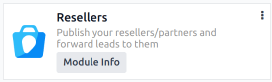

# Qayta sotuvchilar

Odoo'ning *CRM* ilovasida lidlarni qayta sotuvchilarga (yoki hamkorlarga) yo'naltirish mumkin. Lidlar qo'lda tayinlanishi yoki qayta sotuvchilarning belgilangan *darajasi* va joylashuviga asoslanib avtomatik tarzda tayinlanishi mumkin.

## Konfiguratsiya

Qayta sotuvchilar xususiyatlaridan foydalanish uchun avvalo *Resellers* moduli o'rnatilishi kerak. `Apps application`ga o'ting va `Search...` maydonidan `Apps` filtrini olib tashlang. Keyin [Resellers] ni qidiring.

Paydo bo'lgan `Resellers` modul kartasida `Activate`ni bosing. Bu modulni o'rnatadi va asosiy Odoo boshqaruv paneliga qaytaradi.

Modul o'rnatilgandan so'ng `CRM app`ga o'ting. `Configuration` menyusi ostida `Resellers` nomli yangi bo'lim paydo bo'ladi, uning ostida uchta variant bor: `Partner Levels`, `Partner Activations` va `Commission Plans`.

## Hamkor darajalari

Hamkor *darajalari* turli qayta sotuvchilarni farqlash uchun ishlatiladi. Hamkor darajalarini ko'rish uchun `CRM app ‣ Configuration ‣ Resellers: Partner Levels`ga o'ting.

Paydo bo'lgan `Partner Levels` sahifasida uchta standart daraja mavjud:

- `Gold`
- `Silver`
- `Bronze`

Kerak bo'lsa, `New`ni bosib va natijada paydo bo'lgan daraja formasini to'ldirib, yangi darajalar qo'shish mumkin.

Agar kerak bo'lsa, mavjud darajalarni ham tahrirlash va qayta nomlash mumkin. Darajani o'zgartirish uchun uni ro'yxatdan tanlang va paydo bo'lgan daraja formasi sahifasida kerakli o'zgarishlarni amalga oshiring.

Daraja og'irligi hamkorga lid yoki imkoniyat tayinlanish ehtimolini aniqlash uchun ishlatiladi. Daraja formasida `Level Weight` maydoniga raqamli qiymat (noldan katta) bering. Agar og'irlik nolga teng bo'lsa, hech qanday lid tayinlanmaydi.

::: tip

*Level Weight* individual kontakt yozuvida tayinlanishi mumkin. Individual yozuvda tayinlangan og'irlik daraja konfiguratsiya formasida tayinlangan standart og'irlikni qayta yozadi.
::::

## Hamkor faollashtirishlari

Hamkor *faollashtirishlari* hamkorning holatini aniqlash uchun ishlatiladi. Faollashtirishlar individual kontakt yozuvida tayinlanadi va *Partnership Analysis* hisobotini (`CRM app ‣ Reporting ‣ Partnerships`) guruhlash yoki filtrlash uchun ishlatilishi mumkin.

Hamkor darajalarini ko'rish uchun `CRM app ‣ Configuration ‣ Partner Activations`ga o'ting.

*CRM* ilovasida sukut bo'yicha uchta faollashtirish turi yaratilgan:

- `Fully Operational`
- `Ramp-up`
- `First Contact`

Kerak bo'lsa, `New`ni bosib va paydo bo'lgan yangi qatorda `Name` kiritib, yangi hamkor faollashtirishlarini qo'shish mumkin. Keyin `Active` ustunida kerakli holatni tanlang.

Agar kerak bo'lsa, mavjud hamkor faollashtirishlarini ham tahrirlash va qayta nomlash mumkin. Holatni qayta nomlash uchun kerakli darajaning `Name` maydonini bosing va yangi nom kiriting.

Faollashtirishning faol holatini o'zgartirish uchun kerakli faollashtirishning `Active` ustunidagi tugmachani *nofaol* holatga suring.

CRM ilovasidagi standart Partner Activations ro'yxati. First Contact uchun tugmacha nofaol holatda, qolganlari faol holatda.

## Hamkor tayinlashlari

`partner levels` va `partner activations` konfiguratsiyalangandan so'ng.

Individual hamkor yozuvini yangilash uchun `CRM app ‣ Sales ‣ Customers`ga o'ting va mijoz yozuvini ochish uchun kerakli hamkorning Kanban kartasini bosing.

Mijoz yozuvida `Partner Assignment` yorlig'ini bosing.

`Partner Level` maydonini bosing va darajani tayinlash uchun pastga tushadigan menyudan variant tanlang. Agar kerak bo'lsa, `Activation` maydonini bosing va pastga tushadigan ro'yxatdan hamkor faollashtirish turini tanlang. Keyin, agar kerak bo'lsa, boshqa daraja og'irligini tayinlash uchun `Level Weight` maydonini bosing.

## Hamkorlarni e'lon qilish

Odoo *Website* va *Resellers* ilovalari o'rnatilgan holda, *CRM* ilovasidagi barcha faol hamkorlar ro'yxatini ko'rsatish uchun yangi veb-sahifa ([/partners]) yaratiladi.

Keyin `CRM app ‣ Sales ‣ Customers`ga qaytib, hamkorning Kanban kartasini bosing. O'sha hamkorning kontakt formasida sahifaning yuqori qismidagi `Go to Website` aqlli tugmasini bosing va o'sha hamkorning veb-sahifasini oching.

Keyin hamkorning veb-sahifasining yuqori-o'ng qismidagi `Edit`ni bosing va `building blocks` dan foydalanib hamkor haqida qo'shimcha dizayn elementlari yoki ma'lumotlar qo'shing.

::: tip

Bu sahifaga kompaniya xulasasini qo'shish foydali bo'ladi.
::::

Sahifaga kerakli o'zgarishlarni kiritgandan so'ng `Save`ni bosing. Sahifaning yuqori qismida, agar kerak bo'lsa, `Unpublished` tugmachasini faol `Published` holatiga suring.

Barcha hamkorlar uchun bu qadamlarni takrorlang.

