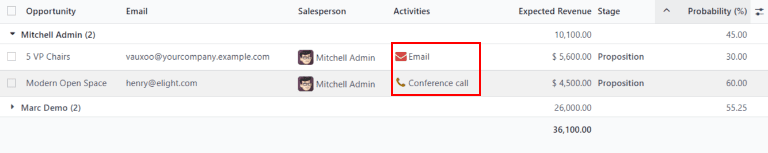
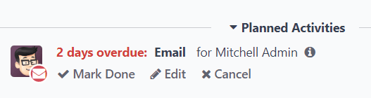
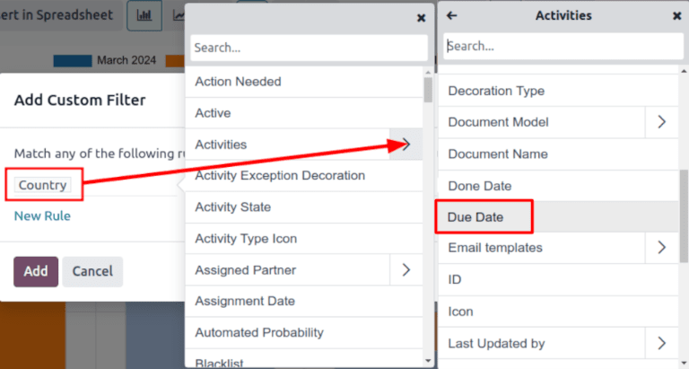
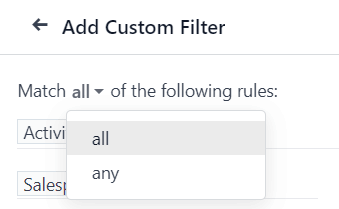
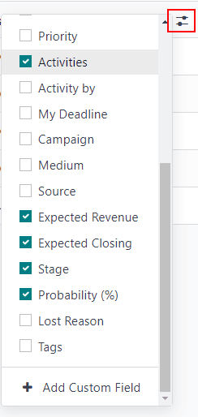

# E'tibordan chetda qolgan lidlar hisoboti

*E'tibordan chetda qolgan lidlar* - bu muddati kelgan yoki o'tgan rejalashtirilgan faoliyatlarga ega bo'lgan lidlardir. Faoliyat rejalashtirilganda, Odoo muddatni kuzatib boradi va faoliyat tayinlangan foydalanuchilarga elektron pochta orqali eslatmalar yuboradi.

*E'tibordan chetda qolgan lidlar hisoboti* muddati kelgan yoki o'tgan faoliyatlarga ega bo'lgan barcha faol lidlarni to'playdi, bu esa sotuv menejeriga qaysi imkoniyatlar zudlik bilan e'tibor talab qilishini aniqlash imkonini beradi.

Har kuni e'tibordan chetda qolgan lidlar hisobotini chiqarib, sotuv menejerlari o'z jamoalarini muddati o'tmasdan oldin bajarilmagan faoliyatlarni hal qilishga eslatishlari mumkin, bu esa e'tibordan chetda qolgan lidlarni oldini olishga va sotuvchilarida faol xatti-harakatlarni mustahkamlashga yordam beradi.

::: example
Sotuv menejeri kunini e'tibordan chetda qolgan lidlar hisobotini chiqarish bilan boshlaydi va ro'yxat ko'rinishiga o'tganda quyidagilarni ko'radi:

Ularning jamoa a'zosi Mitchell'ning *Proposition* bosqichida muddati kelgan faoliyatlarga ega ikkita lidi bor.

Sariq `📞 (telefon)` belgisi [Modern Open Space] lidida bugun uchun telefon qo'ng'irog'i faoliyati rejalashtirilganligini ko'rsatadi. Qizil `✉️ (konvert)` belgisi [5 VP Chairs] lidida muddati o'tgan elektron pochta faoliyati rejalashtirilganligini ko'rsatadi.

[5 VP Chairs] lidini bosib, sotuv menejeri lidning yozuvini ochadi va chatterni ko'rib chiqadi. Ular elektron pochta ikki kun oldin yuborilishi kerak edi, ammo Mitchell bu faoliyatni hech qachon bajarilgan deb belgilamagan.

:::

::: warning

E'tibordan chetda qolgan lidlar hisobotini chiqarish uchun sotuv jamoalari *CRM* oqimida, individual lid va imkoniyat kartalarida faoliyatdan muntazam ravishda foydalanishlari **kerak**.

Agar sotuvchilar *chatter*dagi *Activities* xususiyatidan foydalanmasalar, to'liq hisobot tuzish **mumkin emas**.

Qo'shimcha ma'lumot uchun `Activities` ga qarang.
::::

## E'tibordan chetda qolgan lidlar hisobotini yaratish

E'tibordan chetda qolgan lidlar hisobotini yaratish uchun avvalo `CRM app ‣ Reporting ‣ Pipeline`ga o'ting va `Pipeline Analysis` boshqaruv panelini oching. Sahifaning yuqori qismidagi `Search...` maydonini bosing va barcha standart filtrlarni olib tashlang.

::: tip

`Created on` filtri faol qolishi mumkin, chunki bu o'zgaruvchi hisobotga kiritish uchun foydali bo'lishi mumkin.
::::

Keyin `Search...` maydonining o'ng tomonidagi `🔻(pastga yo'nalgan uchburchak)` belgisini bosib maxsus filtrlar qo'shing va `Filters`, `Group By` va `Favorites` ustunlarini o'z ichiga olgan pastga tushadigan menyuni oching. `Filters` ustuni ostida `Add Custom Filter`ni bosing, bu `Add Custom Filter` pop-up oynasini ochadi.

`Add Custom Filter` pop-up oynasi aniqroq filtrlar yaratish imkonini beradi.

### Maxsus filtrlar qo'shish

E'tibordan chetda qolgan lidlar hisobotini yaratish uchun quyidagi shartlar uchun filtrlar yaratish kerak:

> - `Past due activities`: natijalarni faqat muddati o'tgan tayinlangan faoliyatlarga ega lidlarni o'z ichiga olish bilan cheklaydi. Buni hisobot yaratilgan sanada sodir bo'lishi kerak bo'lgan faoliyatlarni ham qo'shish uchun o'zgartirish mumkin.
> - `Unassigned leads`: tayinlangan sotuvchisi yo'q lidlarni chiqarib tashlaydi.
> - `Specific sales teams`: natijalarni faqat bir yoki bir nechta sotuv jamoalariga tayinlangan lidlarni o'z ichiga olish bilan cheklaydi. Ushbu filtr ixtiyoriy va agar hisobot butun kompaniya uchun mo'ljallangan bo'lsa, uni qo'shmaslik kerak.

#### Muddati o'tgan faoliyatlar uchun filtr qo'shish

Yangi qoida uchun birinchi maydonni bosing va `Search...` maydoniga [Activities] deb yozing yoki uni topish uchun ro'yxatni aylanib ko'ring. Keyin `Activities` yonida `> (katta belgisi)`ni bosib ikkinchi darajali shartlar bilan yangi pastga tushadigan menyuni oching.

`Search...` maydoniga [Due Date] deb yozing yoki ro'yxatni aylanib ko'ring. Uni qoidaga qo'shish uchun `Due Date`ni bosing.

> 

Keyin keyingi maydonni bosing va `` ni tanlang
::::

Hisobotning natijalarini bir yoki bir nechta sotuv jamoalari bilan cheklash uchun `New Rule`ni bosing. Keyin yangi qoida uchun birinchi maydonni bosing va `Search...` maydoniga [Sales Team] deb yozing yoki uni topish uchun ro'yxatni aylanib ko'ring.

Qoidaning ikkinchi maydonida pastga tushadigan menyudan `is in`ni tanlang. Ushbu operatorni tanlash natijalarni keyingi maydonida tanlangan sotuv jamoalari bilan cheklaydi.

Nihoyat, uchinchi maydonida pastga tushadigan menyudan kerakli sotuv jamoasini tanlang. Ushbu maydonida bir nechta jamoa qo'shish mumkin, bu yerda har bir parametr qidiruv mantiqida "yoki" (masalan, "har qanday") operatori bilan ko'rib chiqiladi.

Barcha qoidalar konfiguratsiya qilingan Add Custom Filter pop-up oynasining namunasi.

## Natijalarni ko'rish

`Add Custom Filter` formasining yuqori qismida qoidalarning `any` yoki `all`iga mos kelish variantlari mavjud. Hisobotni to'g'ri ishga tushirish uchun faqat quyidagi filtrlarning **barchasiga** mos keladigan yozuvlar kiritilishi kerak. Filtrlarni qo'shishdan oldin ushbu maydonida `all` tanlanganligiga ishonch hosil qiling.

Filtrlar konfiguratsiya qilingandan so'ng `Add`ni bosing. Natijada paydo bo'lgan hisobot faoliyati muddati o'tgan yoki joriy sanada muddati kelgan sotuvchiga tayinlangan barcha lidlarni ko'rsatadi. Standart ko'rinish ustunlar diagrammasi bo'lib, lidlar *bosqich* bo'yicha guruhlangan.

Natijalarni sotuvchi bo'yicha guruhlash uchun `Search...` maydonining o'ng tomonidagi `🔻(pastga yo'nalgan uchburchak)` belgisini bosing va `Filters`, `Group By` va `Favorites` ustunlarini o'z ichiga olgan pastga tushadigan menyuni oching. `Group By` sarlavhasi ostida `Salesperson`ni tanlang.

::: tip

`Group By` sarlavhasi ostida `Sales Team` bo'yicha guruhlash variantlari ham mavjud.
::::

*Ro'yxat* ko'rinishiga o'tish uchun ekranning yuqori-o'ng burchagidagi `≣ (ro'yxat)` belgisini bosing.

::: tip

`(toggle) icon`ni bosish hisobotga qo'shilishi mumkin bo'lgan qo'shimcha ustunlarning pastga tushadigan menyusini ochadi.

Ushbu hisobot uchun foydali bo'lgan ba'zi variantlar:

- `Activities`: ushbu lid uchun eng so'nggi faoliyatning xulasasi.
- `Expected Closing`: lidning yutilishi taxmin qilinayotgan sana.
- `Probability`: bosqichga asoslangan taxminiy muvaffaqiyat darajasi.

::::