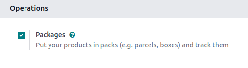
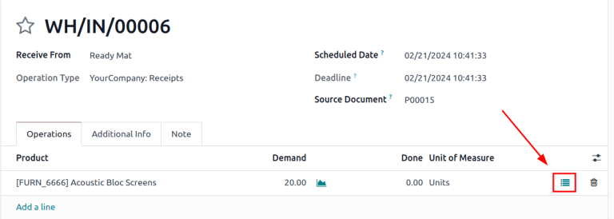
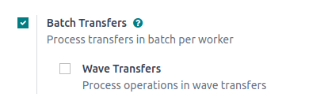
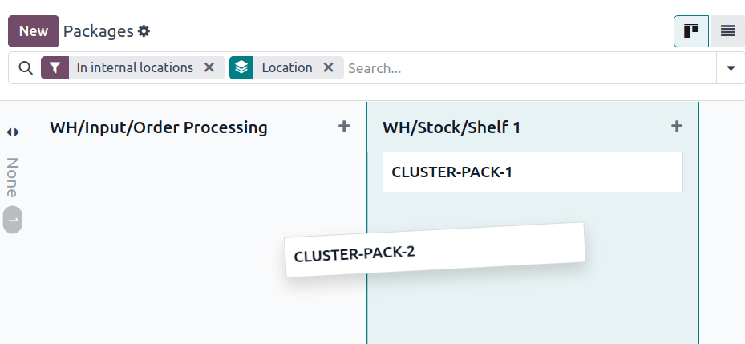

# Paketlar

*Paket* - bu bir yoki bir nechta mahsulotlarni saqlovchi jismoniy konteynerdir.
Paketlar shuningdek buyumlarni ommaviy tarzda saqlash uchun ham ishlatilishi mumkin.

Paketlar odatda quyidagi maqsadlar uchun ishlatiladi:

1.  `Grouping products to move them in bulk `.
2.  `Shipping to customers `: paket turlarini yuk tashuvchi kompaniyalarning o'lcham va og'irlik talablariga moslash, qadoqlash jarayonini soddalashtirish va yuk tashuvchi spetsifikatsiyalariga muvofiqlikni ta'minlash uchun sozlang.
3. Buyumlarni ommaviy tarzda saqlash.

*Paket foydalanishi* - bu Odoo'dagi paket formasidagi maydon bo'lib, faqat `Batch Transfers` va `Packages` funksiyalarini yoqish orqali ko'rinadi (`Inventory app ‣ Configuration ‣ Settings`).

Odatiy holda, paketlar formasidagi *Paket Foydalanishi* maydoni *Bir marta ishlatiladigan Quti* qilib o'rnatilgan. Bu maydonni *Qayta ishlatiladigan Quti*ga **faqat** `cluster pickings` uchun paketlarni sozlashda o'zgartiring.

*Paket turi* - bu haqiqiy yuk og'irligiga asoslangan `calculating shipping cost` uchun ishlatiladigan ixtiyoriy funksiya. Yuk tashish xarajatlari hisoblarida paketning o'zi og'irligini (masalan, qutilar, palletlar, boshqa yuk konteynerlarini) kiritish uchun paket turlarini yarating.

::: tip

Paketlar odatda `three-step delivery route`da ishlatilsa-da, ular saqlanishi mumkin bo'lgan mahsulotlar bilan bog'liq har qanday ish jarayonida ishlatilishi mumkin.
::::

## Sozlash 

Paketlardan foydalanish uchun, avval `Inventory app ‣ Configuration ‣ Settings`ga o'ting. `Operations` sarlavhasi ostida `Packages` funksiyasini faollashtiring. Keyin `Save`ni bosing.

::: 
Paketlarni ichki ravishda ko'chirishda, *Move Entire Packages* funksiyasi operatsiya turida yoqilishi mumkin, bu paketning joylashuvini yangilashda paket tarkibidagi buyumlarning joylashuvini yangilash uchun.
:::

Buning uchun `Inventory app ‣ Configuration ‣ Operations Types`ga o'ting va ushbu funksiya qo'llaniladigan kerakli operatsiyani tanlang (bir nechtasini o'rnatishga to'g'ri kelishi mumkin).

Operatsiya turi sahifasida, `Packages` bo'limida `Move Entire Packages` katakchasi belgilang.

## Buyumlarni qadoqlash 

Mahsulotlar har qanday transferda paketlarga qo'shilishi mumkin:

1.  Mahsulot qatoridagi har bir `Detailed Operations ` belgisini bosish orqali.
2.  Transferdagi hamma narsani paketga joylashtirish uchun `Put in Pack ` tugmasidan foydalanish orqali.

### Batafsil operatsiyalar 

Har qanday ombor transferida (masalan, qabul qilish, yetkazib berish buyrug'i), mahsulotni paketga qo'shish uchun `Operations` bo'limidagi `⦙≣ (bulleted list)` belgisini bosing.

Buni qilish `Product` uchun `Detailed Operations` oynasini ochadi.

`Product`ni paketga joylashtirish uchun, `Add a line`ni bosing va mahsulotni `Destination Package`ga tayinlang. Mavjud paketni tanlang yoki yangi paket nomini yozib, keyin `Create...`ni tanlab yangi paket yarating.

O'n ikki dona Acoustic Bloc Screen PACK0000001ga joylashtirildi.

Keyin, `Done` ustunida paketga qo'yiladigan buyumlar miqdorini belgilang. `Product`ni turli paketlarga joylashtirish uchun yuqoridagi qadamlarni takrorlang. Tugagach, oynani yopish uchun `Confirm`ni bosing.

### Paketga joylashtirish 

Shu bilan bir qatorda, yangi paket yaratish va transferdagi barcha buyumlarni o'sha yangi yaratilgan paketga joylashtirish uchun **har qanday** ombor transferida `Put in Pack` tugmasini bosing.

::: warning

`Put in Pack` tugmasi qabul qilish, yetkazib berish buyruqlari va `Inventory app ‣ Configuration ‣ Settings`da *Packages* funksiyasi yoqilgan boshqa transfer formalarida paydo bo'ladi.
::::

BATCH/00003 to'plam transferida Put in Pack tugmasi bosildi va yangi paket PACK0000002 yaratildi hamda barcha buyumlar Destination Package maydonida unga tayinlandi.

## Paket turi 

Maxsus o'lchamlar va og'irlik chegaralarini belgilash uchun `Inventory app ‣ Configuration ‣ Package Types`ga o'tib paket turlarini yarating. Bu funksiya asosan yuk tashish xarajatlari uchun paket og'irliklarini hisoblash uchun ishlatiladi.

`Package Types` ro'yxatida `New`ni bosish bo'sh paket turi formasini ochadi. Formaning maydonlari quyidagicha:

- `Package Type` (majburiy): paket turining nomini belgilang.
- `Size`: paketning o'lchamlarini millimetr (mm) da belgilang. Maydonlar, chapdan o'ngga, `Length`, `Width` va `Height`ni belgilaydi.
- `Weight`: bo'sh paketning og'irligi (masalan, bo'sh quti, pallet).

::: tip

Odoo paketning og'irligini bo'sh paket og'irligi va buyum(lar) og'irligini qo'shish orqali hisoblab chiqadi, bu har bir mahsulot formasining `Inventory` bo'limidagi `Weight` maydonida topilishi mumkin.
::::

- `Max Weight`: paketda ruxsat etilgan maksimal yuk og'irligi.
- `Barcode`: skanerlash orqali paket turini aniqlash uchun shtrix-kod belgilang.
- `Company`: paket turini faqat tanlangan kompaniyada mavjud qilish uchun kompaniyani belgilang. Agar barcha kompaniyalarda mavjud bo'lsa, maydonni bo'sh qoldiring.
- `Carrier`: ushbu paket turi uchun mo'ljallangan yuk tashuvchi kompaniyani belgilang.
- `Carrier Code`: paket turiga bog'langan kodni belgilang.

## Klaster paketlar 

*Klaster paketlaridan* foydalanish uchun, avval `Inventory app ‣ Configuration ‣ Settings`ga o'ting va `Operations` bo'limida joylashgan `Batch Transfers` funksiyasini faollashtiring. Buni qilish paket formasida *Package Use* maydonini ko'rinadigan qiladi.

Yangi paketlar qo'shish uchun `Inventory app ‣ Products ‣ Packages`ga o'ting. Keyin `New`ni bosing yoki mavjud paketni tanlang. Buni qilish quyidagi maydonlarni o'z ichiga olgan paket formasini ochadi:

- `Package Reference` (majburiy): paketning nomi.

- `Package Type`: `configuring shipping boxes to ship to the customer` uchun ishlatiladi.

  ::: tip
   seealso
`Using cluster packages `
:::

## Paketlarni ko'rish

Barcha paketlarni ko'rish uchun `Inventory app ‣ Products ‣ Packages`ga o'ting. Odatiy holda, paketlar Kanban ko'rinishida, ularning joriy saqlash joyida ko'rsatiladi.

::: tip

Paketlarni ichki joylar orasida ko'chirish uchun sudrab-tashlang.
::::

