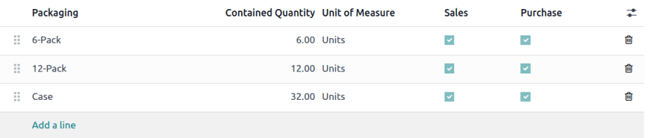
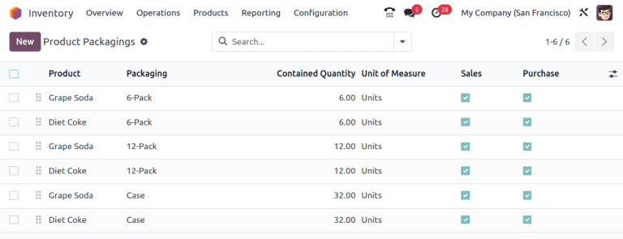

# Qadoqlash

Odoo *Inventory*da *qadoqlash* - bu muayyan mahsulotning bir nechta birliklarini saqlovchi bir marta ishlatiladigan konteynerlarni anglatadi.

Masalan, gazlangan ichimlik bankalari uchun turli paketlar, masalan 6 ta o'ram, 12 ta o'ram yoki 36 tali quti kabi, **albatta** alohida mahsulot formasida sozlanishi kerak. Buning sababi shundaki, qadoqlashlar mahsulotga xos bo'lib, umumiy emas.

::: tip

Qadoqlashni Odoo `Barcode` bilan birga ishlatish mumkin. Yetkazib beruvchilardan mahsulotlarni qabul qilishda, qadoqlash shtrix-kodini skanerlash avtomatik ravishda qadoqlashdagi birliklar sonini mahsulotning ichki hisobiga qo'shadi.
::::

## Sozlash

Qadoqlashlardan foydalanish uchun `Inventory app ‣ Configuration ‣ Settings`ga o'ting. Keyin `Products` sarlavhasi ostida `Product Packagings` funksiyasini yoqing va `Save`ni bosing.

## Qadoqlash yaratish 

Qadoqlashlar to'g'ridan-to'g'ri mahsulot formasida yoki `Product Packagings` sahifasidan yaratilishi mumkin.

### Mahsulot formasidan

Mahsulot formasida qadoqlashlar yaratish uchun `Inventory app ‣ Products ‣ Products`ga o'ting va kerakli mahsulotni tanlang.

`Inventory` bo'limi ostida `Packaging` bo'limiga qadar pastga aylantiring va `Add a line`ni bosing. Jadvalda quyidagi maydonlarni to'ldiring:

- `Packaging` (majburiy): mahsulot uchun qadoqlash varianti sifatida savdo/xarid buyurtmalarida paydo bo'ladigan qadoqlash nomi.
- `Contained quantity` (majburiy): qadoqlashdagi mahsulot miqdori.
- `Unit of Measure` (majburiy): mahsulotni o'lchash uchun o'lchov birligi.
- `Sales`: savdo buyurtmalarida foydalanish uchun mo'ljallangan qadoqlashlar uchun ushbu variantni belgilang.
- `Purchase`: xarid buyurtmalarida foydalanish uchun mo'ljallangan qadoqlashlar uchun ushbu variantni belgilang.

::: tip

`Packaging` bo'limidagi ustun sarlavhalarining eng o'ng tomonidagi `oi-settings-adjust` `(additional options)` belgisini bosib va paydo bo'ladigan ochiluvchi menyudan kerakli variantlarni tanlab, quyidagi `Packaging` jadvalidagi qo'shimcha maydonlarga kirish mumkin.
::::

- `Barcode`: `Barcode app` yordamida stok harakatlari yoki tanlab olishlarda qadoqlashni kuzatish uchun identifikator. Agar foydalanilmasa, bo'sh qoldiring.
- `Company`: qadoqlashning faqat tanlangan kompaniyada mavjudligini bildiradi. Qadoqlashni barcha kompaniyalarda mavjud qilish uchun bo'sh qoldiring.

::: tip
[Grape Soda] mahsulotining olti birligi uchun qadoqlash turini yaratish uchun `Add a line`ni bosishdan boshlang. Qatorda `Packaging`ni [6-pack] deb nomlang va `Contained quantity`ni [6]ga o'rnating. Qo'shimcha qadoqlashlar uchun bu jarayonni takrorlang.

:::

### Mahsulot qadoqlashlari sahifasidan

Yaratilgan barcha qadoqlashlarni ko'rish uchun `Inventory app ‣ Configuration ‣ Product Packagings`ga o'ting. Buni qilish barcha mahsulotlar uchun yaratilgan barcha qadoqlashlarning to'liq ro'yxati bilan `Product Packagings` sahifasini ochadi. `New`ni bosib yangi qadoqlashlar yarating.

::: tip
Ikkita gazlangan ichimlik mahsuloti, [Grape Soda] va [Diet Coke], uchta turdagi qadoqlash sozlangan. `Product Packagings` sahifasida har bir mahsulot 6 ta mahsulotni o'z ichiga olgan [6-Pack], 12 ta mahsulotli [12-Pack] yoki 32 ta mahsulotli [Case] sifatida sotilishi mumkin.

:::

### Qisman rezervlash

`completing the packaging setup`dan keyin, qadoqlashlar chiquvchi jo'natmalar uchun to'liq yoki qisman miqdorlarda rezerv qilinishi mumkin. Qisman qadoqlash moslashuvchanligi mavjud buyumlarni darhol jo'natishga imkon berish orqali, qolganini kutishda buyurtmani bajarishni tezlashtiradi.

Qadoqlash rezervlash usullarini sozlash uchun `Inventory app ‣ Configuration ‣ Product Categories`ga o'ting. Keyin `New`ni bosing yoki kerakli mahsulot toifasini tanlang.

Mahsulot toifasining formasida, `Logistics` bo'limida `Reserve Packagings`ni `Reserve Only Full Packagings` yoki `Reserve Partial Packagings`ga o'rnatish mumkin.

::: warning

`Reserve Packaging` maydonini ko'rish uchun `Product Packaging` funksiyasi **albatta** yoqilgan bo'lishi kerak. Bu funksiyani yoqish uchun `Inventory app ‣ Configuration ‣ Settings`ga o'ting, `Products` bo'limiga aylantiring, `Product Packagings` katakchasi belgilang va `Save`ni bosing.
::::

::: tip
Biznes ehtiyojlariga asoslangan variantlarni yaxshiroq baholash uchun quyidagi misolni ko'rib chiqing:

- mahsulot har bir qadoqlashda o'n ikki birlikda sotiladi.
- buyurtma ikkita qadoqlashni talab qiladi.
- omborda faqat yigirma ikki birlik mavjud.

`Reserve Only Full Packagings` tanlanganda, buyurtma uchun faqat o'n ikki birlik rezerv qilinadi.

Aksincha, `Reserve Partial Packagings` tanlanganda, buyurtma uchun yigirma ikki birlik rezerv qilinadi.
:::

## Qadoqlashlarni qo'llash

`Sales` ilovasida savdo buyurtmasini yaratishda mahsulot uchun qo'llanilishi kerak bo'lgan qadoqlashlarni belgilang. Tanlangan qadoqlash `SO (Sales Order)`da `Packaging` maydonida ko'rsatiladi.

::: tip
[Grape Soda] mahsulotining 18 ta bankasi uchta 6 ta o'ramli qadoqlash yordamida qadoqlanadi.

:::

## Qadoqlash uchun marshrutlar 

Qadoqlashlarni qabul qilishda, odatiy ravishda ular omborning `configured reception route`ini kuzatadi. Qadoqlashga xos marshrutni **ixtiyoriy** tarzda o'rnatish uchun `Inventory app ‣ Configuration ‣ Routes`ga o'ting.

::: warning

*Product Packagings*, *Storage Locations* va *Multi-Step Routes* funksiyalari (`Inventory app ‣ Configuration ‣ Settings`ga o'tish orqali topiladi) **albatta** faollashtirilgan va saqlanган bo'lishi kerak.
::::

### Marshrut yaratish

`Routes` sahifasida `New`ni bosing yoki ombor uchun **bo'lmagan** marshrutni tanlang. Keyin `Applicable on` bo'limida `Packagings` katakchasini belgilang.

"Packagings" tanlangan, "Products" va "Warehouses" tanlanmagan marshrut.

### Qadoqlashda marshrutni qo'llash 

Keyin marshrutni qo'llash uchun `Inventory app ‣ Products ‣ Products`ga o'ting va qadoqlash ishlatiladigan mahsulotni tanlang.

Mahsulot formasida `Inventory` bo'limiga o'ting. `configured packagings`ni o'z ichiga olgan `Packaging` bo'limida `oi-settings-adjust` `(additional options)` belgisini bosing. `Packaging` jadvalida ustunni ko'rinadigan qilish uchun `Routes` katakchasini belgilang.

`Routes` maydonida qadoqlashga xos marshrutni tanlang. Marshrutdan foydalanish mo'ljallangan barcha qadoqlashlar uchun bu qadamlarni takrorlang.

