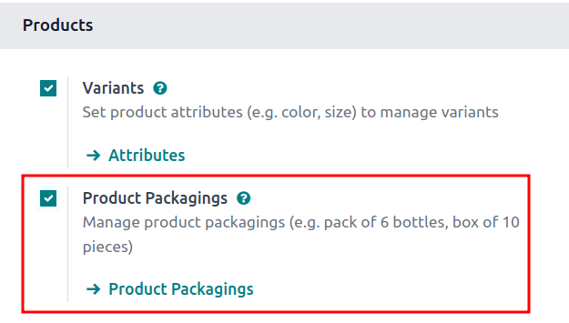

# Packaging

In Odoo *Inventory*, *packaging* refers to disposable containers holding
multiple units of a specific product.

For example, different packages for cans of soda, such as a 6-pack, a
12-pack, or a case of 36, **must** be configured on the individual
product form. This is because packagings are product specific, not
generic.

::: tip

Packaging can be used in conjunction with Odoo
`Barcode `. When receiving products from suppliers, scanning the
packaging barcode automatically adds the number of units in the
packaging to the internal count of the product.
::::

## Configuration

To use packagings, navigate to
`Inventory app ‣ Configuration ‣ Settings`. Then, under the `Products` heading, enable the
`Product Packagings` feature, and
click `Save`.

## Create packaging 

Packagings can be created directly on the product form, or from the
`Product Packagings` page.

### From product form

Create packagings on a product form by going to
`Inventory app ‣ Products ‣
Products`, and select the
desired product.

Under the `Inventory` tab, scroll
down to the `Packaging` section, and
click `Add a line`. In the table,
fill out the following fields:

- `Packaging` (required): name of
  packaging that appears on sales/purchase orders as a packaging option
  for the product.
- `Contained quantity` (required):
  amount of product in the packaging.
- `Unit of Measure` (required):
  measurement unit for quantifying the product.
- `Sales`: check this option for
  packagings intended for use on sales orders.
- `Purchase`: check this option for
  packagings intended for use on purchase orders.

::: tip

Access additional fields in the `Packaging` table below by clicking the
`oi-settings-adjust`
`(additional options)` icon to the
far-right of the column titles in the `Packaging` section, and selecting the desired options from the
drop-down menu that appears.
::::

- `Barcode`: identifier for tracing
  packaging in stock moves or pickings, using the
  `Barcode app `. Leave blank if not in use.
- `Company`: indicates the packaging
  is only available at the selected company. Leave blank to make the
  packaging available across all companies.

::: example
To create a packaging type for six units of the product, [Grape
Soda], begin by clicking `Add a line`. In the line, name the `Packaging` [6-pack], and set the
`Contained quantity` to
[6]. Repeat this process for additional packagings.

:::

### From product packagings page

To view all packagings that have been created, go to
`Inventory app ‣ Configuration
‣ Product Packagings`. Doing
so reveals the `Product Packagings`
page with a complete list of all packagings that have been created for
all products. Create new packagings by clicking `New`.

::: example
Two soda products, [Grape Soda] and [Diet Coke],
have three types of packagings configured. On the
`Product Packagings` page, each
product can be sold as a [6-Pack] that contains 6 products,
as a [12-Pack] of 12 products, or as a [Case] of
32 products.

:::

### Partial reservation

After
`completing the packaging setup `, packagings can be reserved in full or partial quantities
for outgoing shipments. Partial packaging flexibility expedites order
fulfillment by allowing the immediate shipment of available items, while
awaiting the rest.

To configure packaging reservation methods, go to
`Inventory app ‣ Configuration
‣ Product Categories`. Then,
click `New`, or select the desired
product category.

On the product category\'s form, in the `Logistics` section, `Reserve Packagings` can be set to
`Reserve Only Full Packagings` or
`Reserve Partial Packagings`.

::: warning

To see the `Reserve Packaging` field,
the `Product Packaging` feature
**must** be enabled. To enable this feature, go to `Inventory app ‣
Configuration ‣ Settings`,
scroll to the `Products` section,
tick the `Product Packagings`
checkbox, and click `Save`.
::::

::: example
To better evaluate the options based on business needs, consider the
following example:

- a product is sold in twelve units per packaging.
- an order demands two packagings.
- there are only twenty-two units in stock.

When `Reserve Only Full Packagings`
is selected, only twelve units are reserved for the order.

Conversely, when `Reserve Partial Packagings` is selected, twenty-two units are reserved for the
order.
:::

## Apply packagings

When creating a sales order in the `Sales` app, specify the packagings that should be used
for the product. The chosen packaging is displayed on the
`SO (Sales Order)` under the
`Packaging` field.

::: example
18 cans of the product, [Grape Soda], is packed using three
6-pack packagings.

:::

## Routes for packaging 

When receiving packagings, by default, they follow the warehouse\'s
`configured reception route
`. To **optionally** set up a packaging-specific route, go to
`Inventory app ‣ Configuration ‣ Routes`.

::: warning

The *Product Packagings*, *Storage Locations*, and *Multi-Step Routes*
features (found by going to
`Inventory app ‣ Configuration ‣ Settings`) **must** be activated, and saved.
::::

### Create route

On the `Routes` page, click
`New`, or select a route that is
**not** for a warehouse. Next, in the `Applicable on` section, tick the `Packagings` checkbox.

Route with "Packagings" selected, with "Products" and
"Warehouses" not selected.

### Apply route on packaging 

Then, to apply the route, go to
`Inventory app ‣ Products ‣ Products`, and select the product that uses packaging.

In the product form, switch to the `Inventory` tab. In the `Packaging` section that contains
`configured packagings `, click the `oi-settings-adjust` `(additional options)`
icon. Tick the `Routes` checkbox to
make the column visible in the `Packaging` table.

In the `Routes` field, select the
packaging-specific route. Repeat these steps for all packaging intended
to use the route.

