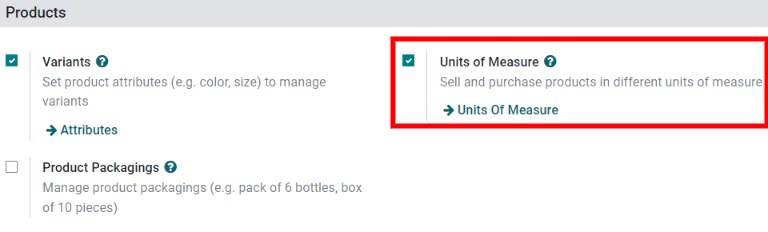
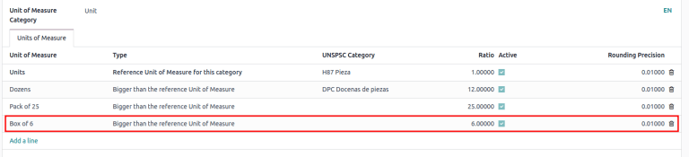

# O'lchov birliklari

Ba'zi hollarda mahsulotlarni turli o'lchov birliklarida boshqarish zarur bo'ladi. Masalan, biznes metrik tizimidan foydalanadigan mamlakatdan mahsulotlarni sotib olib, keyin bu mahsulotlarni imperial tizimdan foydalanadigan mamlakatda sotishi mumkin. Bunday holda, biznes birliklarni konvertatsiya qilishi kerak.

Birlik konvertatsiyasining yana bir holati - biznes yetkazib beruvchidan mahsulotlarni katta paketda sotib olib, keyin bu mahsulotlarni alohida birliklar bilan sotganda yuzaga keladi.

Odoo bitta mahsulot uchun turli *o'lchov birliklari (UoM)* dan foydalanish uchun sozlanishi mumkin.

## Sozlash

Odoo da turli o'lchov birliklaridan foydalanish uchun, avval `Inventory app ‣ Configuration ‣ Settings` ga o'ting va `Products` bo'limi ostida `Units of Measure` sozlamasini faollashtiring. Keyin `Save` tugmasini bosing.

## O'lchov birliklari toifalari

*Units of Measure* sozlamasini yoqqandan keyin, `Inventory app ‣ Configuration ‣ UoM Categories` da standart o'lchov birliklari toifalarini ko'ring. Toifa birlik konvertatsiyasi uchun muhim; Odoo mahsulot birliklarini bir birlikdan ikkinchisiga **faqat** ikkala birlik bir xil toifaga tegishli bo'lsagina konvertatsiya qilishi mumkin.

Har bir o'lchov birliklari toifasida mos yozuv birligi mavjud. Mos yozuv birligi `Units of Measure Categories` sahifasining `Uom` ustunida ko'k rang bilan ajratilgan. Odoo mos yozuv birligini har qanday yangi birliklar uchun asos sifatida ishlatadi.

Yangi birlik yaratish uchun, avval `Units of Measure Categories` sahifasidan to'g'ri toifani tanlang. Masalan, mahsulotni oltita birlikdan iborat qutida sotish uchun `Unit` toifa qatorini bosing. Keyin paydo bo'ladigan toifa sahifasida `Units of Measure` tabidagi `Add a line` tugmasini bosing. Keyin `Unit of Measure` maydonida yangi birlikni nomlang, masalan [Box of 6], so'ngra `Type` maydonida tegishli o'lcham mos yozuvini tanlang, masalan `Bigger than the reference Unit of Measure`.

Agar kerak bo'lsa, `UNSPSC Category` ni kiriting, bu [GS1 tomonidan boshqariladigan](https://www.unspsc.org/) global darajada tan olingan kod bo'lib, foydalanish uchun **sotib olinishi** shart.

`Ratio` maydonida yangi `UoM (Unit of Measure)` da nechta alohida birlik borligini kiriting, masalan [6.00000] [6-Pack] misolidan foydalanganda (chunki oltita quti mos yozuv birligi [1.00000] dan olti marta *katta*).

## Mahsulotning o'lchov birliklarini belgilash

Mahsulotda o'lchov birliklarini o'rnatish uchun, avval `Inventory app ‣ Products ‣ Products` ga o'ting va mahsulot forma sahifasini ochish uchun mahsulotni tanlang.

`General Information` tabida mahsulot sotiladigan o'lchov birligini belgilash uchun `Unit of Measure` maydonini tahrirlang. Belgilangan birlik shuningdek mahsulot inventarini va ichki o'tkazmalarni kuzatish uchun ishlatiladigan birlik hisoblanadi.

Mahsulot sotib olinadigan o'lchov birligini belgilash uchun `Purchase UoM` maydonini tahrirlang.

## Birlik konvertatsiyasi

Odoo mahsulotlar turli `UoMs (Units of Measure)` va sotib olish `UoMs (Units of Measure)` ga ega bo'lganda o'lchov birliklarini avtomatik ravishda konvertatsiya qiladi.

Bu turli stsenariylarda sodir bo'ladi, jumladan:

1. `Vendor orders`: sotib olish buyurtmalarida (POs) sotib olish `UoM (Unit of Measure)` ichki ombor hujjatlarida `UoM (Unit of Measure)` ga konvertatsiya qilinadi
2. `Automatic replenishment`: mahsulot zaxira darajasi (`UoM (Unit of Measure)` da kuzatiladi) ma'lum darajadan pastga tushganda `POs (Purchase Orders)` yaratadi. Ammo `POs (Purchase Orders)` sotib olish `UoM (Unit of Measure)` dan foydalanib yaratiladi
3. `Sell products`: agar sotish buyurtmasida (SO) boshqa `UoM (Unit of Measure)` ishlatilsa, miqdor yetkazib berish buyurtmasida omborning afzal ko'radigan `UoM (Unit of Measure)` ga konvertatsiya qilinadi

### Sotib olish UoM da mahsulotlarni sotib olish

*Purchase* ilovasida yangi kotirovka so'rovi (RFQ) yaratayotganda, Odoo avtomatik ravishda mahsulotning belgilangan sotib olish o'lchov birligini ishlatadi. Agar kerak bo'lsa, `RFQ (Request for Quotation)` da `UoM` qiymatini qo'lda tahrirlang.

`RFQ (Request for Quotation)` `PO (Purchase Order)` ga tasdiqlanganidan keyin, `PO (Purchase Order)` ning yuqori qismidagi `Receipt` aqlli tugmasini bosing.

Odoo sotib olish o'lchov birligini avtomatik ravishda mahsulotning sotish/inventar o'lchov birligiga konvertatsiya qiladi, shuning uchun yetkazib berish kvitansiyasining `Demand` ustuni konvertatsiya qilingan miqdorni ko'rsatadi.

::: tip
Mahsulotning sotib olish `UoM` [Box of 6] bo'lsa va uning sotish/inventar o'lchov birligi [Units] bo'lsa, `PO (Purchase Order)` miqdorni oltita qutida ko'rsatadi va kvitansiya (va boshqa ichki ombor hujjatlari) miqdorni birliklar bilan ko'rsatadi.

Sotib olish "UoM": Box of 6 dan foydalanib uchta miqdor buyurtmasi beriladi.

Ombor qabul qilishda qayd etilgan miqdorlar ichki "Unit of Measure": Units da bo'ladi.
:::

### To'ldirish

Mahsulot uchun kotirovka so'rovi to'g'ridan-to'g'ri mahsulot formasidan `Replenish` tugmasi yordamida ham yaratilishi mumkin.

`Replenish` tugmasini bosgandan keyin, to'ldirish yordamchi oynasi paydo bo'ladi. Agar kerak bo'lsa, sotib olish o'lchov birligi `Quantity` maydonida qo'lda tahrirlanishi mumkin. Keyin `RFQ (Request for Quotation)` yaratish uchun `Confirm` tugmasini bosing.

::: warning
`PO (Purchase Order)` **faqat** mahsulot formasining `Purchase` tabida kamida **bitta** yetkazib beruvchi ro'yxatga olingan bo'lsagina avtomatik ravishda yaratilishi mumkin.
:::

Yaratilgan `PO (Purchase Order)` ga o'tish uchun mahsulot formasidagi `Forecasted` aqlli tugmasini bosing. `Forecasted Inventory` bo'limigacha pastga aying va `Requests for quotation` qatorida loyiha `RFQ (Request for Quotation)` ni ochish uchun `RFQ (Request for Quotation)` mos yozuv raqamini bosing. Agar kerak bo'lsa, sotib olish `UoM (Unit of Measure)` to'g'ridan-to'g'ri `PO (Purchase Order)` da tahrirlanishi mumkin.

### Boshqa UoM da sotish

*Sales* ilovasida yangi kotirovka yaratayotganda, Odoo avtomatik ravishda mahsulotning belgilangan o'lchov birligini ishlatadi. Agar kerak bo'lsa, `UoM` kotirovkada qo'lda tahrirlanishi mumkin.

Kotirovka mijozga yuborilgandan va sotish buyurtmasiga (SO) tasdiqlanganidan keyin, `SO (Sales Order)` ning yuqori qismidagi `Delivery` aqlli tugmasini bosing. Odoo o'lchov birligini avtomatik ravishda mahsulotning inventar o'lchov birligiga konvertatsiya qiladi, shuning uchun yetkazib berishning `Demand` ustuni konvertatsiya qilingan miqdorni ko'rsatadi.

Masalan, agar `SO (Sales Order)` dagi mahsulotning `UoM (Unit of Measure)` [Box of 6] ga o'zgartirilgan bo'lsa, lekin uning inventar o'lchov birligi [Units] bo'lsa, `SO (Sales Order)` miqdorni oltita qutida ko'rsatadi va yetkazib berish miqdorni birliklar bilan ko'rsatadi.