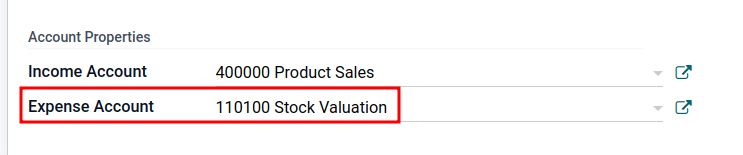
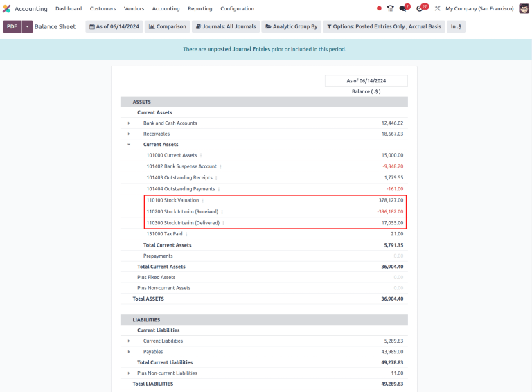

# Avtomatik inventar baholash

Kompaniyaning barcha qo'lda mavjud zaxiralari uning inventarini baholashga hissa qo'shadi. Bu qiymat kompaniya va uning barcha aktivlarining qiymatini aniq ko'rsatish uchun kompaniyaning buxgalteriya hisoblarida aks ettirilishi kerak.

Odoo sukut bo'yicha davriy inventar baholashdan (qo'lda inventar baholash deb ham ataladi) foydalanadi. Bu usul buxgalteriya jamoasi kompaniyaning jismoniy inventariga asoslanib qo'lda jurnal yozuvlarini kiritishni va ombor xodimlari zaxiralarni sanash uchun vaqt ajratishni nazarda tutadi. Odoo'da har bir mahsulot toifasi buni aks ettiradi, `Costing Method` `Standard Price`ga o'rnatilgan va `Inventory Valuation` (sukut bo'yicha ko'rinmaydi) `Manual`ga o'rnatilgan.

Shu bilan birga, doimiy (avtomatik) inventar baholash kompaniyaning omboriga zaxira kirib-chiqishi paytida *Accounting* ilovasida real vaqtda *jurnal yozuvlarini* yaratadi.

Ushbu hujjat avtomatik inventar baholashning to'g'ri sozlanishiga qaratilgan bo'lib, bu *Accounting* ilovasidagi jurnal yozuvlari *Inventory* ilovasidagi zaxira baholash yangilanishlari bilan mos kelishini ta'minlaydigan integratsiyalashgan baholash usulidir. Odoo'da inventar baholashning kirish qo'llanmasi uchun `using_inventory_valuation` hujjatlariga murojaat qiling.

:::: warning

Qo'lda baholashdan avtomatik inventar baholashga o'tish zaxira baholashi va buxgalteriya jurnallari o'rtasida nomuvofiqlik keltirib chiqarishi mumkin.

Avtomatlashtirilgan baholashga o'tish uchun [muvaffaqiyatli strategiya](https://www.odoo.com/r/Kvfg):

1.  Mavjud zaxiralarni tozalang (ehtimol `inventory adjustment` bilan)
2.  Inventar baholash usulini *Automatic*ga o'zgartiring
3.  Mavjud zaxiralarni asl pul qiymati bilan qaytaring (inventar tuzatishdan foydalanib)

Mavjud zaxira tiklanganidan so'ng, Odoo *Accounting* ilovasi avtomatik ravishda tegishli zaxira baholash yozuvlariga jurnal yozuvlarini yaratadi.
::::

## Konfiguratsiya

Avtomatik inventar baholashni to'g'ri sozlash uchun Odoo'da quyidagi qadamlarni bajaring:

1.  `Install Accounting app and enable specific settings`
2.  `Set Automatic inventory valuation on product categories`
3.  `Set costing method`

### Buxgalteriya sozlamalari 

Avtomatik inventar baholashdan foydalanish uchun *Accounting* ilovasini o'rnating. Keyin `Accounting app ‣ Configuration ‣ Settings`ga o'ting va `Stock Valuation` bo'limida `Automatic Accounting` katagini belgilang. So'ngra `Save`ni bosing.

::: tip

`Automatic Accounting`ni yoqish mahsulot toifasida ilgari ko'rinmagan *Inventory Valuation* maydonini ko'rsatadi.
::::

Ko'rsatilgan buxgalteriya jurnallarini sozlash bo'yicha batafsil ma'lumot uchun hujjatlashning `Expense` va `Stock input/output` bo'limlariga murojaat qiling.

### Mahsulot toifasi sozlamalari 

`enabling inventory valuation`dan so'ng, keyingi qadam mahsulot toifasini avtomatik inventar baholashdan foydalanish uchun sozlashdir.

`Inventory app ‣ Configuration ‣ Product Categories`ga o'ting va kerakli mahsulot toifasini tanlang. `Inventory Valuation` bo'limida `Inventory Valuation` maydonini `Automated`ga o'rnating. Bu qadamni avtomatik inventar baholashdan foydalanmoqchi bo'lgan har bir mahsulot toifasi uchun takrorlang.

::: tip

Avtomatik buxgalteriyani yoqgandan so'ng, inventar baholash yangilanishlari paytida yaratilgan har bir yangi zaxira harakati qatlami (SVL) jurnal yozuvini yaratadi.
::::

## Xarajat usuli 

`enabling inventory valuation`dan so'ng, inventar xarajatlarini hisoblash va qayd etish uchun *xarajat usuli* Odoo'da mahsulot toifasida belgilanadi.

`Inventory app ‣ Configuration ‣ Product Categories`ga o'ting va kerakli mahsulot toifasini tanlang. `Inventory Valuation` bo'limida tegishli `Costing Method`ni tanlang:

:::::::: tabs
::: tab
Standard Price

Odoo'dagi standart xarajat usuli. Mahsulotning narxi mahsulot formasida qo'lda belgilanadi va bu narx baholashni hisoblash uchun ishlatiladi. Hatto xarid buyurtmasidagi xarid narxi farq qilsa ham, baholash mahsulot formasida belgilangan narxdir.

  Amal                               Birlik narxi   Qo'ldagi miqdor   Kiruvchi qiymat   Inventar qiymati
  ---------------------------------- -------------- ----------------- ----------------- ------------------
                                     $10            0                                    $0
  8 ta mahsulotni $10/birlik uchun qabul qilish   $10        8             8 * $10        $80
  4 ta mahsulotni $16/birlik uchun qabul qilish   $10        12            4 * $10        $120
  10 ta mahsulot yetkazib berish                $10        2             -10 * $10      $20
  2 ta mahsulotni $9/birlik uchun qabul qilish    $10        4             2 * $10        $40
:::

::::: tab
Average Cost (AVCO)

Mahsulotning baholashini o'sha mahsulotning o'rtacha narxi va qo'lda mavjud umumiy zaxira miqdoriga bo'lingan holda hisoblaydi. Ushbu xarajat usuli bilan inventar baholash *dinamik* bo'lib, mahsulotlarning xarid narxiga qarab doimiy ravishda moslashadi.

  Amal                               Birlik narxi   Qo'ldagi miqdor   Kiruvchi qiymat   Inventar qiymati
  ---------------------------------- -------------- ----------------- ----------------- ------------------
                                     $0             0                                    $0
  8 ta mahsulotni $10/birlik uchun qabul qilish   $10        8             8 * $10        $80
  4 ta mahsulotni $16/birlik uchun qabul qilish   $12        12            4 * $16        $144
  10 ta mahsulot yetkazib berish                $12        2             -10 * $12      $24
  2 ta mahsulotni $6/birlik uchun qabul qilish    $9         4             2 * $6         $36

Har bir bosqichda birlik narxi va inventar qiymati qanday hisoblanadi?

- To'rtta mahsulotni har biri $16 dan qabul qilishda:
  - Inventar qiymati oldingi inventar qiymatiga kiruvchi qiymatni qo'shish orqali hisoblanadi: $80 + (4 * $16) = $144.
  - Birlik narxi inventar qiymatini qo'ldagi miqdorga bo'lish orqali hisoblanadi: $144 / 12 = $12.
- O'nta mahsulot yetkazib berishda, mahsulotning xarid narxidan qat'i nazar, o'rtacha birlik narxi inventar qiymatini hisoblash uchun ishlatiladi. Shuning uchun inventar qiymati $144 + (-10 * $12) = $24.
- Ikkita mahsulotni har biri $6 dan qabul qilish:
  - Inventar qiymati: $24 + (2 * $6) = $36
  - Birlik narxi: $36 / 4 = $9

::: tip

`Costing Method` sifatida `Average Cost (AVCO)`ni tanlaganda, tegishli mahsulot toifasidagi mahsulotlar uchun *Cost* maydonidagi raqamli qiymatni o'zgartirish mahsulot qiymatini sozlash uchun *Inventory Valuation* hisobotida yangi yozuv yaratadi. Keyin *Cost* miqdori qo'lda mavjud inventar va tasdiqlangan xarid buyurtmalaridan to'plangan xarajatlarning o'rtacha xarid narxiga asoslanib avtomatik ravishda yangilanadi.
::::
:::::

::: tab
First In First Out (FIFO)

Kiruvchi va chiquvchi elementlarning xarajatlarini real vaqtda kuzatib boradi va baholashni o'zgartirish uchun mahsulotlarning haqiqiy narxidan foydalanadi. Eng eski xarid narxi keyingi sotilgan tovar uchun xarajat sifatida ishlatiladi, toki o'sha mahsulotning butun partiyasi sotilmaguncha. Keyingi inventar partiyasi navbatda yuqoriga ko'tarilganda, o'sha aniq partiyaning baholashiga asoslanib yangilangan mahsulot narxi ishlatiladi.

Bu usul turli sabablar tufayli eng aniq inventar baholash usuli hisoblanadi, lekin u kirish ma'lumotlari va inson xatolariga juda sezgir.

+--------------+-----------+-------------+--------------+--------------+
| Amal         | Birlik narxi | Qo'ldagi miqdor | Kiruvchi     | Inventar    |
|              |           |             | qiymat       | qiymati        |
+==============+===========+=============+==============+==============+
|              | $0        | 0           |              | $0          |
+--------------+-----------+-------------+--------------+--------------+
| 8 ta mahsulotni | $10      | 8           | 8 * $10    | $80         |
| $10/birlik uchun qabul qilish |           |             |              |              |
+--------------+-----------+-------------+--------------+--------------+
| 4 ta mahsulotni | $12      | 12          | 4 * $16    | $144        |
| $16/birlik uchun qabul qilish |           |             |              |              |
+--------------+-----------+-------------+--------------+--------------+
| 10 ta mahsulot | $16      | 2           | | -8 * $10 | $32         |
| yetkazib berish     |           |             | | -2 * $16 |              |
+--------------+-----------+-------------+--------------+--------------+
| 2 ta mahsulotni | $11      | 4           | 2 * $6     | $44         |
| $6/birlik uchun qabul qilish |           |             |              |              |
+--------------+-----------+-------------+--------------+--------------+

Har bir bosqichda birlik narxi va inventar qiymati qanday hisoblanadi?

- To'rtta mahsulotni har biri $16 dan qabul qilishda:

  - Inventar qiymati oldingi inventar qiymatiga kiruvchi qiymatni qo'shish orqali hisoblanadi: $80 + (4 * $16) = $144.
  - Birlik narxi inventar qiymatini qo'ldagi miqdorga bo'lish orqali hisoblanadi: $144 / 12 = $12.

  > - O'nta mahsulot yetkazib berishda, sakkiz birlik $10 ga sotib olingan va ikki birlik $16 ga sotib olingan.

  - Birinchidan, kiruvchi qiymat qo'ldagi miqdorni sotib olingan narxga ko'paytirish orqali hisoblanadi: (-8 * $10) + (-2 * $16) = -112.
  - Inventar qiymati oldingi inventar qiymatidan kiruvchi qiymatni ayirish orqali hisoblanadi: $144 - $112 = $32.
  - Birlik narxi inventar qiymatini qolgan miqdorga bo'lish orqali hisoblanadi: $32 / 2 = $16.

- Ikkita mahsulotni $6 dan qabul qilganda, inventar qiymati $32 + $12 = $44. Birlik narxi $44 / 4 = $11.
:::
::::::::

:::: warning

Xarajat usulini o'zgartirish inventar baholashiga katta ta'sir qiladi. Bu yerda har qanday o'zgartirishlar kiritishdan oldin buxgalter bilan maslahatlashish tavsiya etiladi.
::::

`Costing Method` o'zgartirilganda, `Standard` xarajat usulidan foydalanayotgan zaxiradagi mahsulotlar qiymatini **o'zgartirmaydi**; aksincha, mavjud birliklar o'z qiymatini saqlaydi va o'sha paytdan boshlab har qanday mahsulot harakati o'rtacha xarajatga ta'sir qiladi va mahsulot narxi o'zgaradi. Agar mahsulot formasidagi `Cost` maydonining qiymati qo'lda o'zgartirilsa, Odoo *Inventory Valuation* hisobotida tegishli yozuv yaratadi.

::: tip

Turli mahsulot toifalari uchun turli baholash sozlamalaridan foydalanish mumkin.
::::

## Buxgalteriya turlari 

Avtomatlashtirilgan inventar baholash sozlanganda, yaratilgan jurnal yozuvlari tanlangan buxgalteriya rejimiga bog'liq: *Continental* yoki *Anglo-Saxon*.

::: tip

Buxgalteriya rejimini `developer-mode`ni faollashtirish va `Accounting app ‣ Configuration ‣ Settings`ga o'tish orqali tekshiring.

Keyin `Search...` panelida [Anglo-Saxon Accounting] xususiyatini qidiring va u faollashtirilganligini ko'ring. Agar u **faollashtirilmagan** bo'lsa, *Continental* buxgalteriya rejimi ishlatilmoqda.

::::

*Anglo-Saxon* buxgalteriyasida sotilgan tovarlar xarajati (COGS) mahsulotlar sotilganda yoki yetkazib berilganda hisobot beriladi. Bu shuni anglatadiki, tovarning xarajati faqat mijoz mahsulot uchun hisob-faktura qilinganida xarajat sifatida qayd etiladi.

Shunday qilib, **qo'lda** baholash usuli uchun *Expense Account*ni joriy aktiv turi uchun *Stock Valuation*ga o'rnating; **avtomatik** baholash usuli uchun *Expense Account*ni *Expenses* yoki *Cost of Revenue* turiga o'rnating (masalan, *Cost of Production*, *Cost of Goods Sold* va boshqalar).

*Continental* buxgalteriyasida tovarning xarajati mahsulot zaxiraga qabul qilinishi bilanoq hisobot beriladi. Shu sababli, *Expense Account* **yoki** *Expenses* yoki *Cost of Revenue* turiga o'rnatilishi mumkin, ammo odatda *Expenses* hisobiga o'rnatiladi.

Har bir hisob turini sozlash bo'yicha batafsil ma'lumot uchun `Expense` va `Stock input/output` bo'limlariga murojaat qiling.

### Xarajat hisobi 

Qo'lda ham, avtomatik inventar baholashda ham ishlatiladigan *xarajat hisobini* sozlash uchun kerakli mahsulot toifasining `Account Properties` bo'limiga o'ting (`Inventory app ‣ Configuration ‣ Product Categories`). Keyin `Expense Account` ochiladigan menyusidan mavjud hisobni tanlang.

Tanlangan hisob to'g'ri `Type` ekanligini ta'minlash uchun hisobning o'ng tomonidagi `fa-arrow-right` `(o'ng o'q)` belgisini bosing. Keyin quyidagi ma'lumotlarga asoslanib hisob turini o'rnating.

::::::::::: tabs
:::::: group-tab
Anglo-Saxon

::::: tabs
::: group-tab
Automated

Anglo-Saxon buxgalteriyasida avtomatlashtirilgan inventar baholash uchun `Expense Account`ni [Expenses] hisobiga o'rnating. Keyin hisobning o'ng tomonidagi `fa-arrow-right` `(o'ng o'q)` belgisini bosing.

Paydo bo'lgan oynada `Type` ochiladigan menyusidan `Expenses` yoki `Cost of Revenue`ni tanlang.

:::

::: group-tab
Manual

`Expense Account`ni sozlash uchun maydon ochiladigan menyusidan `Stock Valuation`ni tanlang. `fa-arrow-right` `(o'ng o'q)` belgisini bosish orqali hisobning turini tekshiring va `Type`ning `Current Assets` ekanligini ta'minlang.

:::
:::::
::::::

:::::: group-tab
Continental

::::: tabs
::: group-tab
Automated

`Expense Account`ni `Expenses` yoki `Cost of Revenue` hisob turiga o'rnating.
:::

::: group-tab
Manual

`Expense Account`ni `Expenses` yoki `Cost of Revenue` hisob turiga o'rnating.
:::
:::::
::::::
:::::::::::

#### Zaxira kirish/chiqish (faqat avtomatik) 

`Stock Input Account` va `Stock Output Account`ni sozlash uchun `Inventory app ‣ Configuration ‣ Product Categories`ga o'ting va kerakli mahsulot toifasini tanlang.

`Inventory Valuation` maydonida `Automated`ni tanlang. Buni qilish `Account Stock Properties` bo'limini paydo qiladi. Ushbu hisoblar quyidagicha belgilanadi:

- `Stock Valuation Account`: mahsulotda avtomatlashtirilgan inventar baholash yoqilganda, bu hisob mahsulotlarning joriy qiymatini saqlaydi.
- `Stock Journal`: mahsulotning inventar baholashi o'zgarganida yozuvlar avtomatik ravishda kiritilayotgan buxgalteriya jurnali.
- `Stock Input Account`: barcha kiruvchi zaxira harakatlari uchun qarama-qarshi jurnal yozuvlari bu hisobga kiritiladi, agar manba joyida aniq baholash hisobi o'rnatilmagan bo'lsa. Bu ma'lum toifadagi barcha mahsulotlar uchun standart qiymat bo'lib, har bir mahsulotda ham to'g'ridan-to'g'ri o'rnatilishi mumkin.
- `Stock Output Account`: barcha chiquvchi zaxira harakatlari uchun qarama-qarshi jurnal yozuvlari bu hisobga kiritiladi, agar belgilangan joyda aniq baholash hisobi o'rnatilmagan bo'lsa. Bu ma'lum toifadagi barcha mahsulotlar uchun standart qiymat bo'lib, har bir mahsulotda ham to'g'ridan-to'g'ri o'rnatilishi mumkin.

:::::: tabs
::: group-tab
Anglo-Saxon

Anglo-Saxon buxgalteriyasida `Stock Input Account` va `Stock Output Account` *turli* `Current Assets` hisoblariga o'rnatiladi. Shu tariqa, mahsulotlarni yetkazib berish va mijozga hisob-faktura qilish *Stock Output* hisobini muvozanatlaydi, mahsulotlarni qabul qilish va sotuvchilarga hisob-faktura qilish esa *Stock Input* hisobini muvozanatlaydi.

Hisob turini o'zgartirish uchun zaxira kirish/chiqish hisobining o'ng tomonidagi `fa-arrow-right` `(o'ng o'q)` belgisini bosing. Paydo bo'lgan oynada `Type` ochiladigan menyusidan `Current Assets`ni tanlang.

Stock Input hisobi Stock Interim (Received)ga o'rnatilgan, bu Current Asset hisob turi.

:::

:::: group-tab
Continental

Continental buxgalteriyasida `Stock Input Account` va `Stock Output Account` **bir xil** `Current Assets` hisobiga o'rnatiladi. Shu tariqa, tovarlar sotib olingan va sotilganida bitta hisob muvozanatlanishi mumkin.

::: tip
Zaxira kirish va chiqish hisoblari ikkalasi ham [Stock Interim (Received)]ga o'rnatilgan, bu `Current Assets` hisob turi. Ular [Stock Interim (Delivered)]ga ham o'rnatilishi mumkin, agar kirish va chiqish hisoblari **bir xil** hisobga tayinlangan bo'lsa.

:::
::::
::::::

## Inventar baholash hisoboti

Boshlash uchun `Accounting app ‣ Reporting ‣ Balance Sheet`ga o'ting. `Current Assets` qator elementini bosib ochiladigan menyuni ochiq holga keltirib, ichma-ich joylashgan `Stock Valuation`, `Stock Interim (Received)` va `Stock Interim (Delivered)` qatorlarini qidiring.

::: tip

Boshqaruv panelining yuqori qismida belgilangan sanagacha bo'lgan buxgalteriya yozuvlarini ko'rsatish uchun `As of [date]` tugmasini bosing.
::::

Kerakli jurnalning o'ng tomonidagi `fa-ellipsis-v` `(ellipsis)` belgisini bosish orqali aniqroq ma'lumotga erishing. Barcha jurnal yozuvlari ro'yxatini ko'rish uchun `General Ledger`ni tanlang, bu yerda har bir qator elementining `fa-ellipsis-v` `(ellipsis)` belgisini bosib individual jurnal yozuvini ochish uchun `View Journal Entry` opsiyasini ko'rsatish mumkin.

Qo'shimcha ravishda, `Balance Sheet`ga izohlar qo'shish uchun `Annotate`ni tanlab, matn maydonini to'ldirib, `Save`ni bosish mumkin.

