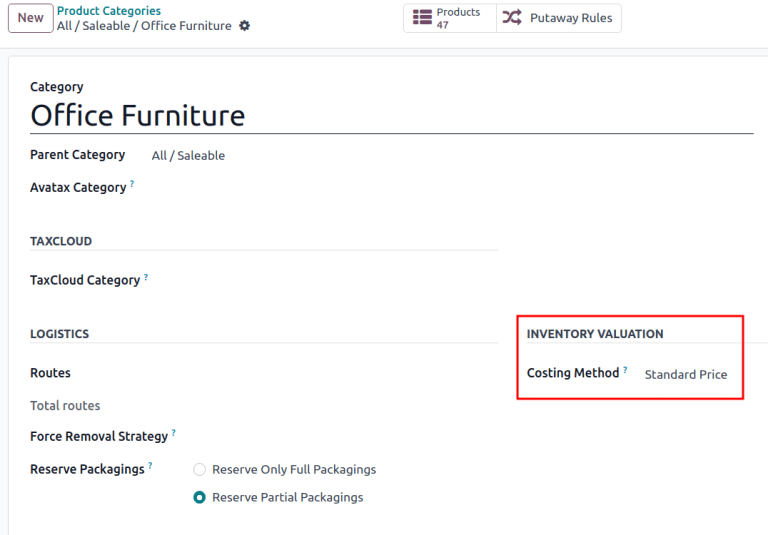

# Automatic inventory valuation

All of a company\'s stock on-hand contributes to the valuation of its
inventory. That value should be reflected in the company\'s accounting
records to accurately show the value of the company and all of its
assets.

By default, Odoo uses a periodic inventory valuation (also known as
manual inventory valuation). This method implies that the accounting
team manually posts journal entries, based on the physical inventory of
the company, and warehouse employees take the time to count the stock.
In Odoo, each product category reflects this, with the
`Costing Method` set to `Standard
Price`, and the
`Inventory Valuation` (not visible by
default) set to `Manual`.

Alternatively, perpetual (automatic) inventory valuation creates
real-time *journal entries* in the *Accounting* app whenever stock
enters or leaves the company\'s warehouse.

This document is focused on the proper setup of automatic inventory
valuation, which is an integrated valuation method that ensures journal
entries in the *Accounting* app match stock valuation updates in the
*Inventory* app. For an introduction of inventory valuation in Odoo,
refer to the `using_inventory_valuation`
documentation.

:::: warning

Switching from manual to automatic inventory valuation may cause
discrepancies between stock valuation and accounting journals.

One [successful strategy](https://www.odoo.com/r/Kvfg) for switching to
automated valuation:

1.  Clear existing stock (possibly with an `inventory adjustment
    `)
2.  Change the inventory valuation method to *Automatic*
3.  Return the existing stock, with the original monetary value (using
    an inventory adjustment)

Once the existing stock is recovered, the Odoo *Accounting* app
automatically generates the journal entries to corresponding stock
valuation records.
::::

## Configuration

To properly set up automatic inventory valuation, follow these steps in
Odoo:

1.  `Install Accounting app and enable specific settings
    `
2.  `Set Automatic inventory valuation on product categories
    `
3.  `Set costing method `

### Accounting setup 

To use automatic inventory valuation, install the *Accounting* app.
Next, go to
`Accounting app ‣ Configuration ‣ Settings`, and in the `Stock
Valuation` section, tick the
`Automatic Accounting` checkbox.
Then, click `Save`.

::: tip

Enabling `Automatic Accounting` shows
the previously invisible *Inventory Valuation* field on a product
category.
::::

Refer to the
`Expense ` and `Stock
input/output ` sections of documentation for details on configuring the
accounting journals shown.

### Product category setup 

After
`enabling inventory valuation `, the next step is to set the product category to use
automatic inventory valuation.

Go to
`Inventory app ‣ Configuration ‣ Product Categories`, and select the desired product category. In the
`Inventory Valuation` section, set
the `Inventory Valuation` field to
`Automated`. Repeat this step for
every product category intending to use automatic inventory valuation.

::: tip

After enabling automatic accounting, each new stock move layer (SVL),
that is created during inventory valuation updates, generates a journal
entry.
::::

## Costing method 

After
`enabling inventory valuation `, the *costing method* for calculating and recording
inventory costs is defined on the product category in Odoo.

Go to
`Inventory app ‣ Configuration ‣ Product Categories` and select the desired product category. In the
`Inventory Valuation` section, select
the appropriate `Costing Method`:

:::::::: tabs
::: tab
Standard Price

The default costing method in Odoo. The cost of the product is manually
defined on the product form, and this cost is used to compute the
valuation. Even if the purchase price on a purchase order differs, the
valuation is the cost defined on the product form.

  Operation                          Unit Cost   Qty On Hand   Incoming Value   Inventory Value
  ---------------------------------- ----------- ------------- ---------------- -----------------
                                     \$10        0                              \$0
  Receive 8 products for \$10/unit   \$10        8             8 \* \$10        \$80
  Receive 4 products for \$16/unit   \$10        12            4 \* \$10        \$120
  Deliver 10 products                \$10        2             -10 \* \$10      \$20
  Receive 2 products for \$9/unit    \$10        4             2 \* \$10        \$40
:::

::::: tab
Average Cost (AVCO)

Calculates the valuation of a product based on the average cost of that
product, divided by the total number of available stock on-hand. With
this costing method, inventory valuation is *dynamic*, and constantly
adjusts based on the purchase price of products.

  Operation                          Unit Cost   Qty On Hand   Incoming Value   Inventory Value
  ---------------------------------- ----------- ------------- ---------------- -----------------
                                     \$0         0                              \$0
  Receive 8 products for \$10/unit   \$10        8             8 \* \$10        \$80
  Receive 4 products for \$16/unit   \$12        12            4 \* \$16        \$144
  Deliver 10 products                \$12        2             -10 \* \$12      \$24
  Receive 2 products for \$6/unit    \$9         4             2 \* \$6         \$36

How are unit cost and inventory value calculated at each step?

- When receiving four products for \$16 each:
  - Inventory value is calculated by adding the previous inventory value
    with the incoming value: $$80 + (4 * $16) = $144$.
  - Unit cost is calculated by dividing the inventory value by the
    quantity on-hand: $$144 / 12 = $12$.
- When delivering ten products, the average unit cost is used to
  calculate the inventory value, regardless of the purchase price of the
  product. Therefore, inventory value is $$144 + (-10 * $12) = $24$.
- Receive two products for \$6 each:
  - Inventory value: $$24 + (2 * $6) = $36$
  - Unit cost: $$36 / 4 = $9$

::: tip

When choosing `Average Cost (AVCO)`
as the `Costing Method`, changing the
numerical value in the *Cost* field for products in the respective
product category creates a new record in the *Inventory Valuation*
report to adjust the value of the product. The *Cost* amount is then
automatically updated, based on the average purchase price of both the
inventory on-hand and the costs accumulated from validated purchase
orders.
::::
:::::

::: tab
First In First Out (FIFO)

Tracks the costs of incoming and outgoing items in real-time, and uses
the real price of the products to change the valuation. The oldest
purchase price is used as the cost for the next good sold, until an
entire lot of that product is sold. When the next inventory lot moves up
in the queue, an updated product cost is used based on the valuation of
that specific lot.

This method is arguably the most accurate inventory valuation method for
a variety of reasons, but it is highly sensitive to input data and human
error.

+--------------+-----------+-------------+--------------+--------------+
| Operation    | Unit Cost | Qty On Hand | Incoming     | Inventory    |
|              |           |             | Value        | Value        |
+==============+===========+=============+==============+==============+
|              | \$0       | 0           |              | \$0          |
+--------------+-----------+-------------+--------------+--------------+
| Receive 8    | \$10      | 8           | 8 \* \$10    | \$80         |
| products for |           |             |              |              |
| \$10/unit    |           |             |              |              |
+--------------+-----------+-------------+--------------+--------------+
| Receive 4    | \$12      | 12          | 4 \* \$16    | \$144        |
| products for |           |             |              |              |
| \$16/unit    |           |             |              |              |
+--------------+-----------+-------------+--------------+--------------+
| Deliver 10   | \$16      | 2           | | -8 \* \$10 | \$32         |
| products     |           |             | | -2 \* \$16 |              |
+--------------+-----------+-------------+--------------+--------------+
| Receive 2    | \$11      | 4           | 2 \* \$6     | \$44         |
| products for |           |             |              |              |
| \$6/unit     |           |             |              |              |
+--------------+-----------+-------------+--------------+--------------+

How are unit cost and inventory value calculated at each step?

- When receiving four products for \$16 each:

  - Inventory value is calculated by adding the previous inventory value
    to the incoming value: $$80 + (4 * $16) = $144$.
  - Unit cost is calculated by dividing the inventory value by the
    quantity on-hand: $$144 / 12 = $12$.

  > - When delivering ten products, eight units were purchased for \$10,
  >   and two units were purchased for \$16.

  - First, the incoming value is calculated by multiplying the on-hand
    quantity by the purchased price: $(-8 * $10) + (-2 * $16) = -112$.
  - The inventory value is calculated by subtracting the incoming value
    from the previous inventory value: $$144 - $112 = $32$.
  - Unit cost is calculated by dividing the inventory value by the
    remaining quantity: $$32 / 2 = $16$.

- When receiving two products for \$6, inventory value is
  $$32 + $12 = $44$. Unit cost is $$44 / 4 = $11$.
:::
::::::::

:::: warning

Changing the costing method greatly impacts inventory valuation. It is
highly recommended to consult an accountant first before making any
adjustments here.
::::

When the `Costing Method` is changed,
products already in stock that were using the
`Standard` costing method **do not**
change value; rather, the existing units keep their value, and any
product moves from then on affect the average cost, and the cost of the
product will change. If the value in the `Cost` field on a product form is changed manually, Odoo
generates a corresponding record in the *Inventory Valuation* report.

::: tip

It is possible to use different valuation settings for different product
categories.
::::

## Types of accounting 

With automated inventory valuation set up, the generated journal entries
depend on the chosen accounting mode: *Continental* or *Anglo-Saxon*.

::: tip

Verify the accounting mode by activating the
`developer-mode`, and navigating to
`Accounting app ‣ Configuration ‣ Settings`.

Then, in the `Search...` bar, look
for [Anglo-Saxon Accounting], to see if the feature is
enabled. If it is **not** enabled, *Continental* accounting mode is in
use.

::::

In *Anglo-Saxon* accounting, the costs of goods sold (COGS) are reported
when products are sold or delivered. This means the cost of a good is
only recorded as an expense when a customer is invoiced for a product.

So, for **manual** valuation method, set the *Expense Account* to *Stock
Valuation* for the current asset type; for **automatic** valuation
method, set the *Expense Account* to an *Expenses* or a *Cost of
Revenue* type (e.g. *Cost of Production*, *Cost of Goods Sold*, etc.).

In *Continental* accounting, the cost of a good is reported as soon as a
product is received into stock. Because of this, the *Expense Account*
can be set to **either** *Expenses* or a *Cost of Revenue* type,
however, it is more commonly set to an *Expenses* account.

Refer to the
`Expense ` and `Stock
input/output ` sections for details on configuring each account type.

### Expense account 

To configure the *expense account*, which is used in both manual and
automatic inventory valuation, go to the
`Account Properties` section of the
intended product category
(`Inventory app ‣ Configuration ‣ Product Categories`). Then, choose an existing account from the
`Expense Account` drop-down menu.

To ensure the chosen account is the correct `Type,` click the `fa-arrow-right` `(right arrow)` icon to
the right of the account. Then, set the account type based on the
information below.

::::::::::: tabs
:::::: group-tab
Anglo-Saxon

::::: tabs
::: group-tab
Automated

In Anglo-Saxon accounting for automated inventory valuation, set the
`Expense
Account` to the
[Expenses] account. Then, click the
`fa-arrow-right`
`(right arrow)` icon to the right of
the account.

In the pop-up window, choose `Expenses` or `Cost of Revenue`
from the `Type` drop-down menu.

:::

::: group-tab
Manual

To configure the `Expense Account`,
choose `Stock Valuation` from the
field\'s drop-down menu. Verify the account\'s type by clicking the
`fa-arrow-right`
`(right arrow)` icon, and then ensure
the `Type` is
`Current Assets`.

:::
:::::
::::::

:::::: group-tab
Continental

::::: tabs
::: group-tab
Automated

Set the `Expense Account` to the
`Expenses` or `Cost of
Revenue` account type.
:::

::: group-tab
Manual

Set the `Expense Account` to the
`Expenses` or `Cost of
Revenue` account type.
:::
:::::
::::::
:::::::::::

#### Stock input/output (automated only) 

To configure the `Stock Input Account` and `Stock Output Account`, go to
`Inventory app ‣ Configuration ‣ Product Categories` and select the desired product category.

In the `Inventory Valuation` field,
select `Automated`. Doing so makes
the `Account Stock Properties`
section appear. These accounts are defined as follows:

- `Stock Valuation Account`: when
  automated inventory valuation is enabled on a product, this account
  will hold the current value of the products.
- `Stock Journal`: accounting journal
  where entries are automatically posted when a product\'s inventory
  valuation changes.
- `Stock Input Account`: counterpart
  journal items for all incoming stock moves will be posted in this
  account, unless there is a specific valuation account set on the
  source location. This is the default value for all products in a given
  category, and can also be set directly on each product.
- `Stock Output Account`: counterpart
  journal items for all outgoing stock moves will be posted in this
  account, unless there is a specific valuation account set on the
  destination location. This is the default value for all products in a
  given category, and can also be set directly on each product.

:::::: tabs
::: group-tab
Anglo-Saxon

In Anglo-Saxon accounting, the `Stock Input Account` and `Stock Output
Account` are set to *different*
`Current Assets` accounts. This way,
delivering products and invoicing the customer balance the *Stock
Output* account, while receiving products and billing vendors balance
the *Stock Input* account.

To modify the account type, go to the click the
`fa-arrow-right`
`(right arrow)` icon to the right of
the stock input/output account. In the pop-up window, choose
`Current Assets` from the
`Type` drop-down menu.

The Stock Input account is set to Stock Interim (Received), a Current
Asset account type.

:::

:::: group-tab
Continental

In Continental accounting, the `Stock Input Account` and `Stock Output
Account` are set to **the same**
`Current Assets` account. That way,
one account can be balanced when items are bought and sold.

::: example
The stock input and output accounts are both set to [Stock Interim
(Received)], a `Current Assets` account type. They can also be set to the [Stock
Interim (Delivered)], as long as the input and output
accounts are assigned to the **same** account.

:::
::::
::::::

## Inventory valuation reporting

To start, go to
`Accounting app ‣ Reporting ‣ Balance Sheet`. Click the `Current Assets` line item to unfold the drop-down menu, and look for
the nested `Stock Valuation`,
`Stock Interim (Received)`, and
`Stock Interim
(Delivered)` lines.

::: tip

At the top of the dashboard, click the `As of [date]` button to display accounting records up to a specified
date.
::::

Access more specific information by clicking the
`fa-ellipsis-v`
`(ellipsis)` icon to the right of the
desired journal. Select `General Ledger` to see a list of all of the journal entries, where each
line item\'s `fa-ellipsis-v`
`(ellipsis)` icon can be clicked to
reveal the `View Journal Entry`
option to open the individualized journal entry.

Additionally, annotations to the `Balance Sheet` can be added by choosing `Annotate`, filling in the text box, and clicking
`Save`.

