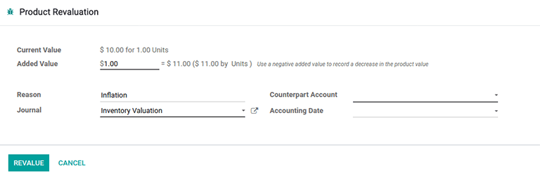

# Using inventory valuation

::: 
*Inventory valuation* is a quintessential accounting procedure that
calculates the value of on-hand stock. Once determined, the inventory
valuation amount is then incorporated into a company\'s overall value.
:::

In Odoo, this process can be conducted manually--- by warehouse
employees physically counting the products--- or automatically through
the database.

## Automatic inventory valuation

To use Odoo to automatically generate a trail of inventory valuation
entries, first navigate to the `Product Categories` list by going to `Inventory app ‣ Configuration
‣ Product Categories` and
select the desired product category. On the form, set the
`Inventory Valuation` as
`Automated` and the
`Costing Method` to any of the three
options.

In order to understand how moving products in and out of stock affects
the company\'s overall value, consider the following product and stock
moves scenario below.

### Receive a product

To track the value of incoming products, such as a simple *table*,
configure the product category on the the product itself. To get there,
navigate to `Inventory app ‣ Products ‣
Products` and click the desired
product. On the product form, click the
`➡️ (right arrow)` icon beside the
`Product Category` field, which opens
an internal link to edit the product category. Next, set the
`Costing Method` as
`First In First Out (FIFO)` and
`Inventory Valuation` as
`Automated`.

::: tip

Alternatively access the `Product Categories` dashboard by navigating to
`Inventory app ‣ Configuration ‣ Product Categories` and select the desired product category.
::::

Next, assume 10 tables are purchased at a price of \$10.00, each. The
`PO (Purchase Order)` for those tables
will show the subtotal of the purchase as \$100, plus any additional
costs or taxes.

After selecting `Validate` on the
`PO (Purchase Order)`, the
`Valuation` smart button is enabled.
Clicking on this button displays a report showing how the inventory
valuation for the table was affected by this purchase.

::: warning

`Developer mode ` **must**
be turned on to see the `Valuation`
smart button.
::::

::: tip

The
`consignment ` feature allows ownership to items in stock. Thus, products
owned by other companies are not accounted for in the host company\'s
inventory valuation.
::::

For a comprehensive dashboard that includes the inventory valuation of
all product shipments, inventory adjustments, and warehouse operations,
refer to the `stock valuation report
`.

### Deliver a product

In the same logic, when a table is shipped to a customer and leaves the
warehouse, the stock valuation decreases. The
`Valuation` smart button on the
`DO (Delivery Order)`, likewise, displays
the stock valuation record as it does on a
`PO (Purchase Order)`.

## Inventory valuation report 

To view the current value of all products in the warehouse, first turn
on `Developer mode
` and navigate to
`Inventory app ‣ Reporting ‣ Valuation`. The `Stock Valuation` dashboard displays detailed records of products with
the `Date`,
`Quantity`,
`Unit Value`, and
`Total Value` of the inventory.

::: warning

`Developer mode ` **must**
be enabled to see the `Valuation`
option under `Reporting`.
::::

The `Valuation At Date` button,
located in the top-left corner of the `Stock
Valuation` page, reveals a pop-up
window. In this pop-up, the inventory valuation of products available
during a prior specified date can be seen and selected.

::: tip

View a detailed record of a product\'s inventory value, stock move, and
on-hand stock by selecting the teal `➡️ (right arrow)` button to the right of the
`Reference` column value.
::::

### Update product unit price 

For any company: lead times, supply chain failures, and other risk
factors can contribute to invisible costs. Although Odoo attempts to
accurately represent the stock value, *manual valuation* serves as an
additional tool to update the unit price of products.

::: warning

Manual valuation is intended for products that can be purchased and
received for a cost greater than 0, or have product categories set with
`Costing Method` set as either
`Average Cost (AVCO)` or
`First In First Out (FIFO)`.
::::

Create manual valuation entries on the
`Stock Valuation` dashboard by first
navigating to
`Inventory app ‣ Reporting ‣ Valuation`. Next, to enable the *product revaluation*
feature, select `Group by ‣ Product` to organize all the records by product. Click on
the gray `▶️ (drop-down triangle)`
icon to reveal stock valuation line items below, as well as a teal
`➕ (plus)` button on the right.

Click the teal `+ (plus)` button to
open up the `Product Revaluation`
form. Here, the inventory valuation for a product can be recalculated,
by increasing or decreasing the unit price of each product.

::: tip

The `▶️ (drop-down triangle)` and
`➕ (plus)` buttons are only visible
after grouping entries by product.
::::

### Inventory valuation journal entries

In Odoo, automatic inventory valuation records are also recorded in the
`Accounting
app ‣ Accounting ‣ Journal Entries` dashboard. On this comprehensive list of
accounting entries, inventory valuation records are identified by
checking values in the `Journal`
column, or looking for the `Reference` column value which matches the warehouse operation
reference (e.g. [WH/IN/00014] for receipts).

Clicking on an inventory valuation journal entry opens a *double-entry
accounting* record. These records are generated by Odoo to track the
change of value in inventory valuation as products are moved in and out
of the warehouse.

::: tip
To view the inventory valuation of 10 *tables*, costing \$10.00 each,
upon reception from the vendor, go to the
`Journal Entries` page found in
`Accounting app
‣ Accounting ‣ Journal Entries`. Here, click the journal line where the
`Reference` column value matches the
reference on the receipt, [WH/IN/00014].

[Stock interim] is a holding account for money intended to
pay vendors for the product. The [stock valuation] account
stores the value of all on-hand stock.

:::

