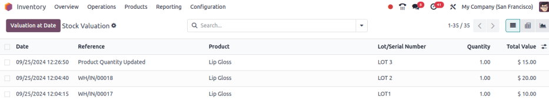

# Valuation by lots/serial numbers

Track
`inventory valuation ` by `lots or serial numbers
` to:

1.  `Compare and differentiate purchasing cost `, based on lot or serial numbers.
2.  Track the actual cost of manufactured products, based on the real
    cost of each tracked component used.
3.  Depreciate specific lot or serial numbers when they
    `sit in stock for too long
    `.

::: warning

Please read this
`introduction to inventory valuation ` before setting up valuation by lot/serial numbers.
::::

## Configuration

To enable valuation by lots or serial numbers, begin by enabling the
`Lots and Serial Numbers
feature `. After
that, go to `Inventory app ‣ Products ‣
Products`, and select the
desired product, or create a new product, by clicking
`New`.

On the product form, in the `Category` field, choose a product category. Ensure the product
category\'s
`Costing Method ` is set to *First In First Out (FIFO)* or *Average Cost
(AVCO)*.

::: tip

To check the costing method set on the product category, hover over the
`Category` field, and click the
`oi-arrow-right`
`(Internal Link)` icon.
::::

Next, activate the product to be tracked by lots or serial numbers by
ticking the `Track
Inventory` checkbox. Then, click the
adjacent field that appears, and choose either `By
Lots` or
`By Unique Serial Number` from the
resulting drop-down menu.

Doing so makes the `Valuation by Lot/Serial number` checkbox appear below it. Tick that checkbox, and the
configuration to track valuation by lot or serial numbers is complete.

Product form showing the Valuation by Lot or Serial Number
feature

## Valuation layers

To understand how valuation by lots and serial numbers works, consider
these scenarios:

1.  `Purchase and sell products `: cost is calculated based on the *product category\'s*
    costing method.
2.  `Create new lot/serial numbers ` using an inventory adjustment: value of the new
    lot/serial number is assigned to the cost from the product form.
3.  Inventory adjustment to update quantities for an
    `existing lot/serial number
    `: value is assigned based on the most recent cost for
    that lot/serial number.

For both `AVCO (Average Cost)` and
`FIFO (First In First Out)` methods, the
*Cost* field on the product form is calculated using this formula:

$Avg~Cost = \frac$

### Purchase products 

Consider how purchasing products affect the inventory valuation, in the
table below.

                                                Quantity   Lot number   Math                Average cost on product form
  --------------------------------------------- ---------- ------------ ------------------- ------------------------------
  Empty stock                                   0.00                                        \$0
  Day 1: Receive one product at \$10/unit       1.00       LOT 1        $\frac$      \$10
  Day 2: Receive another product at \$20/unit   1.00       LOT 2        $\frac$   \$15

As a result, the product form displays an average cost of
$15 in the Cost field.

### Create new lot/serial number 

Creating a new lot/serial number through an `inventory adjustment
` assigns the same value as the cost on the product form.

To make an inventory adjustment, and assign a lot number, go to
`Inventory app ‣
Operations ‣ Physical Inventory`. Then, click `New`.

In the new inventory adjustment line that appears, set the
`Product`, create the
`Lot/Serial Number`, set the
`Counted Quantity`, and click
`fa-floppy-o` `Apply`.

To view the valuation layer, go to
`Inventory app ‣ Reporting ‣ Valuation`. The `Total Value` per unit matches the *Cost* on the product form.

::: example
Continuing the example in the table above, when the product cost is
[\$15], the valuation for a newly-created [LOT3]
is also be [\$15].

:::

### Existing lot/serial number 

When adjusting the quantity of an existing lot/serial number, the value
is based on the most recent valuation layer for that specific lot/serial
number.

::: example
Continuing the example in the table above, the value for [LOT
1] is [\$10].

So, when the quantity is updated from [1.00] to
[2.00], the additional quantity is also valued at
[\$10], reflecting the latest valuation layer for [LOT
1].

The inventory adjustment (top line) is valued the same as
LOT 1 (bottom line).

:::

## View valuation 

To find the average cost of a specific lot/serial number, go to
`Inventory app ‣
Products ‣ Lots/Serial Numbers`, and select the desired record.

Both the `Cost` and
`Average Cost` fields show a unit\'s
average cost. The `Total Value`
reflects the total on-hand value for that lot/serial number.

::: warning

Ensure the costing method is set to *First In First Out (FIFO)* or
*Average Cost (AVCO)* to display the cost on this page.
::::

Lot form, displaying Cost field. The
Valuation smart button is in the
top-right.

Valuation layers of a lot/serial number can be viewed through the
`valuation report
`, or by clicking the lot/serial number\'s
`Valuation` smart button. These
detailed, line-by-line records can help determine how each inventory
move of the specific lot/serial number affects its valuation.

### Valuation report 

Display the valuation of lots and serial numbers in the database by
going to `Inventory app ‣ Reporting ‣ Valuation`.

On the resulting `Stock Valuation`
report, click the search bar, and in the `oi-group` `Group By` section of
the resulting drop-down menu, select
`Lot/Serial number`.

::: tip

Click the `fa-plus`
`(plus)` icon to the right of a
collapsed lot number line to
`manually modify the cost `.

This is useful for adjusting individual lot prices when a purchase order
or bill includes multiple lots/serial numbers, as initial prices are
identical upon reception.
::::

### Valuation smart button

To access a filtered part of the *Stock Valuation* report, specific to a
lot or serial number, go to
`Inventory app ‣ Products ‣ Lots/Serial Numbers`, and select the desired item.

On the `Lot/Serial Numbers` page,
click the `Valuation` smart button.

All stock moves that affect the valuation of LOT 1.

