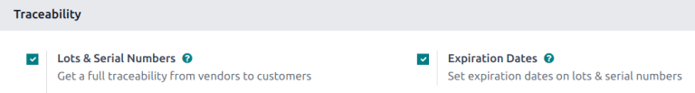
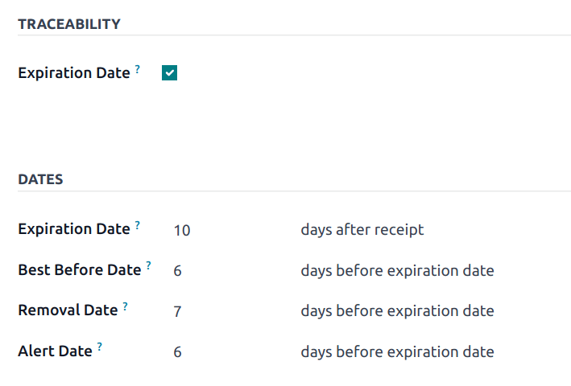
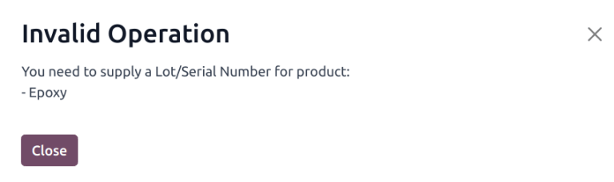
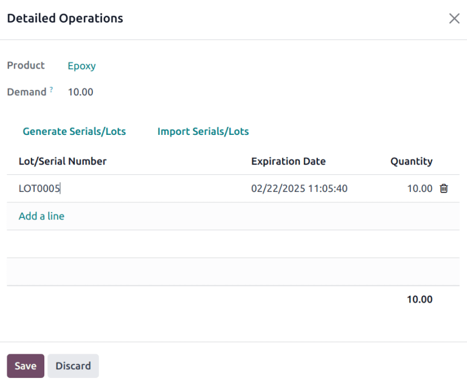
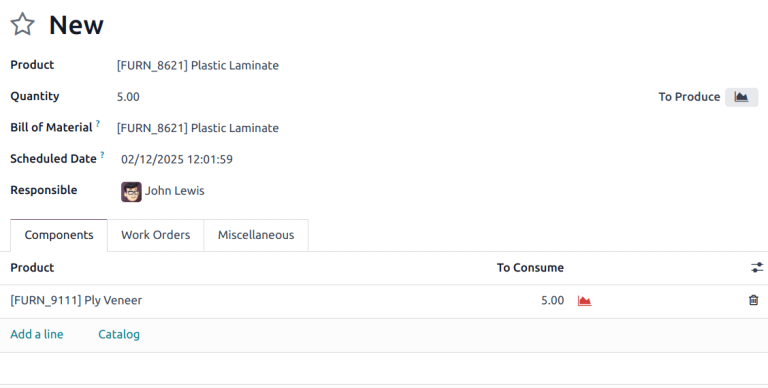
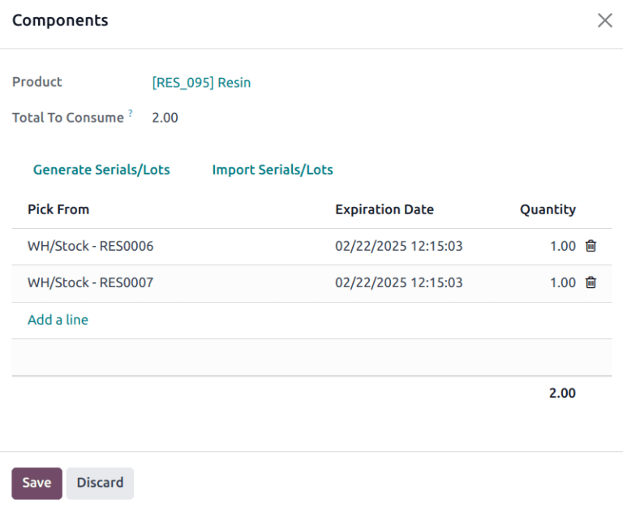
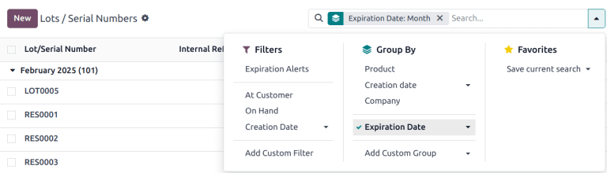
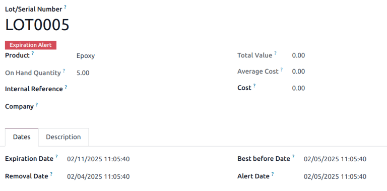

# Expiration dates

::: 
In Odoo, *expiration dates* can be used to manage and track the
lifecycles of perishable products, from purchase to sale. Using
expiration dates reduces product loss due to unexpected expiry, and
helps to avoid sending expired products to customers.
:::

In Odoo, only products that are tracked using *lots* and *serial
numbers* can be assigned expiration information. Once a lot or serial
number has been assigned, an expiration date can be set. This is
especially helpful for companies (such as food manufacturers) that
consistently, or exclusively, buy and sell perishable products.

## Enable expiration dates

To enable the use of *expiration dates*, go to
`Inventory app ‣ Configuration ‣
Settings`, and scroll down to
the `Traceability` section. Then,
click the checkbox to enable the
`Lots & Serial Numbers` feature.

Once that feature is activated, a new option will appear to enable
`Expiration Dates`. Click that
checkbox to enable the feature, and be sure to `Save` changes.

::: tip

Once the `Lots & Serial Numbers`
feature is activated, an additional feature appears to
`Display Lots & Serial Numbers on Delivery Slips`. Activating these features helps with end-to-end
traceability, making it easier to manage product recalls, identify
batches of faulty products, and more.
::::

## Configure expiration dates on products

Once the `Lots & Serial Numbers` and
`Expiration Dates` features have been
enabled in the **Inventory** app settings, expiration information can be
configured on individual products.

To do so, go to
`Inventory app ‣ Products ‣ Products`, and select a product to edit. Selecting a product
reveals the product form for that particular item.

::: warning

To be tracked using lots or serial numbers, or to configure expiration
information, products *must* have their `Product Type` set as `Goods` under
the `General
Information` tab. Then, in the
`Track Inventory` field, select
either `By
Unique Serial Number` or
`By Lots`.
::::

Then, click the `Inventory` tab, and
scroll down to the `Traceability`
section. Tick the `Expiration Date`
checkbox.

::: tip

If a product has stock on-hand prior to activating tracking by lots or
serial numbers, an inventory adjustment might need to be performed in
order to assign lot numbers to the existing stock.
::::

::: tip

For processing large quantities of products on receipts or deliveries,
it is recommended to track using lots, so multiple products can be
traced back to the same lot, if any issues arise.
::::

Under the `Dates` section, there are
four categories of expiration information to configure for the product:

- `Expiration Time`: the number of
  days after receiving products (either from a vendor or in stock after
  production) in which goods may become dangerous and should not be used
  or consumed.
- `Best Before Time`: the number of
  days before the expiration date in which the goods start
  deteriorating, **without** being dangerous yet.
- `Removal Time`: the number of days
  before the expiration date in which the goods should be removed from
  stock.
- `Alert Time`: the number of days
  before the expiration date in which an alert should be raised on goods
  in a particular lot or containing a particular serial number.

::: tip

The values entered into these fields automatically compute the
expiration date for goods entered into stock, whether purchased from a
vendor or manufactured in-house.
::::

::: tip

If the `Dates` field is not populated
with any values for expiration information, dates (and lots) can be
manually assigned upon receipts and deliveries in and out of the
warehouse. Even when assigned, they can still be overwritten and changed
manually if needed, as well.
::::

## Set expiration dates on receipts with lots & serial numbers

Generating expiration dates for *incoming* goods can be done directly on
the `Receipt`. Navigate to
`Inventory app ‣ Operations ‣ Receipts`, then click on a line to open the
`Receipt` record.

::: warning

Clicking `Validate` before assigning
a serial number to the ordered product quantities causes a
`User Error` popup to appear. The
popup requires entry of a lot or serial number for the ordered products.
The receipt cannot be validated without an assigned lot or serial
number.

::::

From here, click the `fa-list`
`(Details)` icon located on the of
the product line. When clicked, a
`Detailed Operations` pop-up will
appear.

In the pop-up, the `Expiration Date`
automatically populates, based on the configuration on the product form.
Click the `Lot/Serial Number` field
on the appropriate line, then enter the lot or serial number.

::: tip

If the `Dates` field on the product
form has not been configured, the `Expiration Date` can be manually entered.
::::

Click `Save` when finished to close
the pop-up. Finally, click `Validate`.

A `Traceability` smart button will
appear upon validating the receipt. Click the
`Traceability` smart button to see
the updated `Traceability Report`,
which includes: a `Reference`
document; the `Product` being traced;
the `Lot/Serial #`; and more.

## Set expiration dates on manufactured products

Expiration dates can also be generated for products manufactured
in-house. To assign expiration dates to manufactured products, a
manufacturing order (MO) needs to be completed.

To create a `MO (manufacturing order)`,
go to `Manufacturing app ‣ Operations
‣ Manufacturing Orders`, and
click `New`. Choose a product to
manufacture from the `Product` field
drop-down menu, then select the `Quantity` to produce.

::: tip

To manufacture a product, there must be materials to consume in the
lines in the `Product` column. This
can be achieved either by creating a `Bill of
Material` for the
`Product`, or manually adding
materials to consume by clicking `Add a line`.
::::

Once ready, click `Confirm`.

The appropriate number of `Lots/Serial Numbers` automatically populated in the field. Click the
`fa-list` `(Details)` icon to reveal additional information for those
specific numbers. On that pop-up, all expiration information that was
previously configured for the product is displayed.

## Sell products with expiration dates

Selling perishable products with expiration dates is done the same as
any other type of product. The first step in selling perishable products
is to create a sales order.

To do that, go to `Sales app ‣ New` to create a new quotation, and fill out the
information on the sales order form.

Add a `Customer`, then click
`Add a product` to add the desired
products to the `Product` lines, and
set a `Quantity` for the products.

Then, click the `Other Info` tab.
Under the `Delivery` section, change
the `Delivery Date` to a date after
the expected date, and click `Apply`
to confirm the date. Finally, click `Confirm` to confirm the sales order.

::: warning

If the products are delivered before the `Alert Date` set on the product form, then no alerts are created.
::::

Next, click the `Delivery` smart
button at the top of the sales order to see the warehouse receipt form.

On the warehouse receipt form, click `Validate`, and then `Apply` in
the accompanying pop-up window, to automatically process all
`Done` quantities, and deliver the
products to the customer.

::: warning

To sell perishable products with expiration dates, the
`Removal Strategy` for the
`Location` the products are stored in
must be set to `FEFO (First Expiry, First
Out)`. If there is not enough stock of
perishable products in one lot, Odoo will automatically take the
remaining quantity required from a second lot with the next-soonest
expiration date. Removal strategies can also be set on
`Product Categories`.
::::

## View expiration dates for lots & serial numbers

To view (and/or group) all products with expiration dates by lot number,
go to
`Inventory app ‣ Products ‣ Lots/Serial Numbers`.

Once there, remove any default search filters from the search bar. Then,
click `Group By`, choose
`Add Custom Group`, and select the
`Expiration Date` parameter from the
drop-down menu. Doing so breaks down all perishable products, their
expiration dates, and the assigned lot number.

::: tip

Customers can also view the expiration date alert in their customer
portal.
::::

### Expiration alerts 

To see expiration alerts, go to
`Inventory app ‣ Products ‣ Lots/Serial Numbers`.

Then, click into a `Lot/Serial Number` with perishable products. Doing so reveals the serial
number detail form.

::: tip

To view expiration date information in the list view, click the
`oi-settings-adjust`
`(adjust settings)` icon at the top
of the list of records, then tick the
`Expiration Date` checkbox.
::::

On the `Lot/Serial Number` detail
form, the `Dates` lists all
expiration information related to the products.

If the expiration date for a lot/serial number has passed, the form
displays a red `Expiration Alert` at
the top of the page to indicate that the products in this lot are either
expired or expiring soon.

From here, click back to the `Lots/Serial Numbers` page (via the breadcrumbs).

To see the new expiration alert, or any expiration alerts for products
that are expired (or will expire soon), click back to the
`Lots/Serial Numbers` page via the
breadcrumbs. Remove all of the search filters from the search bar on the
`Lots/Serial Numbers` dashboard.

Then, click `Filters`, and choose
`Expiration Alerts`.

### Expiration notifications

Users can be notified when the expiration date for a product has passed.
This can help keep specific employees up to date on the status of items
under their purview.

To configure a notification, navigate to
`Inventory app ‣ Products ‣ Products`. Select a product configured with lot/serial
numbers and expiration date tracking. Navigate to the
`Inventory` tab. Under the
`Logistics` section, select a user in
the `Responsible` field.

When the expiation date passes for a lot/serial number for this product,
a notification is sent to the user in this field.
