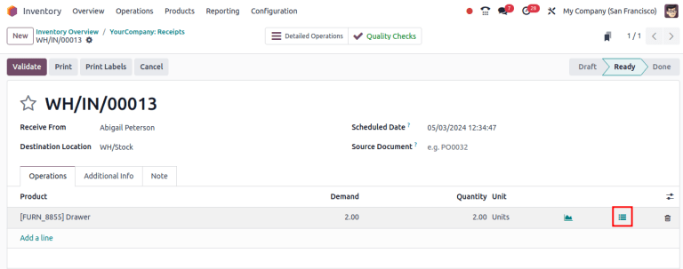
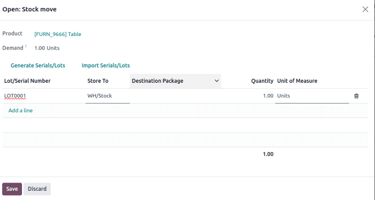
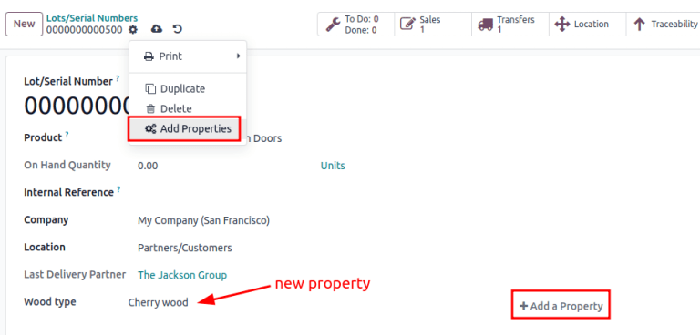
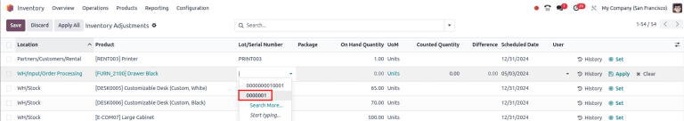
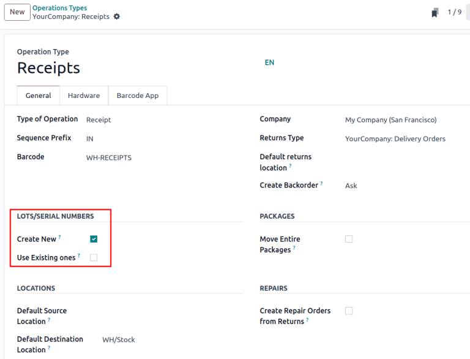
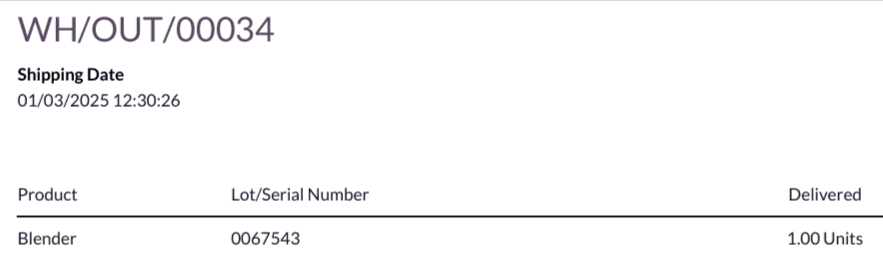
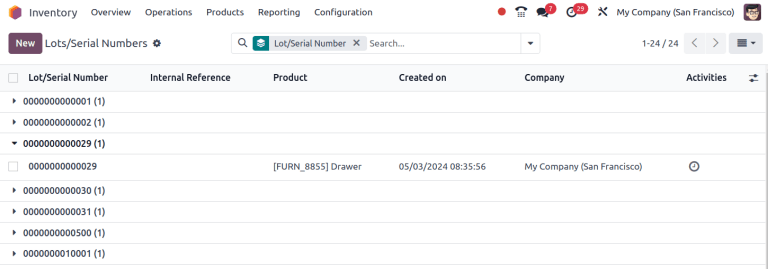

# Lot numbers

*Lots* are one of the two ways to identify and track products in Odoo.
They typically represent a specific batch of products that were
received, stored, shipped, or manufactured in-house.

Manufacturers assign lot numbers to groups of products sharing common
properties, facilitating end-to-end traceability through their
lifecycles.

Lots are useful for managing large quantities of manufactured or
received products, aiding in tracing items back to their group,
particularly for product recalls or `expiration dates
`.

## Enable lots & serial numbers

To track products using lots, enable the *Lots & Serial Numbers*
feature. Go to the
`Inventory app ‣ Configuration ‣ Settings`, scroll down to the
`Traceability` section, and tick the
checkbox next to `Lots & Serial Numbers`. Then, click `Save`.

## Track by lots 

Once the `Lots & Serial Numbers`
feature is activated, configure individual products to be tracked using
lots. To do this, go to
`Inventory app ‣ Products ‣ Products`, and choose a product to configure.

On the product form, go to the `Inventory` tab. In the `Traceability` section, select the `By Lots` option in the `Tracking` field. Now, new or existing lot numbers can be assigned
to newly-received or manufactured batches of this product.

::: warning

If a product has stock on-hand prior to activating tracking by lots or
serial numbers, a warning message appears. Use an
`inventory adjustment ` to
assign lot numbers to existing products in stock.
::::

## Assign lots for shipping and receiving

Assign new lot numbers to
`incoming goods ` on the receipt form. When shipping `outgoing goods
`, select products with specific lot numbers on the delivery
order form.

### On receipts 

Assigning new or existing lot numbers to incoming goods can be done
directly on receipts.

To begin, go to the `Purchase`
app to [create and confirm](https://www.youtube.com/watch?v=o_uI718P1Dc)
a `PO (Purchase Order)` for products
tracked by lot numbers. Then, click the `Receipt` smart button that appears at the top of the page to
navigate to the warehouse receipt form.

::: tip

Alternatively, navigate to an existing receipt by going to the
`Inventory` app, clicking the
`Receipts` Kanban card, and choosing
the desired receipt.
::::

::: warning

Clicking `Validate` before assigning
a lot number triggers an error, indicating that a lot number **must** be
assigned before validating the receipt.

::::

On the receipt form, on the product line in the
`Operations` tab, select the
`fa-list` `(list)` icon to the right of the product that is tracked by lot
numbers.

Doing so opens the `Open: Stock move`
pop-up window, where the `Lot/Serial
Number` and
`Quantity` are assigned.

The two ways to assign lot numbers: **manually** and **importing**.

#### Manual assignment

To manually assign lot numbers, click `Add a line`. Input the `Lot/Serial
Number`, `Store To` location for the lot, `Quantity`, and `Destination
Package`, if any.

::: tip

To assign multiple lot numbers, or store to multiple locations, click
`Add a line`, and type a new
`Lot/Serial Number` for additional
quantities. Repeat until the total in the `Quantity` column matches the `Demand` at the top.
::::

#### Import lots

In the `Open: Stock move` pop-up
window, click `Import Serials/Lots`,
then paste the bulk lot numbers, in the
`Lots/Serial numbers` field.

List of lot numbers copied on Google
spreadsheets.

Lot numbers pasted to the "Lots/Serial numbers" field, in
the Import Lots pop-up window.

Tick the `Keep current lines`
checkbox to generate *additional* lot numbers in the
`Open: Stock move` pop-up window. To
replace the lot numbers in the list, leave the
`Keep current lines` option unticked.

Finally, click `Generate`.

Once all product quantities have been assigned a lot number, click
`Save` to close the pop-up window.
Then, click `Validate` on the receipt
form.

### On delivery orders 

Odoo makes it possible to specify which lot numbers for a product are
chosen for outgoing shipment on a delivery order form.

To begin, create or select an existing quotation from the
`Sales` app. After confirming
the `SO (Sales Order)`, the
`Delivery` smart button becomes
available. Click the `Delivery` smart
button to view the warehouse receipt form for that specific
`SO (Sales Order)`.

::: tip

Alternatively, navigate to delivery orders by going to the
`Inventory` app, and clicking
the `Delivery Orders` kanban card.
::::

Clicking the `Delivery` smart button
opens the the delivery order form, where lot numbers are picked for
delivery. In the `Operations` tab,
click the `fa-list`
`(list)` icon to the right of the
product that is tracked by lot numbers. Clicking that icon reveals a
`Open: Stock
move` pop-up window.

In the pop-up window, the chosen lot number and its storage location is
displayed in the `Pick From` column,
with the with the full `Quantity`
taken from that specific lot (if there is enough stock in that
particular lot).

If there is insufficient stock in that lot, or if partial quantities of
the `Demand` should be taken from
multiple lots, change the `Quantity`
directly.

::: tip

The lot automatically chosen for delivery orders varies, depending on
the selected removal strategy
(`FIFO (First In, First Out)`,
`LIFO (Last In, First Out)`, or `FEFO
(First Expiry, First Out)`). It also
depends on the ordered quantity, and whether the lot\'s on-hand quantity
is enough to fulfill the order.
::::

Repeat the above steps to select enough lots to fulfill the
`Demand`, and click
`Save` to close the pop-up window.
Lastly, click the `Validate` button
on the `DO (Delivery Order)` to deliver
the products.

## Lot management

Manage and view existing lot numbers for products in the
`Lot/Serial Numbers` dashboard by
going to
`Inventory app ‣ Products ‣ Lots/Serial Numbers`.

By default, lot numbers are grouped by product, and selecting the
drop-down menu for each product displays the existing lot numbers.
Select a lot number to `modify or add details
`
linked to the lot. Lot numbers can also be `created
` from this page, by clicking the `New` button.

Display lot numbers, grouped by products, on the
Lot/Serial Number dashboard.

### Modify lot 

Clicking a lot from the `Lot/Serial Number` dashboard reveals a separate page where additional
information can be provided about the lot.

::: tip

Odoo automatically generates a new `Lot/Serial Number` to follow the most recent number. However, it can be
edited, by clicking the line under the
`Lot/Serial Number` field, and
changing the generated number to any desired one.
::::

On the lot number form, the following fields can be modified:

- `Lot/Serial Number`: change the lot
  number linked to the `Product`
- `Internal Reference`: records an
  alternative lot/serial number used within the warehouse that differs
  from the one used by the supplier manufacturer.
- `Company`: specify the company
  where the lot number is available.
- `Description`: add extra details
  about the lot or serial number in this text field.

::: warning

On existing lots, the `Product` and
`On Hand Quantity` fields **cannot**
be modified, as the lot numbers are linked with existing stock moves.
::::

#### Add property

To add custom fields to lots for enhanced traceability, there are two
methods of adding properties on a lot number form:

1.  Click the `fa-cog`
    `(cog)` icon at the top-left of
    the page, then select `fa-cogs`
    `Add Properties` from the
    drop-down menu.
2.  Click the `fa-plus`
    `Add a Property` button, located
    below the existing fields.

Name and
`configure the new field `. Once finished, enter the property value in the new field.

::: tip
The new property, [Wood type], is added. The value is
recorded as [Cherry wood].

:::

### Reserve lot number for a product 

To create a lot number for a product, begin by going to
`Inventory app ‣ Products
‣ Lot/Serial Numbers`, and
click `New`.

::: warning

Creating a lot number reserves it for a product but **does not** assign
it. To assign lot numbers, refer to the section on
`assigning lot numbers on receipts
`.
::::

::: tip

While Odoo automatically generates a new
`Lot/Serial Number` to follow the
most recent number, it can be edited and changed to any desired number,
by clicking the line under the `Lot/Serial Number` field on the lot form, and changing the generated
number.
::::

Once the new `Lot/Serial Number` is
generated, click the blank field next to `Product` to reveal a drop-down menu. From this menu, select the
product to which this new number will be assigned.

::: tip
The lot number, [000001], is created for the product,
[Drawer Black].

:::

After a new lot number has been created, saved, and assigned to the
desired product, the lot number is saved as an existing lot number
linked to the product, and can be selected when `assigning
lot numbers to products on a receipt `, or when making an inventory adjustment.

::: tip
After creating the lot number, [000001] appears as an option
for [Drawer Black] when assigning lot numbers on the
`Inventory Adjustment` page.

:::

## Manage lots for different operations types

By default, new lots can only be created when receiving products, and
existing lot numbers cannot be used. For sales orders, only existing lot
numbers can be utilized, and new ones cannot be created on the delivery
order.

To change the ability to use new (or existing) lot numbers on any
operation type, go to the
`Inventory app ‣ Configuration ‣ Operations Types`, and select the desired operation type.

On the operation type form, under the
`Lots/Serial Numbers` section, tick
the `Create New` checkbox to enable
new lot numbers to be created during this operation type. Choose
`Use Existing ones` if only existing
lot numbers can be selected.

::: tip

For inter-warehouse transfers involving products tracked by lots, it can
be useful to enable the
`Use Existing Lots/Serial Numbers`
option for warehouse receipts.
::::

## Display lots on delivery slips 

When selling products tracked with lots, it is possible to include the
lot numbers on the delivery slips sent to customers. This can be helpful
to customers in cases where lot numbers are needed, such as filing an
RMA or repair request, or registering the product.

To include lot numbers on delivery slips, open the
`Inventory` app, and navigate to
`Configuration ‣ Settings`.
Scroll down to the `Traceability`
section, tick the
`Display Lots & Serial Numbers on Delivery Slips` checkbox, and click `Save`.

After enabling the
`Display Lots & Serial Numbers on Delivery Slips` setting, lot numbers are listed on delivery slips for
products tracked by lots, once the delivery order is validated.

To view lot numbers on delivery orders and delivery slips, navigate to
the `Inventory` app, click on
`Delivery Orders`, and select an
order containing a product tracked using lots.

To view the lot numbers of products included in the order, make sure the
`Operations` tab is selected, then
click the `oi-settings-adjust`
`(adjust)` button to the right of the
tab. Ensure that the `Serial Numbers`
checkbox is ticked, which causes a `Serial Numbers` column to appear. The lot number(s) for each product
included in the order are displayed in this column.

When the order is ready to be processed, click
`Validate` to confirm the delivery
and add product information to the delivery slip.

At the top of the order\'s form, click the `fa-cog` `(Actions)` button, and
select `Print ‣ Delivery Slip`. The
delivery slip is then downloaded. Open the delivery slip using the
device\'s browser or file manager. Lot numbers are listed next to their
respective products in the `Lot/Serial Number` column.

## Traceability

Manufacturers and companies can refer to traceability reports to see the
entire lifecycle of a product: where it came from, when it arrived,
where it was stored, who it went to (and when).

To see the full traceability of a product, or group by lots, go to the
`Inventory app
‣ Products ‣ Lots/Serial Numbers`. Doing so reveals the
`Lots/Serial Numbers` dashboard.

From here, products with lot numbers assigned to them will be listed by
default, and can be expanded to show the lot numbers those products have
assigned to them.

To group by lots, begin by removing any filters in the
`Search...` bar. Then, click the
`fa-caret-down`
`(caret down)` icon to open a
drop-down menu of `Filters`,
`Group By` options, and
`Favorites`. Under the
`Group By` section, click the
`Add Custom Group` option, and select
`Lot/Serial Number` from the
drop-down menu.

Doing so reorganizes all the records on the page to display all existing
lots and serial numbers, and can be expanded to show all quantities of
products with that assigned number.

### Traceability report

To view a full stock moves report for a lot number, select the lot
number line from the `Lots/Serial Number` dashboard. On the lot number form, click the
`Traceability` smart button.

