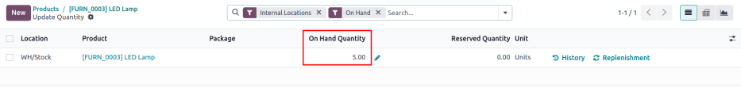
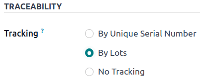

# Reassign lot/serial numbers

Changing a product\'s tracking settings to use lots or serial numbers,
*after* storing products in Odoo without them, can lead to inconsistent
records. Follow this documentation to learn how to use an inventory
adjustment to assign lot or serial numbers to products that were not
originally assigned lots.

::: tip

This document outlines the process of using two inventory adjustments:
one to remove incorrect records *without* lot numbers, and another to
save the quantities *with* the lot numbers.
::::

## Change on-hand quantity to zero

To change the product\'s settings to track by lots or serial numbers,
begin by navigating to
`Inventory app ‣ Products ‣ Products`, and select the intended product.

Next, click the product\'s `On Hand`
smart button to open the `Update Quantity` page. In the `On Hand Quantity` column, change the value to zero.

::: tip

If the product is stored in multiple locations, make sure the **total**
on hand quantity at **all** locations is zero.
::::

## Change traceability setting

Return to the product form
(`Inventory app ‣ Products ‣ Products`), and switch to the `Inventory` tab. In the `Traceability` section, change the `Tracking` option from `No Tracking` to `By Lots` or `By
Unique Serial Number`.

## Restore on-hand quantity

After manually changing the on-hand quantity to zero and changing the
`Tracking` setting to lots or serial
numbers, restore the quantities by clicking the
`On Hand` smart button from the
desired product form.

On the `Update Quantity` page,
because the on-hand quantity had been previously changed to zero, a
`No Stock On Hand` warning appears on
the page. From here, click the `New`
button in the top-left corner. Doing so reveals a new, modifiable line
on the `Update Quantity` page. Then,
input a desired lot number in the `Lot/Serial
Number` field, and adjust the
`On Hand Quantity` to its original
value.

::: tip

To find the original quantity, and adjust the
`On Hand Quantity` accordingly, after
assigning a new lot or serial number, click the
`fa-pencil` `(pencil)` icon in the `On Hand Quantity` column. Then, click the `fa-history` `History` button on the
far-right.

The inventory adjustment that changed the on-hand quantity to zero is
displayed in the `Quantity` field.

> 
::::
