# Serial numbers

*Serial numbers* are one of the two ways to identify and track products
in Odoo, along with `lots `. A
serial number is a unique identifier assigned to a product to
distinguish it from other products in a series. Serial numbers can
consist of several character types: they can contain numbers, letters,
other typographical characters, or any mix of these character types.

The goal of assigning serial numbers allows for the tracking of
individual products and their
`expiration dates ` and
location throughout the supply chain. For instance, serial numbers can
help manufacturers locate products to provide after-sales services or in
the event of a recall.


## Enable lots & serial numbers 

To track products using serial numbers, two settings need to be enabled:
the `Lots & Serial
Numbers traceability setting `, and `serial
number usage by operation type `.

### Traceability setting 

The *Lots & Serial Numbers* traceability feature *must* be enabled first
to track products. To do so, go to
`Inventory app ‣ Configuration ‣ Settings`, scroll down to the
`Traceability` section, and tick the
`Lots & Serial Numbers` checkbox.
Remember to click the `Save` button
to save changes.

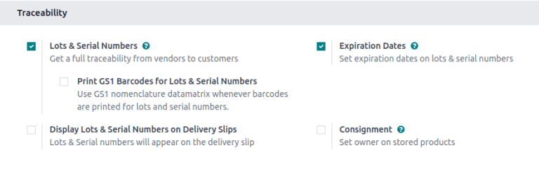

### By operation type 

Next, specify whether the ability to create new or use existing serial
numbers should be turned on for particular operation types (such as
shipping or receiving goods). In other words, this setting allows for
serial number tracking on warehouse receipts and delivery orders.

::: tip
Enabling the *Create New* option for receipts allows new serial numbers
to be assigned as items are received. However, for delivery orders, it
is often disabled to prevent workers from accidentally assigning serial
numbers that do not exist in inventory.
:::

To enable the creation of new serial numbers on an operation, navigate
to `Inventory
app ‣ Configuration ‣ Operations Types`.

From the `Operations Types` page,
select the desired operation type (e.g. `Receipts`, `Delivery Orders`,
or `Manufacturing`), and select the
`Create New` option in the
`Lots/Serial Numbers` section of the
operation type\'s configuration page.

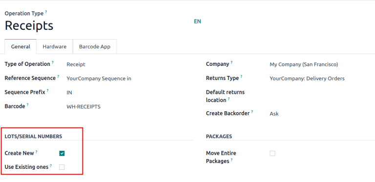

## Configure serial number tracking on individual products 

Once the
`Lots & Serial Numbers setting ` has been activated, individual products can now be tracked
using serial numbers. To track a product, go to
`Inventory app ‣ Products ‣ Products`, and select the desired product.

In the `General Information` tab on
the product form, make sure the box next to
`Track Inventory` is checked. Then,
select `By Unique Serial Number`, and
click `Save` to save the changes.
Now, existing or new serial numbers can now be selected and assigned to
newly-received or manufactured batches of this product.

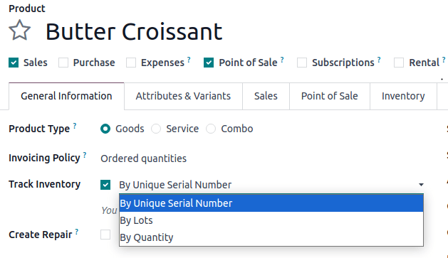

## Assign serial numbers 

In Odoo, serial numbers can be assigned at several times and places:

- When a product is
  `already in stock `
- Via the
  `Moves smart button ` on a receipt
- Via the
  `Open: Stock move window ` on a receipt
- `During a manufacturing order
  ` for a product tracked by lots/serial numbers
- When `making an inventory adjustment
  `

### Create new serial numbers for products already in stock 

New serial numbers can be created for products already in stock with no
assigned serial number. To do so, go to
`Inventory ‣ Products ‣ Lots/Serial Numbers`, and click `New`. Doing so reveals a blank lot/serial number form. On
this form, a new `Lot/Serial Number`
is generated automatically.

::: tip

While Odoo automatically generates a new lot/serial number to follow the
most recent number, it can be edited and changed to any desired number,
by clicking the line under the `Lot/Serial Number` field, and changing the generated number.
::::

Once the `Lot/Serial Number` is
generated, click the blank field next to `Product` to reveal a drop-down menu. From this menu, select the
product to which this new number will be assigned.

This form also provides the option to adjust the
`On Hand Quantity`, to assign a
unique `Internal Reference` number
(for additional traceability), and to assign this specific lot/serial
number configuration to a specific company in the
`Company` field. A detailed
description of this specific lot/serial number can also be added in the
`Description` tab below.

::: tip

The `Internal Reference` number field
is a space for manufacturers to input an additional unique number to
allow for easier tracking. For instance, SKU values may be used here.
::::

When all desired configurations are complete, click the
`Save` button to save all changes.

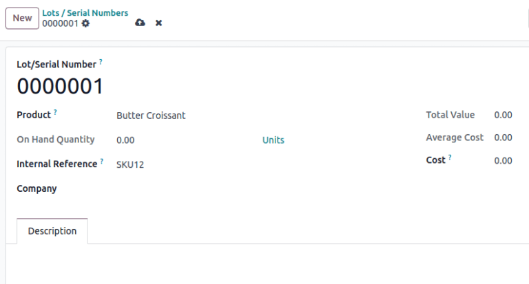

After a new serial number has been created, assigned to the desired
product, and saved, navigate back to the product form, by going to
`Inventory app ‣ Products ‣ Products`, and selecting the product that this newly-created
serial number was just assigned to.

On that product\'s detail form, click the
`Lot/Serial Numbers` smart button to
view the new serial number.

### Create serial numbers for incoming or outgoing products 

Serial numbers can be assigned to both incoming and outgoing goods. The
receipt and delivery order forms mirror one another; the instructions
below can be followed to assign serial numbers in either form.

- **Incoming goods:** Assign serial numbers directly on the **receipt**.
  Receipts can be accessed by navigating to
  `Inventory app ‣ Operations ‣ Receipts`.
- **Outgoing goods:** Assign serial numbers directly on the **delivery
  order**. Receipts can be accessed by navigating to
  `Inventory app ‣ Operations ‣ Deliveries`.

::: warning

Before assigning serial numbers on receipts or delivery orders, be sure
that the ability to `create new serial numbers by operations type
` is enabled.
::::

#### Lots/serial number field

Serial numbers can be entered directly into the
`Serial Numbers` field on a receipt
or delivery order.

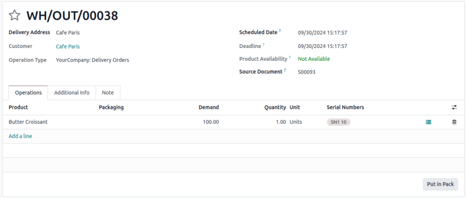

::: tip

To make the `Serial Numbers` field
visible on a receipt or delivery order, click the
`oi-settings-adjust`
`(Adjust Settings)` icon, and in the
drop-down menu, tick the `Serial Numbers` checkbox.


Example Serial Numbers field on a delivery
order.

::::

#### Stock move pop-up window 

For various methods of assigning serial numbers individually or in bulk,
click the `fa-list`
`(list)` icon in the product line of
a receipt.

##### Add a line

In the `Open: Stock move` pop-up
window, manually enter serial numbers in the
`Lot/Serial Number` column. This
method is best reserved for adding only one or a few serial numbers.

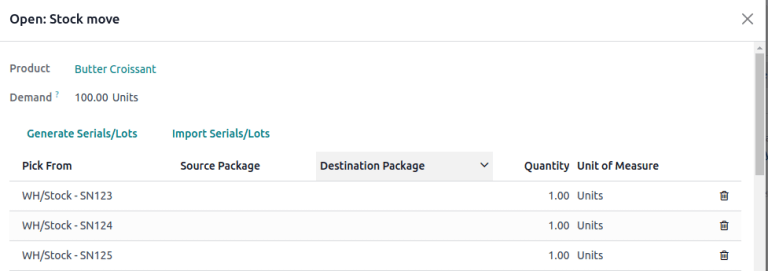

##### Generate Serials/Lots 

Assign multiple serial numbers at once by clicking the
`Generate Serials/Lots` button in the
`Open: Stock move` pop-up window.

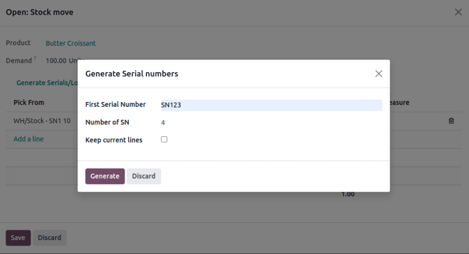

Doing so opens a new popup, `Generate Serial numbers`, which contains a few fields:

- `First SN`: Input the first serial
  number that should start the sequence. From there, Odoo automatically
  detects what pattern should be followed to generate more serial
  numbers.

- `Number of SN`: Specify the desired
  number of serial numbers to generate.

  ::: tip
  : important

If the import button is not visible, ensure the
`Create New` box is checked in the
`receipt's configuration page `.
::::

Doing so opens the `Import Serials`
pop-up window. Enter each serial number on a separate line in the
`Lots/Serial numbers` text field.

As when
`generating serials `, check the `Keep current lines` box to keep existing serial numbers, or leave it
unchecked to overwrite them.

::: tip

To expedite this process, copy/paste serial numbers from an existing
spreadsheet and add them to the `Lots/Serial numbers` text field.
::::

Finally, click `Generate`.

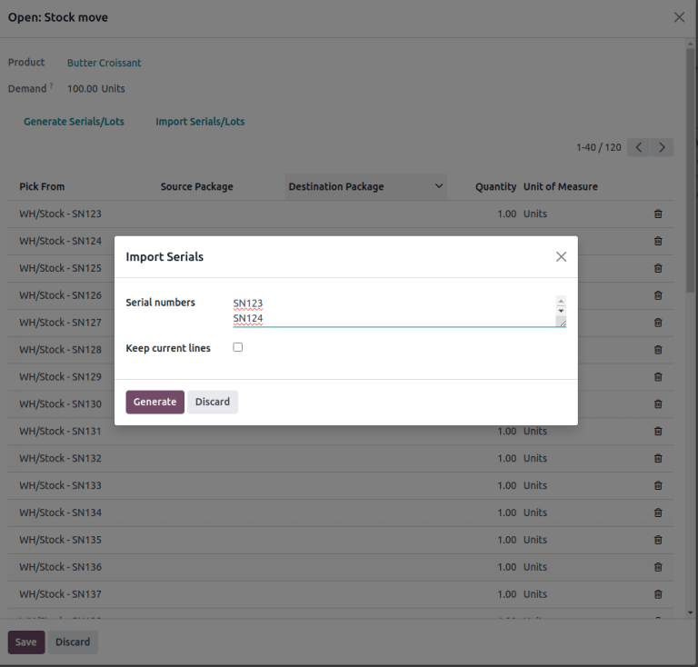

::: tip
For a receipt with a `Demand` of
[3.00] products, one product has already been assigned a
serial number in the `Open: Stock move` pop-up window.

So, in the `Import Lots` pop-up
window, two serial numbers, [124] and [125] are
assigned to the remaining products by entering the following in the
`Lots/Serial
numbers` input field:

``` 
124
125
```

The `Keep current lines` option is
selected to add these two serial numbers **in addition** to the serial
number, [123], that has already been assigned.

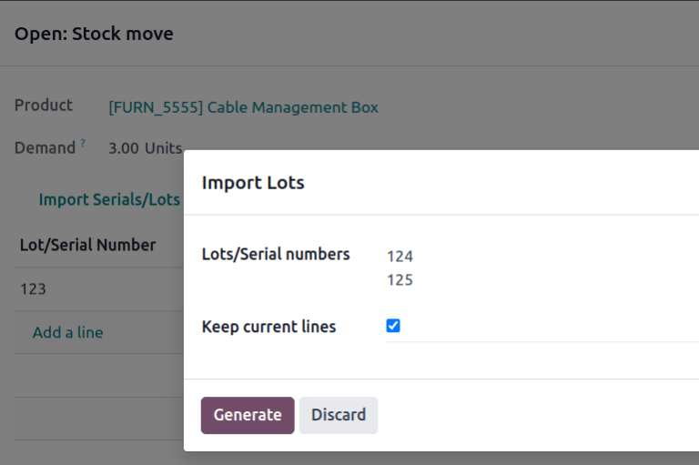
:::

#### Detailed operations 

Accessible from both receipt and delivery order forms, the *Detailed
Operations* page shows a detailed view of product movements, including
information about serial numbers, exact locations, expiration dates,
etc. This level of detail permits more precise tracking, for example,
when handling perishable or regulated goods.

To access this page, first `select a warehouse receipt or delivery order
`. Then, click on the `fa-bars`
`Moves` smart button at the top of
the page.

In the `Lot/Serial Number` column,
manually type (or select from the drop-down menu) the desired serial
numbers for each individual product.

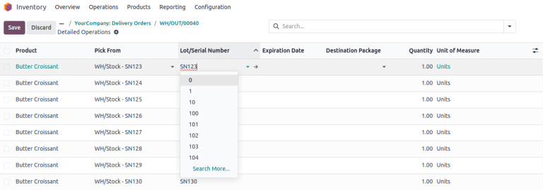

When finished, click the receipt/delivery order\'s breadcrumbs, and the
assigned serial numbers are automatically saved.

## Display serial numbers on delivery slips

When selling products tracked using serial numbers, it is possible to
include the serial numbers on the delivery slips sent to customers. This
can be helpful to customers in cases where serial numbers are needed,
such as filing an RMA or repair request, or registering the product.

To include serial numbers on delivery slips, open the
`Inventory` app, and navigate to
`Configuration ‣ Settings`.
Scroll down to the `Traceability`
section, tick the
`Display Lots & Serial Numbers on Delivery Slips` checkbox, and click `Save`.

After enabling the
`Display Lots & Serial Numbers on Delivery Slips` setting, serial numbers are listed on delivery slips
for products tracked by serial numbers, once the delivery order is
validated.

To view serial numbers on delivery orders and delivery slips, navigate
to the `Inventory` app, click on
`Delivery Orders`, and select an
order containing a product tracked using serial numbers.

To view the serial numbers of products included in the order, make sure
the `Operations` tab is selected,
then click the `oi-settings-adjust`
`(adjust)` icon to the right of the
tab. Ensure that the `Serial Numbers`
checkbox is ticked, which causes a `Serial Numbers` column to appear. The serial number(s) for each product
included in the order are displayed in this column.

When the order is ready to be processed, click
`Validate` to confirm the delivery
and add product information to the delivery slip.

At the top of the order\'s form, click the `fa-cog` `(Actions)` button, and
select `Print ‣ Delivery Slip`. The delivery slip is then downloaded. Open the
delivery slip using the device\'s browser or file manager. Serial
numbers are listed next to their respective products in the
`Lot/Serial Number` column.

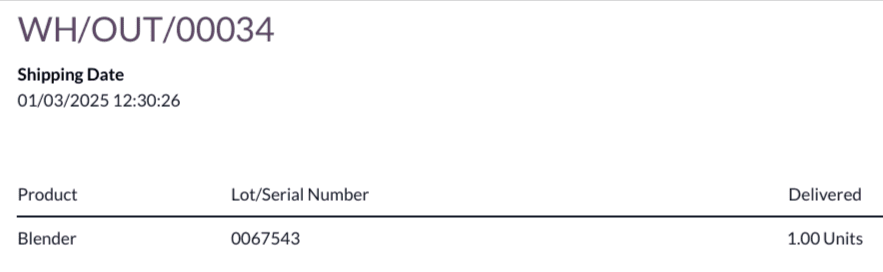

## Traceability & reporting

Manufacturers and companies can refer to the *Lots/Serial Numbers*
dashboard and traceability reports to see the entire lifecycle of a
product: when and where it originated, where it was stored, and who it
was shipped to.

### Lots/Serial Numbers dashboard

To see the full traceability of a product, or group by serial numbers,
go to
`Inventory app ‣ Products ‣ Lots/Serial Numbers`. Doing so reveals the
`Lots/Serial Numbers` dashboard.

#### Reporting

On the `Lots/Serial Numbers`
dashboard, products with serial numbers assigned to them are listed by
default. Click the `fa-caret-right`
`(expand)` icon to show which serial
numbers are assigned to the chosen product.

To group by serial numbers (or lots), first remove any default filters
from the search bar in the upper-right corner. Then, click the
`fa-caret-down`
`(down arrow)` icon and select
`Add Custom Group`, which reveals a
mini drop-down menu. From this mini drop-down menu, select
`Lot/Serial Number`, and click
`Apply`.

Doing so reveals all existing serial numbers and lots. Each row can be
expanded to show all quantities of product assigned to that serial/lot
number. For unique serial numbers that are not reused, there should be
just one product per serial number.

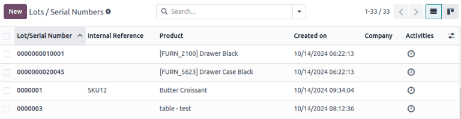

::: tip

For additional information regarding an individual serial (or lot)
number, click the line item for the serial number to reveal that
specific `Serial Number` form. From
this form, click the `Location` and
`Traceability` smart buttons to see
all stock on-hand using that serial number, and any operations made
using that serial number.
::::

