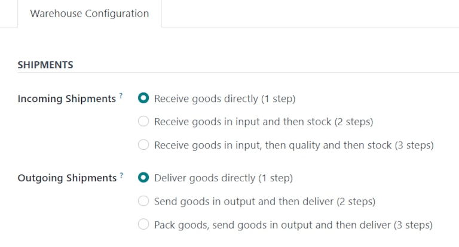
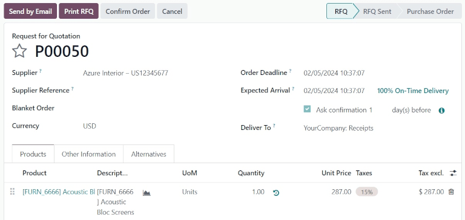
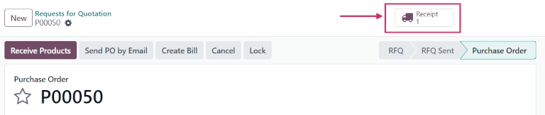
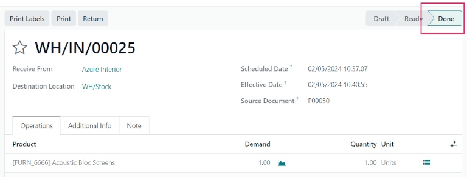
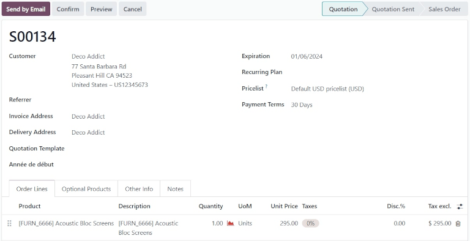
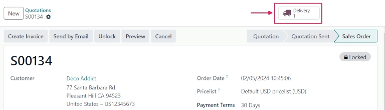
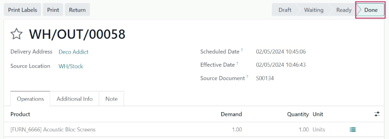

# One-step receipt and delivery

In Odoo *Inventory*, both incoming and outgoing shipments are configured
to process in one step, by default. This means purchases will be
received directly into stock, and deliveries will be moved directly from
stock to customers.

::: tip

Incoming and outgoing shipments do **not** need to be configured with
the same amount of steps.

For example, a warehouse\'s settings can be configured so products can
be received directly in one step, and delivered in three steps (pick +
pack + ship).
::::

## Configuration

To configure one-step receipts and deliveries for a warehouse, navigate
to `Inventory
app ‣ Configuration ‣ Warehouses`, and select a warehouse to edit.

Under the `Warehouse Configuration`
tab, set `Incoming Shipments` to
`Receive goods directly (1 step)`,
and set `Outgoing Shipments` to
`Deliver goods directly (1 step)`.

::: tip

Since one-step receipt and delivery is the default for incoming and
outgoing shipments in Odoo, the *Multi-Step Routes* feature is *not*
required.

However, for the `Shipments` settings
to appear on a warehouse form, the feature **must** be enabled.

To enable *Multi-Step Routes*, navigate to
`Inventory app ‣ Configuration ‣
Settings`. Under the
`Warehouse` section, tick the
checkbox next to `Multi-Step Routes`,
and click `Save`. Doing so also
activates the `Storage Locations`
feature.
::::

## Receive goods directly (1 step) 

When products are received in one step, they will move from the vendor
location to warehouse stock in the database immediately upon validation
of a purchase order (PO).

### Create purchase order

To create a `PO (Purchase Order)`,
navigate to the `Purchase app`,
and click `New`. This opens a blank
`Request for Quotation` (RfQ) form.

Add a vendor in the `Supplier` field.
Then, fill out the various fields on the
`RfQ (Request for Quotation)`, as
necessary.

Under the `Products` tab, click
`Add a product`, and select a product
to add to the `RfQ (Request for Quotation)`.

Once ready, click `Confirm Order`.
This moves the `RfQ (Request for Quotation)` to the `Purchase Order`
stage.

Once the `PO (Purchase Order)` is
confirmed, a `Receipt` smart button
appears at the top of the form. Clicking the smart button opens the
warehouse receipt (WH/IN) form.

### Process receipt

From the warehouse receipt form, the products ordered can be received
into the warehouse. To receive the products, click
`Validate`. Once validated, the
receipt moves to the `Done` stage.

Click back to the `PO (Purchase Order)`
(via the breadcrumbs, at the top of the form) to view the
`PO (Purchase Order)` form. On the
product line, the quantity in the `Received` column now matches the ordered
`Quantity`.

## Deliver goods directly (1 step) 

When products are delivered in one step, they will move from warehouse
stock to the customer location in the database immediately upon
validation of a sales order (SO).

### Create sales order

To create a `SO (Sales Order)`, navigate
to the `Sales app`, and click
`New`. This opens a blank sales
quotation form.

Add a customer in the `Customer`
field. Then, fill out the various fields on the sales quotation form, as
necessary.

Under the `Product` tab, click
`Add a product`, and select a product
to add to the sales order quotation.

Once ready, click `Confirm`. This
moves the quotation to the `Sales Order` stage.

Once the `SO (Sales Order)` is confirmed,
a `Delivery` smart button appears at
the top of the form. Clicking the smart button opens the warehouse
delivery (WH/OUT) form.

### Process delivery

From the warehouse delivery form, the products ordered by the customer
can be delivered from the warehouse. To deliver the products, change the
value in the `Quantity` field to
match the ordered quantity in the `Demand` field.

Once ready, click `Validate`. Once
validated, the delivery order moves to the `Done` stage.

Click back to the `SO (Sales Order)` (via
the breadcrumbs, at the top of the form) to view the
`SO (Sales Order)` form. On the product
line, the quantity in the `Delivered`
column now matches the ordered `Quantity`.

